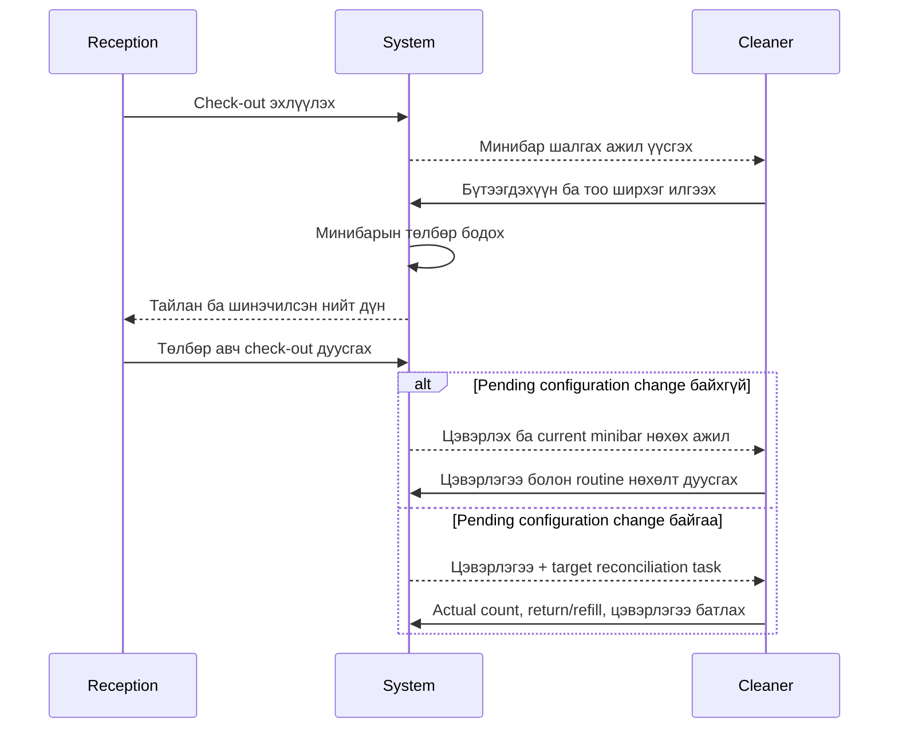

# Cleaner Dashboard — Минибар шалгах ба өрөө цэвэрлэх ажиллагаа

**Хувилбар:** 1.11  
**Төлөв:** MVP Cleaner ажиллагаа, inventory refill, room configuration reconciliation, checkout exception, P0-37 болон P0-39A–P0-39C-2 батлагдсан  
**Хамаарах үе шат:** MVP — Reception system

## 1. Зорилго

Cleaner хэрэглэгч гар утаснаас check-out эхэлсэн өрөөний минибарыг шалгаж хэрэглэсэн бүтээгдэхүүний тоо ширхэгийг мэдээлэх, мөн check-out дууссан бохир өрөөнүүдийн цэвэрлэгээний төлөвийг удирдана.

## 2. Багцын хамрах хүрээ

- Cleaner role, Cleaner dashboard болон minibar нь зөвхөн **25,000₮** болон **30,000₮** багцад идэвхжинэ.
- **20,000₮** багцад Cleaner хэрэглэгч үүсгэх, Cleaner dashboard нээх болон minibar ашиглах боломжгүй байна.
- 25,000₮/30,000₮ багцын бүх өрөөнд minibar заавал биш. Current mode `Minibar ашиглахгүй` өрөөнд routine guest usage/refill task үүсэхгүй; Cleaner-ийн цэвэрлэгээний task хэвийн байна. Харин OFF → ON pending change үүссэн бол тусдаа assigned configuration reconciliation task үүсч болно.
- 20,000₮ багцад Manager өрөөний төлөвийг `Цэвэрлэгээ шаардлагатай`-аас `Цэвэр` болгон өөрчилнө. Reception төлөвийг зөвхөн харна.
- Багцын эрхийг зөвхөн дэлгэц нуух байдлаар бус, сервер/API түвшинд шалгаж хориглоно.
- Template version-ийн `Publish`/`Set default`/`Archive` болон exact-version `Rollout` нь зөвхөн идэвхтэй minibar entitlement дотор тухайн багцад зөвшөөрөгдсөн role-д нээлттэй: 25,000₮-д Manager, 30,000₮-д Manager/Manager Plus. Hotel Admin-д дээрх role тусдаа шаардлагатай бөгөөд 20,000₮/entitlement-гүй үед хориглож, 25,000₮ багцад Manager Plus үүсгэж gate тойрохгүй. Publish/Set default/Archive дангаараа Cleaner task үүсгэхгүй; Rollout нь доорх safe-point дүрмээр task үүсгэнэ.

## 3. Dashboard-ийн хэлбэр

- Dashboard нь mobile-first, responsive web interface байна.
- Гар утас, таблет болон компьютерын дэлгэцэд зохицон харагдана.
- Үндсэн үйлдлийг жижиг дэлгэц дээр хэвтээ гүйлгэлтгүй, цөөн даралтаар гүйцэтгэх боломжтой байна.
- Шинэ болон хүлээгдэж буй ажлыг хамгийн түрүүнд харуулна.

Dashboard дөрвөн үндсэн жагсаалттай байна:

1. **Идэвхтэй байрлалтын minibar нөхөх** — Reception эсвэл Manager/Manager Plus-ийн хүсэлтээр stay үргэлжилж байхад хийх нөхөлт.
2. **Минибар шалгах** — check-out эхэлсэн боловч минибарын тайлан ирээгүй өрөөнүүд.
3. **Цэвэрлэх ба минибар нөхөх** — check-out дууссан, цэвэрлэгээ шаардлагатай өрөөнүүд; pending configuration change байхгүй minibar-enabled room-д current configuration-ийн lifecycle `ACTIVE` product-ийн ердийн нөхөлт хамт харагдана.
4. **Minibar configuration тааруулах** — pending configuration-д заасан exact template version-ийн immutable product/target-тай бодит count тулгах, removed/excess stock буцаах, added/short stock нөхөх эсвэл rollback хийх server-generated task.

## 4. Cleaner-д харагдах мэдээлэл

- Өрөөний дугаар.
- Давхар болон өрөөний ангилал.
- Ажлын төрөл: `Идэвхтэй байрлалтын minibar нөхөх`, `Минибар шалгах`, `Өрөө цэвэрлэх` эсвэл `Minibar configuration тааруулах`.
- Check-out ажиллагаа эхэлсэн эсвэл дууссан огноо/цаг.
- Минибарын бүтээгдэхүүний нэр болон бүртгэх тоо ширхэг.
- Configuration reconciliation task бол current болон target template-ийн нэр, exact version, immutable target quantity.
- Ажлын одоогийн төлөв.

Cleaner-д зочны регистрийн дугаар, овог нэр, minibar selling price, төлбөрийн дэлгэрэнгүй болон санхүүгийн тайлан харагдахгүй.

Room `RETIRING` болсон ч active stay, checkout, cleaning болон өмнө үүссэн refill/reconciliation task автоматаар алга болохгүй. Cleaner өөрийн task-ийг дуусгаж, room lifecycle/blocker-ийг task хүрээнд read-only харна. `INACTIVE` room-д шинэ Cleaner task үүсгэхгүй. Canonical lifecycle: [26-room-minibar-lifecycle.md](./26-room-minibar-lifecycle.md).

## 5. Minibar task-ийн ажиллагаа

### 5.1 Идэвхтэй байрлалтын үеийн нөхөлт

1. Reception эсвэл Manager/Manager Plus идэвхтэй stay дээр lifecycle `ACTIVE` бүтээгдэхүүн/тоо бүхий `Minibar нөхөх хүсэлт` үүсгэнэ. Current active stay-тай room `RETIRING` байж болох ч `INACTIVE` байж болохгүй.
2. Систем stay, room, minibar mode, product lifecycle болон тухайн product stay price book-д байгаа эсэхийг шалгаж Cleaner task үүсгэнэ.
3. Cleaner task-ийг авч, өрөөнд бодитоор нөхсөн quantity-г батална. Cleaner selling price харахгүй.
4. Сервер warehouse stock-ийг шалгаж, зөвхөн бодитоор баталсан quantity-гаар warehouse → room transfer үүсгэнэ.
5. Movement нь stay, room, product, price-book line, task, requester, Cleaner болон server time-тэй холбогдоно.
6. Warehouse хүрэлцэхгүй бол боломжит тооноос илүүг батлахгүй; үлдсэн shortage хүсэлт дээр харагдана.

Нэмэлт Manager approval шаардахгүй. Хүсэлт нь өөрөө movement биш; Cleaner-ийн completion л stock шилжүүлнэ. Pending task-ийг дуусгах эсвэл цуцлахаас өмнө Reception `Check-out эхлүүлэх` боломжгүй бөгөөд check-out эхэлсний дараа шинэ active-stay refill task үүсэхгүй.

Product deactivation-оос өмнө task үүссэн бол product `RETIRING` үед Cleaner complete эсвэл `Гүйцэтгэх боломжгүй` болгож болно. Систем original task-ийн created time-ийг deactivation time-тай тулгана. Pending task terminal болтол product inactive болохгүй; inactive product дээр completion хийхгүй.

### 5.2 Check-out ба minibar-ын ажиллагаа

25,000₮ болон 30,000₮ багцын **minibar-enabled өрөөний** check-out-ыг дараах хоёр үе шаттай явуулна:

1. Reception **Check-out эхлүүлэх** үйлдэл хийнэ. Энэ нь байрлалтыг шууд хаахгүй.
2. Систем тухайн өрөөнд `Минибар шалгах` ажил үүсгэж Cleaner dashboard-д харуулна.
3. Cleaner өрөөг шалгаад бүтээгдэхүүн бүрийн хэрэглэсэн тоо ширхэгийг оруулна.
4. Хэрэглээ байхгүй бол Cleaner `Минибар хэрэглээгүй` гэж тодорхой батална.
5. Cleaner тайланг илгээхэд систем хэрэглэгч, огноо/цаг, бүтээгдэхүүн болон тоо ширхэгийг хадгална.
6. Систем тухайн stay-ийн check-in үед түгжсэн price book-оос нэгж үнийг авч минибарын төлбөрийг бодон, тухайн байрлалтын нэгдсэн тооцоонд нэмнэ. Cleaner price харах, илгээх эсвэл өөрчлөхгүй.
7. Байрлалт `Эцсийн тооцоо хийхэд бэлэн` төлөвт орж, Reception-д тайлан болон шинэчилсэн дүн харагдана.
8. Reception `өрөө + минибар + бусад төлбөр − өмнө төлсөн дүн − барьцаанаас суутгах дүн` зарчмаар эцсийн төлбөрийг авна.
9. Эцсийн төлбөрийн гүйлгээ эхлэхэд ашиглаж буй минибарын тайлангийн хувилбарыг түгжинэ.
10. Төлбөр амжилттай бол Reception **Check-out дуусгах** үйлдэл хийнэ.
11. Систем өрөөг `Цэвэрлэгээ шаардлагатай` төлөвт оруулна. Pending configuration change байхгүй бол `Цэвэрлэх ба минибар нөхөх`, байгаа бол цэвэрлэгээний ажлаас тусдаа `Minibar configuration тааруулах` task үүсгэнэ.
12. Pending change байхгүй үед Cleaner current configuration-ийн exact version-д заасан хэрэглэгдсэн бүтээгдэхүүнийг нөхөж, нөхсөн бүтээгдэхүүн болон тоо ширхэгийг бүртгэнэ. Pending change байвал хуучин current version-оор routine refill хийхгүй.
13. Pending change байхгүй үед систем бодит тоог current target-тай тулгаж, бүх бүтээгдэхүүн бүрдсэн бол minibar-ыг `Бүтэн` болгоно. Pending change байвал 5.3-ын reconciliation урсгал үйлчилнэ.
14. Cleaner цэвэрлэгээг дуусгаж өрөөг `Цэвэр` төлөвт оруулна.
15. Ердийн урсгалд өрөө check-out дууссан, actual check-out дээр тулгуурласан cleaning buffer өнгөрсөн, `Цэвэр`, minibar `Бүтэн` болсон үед дараагийн зочинд бэлэн болно. Minibar-disabled өрөө болон Manager-ийн shortage override-тай `Дутуу` өрөөний readiness-ийг inventory дүрмээр шийднэ.

### 5.3 Room minibar configuration reconciliation

Explicit Rollout хийхэд ижил hotel, ижил `ACTIVE` template entity-ийн exact `PUBLISHED` target version сонгогдож, бүх target product `ACTIVE` байна; target Default байх албагүй бөгөөд Confirm дээр eligibility-г сервер дахин шалгана. Зөвхөн lifecycle `ACTIVE`, minibar mode `ON`, өөр current version-тэй, non-terminal pending configuration-гүй room eligible; mode/template switch нь Rollout бус ердийн configuration change байна.

Rollout confirm хийхэд exact target-ийг түгжсэн room-level pending request болон check-in/assignment blocker атомикаар шууд үүснэ. Safe/vacant room-д request `READY_FOR_RECONCILIATION` болж Cleaner reconciliation task тэр даруй үүснэ. Active stay эсвэл checkout/payment/minibar report/refill-ийн аль нэг дуусаагүй бол request `SCHEDULED_AFTER_STAY` төлөвт байх бөгөөд Cleaner task хараахан үүсэхгүй; existing safe point хангагдмагц л task үүснэ.

1. Active stay байхгүй, checkout/payment/minibar report болон active-stay refill task бүр terminal болсон safe point-д server pending configuration-д хадгалсан exact target version-оор task үүсгэнэ. `DRAFT`/`ARCHIVED` version reconciliation target эсвэл check-in source болохгүй.
2. Cleaner task-ийг атомикаар авч, room-д бодитоор байгаа product/quantity-г батална.
3. ON → OFF үед usable stock-ийг room → warehouse буцаана. Template/version A → Template/version B үед хоёр exact version-ийн immutable product/target delta-аар removed/excess stock-ийг буцааж, added/short stock-ийг warehouse → room нөхнө. OFF → ON үед pending exact version-ийн target-ийн дагуу нөхнө.
4. Cleaner зөвхөн task payload-д зөвшөөрсөн product, direction болон quantity-н хүрээнд transfer батална. Waste, missing stock, count variance, target/template болон shortage override-ийг өөрчлөхгүй.
5. Зөрүү байвал task `Зөрүү шийдэх шаардлагатай`, stock хүрэлцэхгүй бол `Нөөц хүрэлцэхгүй` төлөвтэй болж Manager/Manager Plus-д шилжинэ.
6. ON configuration-ийн target бүрдсэн эсвэл Manager/Manager Plus хүчинтэй shortage override үүсгэсэн, ON → OFF-ийн room balance `0` болсон үед server current configuration-г атомикаар солино.
7. Posted movement-тэй request цуцлагдвал server-generated rollback task-аар эсрэг чиглэлийн transfer хийнэ; movement-ийг edit/delete хийхгүй.

Configuration reconciliation movement нь guest consumption, minibar sale, revenue эсвэл stay charge биш. Configuration apply нь өрөөний cleaning status-ийг автоматаар `Цэвэр` болгохгүй.

Template entity-ийн `ACTIVE/RETIRING/INACTIVE` төлөв version-ийн `DRAFT/PUBLISHED/ARCHIVED` төлөвөөс тусдаа. Reconciliation target-д зөвхөн exact `PUBLISHED` version сонгогдоно; `ARCHIVED` нь terminal/history-only, шинэ target болохгүй, Published руу шууд буцаахгүй бөгөөд дахин ашиглахдаа шинэ `DRAFT` clone үүсгэнэ. Publish хийхэд parent template entity болон бүх product тухайн hotel-ийн `ACTIVE`, дор хаяж нэг product-той, duplicate product-гүй, target quantity бүр эерэг бүхэл тоо байхыг сервер шалгана. Анхны Published version автоматаар цорын ганц Default болох бөгөөд дараагийн publish одоогийн Default-ийг солихгүй.

Default version-ийг archive хийхээс өмнө өөр eligible Published version-ийг Default болгоно. Exact version room current/pending, active stay эсвэл ямар нэг non-terminal reconciliation/Cleaner/configuration task-д reference-тэй бол archive хориглоно. Historical stay/report/price book/audit reference blocker болохгүй, түүхдээ хэвээр хадгалагдана. Future booking version pin хийдэггүй тул өөрөө archive blocker биш.

`Publish`, `Set default`, `Archive` нь existing room current/pending, active stay, future booking, inventory/stock-ийг өөрчлөхгүй; Cleaner task, configuration request эсвэл check-in blocker үүсгэхгүй. Rollout confirm нь pending request/blocker үүсгэх боловч current version, stay price book, stock эсвэл selling price-ийг өөрчлөхгүй. Cleaner task-ийн immutable stock movement-үүд reconciliation үеэр хийгдэж, existing P0-37B final validation амжилттай үед current version switch, pending completion болон audit атомикаар хийгдэнэ. Pending target exact version түгжигдэх тул дараагийн publish/Default өөрчлөлтөөр солигдохгүй бөгөөд target reference нь Archive blocker байна. Task, movement болон audit түүх exact version reference-ээ хадгална. Canonical суурь: [26-room-minibar-lifecycle.md](./26-room-minibar-lifecycle.md)-ийн RML-DEC-015–024.

### 5.4 Multi-room Rollout ба Cleaner task

- Нэг batch нь нэг exact `PUBLISHED` target болон ижил hotel/template-ийн олон room-той байна. Read-only preview room бүрийг `Одоо хийх боломжтой`, `Stay дууссаны дараа`, `Сонгох боломжгүй` гэж reason-тэй ангилах боловч Cleaner task, pending request, blocker, stock movement эсвэл Archive blocker үүсгэхгүй.
- Confirm үед eligibility-г room бүрээр дахин шалгана. Accepted room бүрд exact target-тай child pending request + blocker атомикаар үүснэ; invalid room `SKIPPED` болж, Cleaner task/blocker авахгүй. Нэг child-ийн алдаа бусад child-ийг rollback хийхгүй.
- Safe/vacant accepted child-д Cleaner reconciliation task шууд үүснэ. Active stay эсвэл unfinished checkout/payment/minibar report/refill-тэй child `SCHEDULED_AFTER_STAY` байж safe point-д хүрсний дараа task үүснэ.
- Cleaner зөвхөн өөрт оноогдсон child reconciliation/rollback task-ийг харж гүйцэтгэнэ. Batch preview, Confirm, `Cancel remaining` эсвэл Retry хийх эрхгүй.
- `Cancel remaining` хийхэд movement эхлээгүй child цуцлагдаж blocker нь арилна; movement эхэлсэн child existing compensating rollback task-аар үргэлжилж terminal болтол blocker-тэй байна. `APPLIED` child өөрчлөгдөхгүй бөгөөд буцаах бол шинэ Rollout ашиглана.
- Retry нь хуучин task/movement/audit-ийг засахгүй, `retry_of_batch_id` холбоостой шинэ batch/child үүсгэн eligibility-г дахин шалгана.
- Batch target exact ID-аар түгжигдэж, дараагийн Publish/Default target-ийг солихгүй. Preview Archive blocker биш; confirmed non-terminal child/batch target version-ийг Archive хийхийг хориглоно; Confirm-оор нэг ч room accepted болоогүй бол blocker үүсэхгүй.
- Batch state нь child-үүдээс `IN_PROGRESS`, `COMPLETED`, `PARTIALLY_COMPLETED`, `CANCELLED`, `FAILED_VALIDATION` гэж автоматаар бодогдоно. Duplicate Confirm idempotent байна; нэг room-д нэгээс олон non-terminal pending change болон cross-hotel/cross-template child үүсгэхгүй.
- Batch эрх нь 25,000₮ багцад зөвхөн Manager, 30,000₮ багцад Manager эсвэл Manager Plus-д байна. Hotel Admin-д зөвшөөрөгдсөн operational role тусдаа шаардлагатай; 20,000₮/entitlement-гүй болон 25,000₮ багцын Manager Plus-д хориглоно.

Canonical multi-room Rollout дүрэм: [26-room-minibar-lifecycle.md](./26-room-minibar-lifecycle.md)-ийн RML-DEC-025–028.

### 5.5 P0-39A — Interval ба өрөө дахин ашиглах readiness

- Stay/booking-ийн эзэмшлийн интервал `[start_at, end_at)` байна; `end_at` агшин интервалд орохгүй.
- Actual check-out хийгдээгүй үед хайлт, төлөвлөлт болон overlap шалгалтад `planned_checkout_at + cleaning_buffer_snapshot`-ийг хамгийн эрт бэлэн болох агшин болгон ашиглана.
- Actual check-out хийгдмэгц authoritative доод хязгаар нь `actual_checkout_at + cleaning_buffer_snapshot` болж шинэчлэгдэнэ.
- Өрөө дараагийн зочинд дахин ашиглагдахын тулд server time уг доод хязгаарт хүрсэн, cleaning status `Цэвэр`, мөн тухайн өрөөнд үйлчлэх minibar/configuration readiness хангагдсан гэсэн бүх нөхцөл зэрэг биелсэн байна. `Цэвэр` төлөв дангаараа buffer-ийг алгасахгүй; buffer өнгөрсөн нь ч цэвэрлэгээг автоматаар дуусгахгүй.
- 25,000₮/30,000₮ багцад `Цэвэр` төлөвийг зөвхөн Cleaner батална. Cleaner role байхгүй 20,000₮ багцад өмнө баталсан Manager-ийн cleaning-state exception хэвээр мөрдөгдөнө; Reception аль ч багцад төлөвийг өөрчлөхгүй.
- Early actual check-out buffer-ийн бодит тооллыг эрт эхлүүлж болох боловч дараагийн confirmed booking-ийн эхлэх цагийг автоматаар урагшлуулахгүй. Late actual check-out readiness-ийн доод хязгаарыг хойшлуулна; automatic overdue fee үүсгэхгүй.
- Availability/assignment/check-in бүр дээр overlap болон readiness-ийг сервер authoritative байдлаар дахин шалгана. Late check-out-оос үүсэх confirmed-booking conflict-ийг `STAY-DEC-013`-ын alert/blocker/reassignment/hotel-cancellation урсгалаар шийднэ; early actual checkout automatic repricing/refund үүсгэхгүй.
- Cleaning status transition, minibar refill/count/report болон configuration task completion бүр immutable server timestamp, actor, room/task холбоостой байна. `STAY-DEC-009`-ийн backdate validation нь сонгосон actual цагт эдгээр event аль хэдийн хүчинтэй байсныг шалгах бөгөөд backdate өөрөө Cleaner event, stock movement эсвэл readiness history-г өнгөрсөн цагт шинээр үүсгэхгүй.
- `STAY-DEC-010`-ын approval нь historical readiness-ийг зөвхөн өмнө бүртгэгдсэн immutable Cleaner/minibar/configuration event-үүдээр дахин шалгана. Correction нь зөвхөн effective actual start-ийг өөрчилж, Cleaner task, cleaning status, refill/count/report, stock movement эсвэл readiness history-г шинээр үүсгэх, backdate хийх, event-ийн server time-ийг солихгүй.
- Confirmed booking эсвэл `ACTIVE` stay-ийн `planned_checkout_at`-ийг шууд overwrite хийхгүй. MVP-д change байхгүй; STAY-DEC-011-ийн before/after immutable history болон revalidation нь зөвхөн post-MVP change хожим тусдаа батлагдвал мөрдөх invariant байна.
- Энэхүү минимал guard нь одоогоор хугацаа өөрчлөх button/API/action, taxonomy, permission/approval эсвэл eligibility нээхгүй; Cleaner task, cleaning/minibar readiness event, report/refill/count, configuration task, stock movement болон тэдгээрийн immutable server time-д ямар ч side effect үүсгэхгүй.
- `STAY-DEC-012`-оор `CONFIRMED` booking/`ACTIVE` stay-ийн planned checkout MVP-д бүрэн түгжээтэй: amendment/action/button/API, extension, planned-end shorten болон hourly ↔ nightly conversion байхгүй. Early/late actual checkout зөвхөн `actual_checkout_at` бүртгэж, original planned end-ийг өөрчлөхгүй; early-д auto reprice/refund, overdue-д auto fee/penalty үүсэхгүй.
- Room нь actual checkout хүртэл occupied/blocking хэвээр. Actual checkout бүртгэгдсэний дараа л `actual_checkout_at + snapshot buffer`, `Цэвэр` болон applicable minibar readiness-ийн existing AND gate үйлчилнэ. Энэ дүрэм Cleaner/minibar/configuration task, status, snapshot, event эсвэл movement үүсгэх/өөрчлөхгүй.

Canonical шийдвэр: [05-room-stay-and-time-status.md](./05-room-stay-and-time-status.md)-ийн `STAY-DEC-008`.

Cleaner тайлан ирээгүй үеийн Manager-ийн онцгой тайлан, төлбөрөөс өмнөх versioned correction, payment lock, төлбөрийн дараах adjustment болон зочны маргааны canonical дүрмийг [21-cleaner-checkout-exception-and-dispute.md](./21-cleaner-checkout-exception-and-dispute.md)-д тодорхойлно.

Warehouse/room stock, weighted average cost, optional room minibar, negative-stock protection болон `Дутуу minibar-тайгаар нээх` дүрмийг [22-minibar-stock-inventory.md](./22-minibar-stock-inventory.md)-д тодорхойлно.

Check-in selling price book болон normal/exception/corrected report-д ашиглах canonical үнийг [25-minibar-selling-price-snapshot.md](./25-minibar-selling-price-snapshot.md)-д PRICE-DEC-001–008-аар баталсан.

## 6. Төлөвүүд

### Минибар шалгах ажлын төлөв

| Төлөв | Утга |
| --- | --- |
| **Хүлээгдэж байгаа** | Check-out эхэлсэн, Cleaner шалгаж эхлээгүй |
| **Шалгаж байгаа** | Cleaner ажлыг авч, минибар шалгаж байгаа |
| **Илгээсэн** | Хэрэглэсэн тоо эсвэл хэрэглээгүй гэсэн тайлан Reception-д илгээгдсэн |
| **Залруулах шаардлагатай** | Reception шалтгаантайгаар Cleaner-д буцаасан |
| **Дахин илгээсэн** | Cleaner шинэ immutable хувилбар илгээсэн |
| **Төлбөрт түгжигдсэн** | Яг тухайн report version payment attempt-д ашиглагдаж байгаа |
| **Тооцоонд орсон** | Холбоотой эцсийн төлбөр амжилттай баталгаажсан |

`Онцгой тайлан`, `Маргаантай`, `Маргаан шийдсэн`, `Залруулга хийгдсэн`, `Цуцлагдсан` нь дээрх үндсэн төлөвийг дарж солихгүй; тусдаа төрөл/flag эсвэл холбоотой event байна.

### Active-stay refill task-ийн төлөв

| Төлөв | Утга |
| --- | --- |
| **Хүлээгдэж байгаа** | Request үүссэн, Cleaner аваагүй |
| **Гүйцэтгэж байгаа** | Нэг Cleaner task-ийг атомикаар авсан |
| **Дууссан** | Actual quantity батлагдаж, warehouse → room transfer posted болсон |
| **Гүйцэтгэх боломжгүй** | Cleaner reason-тэй хаасан, movement үүсээгүй |
| **Цуцлагдсан** | Reception/Manager/Manager Plus completion-оос өмнө reason-тэй цуцалсан, movement үүсээгүй |

Partial refill-ийг actual quantity-гаар `Дууссан` болгоод үлдсэн shortage-г хадгална. `Дууссан` task-ийг cancel/edit хийхгүй; алдааг Manager/Manager Plus холбоостой return/reversal movement-ээр засна.

### Configuration reconciliation task-ийн төлөв

| Төлөв | Утга |
| --- | --- |
| **Хүлээгдэж байгаа** | Safe point хангагдаж, task үүссэн боловч Cleaner аваагүй |
| **Гүйцэтгэж байгаа** | Cleaner actual count болон зөвшөөрөгдсөн return/refill хийж байгаа |
| **Нөөц хүрэлцэхгүй** | Target refill хийх warehouse stock хүрэлцээгүй; Manager шийдвэр хүлээж байгаа |
| **Зөрүү шийдэх шаардлагатай** | Waste/missing/count variance-г Manager шийдэх шаардлагатай |
| **Rollback шаардлагатай** | Posted movement-ийг compensating movement-ээр буцаах task |
| **Дууссан** | Target/override хангагдаж config applied болсон, эсвэл rollback baseline сэргэсэн |
| **Цуцлагдсан** | Ямар ч stock movement эхлэхээс өмнө Manager/Manager Plus цуцалсан |

### Өрөөний цэвэрлэгээний төлөв

| Төлөв | Утга |
| --- | --- |
| **Цэвэрлэгээ шаардлагатай** | Check-out дууссан, цэвэрлээгүй өрөө |
| **Цэвэрлэж байгаа** | Cleaner цэвэрлэгээ эхлүүлсэн |
| **Цэвэр** | Cleaner физик цэвэрлэгээг дуусгасан; full readiness-д minibar/configuration болон бусад blocker-ийг тусад нь шалгана |

## 7. Эрхийн дүрэм

Cleaner дараах эрхтэй байна:

- минибар шалгах болон цэвэрлэх шаардлагатай өрөөг харах;
- бүтээгдэхүүний хэрэглэсэн тоо ширхэг оруулах;
- `Минибар хэрэглээгүй` гэж батлах;
- минибарын тайлан илгээх;
- lifecycle `ACTIVE` дутуу minibar product-ийг нөхөх болон нөхсөн тоо ширхэгийг бүртгэх;
- өөрт оноогдсон active-stay refill task-ийг авч, бодитоор нөхсөн quantity-г батлах;
- өөрт оноогдсон configuration reconciliation/rollback task-аар actual count болон зөвшөөрөгдсөн room ↔ warehouse transfer батлах;
- active-stay refill хийх боломжгүй бол reason-тэй terminal болгох;
- цэвэрлэгээний ажлыг эхлүүлэх, дуусгах.

Cleaner дараах эрхгүй байна:

- минибарын бүтээгдэхүүний нэр, худалдах үнэ, худалдан авалтын өртөг, зорилтот тоо, warehouse balance болон stock adjustment-ийг шууд засах;
- өрөөний minibar mode/template болон shortage override өөрчлөх;
- generic warehouse return, waste/adjustment, count variance шийдвэрлэх эсвэл reconciliation target-ийг өөрчлөх;
- өрөөний үнэ болон зочны төлбөр өөрчлөх;
- төлбөр хүлээн авах, буцаах;
- check-in/check-out-ыг эцэслэн батлах;
- зочны хувийн мэдээлэл харах;
- өөр буудлын өрөө, бүтээгдэхүүн болон ажил харах.

## 8. Тооцоо ба аудитын хамгаалалт

- Нэг байрлалд нэг идэвхтэй минибар шалгах ажил байна.
- Олон Cleaner ажилладаг бол нэг ажилтан ажлыг эхлүүлэхэд систем даалгаврыг нэг үйлдлээр түүнд онооно. Ингэснээр хоёр Cleaner нэг ажлыг зэрэг авахгүй. Бусдад `Шалгаж байгаа` болон ажилтны нэр харагдана.
- Минибарын төлбөрийг Cleaner гараар бодохгүй; систем үнэ болон тоо ширхэгээр автоматаар бодно.
- Cleaner-ийн бүртгэсэн нөхөлтийг систем тусдаа нөөцийн хөдөлгөөн болгон хадгалж, өрөөний бодит тоог шинэчилнэ. Cleaner нийт нөөцийн дүнг шууд дарж засахгүй.
- Нөхөлт нь warehouse-оос room руу атомик transfer үүсгэнэ; warehouse болон room balance сөрөг болохгүй.
- Configuration reconciliation task-ийн return/refill/rollback movement бүр immutable, request/task холбоостой байна; guest consumption, sale, revenue эсвэл stay charge үүсгэхгүй.
- Configuration reconciliation task, movement болон apply audit нь current/target exact template version-ийг хадгална; version default өөрчлөгдсөнөөр target автоматаар солигдохгүй.
- Pending config байгаа room-д current exact version-оор routine next-stay refill хийхгүй бөгөөд reconciliation terminal болтол check-in/assignment blocker хэвээр байна.
- Warehouse хүрэлцэхгүй үед Cleaner байгаа тооноос илүүг нөхөхгүй; өрөө `Дутуу` хэвээр үлдэж Manager-д shortage харагдана.
- Тооцоонд ашигласан бүтээгдэхүүний нэр, check-in price book-оос авсан нэгж үнэ болон тоо ширхэгийг тухайн тайланд snapshot болгон хадгална.
- Opening quantity `0` байсан template product stay үеэр баримтжуулсан refill-тэй бол check-in price ашиглана; price book-д байгаагүй product-ийг report/charge line болгохгүй.
- Active-stay refill request/task нь stay/room/product/price-book line-тэй; request дангаараа movement биш, Cleaner completion warehouse → room transfer-ийг атомикаар үүсгэнэ.
- Stay-д холбосон warehouse return, room waste болон negative adjustment-ийг зочны хэрэглээнээс хасна; generic positive adjustment billable quantity нэмэхгүй.
- Reception төлбөр эхлүүлэх агшинд сервер талд хамгийн сүүлийн хүчинтэй, түгжигдээгүй тайлангийн хувилбараар нийт дүнг дахин бодож, яг тэр хувилбарыг payment attempt-д түгжинэ. Төлбөр баталгаажих үед өөр `latest` хувилбар руу солихгүй.
- Давхар даралт, сүлжээний retry болон дахин илгээх үед нэг тайлан, нэг төлбөр эсвэл нэг нөөцийн хөдөлгөөн хоёр удаа үүсэхгүй байна.
- Check-out ажиллагааг цуцалбал түр үүссэн минибарын тооцоо болон даалгаврыг устгахгүйгээр цуцалсан түүхтэй болгон буцаана.
- Тайланг хэн, хэзээ үүсгэсэн, илгээсэн болон өөрчилснийг аудитын түүхэд хадгална.
- Эцсийн төлбөр батлагдсаны дараа ашигласан минибарын тайланг шууд дарж өөрчлөхгүй; залруулгыг тусдаа холбоостой гүйлгээгээр хийнэ.
- Reception тайланг өөрөө засахгүй; төлбөрөөс өмнө Cleaner-д шалтгаантай буцааж шинэ хувилбар авна.
- Cleaner боломжгүй үед Manager/Manager Plus өрөөг бодитоор шалгаж, шалтгаантай `Онцгой minibar тайлан` үүсгэнэ. Hotel Admin-д энэ үйлдэл хийх бол Manager/Manager Plus role тусдаа байна.
- Payment attempt эхлэхэд ашигласан report version түгжигдэнэ. Pending/unknown payment reconciliation дуустал unlock хийхгүй.
- Зочны маргааныг Reception зөвхөн тэмдэглэж, Manager/Manager Plus шийдвэрлэнэ; шийдвэр хүртэл checkout хүлээнэ.

## 9. MVP acceptance criteria

- 25,000₮ болон 30,000₮ багцад Reception check-out эхлүүлэхэд Cleaner dashboard-д тухайн өрөө шинэ ажил болон харагдана.
- Cleaner бүтээгдэхүүн бүрийн хэрэглэсэн тоог оруулах эсвэл хэрэглээгүйг батлах боломжтой байна.
- Cleaner selling price харах, илгээх эсвэл override хийхгүй; сервер check-in price book-оос дүн бодно.
- Cleaner тайлан илгээсний дараа Reception шинэчилсэн төлбөрийн задаргааг харна.
- Минибарын тайлан ирэхээс өмнө эцсийн check-out ердийн горимоор хаагдахгүй.
- Check-out дуусахад өрөө автоматаар `Цэвэрлэгээ шаардлагатай` болно.
- 25,000₮/30,000₮ багцад зөвхөн Cleaner өрөөг `Цэвэр` төлөвт оруулна; 20,000₮ багцад Manager өөрчилнө.
- Pending configuration change байхгүй үед Cleaner өрөөг цэвэрлэхдээ current exact version-ийн routine minibar нөхөлтийг бүртгэж, зорилтот тоо бүрдвэл систем `Бүтэн` болгоно; pending байвал хуучин version-ийг нөхөхгүй, target exact version-д зориулсан тусдаа reconciliation task авна.
- Cleaner assigned reconciliation task-аар room ↔ warehouse transfer баталж болох боловч waste/variance/mode/template/override шийдэхгүй.
- Cleaner reconciliation хийхдээ pending configuration-д хадгалсан exact version-ийн immutable target-ийг ашиглана; `DRAFT` version-оор task/check-in үүсэхгүй.
- Version `Publish`, `Set default` эсвэл `Archive` хийхэд existing Cleaner task-ийн exact target солигдохгүй, шинэ Cleaner/configuration task, check-in blocker эсвэл stock movement үүсэхгүй.
- Default, room current/pending, active stay эсвэл non-terminal Cleaner/reconciliation/configuration task-д reference-тэй exact version archive болохгүй; historical reference болон future booking дангаараа blocker биш.
- Eligible room дээр Rollout confirm хийхэд exact `PUBLISHED` target-тай pending request болон check-in/assignment blocker шууд үүсэх боловч current version, stock, үнэ болон stay price book өөрчлөгдөхгүй.
- Safe/vacant room-ийн Rollout Cleaner task-ийг шууд үүсгэнэ; active stay эсвэл дуусаагүй checkout/payment/minibar report/refill-тэй room `SCHEDULED_AFTER_STAY` байх үед task үүсэхгүй, safe point-д хүрэхэд үүснэ.
- Rollout reconciliation existing P0-37B validation-тай атомикаар хэрэгжиж, дараагийн Publish/Default pending exact target-ийг солихгүй; pending target version Archive болохгүй.
- Multi-room preview нь Cleaner task/pending/blocker/movement үүсгэхгүй; Confirm-оор accepted child бүр тусдаа task lifecycle-тэй болж, `SKIPPED` room task/blocker авахгүй.
- Нэг child failure бусад child-ийг rollback хийхгүй; Cleaner зөвхөн өөрт оноогдсон accepted child task-ийг гүйцэтгэнэ.
- `Cancel remaining` нь movement-free child-ийг unblock хийж, movement эхэлснийг rollback task-аар terminal болтол хамгаална; `APPLIED` child-ийг өөрчлөхгүй.
- Confirmed non-terminal batch/child target Archive blocker бөгөөд duplicate Confirm хоёр batch/task үүсгэхгүй; zero-accepted batch blocker үүсгэхгүй.
- Reconciliation movement guest charge/revenue болохгүй; posted movement-тэй cancellation нь immutable rollback шаарддаг.
- Configuration reconciliation дууссан нь cleaning status-ийг автоматаар `Цэвэр` болгохгүй.
- Retiring/inactive product-ийг дараагийн stay-д зориулж нөхөхгүй; Manager config-ийг шийдтэл room configuration blocker-тэй байна.
- Reception эсвэл Manager/Manager Plus active stay-ийн refill хүсэлт үүсгэж, зөвхөн Cleaner role-той хэрэглэгч actual quantity-г task-аар батална.
- Pending active-stay refill task дуусах/цуцлагдахаас өмнө check-out эхлэхгүй бөгөөд check-out эхэлсний дараа шинэ active-stay refill үүсэхгүй.
- Minibar-enabled өрөө ердийн урсгалд actual check-out-д тулгуурласан snapshot cleaning buffer өнгөрч, `Цэвэр`, minibar `Бүтэн` болсон үед дахин ашиглагдана.
- Minibar-disabled өрөөнд routine guest minibar task/charge үүсэхгүй бөгөөд pending config байхгүй үед actual check-out-д тулгуурласан snapshot cleaning buffer өнгөрч, `Цэвэр` болсон бол бэлэн болно. OFF → ON pending change байвал reconciliation terminal болтол blocker-тэй байна.
- Actual check-out-оос өмнөх planning нь planned checkout + snapshot buffer, actual check-out-оос хойших authoritative readiness нь actual checkout + ижил buffer ашиглана; сервер overlap/readiness-ийг дахин шалгана.
- Early check-out existing confirmed booking-ийг автоматаар урагшлуулахгүй, auto reprice/refund хийхгүй; overdue stay-д status/time л харуулж automatic fee/penalty үүсгэхгүй. Дараагийн booking-тэй conflict `STAY-DEC-013`-аар хаагдсан.
- Confirmed booking/active stay-ийн planned checkout change MVP-д бүхэлдээ хоригтой; amendment/action/extension/shorten/conversion байхгүй. STAY-DEC-011 нь зөвхөн post-MVP invariant.
- Минимал guard өөрөө Cleaner action/task/status, inventory/configuration snapshot, үнэ, төлбөр эсвэл refund өөрчлөхгүй.
- Room actual checkout хүртэл occupied хэвээр; дараа нь snapshot buffer + clean + minibar readiness бүгд хангагдана.
- Minibar `Дутуу` өрөөг зөвхөн Manager/Manager Plus-ийн хүчинтэй shortage override болон бодит эхний snapshot-тайгаар дараагийн stay-д нээж болно.
- Cleaner warehouse stock болон shortage override-ийг шууд өөрчлөхгүй.
- Cleaner dashboard гар утасны дэлгэцэд бүрэн ашиглагдана.
- Cleaner зочны хувийн болон санхүүгийн мэдээлэлд хандах боломжгүй байна.
- 20,000₮ багцад Cleaner болон minibar-ын дэлгэц, үйлдэл, API ашиглах боломжгүй байна.
- 20,000₮ багцад Manager цэвэрлэгээний төлөвийг өөрчилж, Reception зөвхөн харна.
- Retiring room-ийн existing Cleaner task үргэлжилж, inactive room-д шинэ task үүсэхгүй.
- Reception буруу тайланг засахгүй, Cleaner-д буцааж шинэ хувилбараар залруулуулна.
- Cleaner боломжгүй үед зөвхөн Manager/Manager Plus шалтгаантай онцгой тайлан үүсгэж чадна.
- Payment attempt-д ашигласан тайлангийн хувилбар түгжигдэж, pending/unknown payment үед давхар тооцоо үүсэхгүй.
- Төлбөрийн дараах алдааг original тайлан/гүйлгээ засахгүйгээр reversal/adjustment-аар шийдвэрлэнэ.
- Minibar маргаан шийдэгдэх хүртэл эцсийн checkout хаагдахгүй.
- Manager current price өөрчилсөн ч active stay-ийн normal/exception/corrected report reprice болохгүй.

## 10. Батлагдсан бизнесийн шийдвэр

Cleaner role болон minibar нь бизнесийн багц ялгах үндсэн боломж бөгөөд зөвхөн 25,000₮ болон 30,000₮ багцад байна. Гэхдээ эдгээр багцын өрөө бүр minibar-тай байх албагүй. 20,000₮ багц болон minibar-disabled өрөөний check-out minibar тайлан хүлээхгүй.

## 11. 20,000₮ багцын цэвэрлэгээний дүрэм

20,000₮ багцад Cleaner байхгүй учраас Manager `Цэвэрлэгээ шаардлагатай → Цэвэр` төлөвийг өөрчилнө. Reception энэ төлөвийг зөвхөн харна. Энэ нь батлагдсан бизнесийн дүрэм байна.

## 12. Батлагдсан checkout exception ба залруулгын дүрэм

- Ердийн checkout Cleaner-ийн хэрэглээ эсвэл `Хэрэглээгүй` тайлангүйгээр хаагдахгүй.
- Cleaner боломжгүй үед Manager/Manager Plus бодит шалгалтаар шалтгаантай онцгой тайлан үүсгэнэ; Reception bypass хийхгүй.
- Төлбөрөөс өмнө Reception тайланг Cleaner-д буцааж, шинэ хувилбар авна.
- Төлбөр эхлэхэд ашигласан report version түгжигдэнэ.
- Төлбөр батлагдсаны дараа original тайлан/төлбөрийг засахгүй; reversal/adjustment ашиглана.
- Зочны маргааныг Manager/Manager Plus шийдвэрлэж дууссаны дараа checkout үргэлжилнэ.

Дэлгэрэнгүй workflow, төлөв, эрх болон CHK-DEC-001–006 шийдвэрийг [21-cleaner-checkout-exception-and-dispute.md](./21-cleaner-checkout-exception-and-dispute.md)-ээс үзнэ.

## 13. Холбоотой дараагийн асуудал

P0-39A–D нь `STAY-DEC-008`–`013`, fractional hourly precision нь `STAY-DEC-014`-өөр батлагдсан. Initial backdate/correction/lock/conflict remedy нь өмнөх Cleaner/minibar event-ийг retroactive өөрчлөхгүй. Early-morning cutoff түр хойшлогдсон.
