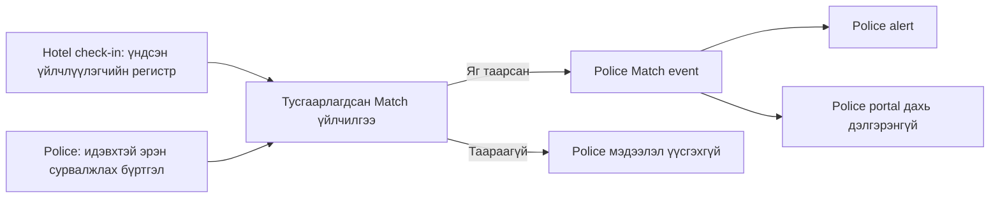

# Цагдаагийн хяналт — Эрэн сурвалжлах бүртгэл, Match ба Alert

**Хувилбар:** 0.24  
**Төлөв:** Wanted Person–Case–Match model, case lifecycle, manual approval, False Match, no-exclusive-owner, Police permission/export, 4-digit bootstrap хамгаалалт болон exact-RD matching батлагдсан; production legal/retention/escalation гэрээ external gate хэвээр  
**Хамаарах үе шат:** MVP — Police Monitoring System

## 1. Зорилго

Цагдаагийн эрх бүхий алба хаагч эрэн сурвалжлагдаж буй хүний мэдээллийг хамгаалагдсан portal-д бүртгэж, уг хүний регистр систем ашиглаж буй буудлын check-in дээр бүртгэгдсэн үндсэн үйлчлүүлэгчийн регистртэй таарвал цагдаагийн талд шуурхай Match болон alert үүсгэнэ.

Энэ модуль нь хүнийг автоматаар баривчлагдсан, олдсон эсвэл гэм буруутай гэж шийдэхгүй. Систем зөвхөн шалгах шаардлагатай Match мэдээлэл үүсгэж, дараагийн ажиллагааг эрх бүхий цагдаагийн алба хаагч гүйцэтгэнэ.

Үүнээс гадна бүх буудлын check-in бүртгэлд орсон үндсэн зочдын тусдаа жагсаалт зөвхөн Police Admin-д харагдана. Энэ жагсаалтад хандах эрх нь Police Officer-д олгогдохгүй бөгөөд Match үүсэх автомат ажиллагаанаас тусдаа хяналтын боломж байна.

## 2. Нэр томьёо

- **Эрэн сурвалжлах бүртгэл:** Хууль ёсны үндэслэлтэй, цагдаагийн эрх бүхий алба хаагчийн үүсгэсэн идэвхтэй хайлтын мэдээлэл.
- **Match:** Идэвхтэй эрэн сурвалжлах бүртгэлийн регистр болон check-in хийсэн үндсэн үйлчлүүлэгчийн регистр яг ижил болсон системийн автомат илрүүлэлт.
- **Олдсон / Found:** Тухайн хүнийг бодитоор илрүүлсэн, системд идэвхтэй өөрийн нэрлэсэн account-тай Police хэрэглэгч харьяалах дүүрэг болон alert-ийг хэн анх хүлээн авснаас үл хамааран өөрийн нэвтрэлтээр баталгаажуулсан үр дүн.
- **Худал Match / False positive:** Гараар буруу регистр оруулсан, бусдын регистр ашигласан эсвэл өөр баталгаатай шалтгаанаар тухайн хүн биш болохыг цагдаа тогтоосон Match.
- **Police Admin:** Цагдаагийн хэрэглэгч, эрх, dashboard болон хяналтын тохиргоо удирдах хэрэглэгч. Hotel/Platform Admin-аас тусдаа ойлголт.
- **Police Officer:** Эрэн сурвалжлах мэдээлэл бүртгэх, жагсаалт болон Match харах цагдаагийн алба хаагч.
- **Wanted Person:** Зөвхөн хүний identity болон түүний immutable revision-уудыг агуулсан aggregate. Хэрэг, `Олдсон`, `Хаагдсан` төлөв агуулахгүй.
- **Wanted Case:** Wanted Person-тэй холбоотой эрэн сурвалжлах үндэслэл, хэрэг, ангилал, харьяалах нэгж болон lifecycle-ийн бүртгэл. Нэг Wanted Person олон Wanted Case-тэй байж болно.
- **MatchCaseLink:** Нэг Match-ийг илрэх үед идэвхтэй байсан, эсвэл тухайн stay идэвхтэй байх хугацаанд дараа нь идэвхжсэн Wanted Case-уудтай append-only байдлаар холбох бүртгэл.
- **Үндсэн үйлчлүүлэгч:** Нэг stay-д бүртгэгдсэн ганц зочин. Хамт байрлагчдыг бүртгэхгүй гэсэн өмнөх шийдвэр хэвээр байна.
- **`actual_check_in_at`:** Reception-ийн баталсан зочны бодитоор ирсэн цаг; `STAY-DEC-009`-ийн хүрээнд зөвшөөрөгдсөн хэмжээгээр серверийн бүртгэлийн цагаас өмнө байж болно.
- **`check_in_recorded_at`:** Check-in амжилттай баталгаажсан өөрчлөгдөхгүй серверийн цаг. Police exact-RD matching болон alert-ийн trigger энэ цагт ажиллана.
- **`detected_at`:** Exact-RD Match сервер дээр илэрч event үүссэн өөрчлөгдөхгүй цаг. Hotel check-in trigger-ийн үед энэ нь `check_in_recorded_at`-тай холбоотой боловч `actual_check_in_at`-аас тусдаа байна.
- **`effective_actual_check_in_at`:** Анхны `actual_check_in_at` эсвэл, батлагдсан immutable correction amendment байгаа бол хамгийн сүүлийн батлагдсан шинэ actual time. Энэ нь Police-ийн stay actual-time харагдацад ашиглагдах derived утга бөгөөд анхны check-in/Match/alert timestamp-ийг overwrite хийхгүй.
- **Actual-time correction amendment:** Active stay-ийн original actual time-ийг өөрчлөхгүйгээр old/new/effective утга, хүсэлт/шийдвэр, actor болон server time-тай нь холбоостой хадгалах append-only залруулгын бүртгэл.

`Match` болон `Олдсон`-ыг дээрх байдлаар тусад нь тооцох дүрэм батлагдсан.

## 3. Системийн тусгаарлалт



- Буудлын системд эрэн сурвалжлагдаж буй хүмүүсийн бүтэн жагсаалтыг өгөхгүй.
- Бүх буудлын check-in бүртгэлд орсон үндсэн зочдын жагсаалтыг зөвхөн Police Admin харна.
- Police Officer-д уг жагсаалтын цэс, хайлт, дэлгэрэнгүй, export болон API хандалт өгөхгүй; Officer зөвхөн өөрийн эрхийн хүрээний идэвхтэй эрэн сурвалжлах бүртгэл болон Match мэдээллийг харна.
- Check-in жагсаалт нь өмнө баталсан дүрмийн дагуу stay бүрийн зөвхөн нэг үндсэн зочныг агуулна. Бүртгэгдээгүй хамт байрлагчдыг агуулахгүй тул үүнийг буудалд бодитоор байрлаж буй бүх хүний бүрэн жагсаалт гэж үзэхгүй.
- Hotel Reception, Manager, Hotel Admin, Cleaner, Restaurant болон зочинд Match гарсан эсэх, эрэн сурвалжлах үндэслэл, хэргийн мэдээллийг харуулахгүй.
- Platform-ийн ердийн Admin/Support цагдаагийн мэдээллийн агуулгыг автоматаар харах эрхгүй байна. Тусгай support access хэрэгтэй бол ЦЕГ-ын баталсан, хугацаатай, аудиттай `break-glass` журмаар шийднэ.

## 4. Police role matrix

| Үйлдэл | Police Admin | Police Officer |
| --- | --- | --- |
| Police account үүсгэх, түдгэлзүүлэх | Тийм | Үгүй |
| Role, утас, харьяалах нэгж/дүүрэг тохируулах | Тийм | Үгүй |
| Wanted Person/Case draft үүсгэх, ХУР/manual identity оруулах | Зөвхөн `WANTED_CASE_CREATE` нэмэлт permission-тэй бол | Тийм |
| Идэвхтэй эрэн сурвалжлах жагсаалт харах | Тийм | Тийм |
| Match жагсаалт болон дэлгэрэнгүй харах | Тийм | Тийм, зөвшөөрөгдсөн нутаг/хэрэг/нэгжийн хүрээнд |
| Бүх буудлын check-in үндсэн зочдын жагсаалт харах | Тийм | Үгүй |
| Check-in зочдын жагсаалт Excel/CSV/bulk export хийх | Үгүй, MVP-д хаалттай | Үгүй |
| Match-ийг хүлээн авсан гэж тэмдэглэх | Тийм | Тийм |
| `Олдсон` төлөв батлах | Өөрөө бодитоор илрүүлсэн бол өөрийн account-аар | Өөрөө бодитоор илрүүлсэн бол өөрийн account-аар; дүүрэг/анх хүлээн авсан хэрэглэгчээр хязгаарлахгүй |
| `Олдсон` залруулах хүсэлт гаргах | Өөрийн баталгаажуулалтад тийм | Өөрийн баталгаажуулалтад тийм |
| `Олдсон` залруулга батлах/татгалзах | Зөвхөн `FOUND_CORRECTION_APPROVE` permission-тэй бол | Зөвхөн `FOUND_CORRECTION_APPROVE` permission-тэй бол |
| `Худал Match` хүсэлт гаргах | Тийм | Тийм |
| `Худал Match` хүсэлт батлах/татгалзах | Зөвхөн `FALSE_MATCH_APPROVE` permission-тэй бол | Зөвхөн `FALSE_MATCH_APPROVE` permission-тэй бол |
| Manual identity батлах | Зөвхөн `WANTED_IDENTITY_APPROVE` permission-тэй бол | Зөвхөн `WANTED_IDENTITY_APPROVE` permission-тэй бол |
| Case идэвхжүүлэх, түдгэлзүүлэх, сэргээх, хаах/цуцлах | Зөвхөн `WANTED_CASE_STATE_MANAGE` permission-тэй бол | Зөвхөн `WANTED_CASE_STATE_MANAGE` permission-тэй бол |
| Dashboard-ийн үндсэн тоо харах | Тийм | Тийм |
| Ангилал болон дүүргийн график харах | Тийм | Үгүй |
| Police хэрэглэгч, хандалтын аудит харах | Тийм | Үгүй |
| Wanted Case Excel export | Зөвхөн `WANTED_CASE_EXPORT` permission-тэй бол | Үгүй |

Police Admin нь account/unit/role, бүх буудлын check-in жагсаалт, график болон аудитын Admin эрхтэй боловч Officer-ийн operational mutation эрхүүдийг автоматаар өвлөхгүй. Draft үүсгэх, manual identity батлах, case lifecycle өөрчлөх болон outcome correction батлах үйлдэл бүр дээр дээрх explicit permission-ийг сервер талд шалгана. Харин батлагдсан уян хатан ажиллагааны дагуу идэвхтэй Police Admin болон Police Officer хоёулаа өөрийн scope дотор Wanted/Match харах, exact active-Match хайх, alert хүлээн авах, өөрийн илрүүлсэн хүнийг `Олдсон` гэж батлах болон False Match хүсэлт гаргах үндсэн эрхтэй байна.

### 4.1 Police Admin-ийн check-in зочдын жагсаалт

- Жагсаалтыг зөвхөн `Police Admin` role-той, идэвхтэй, тусдаа нэрлэсэн account нээнэ.
- Эрхийн шалгалтыг зөвхөн дэлгэцийн tab нуух байдлаар бус сервер, API болон export түвшинд хэрэгжүүлнэ.
- Жагсаалтын нэг бичлэг нь нэг stay-д бүртгэгдсэн нэг үндсэн зочныг илэрхийлнэ.
- Жагсаалтыг анх нээхэд зөвхөн тухайн мөчид буудалд байрлаж буй `идэвхтэй stay`-ууд харагдана.
- Check-out болсон түүхэн бүртгэлийг үзэхийн тулд Police Admin эхлэх/дуусах огнооны интервал болон хайлтын шалтгааныг заавал оруулна.
- Огнооны интервал эсвэл хайлтын шалтгаан байхгүй бол түүхэн хайлтыг систем гүйцэтгэхгүй.
- Нэг удаагийн түүхэн хайлтын эхлэх болон дуусах огнооны интервал хамгийн ихдээ 31 хоног байна. 31 хоногоос урт интервал сонговол хайлтыг гүйцэтгэхгүй, хугацааг богиносгох заавар харуулна.
- 31 хоног нь мэдээллийн нийт хадгалалтын хугацаа биш; Police Admin нэг хүсэлтээр авах үр дүнгийн хугацааны хүрээ байна.
- Үндсэн зочны регистрийн дугаарыг жагсаалт болон дэлгэрэнгүйд Police Admin-д масклахгүй, бүтнээр харуулна.
- Жагсаалтын батлагдсан баганууд:
  - дэс дугаар;
  - буудлын нэр;
  - дүүрэг;
  - овог;
  - нэр;
  - бүтэн регистрийн дугаар;
  - өрөөний дугаар;
  - check-in огноо/цаг;
  - төлөвлөсөн check-out огноо/цаг;
  - stay тооцооллын төрөл: `Хоног` эсвэл `Цаг`;
  - бүртгэлийн суваг: `Walk-in` эсвэл `Online`;
  - stay төлөв.
- Жагсаалтын `check-in огноо/цаг` нь stay-ийн хамгийн сүүлийн батлагдсан `effective_actual_check_in_at`-ийг харуулна. Батлагдсан залруулгатай бол зөвхөн эрх бүхий Police Admin тухайн мөрийн detail-ээс original actual time болон append-only correction history-г харна.
- Effective actual time өөрчлөгдсөн ч жагсаалтын харагдац Match илэрсэн, alert үүссэн/хүрсэн эсвэл escalation эхэлсэн серверийн цагийг орлохгүй. Police Officer-д бүх check-in жагсаалт нээх шинэ эрх үүсэхгүй.
- Төлбөр, барьцаа, ресторан болон минибарын мэдээллийг Police Admin-ийн check-in жагсаалт болон энэ жагсаалтаас нээх зочны харагдацад оруулахгүй.
- Police Officer URL эсвэл record ID-г шууд оруулах, хүсэлтийг өөрчлөх замаар мэдээлэл авах боломжгүй байна.
- Жагсаалт нээх, filter/search хийх, нэг зочны дэлгэрэнгүй үзэх болон оролдлого бүрийг Police Admin-ийн account, огноо/цаг, төхөөрөмж/IP, зорилтот хүрээтэй нь аудитад хадгална.
- Энэ жагсаалтаас Excel, CSV, хэвлэхэд зориулсан файл болон бусад bulk export үүсгэхийг MVP-д зөвшөөрөхгүй. Police Admin болон Police Officer-ийн аль алинд хаалттай байна.
- Browser/API response-ийг файл болгон татах далд export endpoint гаргахгүй. Дараа нэмэх бол тусгай export permission, заавал шалтгаан, 31 хоногоос ихгүй интервал, нэг удаагийн богино настай татах холбоос болон бүрэн аудиттай тусдаа change request байна.
- Түүхэн мэдээллийн хадгалалтын хугацааг кодод хатуу бичихгүй; ЦЕГ-ын бичгээр баталсан журам/гэрээний утгаар хамгаалагдсан тохиргооноос удирдана.
- Production эхлэхээс өмнө бодит хадгалалтын хугацаа, архивлах эсвэл устгах арга, хэрэгжүүлэх давтамж болон хууль ёсны хадгалалтын түгжээний дүрмийг батална.
- Батлагдсан retention тохиргоо байхгүй бол production орчинд check-out болсон түүхэн мэдээллийг Police Admin-д хайх функцийг идэвхжүүлэхгүй.
- Хугацаа дууссан мэдээллийг батлагдсан журмын дагуу архивлах эсвэл устгах бөгөөд ажилласан дүрэм, бичлэгийн тоо, огноо/цаг, үр дүн болон алдааг аудитад хадгална. Аудитад устгасан зочны бүтэн регистр болон бусад raw хувийн мэдээллийг дахин хуулж үлдээхгүй.
- Бүх check-in мэдээллийг ЦЕГ-т ийнхүү харагдуулах хууль зүйн үндэслэл, зорилго, хадгалалт болон хариуцлагыг production-оос өмнө бичгээр баталгаажуулна.

## 5. Police account үүсгэх ба нууц үг

### 5.1 Account activation

1. Police Admin алба хаагчийн нэвтрэх нэр, бүртгэлтэй утас, role болон харьяалах нэгж/дүүргийг оруулна.
2. Account `Идэвхжүүлэлт хүлээж буй` төлөвтэй үүснэ.
3. Бүртгэлтэй утсанд 4 оронтой нэг удаагийн код илгээнэ.
4. Алба хаагч нэвтрэх нэр болон кодоо оруулна.
5. Код зөв бол байнгын нууц үгээ өөрөө зохионо.
6. Account `Идэвхтэй` болж, activation code болон түр credential хүчингүй болно.

Police Admin хэрэглэгчийн байнгын нууц үгийг харах, хадгалах, дараа нь сэргээж үзэх боломжгүй байна. Admin эхний түр нууц үг үүсгэсэн бол зөвхөн нэг удаа ашиглагдаж, хэрэглэгч нэн даруй солино.

### 5.2 Нууц үг сэргээх

1. Хэрэглэгч reset хүсэлт гаргана.
2. Систем account байгаа эсэхийг гаднын хэрэглэгчид ялгаж мэдэгдэхгүй ижил хариу өгнө.
3. Бүртгэлтэй утсанд шинэ 4 оронтой нэг удаагийн код илгээнэ.
4. Код баталгаажсаны дараа хэрэглэгч шинэ нууц үгээ өөрөө үүсгэнэ.
5. Өмнөх нууц үг, reset code болон бүх идэвхтэй session хүчингүй болно.

### 5.3 Дөрвөн оронтой кодын заавал дагах хамгаалалт

4 оронтой код 10,000 боломжтой тул дараах утга болон хамгаалалт нь MVP-ийн салгаж болохгүй нэг багц байна:

- код нь cryptographically secure random numeric утга, зөвхөн `ACCOUNT_ACTIVATION` эсвэл `PASSWORD_RESET` зорилготой, account ID болон тухайн үеийн баталгаажсан утасны хувилбарт bind хийгдэнэ;
- хүчинтэй хугацаа 5 минут; зөвхөн нэг удаа ашиглана;
- нэг код дээр хамгийн ихдээ 3 буруу оролдлого зөвшөөрнө; гурав дахь алдаанд код хүчингүй болж recovery flow 30 минут түгжигдэнэ;
- resend хоорондын доод зай 60 секунд; нэг account/утсанд 15 минутад 3, нэг өдөрт 5-аас олон код олгохгүй; account, утас, төхөөрөмж болон IP түвшний rate limit давхар үйлчилнэ;
- resend хийхэд өмнөх бүх ашиглагдаагүй кодыг хүчингүй болгоно;
- кодыг plaintext хадгалахгүй, тусгай нууц түлхүүртэй HMAC/hash хэлбэрээр хадгална; OTP, нууц үг, raw authentication token-ийг log, analytics, URL болон provider callback-д бичихгүй;
- account байгаа эсэхээс үл хамааран reset хүсэлтэд ижил generic response өгнө;
- activation/reset амжилттай бол тухайн account-ийн бүх outstanding код хүчингүй болно; password reset нь бүх session-ийг revoke хийж server-side authentication epoch-ийг нэмэгдүүлнэ.

4 оронтой SMS код нь өдөр тутмын login MFA биш. Production Police portal нь password дээр нэмэлтээр TOTP эсвэл ЦЕГ-аас зөвшөөрсөн төрийн SSO/MFA хэрэглэнэ. Session idle хугацаа 15 минут, absolute хугацаа 8 цаг бөгөөд server талаас шууд revoke хийх боломжтой байна. Бүтэн регистрийн өндөр эрсдэлтэй харагдац/export, approval болон role/утас/нэгжийн өөрчлөлтөд сүүлийн 10 минутын step-up MFA шаардана. MFA recovery нь тусдаа, аудиттай, өөр эрх бүхий хэрэглэгчийн баталгаажуулалттай урсгал байна; password reset нь MFA-г автоматаар унтраахгүй.

Нэг account дээр дараалсан 5 password алдаа гарвал login-ийг 15 минут түгжиж security audit event үүсгэнэ; account болон төхөөрөмж/IP rate limit давхар үйлчилнэ. Амжилттай login counter-ийг reset хийх боловч өмнөх failure audit-ийг устгахгүй.

4 оронтой bootstrap/reset кодыг хэвээр үлдээх нь production security exception бөгөөд ЦЕГ-ын эрх бүхий нэгж бичгээр хүлээн зөвшөөрнө. Уг approval байхгүй бол production-д дор хаяж 6 оронтой код эсвэл зөвшөөрөгдсөн SSO bootstrap ашиглана.

## 6. Эрэн сурвалжлах мэдээлэл бүртгэх

### 6.1 Үндсэн урсгал

1. Police Officer эсвэл `WANTED_CASE_CREATE` permission-тэй Police Admin `Шинэ эрэн сурвалжлах бүртгэл` үйлдлийг сонгоно.
2. Регистрийн дугаар оруулна.
3. Систем регистрийн бүтэц шалгаж, зөвшөөрөгдсөн ХУР сервисийг серверээс дуудна.
4. ХУР-аас олдвол дараах мэдээллийг автоматаар бөглөнө:
   - ургийн овог;
   - эцэг/эхийн нэр;
   - өөрийн нэр;
   - төрсөн он, сар, өдөр;
   - гэрийн хаяг;
   - регистрийн дугаар.
5. Wanted Case үүсгэх эрхтэй Police хэрэглэгч дараах мэдээллийг оруулна:
   - эрэн сурвалжлах үндэслэл/холбогдох хэргийн товч тайлбар;
   - гэмт хэргийн ангилал.
6. Алба хаагч мэдээллийг шалгаж хадгална.
7. `WANTED_CASE_STATE_MANAGE` permission-тэй хэрэглэгч identity approval хангагдсан эсэхийг шалгаад Wanted Case-ийг `ACTIVE` болгоно.

ХУР-аас гэмт хэргийн тайлбар болон ангилал ирнэ гэж үзэхгүй. Эдгээрийг Police Officer оруулах эсвэл ЦЕГ-ын өөр эрх бүхий системтэй тусдаа интеграцаар авна.

### 6.2 ХУР олдохгүй/ажиллахгүй үеийн fallback

- Wanted Case үүсгэх эрхтэй Police хэрэглэгч дээрх бүх identity талбарыг гараар оруулна.
- Бүртгэлийг `Гараар бүртгэсэн — баталгаажуулалт шаардлагатай` эх үүсвэртэй хадгална.
- ХУР ажиллахгүй байсан эсвэл мэдээлэл олдоогүй шалтгааныг ялгаж хадгална.
- ХУР-аар баталгаажсан мэт харагдуулахгүй.
- Гараар үүсгэсэн identity revision `PENDING_APPROVAL` байна. Үүсгэсэн хүнээс өөр, `WANTED_IDENTITY_APPROVE` эрхтэй Police хэрэглэгч баталсны дараа л холбоотой case `ACTIVE` болж matching-д орно.
- Requester болон approver-ийн immutable account ID өөр байхыг backend шалгана; UI товч нуух төдий биш. Өөр approver байхгүй үед self-approval хийхгүй, хүсэлт pending хэвээр байна.
- Approve/reject шийдвэр, reason, өмнөх/шинэ identity revision, actor болон server time нь append-only аудиттай байна.

### 6.3 Canonical өгөгдлийн архитектур

Нэг хүн хэд хэдэн хэрэг/үндэслэлтэй байж болох тул дараахыг салгаж хадгална:

- **Wanted Person:** Зөвхөн identity aggregate; `FOUND/CLOSED` төлөв агуулахгүй.
- **Wanted Case:** Хэрэг/эрэн сурвалжлах үндэслэл, тайлбар, ангилал, харьяалах нэгж, lifecycle болон хугацаа.
- **Match:** `Stay × Wanted Person` exact detection event; unique `(stay_id, wanted_person_id)`.
- **MatchCaseLink:** Match үүсэх үед `ACTIVE` байсан case-уудтай, эсвэл дараа case active болоход нэмэгдэх append-only холбоос.

Ижил normalized identifier namespace-аар Wanted Person давхар үүсгэхгүй; шаардлагатай бол existing Wanted Person-д шинэ Wanted Case холбоно. Identifier-ийн raw утгыг шифрлэж, uniqueness/exact lookup-д identity type болон country namespace-тай тусгай нууц түлхүүртэй token ашиглана.

Wanted identity бүр immutable revision байна. `XYP_VERIFIED` болон `MANUAL` эх үүсвэр, баталгаажуулалтын төлөв, үүсгэсэн/баталсан actor, server time-ийг хадгална. `FOUND/FALSE_MATCH` нь Match outcome бөгөөд Person/Case-ийг автоматаар хаахгүй.

Match үүсэхэд тухайн мөчийн бүх `ACTIVE` Wanted Case-ийг `MatchCaseLink`-ээр холбоно. Тухайн stay идэвхтэй байх хооронд ижил Wanted Person-ийн өөр case `ACTIVE` болбол existing Match-д шинэ link болон notification event нэмэх боловч base Match, SMS болон анхны alert-ийг давхар үүсгэхгүй. Case дараа хаагдсан ч түүхэн link-ийг устгахгүй.

## 7. Эрэн сурвалжлах төлөв

Canonical Wanted Case төлөв:

```text
DRAFT → PENDING_APPROVAL → ACTIVE ↔ SUSPENDED → CLOSED
                                      └────────→ CANCELLED
```

- Зөвхөн `ACTIVE` Wanted Case matching-д оролцоно.
- `SUSPENDED`, `CLOSED`, `CANCELLED` case шинэ alert үүсгэхгүй. `FOUND` case state биш.
- Бүртгэлийг hard-delete хийхгүй; хууль/архивын журмын дагуу төлөв өөрчилж, аудит хадгална.
- Suspend/reactivate/close/cancel нь тусгай `WANTED_CASE_STATE_MANAGE` permission, mandatory reason болон append-only audit шаардана. `CLOSED/CANCELLED` terminal байна.
- Регистр, төрсөн огноо, identity-ийн үндсэн нэр зэрэг material талбарын засвар existing revision-ийг overwrite хийхгүй, шинэ revision үүсгэнэ.
- ACTIVE Wanted Person-ийн material identity засвар review-д орвол холбоотой ACTIVE case-ууд `SUSPENDED` болж шинэ exact Match үүсгэхээ зогсооно. Шинэ revision-ийг өөр хэрэглэгч баталсны дараа case бүрийг `WANTED_CASE_STATE_MANAGE` эрхтэй хэрэглэгч тусад нь дахин идэвхжүүлнэ; автоматаар сэргээхгүй.
- Case description/category зэрэг case талбарын өөрчлөлт нь өмнөх/шинэ утга, reason болон actor-той append-only audit байна; Person identity revision-ийг өөрчлөхгүй.

## 8. Match үүсэх дүрэм

### 8.1 Match нөхцөл

- Зөвхөн `MN_REG_NO` identity type-тэй, бүтэц зөв, normalized регистрийн дугаарын **яг тэнцүү match** ашиглана.
- Нэр, төрсөн огноо, хаягаар fuzzy/ойролцоо match үүсгэхгүй.
- Регистрийг нэг стандарт хэлбэрт оруулж, бүтэц шалгасны дараа харьцуулна.
- Түүхий регистрийг ердийн хайлт болон log-д ашиглахгүй; шифрлэсэн утга болон тусгай нууц түлхүүртэй хайлтын утгаар сервер талд харьцуулна.
- Нэг stay + нэг Wanted Person-д зөвхөн нэг Match event үүснэ. Retry/давтан хүсэлт duplicate alert үүсгэхгүй.

### 8.2 Үндсэн зочны identity eligibility

- Hotel check-in-ийн үндсэн зочны identity type нь `MN_REG_NO`, `FOREIGN_PASSPORT`, `OTHER_GOV_ID`, `NO_DOCUMENT` байна.
- Бүх төрөлд овог/фамилийн нэр, өөрийн нэр, төрсөн огноо, nationality болон identity source хадгална. Нас нь гараар хадгалах талбар биш; check-in өдрөөр төрсөн огнооноос тооцсон snapshot байна.
- `MN_REG_NO` нь structurally valid normalized РД болон `XYP_VERIFIED` эсвэл `MANUAL` provenance-тэй байна. Manual боловч бүтэц зөв РД exact matching-д орно.
- `FOREIGN_PASSPORT` нь issuing country, passport number, expiry; `OTHER_GOV_ID` нь document type, issuing country/authority, number хадгална.
- `NO_DOCUMENT` үед reason, note заавал бөгөөд identity assurance `LOW_ASSURANCE` байна.
- Үндсэн зочин 18 нас хүрээгүй бол guardian/responsible adult-ийн нэр, холбоо барих дугаар, relationship metadata заавал хадгална. Энэ нь тусдаа staying-guest мөр үүсгэхгүй.
- Valid РД-тэй хүүхдийг exact matching-ээс хасахгүй. Харин passport, other ID, no-document болон invalid РД дээр Police fuzzy matching хийхгүй, `NOT_ELIGIBLE_EXACT_RD` гэж тэмдэглэнэ.
- Hotel талын response, UI болон алдааны текст Match байгаа эсэхээс хамаарч ялгарахгүй.
- Check-in баталгаажсаны дараах hotel identity lifecycle-ээр зөвшөөрөгдсөн correction нь original snapshot-ийг overwrite хийхгүй, reason-тэй append-only revision байна. Шинэ valid РД батлагдвал exact matching дахин ажиллана; өмнөх Match-ийг Hotel correction автоматаар устгахгүй бөгөөд шаардлагатай бол Police-ийн False Match урсгалаар шийдвэрлэнэ.

### 8.3 Match шалгах мөчүүд

1. **Hotel check-in:** Үндсэн үйлчлүүлэгчийн check-in сервер дээр амжилттай баталгаажиж `check_in_recorded_at` үүсэхэд идэвхтэй эрэн сурвалжлах бүртгэлтэй exact-RD matching-ийг нэн даруй ажиллуулна.
2. **Wanted бүртгэл идэвхжих:** Шинэ бүртгэл идэвхжих үед тухайн мөчид буудлуудад байрлаж буй идэвхтэй stay-уудыг нэг удаа нөхөж шалгана.

MVP-д өнгөрсөн, аль хэдийн check-out хийсэн stay-уудыг retroactive matching-д оруулахгүй. Ийм боломжийг дараа нэмэх бол тусдаа хууль зүйн үндэслэл, retention, permission, audit болон нөлөөллийн үнэлгээтэй change request байна.

Reception `STAY-DEC-009`-ийн зөвшөөрсөн хүрээнд `actual_check_in_at`-ийг өмнөх цаг болгосон ч matching-ийг өнгөрсөн цагт ажилласан мэт бүртгэхгүй, хойшлуулахгүй. Match/alert нь check-in системд бодитоор баталгаажсан `check_in_recorded_at` дээр шууд үүсэж, түүний `detected_at`, alert created/delivery time болон escalation timer-ийг backdate хийхгүй. Canonical stay-time дүрэм: [05-room-stay-and-time-status.md](./05-room-stay-and-time-status.md)-ийн `STAY-DEC-009`.

### 8.4 Match event-д хадгалах мэдээлэл

- Match ID;
- Wanted Person холбоос болон нэгээс олон append-only MatchCaseLink;
- `detected_at` — exact Match сервер дээр илэрсэн өөрчлөгдөхгүй огноо/цаг;
- `check_in_recorded_at` — check-in сервер дээр амжилттай баталгаажсан огноо/цаг;
- `actual_check_in_at` — Reception-ийн баталсан бодит ирсэн огноо/цаг, зөвшөөрөгдсөн backdate байсан ч тусдаа утга;
- буудлын нэр;
- буудал байрлах дүүрэг;
- өрөөний дугаар;
- буудлын бүртгэлтэй хаяг;
- Google Map дээрх координат/байршил;
- match арга: `EXACT_REGISTRATION_NUMBER`;
- тухайн агшны өгөгдлийн snapshot;
- Match workflow/outcome төлөв, originating/notified Police нэгжүүд болон event бүрийн actor. Exclusive responsible user/owner талбар хадгалахгүй.

Зочин өрөө сольсон бол анхны Match snapshot-ыг дарж өөрчлөхгүй; шинэ өрөөний update event үүсгэнэ.

### 8.5 Approved actual-time correction-ийн Police нөлөө

- Canonical lifecycle болон permission нь [05-room-stay-and-time-status.md](./05-room-stay-and-time-status.md)-ийн `STAY-DEC-010`. Police модуль Hotel талын correction-ийг батлах, татгалзах эсвэл checkout lifecycle-ийг удирдахгүй.
- Батлагдсан amendment нь original `actual_check_in_at`, immutable `check_in_recorded_at`, Match-ийн `detected_at`/created time, alert created/delivery/open/received time болон escalation-ийн эхлэх/шат бүрийн timestamp-ийг өөрчлөхгүй.
- Amendment нь exact-RD matching-ийг дахин ажиллуулахгүй, шинэ Match үүсгэхгүй, existing Match/alert-ийг duplicate хийхгүй, SMS/push дахин илгээхгүй, alert delivery эсвэл escalation timer-ийг дахин эхлүүлэхгүй.
- Correction request/decision бүрийг existing stay/check-in audit chain-д, Match байгаа бол мөн тухайн existing Match timeline-д холбоно. Холбоостой бүртгэлд correction request/amendment ID, request status, approval/rejection result, `self_approved` эсэх, old/previous effective actual time, requested/corrected new actual time, шийдвэрийн дараах `effective_actual_check_in_at`, requester/approver-ийн өөрчлөгдөхгүй account ID ба role, request/decision server time байна. Зөвхөн approved шийдвэр immutable amendment үүсгэнэ; rejected шийдвэр effective утгыг өөрчлөхгүй.
- Анхны Match snapshot дахь `actual_check_in_at`-ийг overwrite хийхгүй. Police-ийн эрх бүхий Match detail/timeline нь original actual time, correction history болон одоогийн effective actual time-ийг ялгаж харуулна.
- Existing Match байхгүй stay-ийн **actual-time correction** нь retroactive Match/alert trigger болохгүй. Hotel талын actual-time correction response, төлөв болон audit харагдац Match байгаа эсэхээс хамаарч ялгарахгүй; ингэснээр hotel хэрэглэгч Police Match-ийн оршин байгааг таамаглах боломжгүй байна.
- Checkout эхэлсэн эсвэл дууссан stay-д `STAY-DEC-010` correction action байхгүй. Ийм хүсэлт батлагдсан Police amendment үүсгэхгүй, Match/alert-д нөлөөлөхгүй.
- Эдгээр өөрчлөлт Police Admin/Officer-ийн одоо батлагдсан record, unit/territory болон purpose-based access хүрээг тэлэхгүй. Correction history-г зөвхөн тухайн stay/Match-ийг өмнө нь харах эрхтэй Police хэрэглэгч харна.

## 9. Match-ийг шалгах урсгал

```text
Workflow: NEW → ACKNOWLEDGED → UNDER_REVIEW → RESOLVED
Outcome:  NONE | FOUND | FALSE_MATCH | LOCATION_STALE
```

- Workflow болон outcome нь тусдаа талбар байна. `FOUND`, `FALSE_MATCH`, `LOCATION_STALE` нь зөвхөн Match outcome; Wanted Person эсвэл Wanted Case state биш.
- Match үүссэнээр хүнийг шууд `Олдсон` гэж тооцохгүй.
- Match alert-ийг эрх бүхий хүлээн авагч заавал `Хүлээн авсан` гэж баталгаажуулна.
- Систем хамгийн түрүүнд амжилттай баталгаажуулсан хэрэглэгчийг `Анх хүлээн авсан` гэж огноо/цагтай нь бүртгэнэ. Энэ тэмдэглэгээ тухайн хэрэглэгчид Match-ийг онцгойлон өмчлүүлэхгүй.
- Бусад эрх бүхий Police хэрэглэгч alert-ийг хэн, хэдэн цагт анх хүлээн авсныг харна; alert болон Match мэдээлэл тэдний жагсаалтаас устахгүй, ажиллагаанд оролцох эрх нь хаагдахгүй.
- `Хүлээн авсан` нь alert-ийг харж авсны бүртгэл төдий байна. Хүнийг бодитоор олсон, ажиллагаа эхэлсэн, онцгой хариуцагч болсон эсвэл хэрэг хаагдсан гэсэн утгагүй.
- Match-ийн хариуцлагыг нэг Police хэрэглэгчид түгжихгүй бөгөөд `Хариуцлага шилжүүлэх` товч, төлөв болон урсгал MVP-д үүсгэхгүй.
- `Олдсон` төлөвийг тухайн хүнийг бодитоор илрүүлсэн, идэвхтэй өөрийн нэрлэсэн account-тай Police хэрэглэгч өөрийн нэвтрэлтээр өгнө.
- Alert-ийг `Анх хүлээн авсан` хэрэглэгч болон тухайн хүнийг бодитоор илрүүлж `Олдсон` гэж баталгаажуулах Police хэрэглэгч өөр хүн байж болно.
- `Олдсон` баталгаажуулалтыг alert-ийг хэн анх хүлээн авсан эсвэл харьяалах дүүргээр хориглохгүй. Ингэснээр тухайн этгээдийг түрүүлж бодитоор илрүүлсэн идэвхтэй Police хэрэглэгч шууд баталгаажуулж чадна.
- Өөр Police хэрэглэгч илрүүлсэн хүний өмнөөс түүний нэрээр `Олдсон` төлөв өгөхгүй. Shared account, бусдын credential болон хэрэглэгчийн нэрийг гараар сонгож баталгаажуулахыг зөвшөөрөхгүй.
- Систем `Олдсон` төлөв өгсөн account-ийн өөрчлөгдөхгүй хэрэглэгчийн ID, албаны нэгж болон серверийн огноо/цагийг аудитад хадгална.
- Alert-ийн анхны хүлээн авагч биш Police хэрэглэгч `Олдсон гэж батлах` хэсэгт бүтэн регистрийн дугаар эсвэл Match ID оруулж active Match-ийг шууд нээнэ.
- Регистр болон Match ID нь зөвхөн яг тэнцүү хайлт байна. Хэсэгчилсэн регистр, нэр, төрсөн огноо, хаяг болон ойролцоо утгаар энэ урсгалаас хайхгүй.
- Хайлт зөвхөн active Match-ийн баталгаажуулах харагдацыг нээх бөгөөд Police Officer-д бүх буудлын check-in жагсаалт, бусад зочин эсвэл түүхэн stay-уудыг харуулахгүй.
- Exact хайлтын хэрэглэгч, огноо/цаг, хайлтын төрөл, амжилт/үр дүнгүй төлөв болон дараагийн баталгаажуулалтыг аудитад хадгална. Регистрийг ердийн application log болон analytics-д бичихгүй.
- Олон удаагийн автомат таалт хийхээс хамгаалж account болон төхөөрөмж/IP түвшинд rate limit хэрэглэнэ.
- Нэг Match-ийг хоёр хэрэглэгч зэрэг `Олдсон` гэж батлах үед серверийн эхний амжилттай баталгаажуулалт төлөвийг өөрчилнө; дараагийн хэрэглэгчид аль хэдийн хэн, хэдэн цагт баталсныг харуулна.
- `Олдсон` баталгаажуулалт зөвхөн тухайн сонгосон Match-ийн төлөвийг өөрчилнө.
- Ижил Wanted Person-тэй холбоотой бусад Match-ийн outcome болон Wanted Case-ийн lifecycle state-ийг автоматаар өөрчлөхгүй.
- Систем ижил хүнтэй холбоотой бусад идэвхтэй Wanted Case-ийн originating/notified нэгж болон scope-той хэрэглэгчдэд тухайн Match `Олдсон` болсон тухай мэдэгдэнэ.
- Wanted Case бүрийг `WANTED_CASE_STATE_MANAGE` permission-тэй хэрэглэгч тусад нь хаах, түдгэлзүүлэх эсвэл идэвхтэй хэвээр үлдээх шийдвэр гаргана.
- Идэвхтэй хэвээр үлдсэн Wanted Case matching-д үргэлжлэн оролцож, дараагийн шаардлага хангасан stay дээр шинэ Match үүсгэж болно.

### 9.1 `Олдсон` баталгаажуулалтын хурдан форм

Систем дараахыг хэрэглэгчээр дахин бөглүүлэхгүй, автоматаар хадгална:

- баталгаажуулсан Police хэрэглэгчийн өөрчлөгдөхгүй ID болон харагдах нэр;
- тухайн хэрэглэгчийн албаны нэгж;
- серверийн баталгаажуулсан огноо/цаг;
- Match ID;
- Match гарсан буудал, өрөө болон тухайн Match-ийн байршлын snapshot.

Police хэрэглэгч `Олдсон` товч дарахад илрүүлсэн байршлын төрлөөс зөвхөн нэгийг сонгоно:

1. `Match гарсан буудалд` — нэмэлт байршил бичихгүй, Match snapshot ашиглана.
2. `Өөр байршилд` — бодитоор илрүүлсэн байршлын товч мэдээллийг заавал оруулна.

- Товч тэмдэглэл болон ажиллагаа/даалгаврын дугаар MVP-д сонголттой байна.
- Зураг, видео, баримт болон бусад файл нотолгоог MVP-д шаардахгүй.
- Заавал талбар дутуу бол `Олдсон` төлөв хадгалагдахгүй; урт олон алхамтай form үүсгэхгүй.
- Баталгаажуулалтын payload болон үр дүнг audit event-тэй холбоно; нууц authentication мэдээлэл хадгалахгүй.

### 9.2 Алдаатай `Олдсон` баталгаажуулалтыг залруулах

- `Олдсон` төлөв, баталгаажуулалтын event болон audit мөрийг шууд засах, буцаах эсвэл устгах боломжгүй байна.
- Анх `Олдсон` гэж баталгаажуулсан Police хэрэглэгч өөрийн account-аас `Залруулах хүсэлт` гаргаж, шалтгааныг заавал оруулна.
- Хүсэлт гармагц `Олдсон — залруулга хүлээж буй` нэмэлт төлөв/тэмдэглэгээ үүсэх боловч үндсэн Match батлагдах хүртэл `Олдсон` хэвээр байна.
- Тусдаа `FOUND_CORRECTION_APPROVE` эрхтэй Police Admin эсвэл жижүүрийн удирдлага хүсэлтийг `Батлах` эсвэл `Татгалзах` шийдвэр гаргаж, шийдвэрийн тэмдэглэл оруулна.
- Залруулах хүсэлт гаргасан хэрэглэгч Police Admin эсвэл жижүүрийн удирдлагын батлах эрхтэй байсан ч өөрийн хүсэлтийг өөрөө батлах/татгалзах боломжгүй байна.
- Систем хүсэлт гаргагч болон шийдвэр гаргагчийн өөрчлөгдөхгүй хэрэглэгчийн ID өөр болохыг сервер талд шалгана. Зөвхөн товч нуух байдлаар хэрэгжүүлэхгүй.
- Өөр батлах эрхтэй хэрэглэгч тухайн мөчид байхгүй бол хүсэлт `Залруулга хүлээж буй` төлөвт үлдэнэ; өөрөө батлах bypass ашиглахгүй.
- Өөрийн хүсэлтийг батлах оролдлогыг хориглож, хэрэглэгч, огноо/цаг, хүсэлт болон үр дүнг аудитад бүртгэнэ.
- Баталбал анхны `Олдсон` event-ийг `Олдсон — алдаатай баталгаажуулалт` гэж түүхэнд тэмдэглээд Match-ийг `Олдсон` болохын өмнөх хадгалсан төлөвт сэргээнэ.
- Татгалзвал Match `Олдсон` хэвээр үлдэж, хүсэлт болон татгалзсан үндэслэл аудитад хадгалагдана.
- Анхны баталгаажуулсан хэрэглэгч, цаг, байршил болон дараагийн хүсэлт/шийдвэрийг дарж өөрчлөхгүй; бүгд append-only аудитад үлдэнэ.
- Батлагдсан залруулгын дараа одоогийн `Олдсон хүн` болон Match төлөвийн dashboard тоог дахин бодно. Алдаатай гэж залруулсан event-ийг одоогийн Олдсон тоонд оруулахгүй, харин аудит/залруулгын түүхэнд хадгална.
- Хүсэлт гаргагч, Match-ийн originating/notified нэгж болон холбогдох Wanted Case-ийг харах scope-той хэрэглэгчдэд баталсан/татгалзсан үр дүнг мэдэгдэнэ.
- Зочин цагдаа шалгахаас өмнө check-out хийсэн бол `Худал Match` гэж автоматаар тэмдэглэхгүй; `Байршил хуучирсан` гэж ялгана.
- Match-ээс үүдэн hotel хэрэглэгчид зочныг саатуулах, анхааруулах ажиллагааг систем даалгахгүй. Цагдаагийн бодит ажиллагааг ЦЕГ-ын журмаар шийднэ.

### 9.3 `Худал Match` хүсэлт ба хоёр хүний шийдвэр

- Тухайн Match-ийг харах scope-той идэвхтэй Police Admin эсвэл Police Officer `Худал Match хүсэх` үйлдэл хийж болно.
- Хүсэлтэд reason code болон товч тайлбар заавал байна. Нэг Match дээр нэг л pending False Match хүсэлт байна.
- Хүсэлт үүсэхэд Match-ийн одоогийн workflow/outcome шууд өөрчлөгдөхгүй. Батлагдах хүртэл alert/escalation автоматаар хаагдахгүй бөгөөд UI-д `FALSE_MATCH_REVIEW_PENDING` тэмдэглэгээ харагдана.
- `FALSE_MATCH_APPROVE` permission-тэй, хүсэлт гаргагчаас өөр Police хэрэглэгч `Батлах` эсвэл `Татгалзах` шийдвэр гаргана. Requester болон approver-ийн immutable account ID өөр байхыг backend шалгана; self-approval болон bypass байхгүй.
- Баталбал append-only outcome event үүсэж Match `RESOLVED + FALSE_MATCH` болно, цаашдын escalation зогсоно, одоогийн valid Match/Found metric-ээс хасагдана. Анхны Match, alert, SMS delivery, identity/hotel/room snapshot болон audit устахгүй. Wanted Person/Case-ийн төлөв автоматаар өөрчлөгдөхгүй.
- Татгалзвал Match өмнөх workflow/outcome-тай үлдэж, хүсэлт болон татгалзсан үндэслэл аудитад хадгалагдана.
- Match аль хэдийн `FOUND` outcome-той бол шууд False Match хүсэлт батлахгүй. Эхлээд Section 9.2-ын хоёр хүний Found correction амжилттай батлагдаж өмнөх Match төлөв сэргэсэн байна.
- Батлагдсан False Match-ийг overwrite/delete хийхгүй. Алдаа засах бол reason-тэй тусдаа correction request үүсгэж, хүсэлт гаргагчаас өөр `FALSE_MATCH_APPROVE` permission-тэй хэрэглэгч баталсны дараа шинэ append-only outcome event-ээр сэргээнэ.
- False Match request/approve/reject/correction endpoint нь idempotency key болон record version шалгалттай байна. Зэрэгцээ шийдвэрээс серверийн эхний хүчинтэй шийдвэр л төлөв өөрчилнө.

## 10. Alert ба notification

### 10.1 MVP alert

- Hotel check-in trigger-ийн exact Match нь `check_in_recorded_at` дээр нэн даруй үүсэж, Police portal-д real-time in-app notification болон уншаагүй alert badge гарна.
- `actual_check_in_at` өмнөх цаг байсан ч alert-ийн `detected_at`, created time, delivery time болон escalation-ийн эхлэх цаг өөрчлөгдөхгүй; notification-ийг өнгөрсөн цагтай болгох эсвэл хойшлуулахгүй.
- Дараа нь `effective_actual_check_in_at` батлагдсан amendment-аар өөрчлөгдсөн ч existing alert-ийн анхны/давтан хүргэлт, уншилт, хүлээн авалт болон escalation-ийн timestamp/status-ийг засахгүй; шинэ эсвэл давхардсан alert/SMS/push үүсгэхгүй.
- Alert нь Police Admin болон Match гарсан буудал байрлаж буй дүүргийг хариуцсан идэвхтэй Police Officer-д зэрэг очно.
- Routing-ийн дүүргийг эрэн сурвалжлагдаж буй хүний гэрийн хаягаар бус, тухайн буудлын бүртгэлтэй дүүргээр тогтооно.
- Нэг дүүрэгт хэд хэдэн эрх бүхий идэвхтэй Officer байвал тухайн дүүргийн батлагдсан alert group-д хүргэнэ.
- Тухайн дүүрэгт идэвхтэй Officer оноогдоогүй эсвэл routing алдаа гарсан ч Police Admin alert-ийг хүлээн авна; routing алдааг тусдаа ажиллагааны анхааруулга болгоно.
- Хүргэсэн, нээсэн, хүлээн авсан болон төлөв өөрчилсөн цаг бүрийг хадгална.
- Тохируулсан хугацаанд хэн ч `Хүлээн авсан` гэж баталгаажуулаагүй бол систем жижүүрийн удирдлага болон Police Admin-д шаталсан анхааруулга хүргэнэ.
- Шаталсан анхааруулга нь Match-ийг автоматаар `FOUND`, `RESOLVED` эсвэл хэн нэгэнд хүлээн авсан мэт болгохгүй.
- Хэдэн минутын дараа шатлан мэдэгдэх бодит утгыг кодод хатуу бичихгүй; ЦЕГ-ын бичгээр баталсан тохиргоогоор удирдана. Батлагдсан тохиргоогүй бол production-д escalation timer идэвхжүүлэхгүй.
- Escalation тохиргооны өөрчлөлт, анхны хүргэлт, давтан мэдэгдэл, шат бүрийн хүлээн авагч болон амжилт/алдааг аудитад хадгална.

### 10.2 SMS/push мэдэгдэл

MVP-д in-app alert-аас гадна Police Admin болон Match гарсан буудлын дүүрэг хариуцсан Police Officer-ийн бүртгэлтэй утсанд SMS зэрэг илгээнэ.

SMS-д тухайн Match болсон этгээдийн **бүтэн регистрийн дугаар** байна. Харин хүний нэр, хэргийн тайлбар/ангилал, буудлын нэр, өрөө, хаяг болон газрын зургийн байршлыг SMS-д оруулахгүй. Бүрэн дэлгэрэнгүйг Police portal-д нэвтэрсний дараа харуулна.

```text
Шинэ Match alert. РД: [бүтэн регистрийн дугаар].
Police portal-д нэвтэрч шалгана уу.
```

- SMS-ийг зөвхөн Police Admin-аар баталгаажсан албаны утасны дугаарт илгээнэ.
- Утасны дугаар өөрчлөх үйлдэл Police Admin-ийн эрх, дахин баталгаажуулалт болон аудиттай байна.
- SMS доторх portal холбоос байвал Match ID, регистр болон нэвтрэх token-ийг URL-д оруулахгүй.
- Application log, alert delivery log болон provider callback-д бүтэн SMS body/регистр хадгалахгүй; регистрийг масклаж бүртгэнэ.
- SMS provider-т дамжих талбар, хадгалалтын хугацаа, дэд боловсруулагч болон мэдээлэл устгах нөхцөлийг production гэрээнд тодорхойлно.
- Буруу дугаар, SIM солигдсон, forwarding эсвэл lock-screen preview-ээс регистр задрах эрсдэлийг ЦЕГ production-оос өмнө албан ёсоор хүлээн зөвшөөрч, дотоод журмаар хамгаална.

## 11. Dashboard

### 11.1 Үндсэн тоон үзүүлэлт

- **Идэвхтэй эрэн сурвалжлагдаж буй хүн:** Одоогоор дор хаяж нэг идэвхтэй Wanted Case-тэй давхардалгүй хүний тоо.
- **Идэвхтэй Wanted Case:** Одоогоор `ACTIVE` төлөвтэй case-ийн нийт тоо. Үүнийг идэвхтэй хүний тоотой нэгтгэхгүй.
- **Match болсон хүн:** Сонгосон хугацаанд одоогийн outcome нь `FALSE_MATCH` биш дор хаяж нэг Match-тэй давхардалгүй хүний тоо.
- **Match event:** Сонгосон хугацаанд системээс үүссэн Match event-ийн нийт тоо.
- **Олдсон хүн:** Сонгосон хугацаанд одоогийн outcome нь `FOUND` байгаа Match-тай давхардалгүй хүний тоо. Батлагдсан Found correction-оор сэргээгдсэн Match-ийг одоогийн Found тоонд оруулахгүй.
- **Худал Match:** Сонгосон хугацаанд одоогийн outcome нь `FALSE_MATCH` байгаа Match-ийн тоо.
- **Нээлттэй Match:** `Шинэ`, `Хүлээн авсан`, `Шалгаж байгаа` төлөвийн Match-ийн тоо.

Нэг хүн өөр өөр stay дээр хэд хэдэн Match үүсгэж болох тул `Match болсон хүн` болон `Match event`-ийг нэг тоо гэж үзэхгүй.

### 11.2 Police Admin график

- Олдсон хүмүүсийг гэмт хэргийн үндсэн ангиллаар харуулах.
- Match/Олдсон хүмүүсийг match үүссэн буудлын дүүргээр харуулах.
- Огнооны интервал, гэмт хэргийн ангилал, дүүрэг болон төлөвөөр шүүх.

`Идэвхтэй эрэн сурвалжлагдаж буй хүн`-ийг Wanted Person-ийн хамгийн сүүлийн батлагдсан гэрийн хаягийн дүүргээр, `Match/Олдсон`-ыг Match гарсан буудлын дүүргээр тусдаа графикт харуулна. Хаягийн дүүрэг тодорхойгүй бол `Тодорхойгүй` бүлэгт оруулна; хоёр өөр хэмжүүрийг нэг цуваа болгон холихгүй.

## 12. Эрэн сурвалжлах жагсаалт ба Excel

### 12.1 Жагсаалт

Police Admin болон Police Officer өөрийн эрхийн хүрээн дэх эрэн сурвалжлах мэдээллийг серверийн pagination-тай жагсаалтаар харна.

Үндсэн талбар:

- ургийн овог;
- эцэг/эхийн нэр;
- өөрийн нэр;
- төрсөн он, сар, өдөр;
- гэрийн хаяг;
- регистрийн дугаар;
- эрэн сурвалжлах үндэслэл/холбогдох хэргийн товч тайлбар;
- гэмт хэргийн ангилал;
- бүртгэлийн төлөв.

### 12.2 Эрэн сурвалжлах жагсаалтын Excel export

Энэ хэсгийн export нь зөвхөн эрэн сурвалжлах мэдээллийн жагсаалтад хамаарна. Section 4.1-ийн бүх буудлын check-in зочдын жагсаалтад хамаарахгүй.

- Файл `.xlsx` байна.
- Export нь зөвшөөрөгдсөн шүүлтүүрийн бүх мөрийг агуулна; зөвхөн дэлгэцийн нэг page-ээр хязгаарлагдахгүй.
- Нэг Excel мөр нь нэг `WantedCase` байна. Нэг Wanted Person олон case-тэй бол identity талбарууд case бүрийн мөрөнд давтагдаж, `Wanted Person ID`-аар бүлэглэх боломжтой байна.
- Батлагдсан үндсэн баганууд: `Дэс дугаар`, `Wanted Person ID`, `Wanted Case ID`, `Ургийн овог`, `Эцэг/эхийн нэр`, `Өөрийн нэр`, `Төрсөн огноо`, `Гэрийн хаяг`, `Маскалсан регистр`, `Эрэн сурвалжлах үндэслэл/хэргийн тайлбар`, `Гэмт хэргийн ангилал`, `Case төлөв`, `Харьяалах нэгж`.
- Анхдагч export-д РД masked байна. Бүтэн РД зөвхөн `WANTED_CASE_EXPORT` болон `WANTED_EXPORT_FULL_IDENTIFIER` permission хоёулантай Police Admin сүүлийн 10 минутын step-up MFA хийж, purpose болон хэрэг/даалгаврын дугаар оруулсан үед нэмэгдэнэ. Энэ дүрэм нь POL-DEC-009-ийн Match SMS дэх бүтэн РД болон POL-DEC-010-ийн Police Admin portal харагдацыг өөрчлөхгүй.

### 12.3 Эрэн сурвалжлах жагсаалтын export хамгаалалт

- Зөвхөн `WANTED_CASE_EXPORT` permission-тэй Police Admin татна. Police Officer-д Wanted/Case export болон full-identifier export MVP-д олгохгүй.
- Export бүрд purpose болон хэрэг/даалгаврын дугаар заавал байна.
- Export нь хэрэглэгчийн unit/territory/case scope болон серверийн зөвшөөрөгдсөн filter-ээс хэтрэхгүй. Нэг export-ийн row cap-ийг хамгаалагдсан тохиргоогоор удирдаж, хэтэрвэл хугацаа/filter-ээ нарийсгахыг шаардана; pagination bypass хийхгүй.
- Export-ийн хэрэглэгч, нэгж, огноо/цаг, төхөөрөмж/IP, filter, мөрийн тоо, file ID/hash болон амжилт/алдааг аудитад хадгална.
- Татах холбоос нэг удаагийн, богино хугацаатай байна.
- Файлыг ердийн имэйлээр хавсаргаж илгээхгүй.
- Түр файлыг шифрлэж хадгалаад батлагдсан хугацааны дараа устгана.
- Excel үүсгэх үед текстэн талбараар formula ажиллах эрсдэлээс хамгаална.

## 13. Аудит ба хамгаалалт

### 13.1 Аудитад заавал орох үйлдэл

- нэвтрэлт, амжилтгүй нэвтрэлт, logout, session хүчингүй болголт;
- Police account үүсгэх, role/утас/нэгж өөрчлөх, түдгэлзүүлэх;
- ХУР дуудсан хэрэглэгч, зорилго, сервис, огноо/цаг болон амжилт/алдаа;
- Wanted Person identity revision үүсгэх, manual approval хүсэх/батлах/татгалзах, Wanted Case нэмэх, засах, идэвхжүүлэх, түдгэлзүүлэх, сэргээх, хаах/цуцлах;
- өмнөх болон шинэ утга, өөрчлөлтийн шалтгаан;
- жагсаалт хайх, дэлгэрэнгүй record харах;
- Police Admin бүх буудлын check-in жагсаалт нээх, шүүх, хайх, зочны дэлгэрэнгүй үзэх болон зөвшөөрөлгүй оролдлого;
- Match үүсэх, alert хүрэх/нээгдэх/хүлээн авах;
- Hotel check-in-ээс үүссэн Match бүрийн `actual_check_in_at`, `check_in_recorded_at`, `detected_at`, stay/check-in event холбоос болон backdate байсан эсэх; alert-ийн цагт `actual_check_in_at`-ийг орлуулан ашиглахгүй;
- Actual-time correction request/decision бүрийн request/amendment ID, Match/stay/check-in event холбоос, request status ба approval/rejection result, `self_approved` эсэх, old/new/effective actual time, requester/approver account ID ба role, request/decision server time; approved бол immutable amendment үүссэн, rejected бол effective утга өөрчлөгдөөгүй, аль ч тохиолдолд original Match/alert timestamp өөрчлөгдөөгүй үр дүн;
- Match-ийг `Олдсон` болгох, Found correction хүсэх/шийдвэрлэх, False Match хүсэх/батлах/татгалзах/залруулах;
- Excel export үүсгэх, татах, full identifier permission ашиглах болон татах холбоосын амжилтгүй оролдлого;
- OTP олголт/дахин илгээлт/баталгаажуулалтын амжилт ба алдаа, rate-limit/lockout, MFA enrollment/recovery, step-up болон session revoke. OTP/raw token утгыг аудитад оруулахгүй.

Аудитын мөрийг ердийн хэрэглэгч өөрчлөх, устгах боломжгүй байна. Нууц үг, OTP, raw authentication token болон ХУР credential-ийг audit/log-д хадгалахгүй.

### 13.2 Мэдээллийн хамгаалалт

- Регистр, хаяг, хэргийн мэдээлэл болон Match-ийн байршлыг дамжуулах болон хадгалах үед шифрлэнэ.
- Регистр, бүтэн нэр, өрөө, координатыг URL, error message, analytics болон application log-д бичихгүй.
- Цагдаагийн өгөгдөл, hotel data болон commercial platform data-д тусдаа эрхийн хил, encryption key болон service access хэрэглэнэ.
- Хандалтыг хэрэглэгчийн role-оос гадна нэгж, нутаг дэвсгэр, хэрэг/даалгаврын хүрээгээр хязгаарлана.
- Shared Police account зөвшөөрөхгүй; хүн бүр тусдаа account ашиглана.
- Match/Wanted Case-д exclusive user owner, assign эсвэл transfer талбар/үйлдэл үүсгэхгүй. `created_by`, `approved_by`, `first_acknowledged_by`, acknowledgment event, `found_by`, outcome request/approval actor болон state-change actor нь ownership бус immutable үйл явдлын баримт байна.
- Харьяаллыг `originating_unit_id`, notified unit/group болон unit/territory/case scope-оор хадгалж, notification-ийг нэг хэрэглэгчийн ownership-д бус эрх бүхий unit/group-д route хийнэ.
- Хуучирсан/цуцлагдсан эрэн сурвалжлах бүртгэл шинэ Match үүсгэхгүй.
- Мэдээлэл алдагдсан үед авах арга хэмжээ, мэдэгдэх этгээд болон хугацааны incident response plan-ийг ЦЕГ-тай батална.
- Хадгалах, архивлах, устгах хугацааг бүтээгдэхүүний баг дур мэдэн тогтоохгүй; ЦЕГ-ын журам, хэрэг бүртгэл болон архивын шаардлагатай уялдуулна.
- Retention-ийн бодит утгыг зөвхөн тусгай эрхтэй системийн тохиргоогоор өөрчилж, өмнөх/шинэ утга, үндэслэл, зөвшөөрсөн этгээд болон хүчин төгөлдөр болох хугацааг аудитлана.

## 14. MVP acceptance criteria

- Police Officer регистр оруулахад зөвшөөрөгдсөн ХУР сервисээс identity мэдээлэл бөглөгдөнө.
- ХУР ажиллахгүй/олдохгүй үед бүх шаардлагатай талбарыг гараар бүртгэж, эх үүсвэрийг ялгана; үүсгэгчээс өөр `WANTED_IDENTITY_APPROVE` эрхтэй хэрэглэгч батлахаас өмнө case ACTIVE болохгүй.
- Wanted Person identity, Wanted Case болон `Stay × Wanted Person` unique Match тусдаа entity бөгөөд MatchCaseLink нь олон case-ийг append-only холбоно.
- Зөвхөн `ACTIVE` Wanted Case matching-д оролцоно; `FOUND` case state биш.
- Зөвхөн үндсэн үйлчлүүлэгчийн structurally valid `MN_REG_NO`-оор exact Match үүснэ. XYP болон manual provenance хоёулаа eligibility хангавал оролцоно.
- Foreign passport, other government ID, no-document болон invalid РД дээр fuzzy Match үүсэхгүй; valid РД-тэй хүүхдийг matching-ээс хасахгүй.
- Нэр, төрсөн огноо эсвэл хаягийн ойролцоо таарлаар Match үүсэхгүй.
- Match-д буудлын нэр, дүүрэг, өрөө, хаяг/газрын зураг болон match цаг харагдана.
- Hotel хэрэглэгчид Match болон Police мэдээлэл харагдахгүй.
- Нэг stay + нэг Wanted Person давхар Match/alert үүсгэхгүй.
- Hotel check-in exact-RD matching нь `check_in_recorded_at` дээр нэн даруй ажиллаж, Match/audit-д `actual_check_in_at`, `check_in_recorded_at` болон `detected_at` тусдаа хадгалагдана; backdated actual arrival Match/alert-ийн серверийн цаг, хүргэлт болон escalation-ийг өөрчлөхгүй.
- Батлагдсан actual-time amendment Police-ийн stay actual-time талбарт хамгийн сүүлийн `effective_actual_check_in_at`-ийг харуулж, original actual time болон бүх correction history-г хадгална; анхны check-in/Match/alert/detected/delivery/escalation timestamp-ийг overwrite хийхгүй.
- Actual-time correction нь exact-RD matching-ийг дахин ажиллуулахгүй, duplicate Match/alert/SMS/push үүсгэхгүй, delivery/escalation timer-ийг дахин эхлүүлэхгүй; existing Match байвал request/approval/self-approved status, old/new/effective time, actors болон server times-тай immutable холбоос үүсгэнэ.
- Checkout эхэлсэн/дууссан stay-д actual-time correction action байхгүй бөгөөд correction history нь Police-ийн өмнө батлагдсан access/privacy хүрээг тэлэхгүй.
- Match Police portal-д alert болж, хүргэлт/уншилт/хүлээн авалтыг аудитлана.
- Match alert-ийг эхэлж баталгаажуулсан хэрэглэгч `Анх хүлээн авсан` гэж бүртгэгдэх боловч онцгой хариуцагч болохгүй; бусад Police хэрэглэгч ажиллагаанд оролцож, бодитоор илрүүлсэн хүн `Олдсон` гэж батална.
- Тохируулсан хугацаанд Match-ийг хэн ч хүлээн аваагүй бол жижүүрийн удирдлага болон Police Admin-д шатлан мэдэгдэж, Match-ийн бодит төлөвийг автоматаар хаахгүй байна.
- `Match`, `Match event`, `Олдсон` тоонууд тусдаа дүрмээр бодогдоно.
- `Олдсон` төлөвийг тухайн хүнийг бодитоор илрүүлсэн дурын идэвхтэй Police хэрэглэгч өөрийн account-аар, дүүрэг болон alert-ийг хэн анх хүлээн авснаас үл хамааран өгч чадна; өөр хэрэглэгч түүний өмнөөс баталгаажуулж чадахгүй байна.
- Alert-ийн анхны хүлээн авагч биш Police хэрэглэгч бүтэн регистр эсвэл Match ID-ийн exact хайлтаар active Match-ийг нээж чаддаг боловч бүх check-in жагсаалт болон бусад зочны мэдээлэлд хандаж чадахгүй байна.
- Нэг Match-ийг `Олдсон` болгоход ижил хүний бусад Match/Wanted Case автоматаар хаагдахгүй; холбоотой unit/scope-т мэдэгдэж, `WANTED_CASE_STATE_MANAGE` эрхтэй хэрэглэгч case бүрийг тусад нь шийдвэрлэнэ.
- `Олдсон` хурдан форм хэрэглэгч/нэгж/цаг/Match ID болон Match байршлыг автоматаар хадгалж, хэрэглэгч `Match гарсан буудалд` эсвэл `Өөр байршилд` сонгоно; өөр байршилд бол товч мэдээлэл заавал оруулна.
- `Олдсон` баталгаажуулалтад тэмдэглэл, ажиллагааны дугаар сонголттой бөгөөд зураг, видео болон файл шаардахгүй байна.
- `Олдсон` төлөвийг шууд устгах/буцаах боломжгүй; шалтгаантай залруулах хүсэлтийг тусдаа эрхтэй Police Admin эсвэл жижүүрийн удирдлага баталсны дараа өмнөх төлөв сэргээгдэж, анхны болон залруулгын мэдээлэл аудитад үлдэнэ.
- Залруулах хүсэлт гаргасан хэрэглэгч өөрийн хүсэлтийг батлах/татгалзах боломжгүй бөгөөд шийдвэрийг өөр эрх бүхий хэрэглэгч өөрийн account-аар гаргана.
- False Match нь reason-тэй хүсэлт болон хүсэлт гаргагчаас өөр `FALSE_MATCH_APPROVE` эрхтэй хэрэглэгчийн шийдвэрээр append-only outcome болно; Person/Case-ийг хаахгүй, анхны Match/alert-ийг устгахгүй.
- Already Found Match-ийг False Match болгохын өмнө батлагдсан Found correction заавал хийгдэнэ; False Match correction мөн хоёр хүний append-only урсгал байна.
- Police Admin ангилал болон дүүргийн график харна.
- Бүх буудлын check-in үндсэн зочдын жагсаалт зөвхөн Police Admin-д харагдаж, Police Officer UI, API, шууд URL болон export-аар хандаж чадахгүй байна.
- Police Admin check-in жагсаалтыг нээхэд идэвхтэй stay-ууд анхдагчаар харагдаж, check-out болсон түүхийг зөвхөн огнооны интервал болон хайлтын шалтгаантайгаар хайна.
- Police Admin-ийн нэг удаагийн түүхэн хайлтын огнооны интервал 31 хоногоос хэтрэхгүй байна.
- Production-д батлагдсан retention тохиргоогүй бол Police Admin check-out болсон түүхэн мэдээлэл хайж чадахгүй байна.
- Police Admin check-in жагсаалт болон дэлгэрэнгүйд үндсэн зочны регистрийн дугаар бүтнээр харагдана.
- Police Admin check-in жагсаалтад зөвхөн батлагдсан identity, hotel/room, хугацаа, stay төрөл/суваг/төлөвийн баганууд харагдаж, төлбөр, барьцаа, ресторан болон минибарын мэдээлэл харагдахгүй байна.
- Check-in зочдын жагсаалтыг Police Admin болон Police Officer-ийн аль нь ч MVP-д Excel, CSV эсвэл бусад bulk файлаар татаж чадахгүй байна.
- `WANTED_CASE_EXPORT` эрхтэй Police Admin нэг Wanted Case-ийг нэг мөр болгосон Excel татаж, export бүр purpose/task reference болон аудиттай байна; Officer export хийхгүй. Бүтэн РД зөвхөн `WANTED_EXPORT_FULL_IDENTIFIER` болон recent step-up MFA-тай үед орно.
- Police Admin operational mutation эрхийг автоматаар өвлөхгүй; action бүр explicit permission болон scope-оор сервер талд шалгагдана.
- Police Admin account үүсгэж, хэрэглэгч бүртгэлтэй утасны 5 минутын хүчинтэй 4 оронтой нэг удаагийн кодоор өөрийн нууц үгийг тохируулна. Кодын 3 оролдлого, resend/rate-limit/lockout, HMAC storage болон session revoke дүрэм хэрэгжинэ.
- Production Police login password + TOTP эсвэл зөвшөөрөгдсөн SSO/MFA-тай бөгөөд high-risk action recent step-up MFA шаардана; 4 оронтой SMS код login MFA болохгүй.
- Өөр role, нэгж, буудал эсвэл таамгаар ID сольсон хүсэлт мэдээлэл задруулахгүй.

## 15. Батлагдсан шаардлагууд

### POL-DEC-001 — Эрэн сурвалжлах мэдээлэл бүртгэх

- **Төлөв:** Батлагдсан
- **Шийдвэр:** Police Officer регистр оруулж ХУР-аас ургийн овог, эцэг/эхийн нэр, өөрийн нэр, төрсөн огноо, гэрийн хаяг болон регистр авна. Хэргийн тайлбар, ангиллыг Police Officer бүртгэнэ. ХУР олдохгүй/ажиллахгүй бол гараар бүртгэнэ.

### POL-DEC-002 — Match мэдээлэл ба alert

- **Төлөв:** Батлагдсан; escalation-ийн бодит минут production external gate хэвээр
- **Шийдвэр:** Эрэн сурвалжлах бүртгэл hotel-ийн үндсэн үйлчлүүлэгчтэй match болбол Police portal-д буудлын нэр, дүүрэг, өрөө болон газрын зураг дахь байршилтай мэдэгдэл үүснэ. Hotel check-in matching/alert нь `STAY-DEC-009`-ийн дагуу `check_in_recorded_at` дээр нэн даруй ажиллаж, Match/audit-д `actual_check_in_at`, `check_in_recorded_at`, `detected_at`-ийг тусдаа хадгална; backdated actual arrival event/alert timestamp-ийг өөрчлөхгүй. `STAY-DEC-010`-ийн approved amendment нь original check-in/Match/alert/delivery/escalation timestamp-ийг өөрчлөхгүй, duplicate Match/alert үүсгэхгүй; Police-ийн stay actual-time харагдац latest approved effective утгыг original/correction history-тэй харуулж, existing Match/audit-д request/approval/self-approved status, old/new/effective time, actors болон server times-тай холбоно. Match болон эрэн сурвалжлах мэдээллийг hotel-ийн хэрэглэгчдэд харуулахгүй.

### POL-DEC-003 — Police dashboard ба Excel

- **Төлөв:** Батлагдсан
- **Шийдвэр:** Dashboard-д идэвхтэй эрэн сурвалжлагдаж буй, Match болсон болон олдсон хүмүүсийн тоо байна. Police Admin гэмт хэргийн ангилал болон дүүргээр график харна. Зөвшөөрөгдсөн эрэн сурвалжлах мэдээллийг Excel-ээр татна.

### POL-DEC-004 — Police account activation

- **Төлөв:** Батлагдсан; 4 оронтой кодын production security exception нь release gate
- **Шийдвэр:** Police Admin нэвтрэх нэр, бүртгэлтэй утас болон эрхтэй account үүсгэнэ. Бүртгэлтэй утсанд 4 оронтой нэг удаагийн код ирж, хэрэглэгч кодоо баталгаажуулсны дараа өөрийн шинэ нууц үгийг тохируулна.

### POL-DEC-005 — Police Admin ба Officer харагдац

- **Төлөв:** Батлагдсан
- **Шийдвэр:** Police Officer идэвхтэй эрэн сурвалжлах мэдээлэл болон Match-ийг харна. Police Admin хэрэглэгчийн эрхийг удирдаж, үндсэн мэдээллийг харахаас гадна ангилал болон дүүргийн график харна.

### POL-DEC-006 — Match ба Олдсон төлөвийн ялгаа

- **Төлөв:** Батлагдсан
- **Шийдвэр:** `Match` нь идэвхтэй эрэн сурвалжлах бүртгэлийн регистр болон check-in хийсэн үндсэн үйлчлүүлэгчийн регистр яг таарсан системийн автомат дохио байна. Match үүсэх нь хүнийг олсон гэсэн баталгаа биш. Тухайн хүнийг бодитоор илрүүлсэн, идэвхтэй өөрийн нэрлэсэн account-тай Police хэрэглэгч өөрийн нэвтрэлтээр `Олдсон` төлөвт оруулна. Alert-ийг хэн анх хүлээн авсан эсвэл дүүргээр баталгаажуулах эрхийг хориглохгүй. Өөр хэрэглэгч түүний өмнөөс баталгаажуулахгүй. Худал Match болон байршил хуучирсан тохиолдлыг `Олдсон` тоонд оруулахгүй. Dashboard-д Match event, Match болсон давхардалгүй хүн болон Олдсон хүнийг тусад нь тоолно.

### POL-DEC-007 — Match-ийг hotel хэрэглэгчээс нууцлах

- **Төлөв:** Батлагдсан
- **Шийдвэр:** Match, alert, эрэн сурвалжлах үндэслэл, хэргийн тайлбар болон Police ажиллагааны мэдээллийг Hotel Reception, Manager, Hotel Admin, Cleaner, Restaurant болон зочинд харуулахгүй. Эдгээр role-д UI, notification болон API-аар Match үүссэн эсэхийг ялгаж мэдэх мэдээлэл өгөхгүй. Мэдээлэл зөвхөн эрх бүхий Police portal-д харагдана.

### POL-DEC-008 — Match alert хүлээн авагч

- **Төлөв:** Батлагдсан
- **Шийдвэр:** Match alert-ийг Police Admin болон Match гарсан буудал байрлаж буй дүүргийг хариуцсан идэвхтэй Police Officer-д зэрэг хүргэнэ. Дүүргийг буудлын бүртгэлтэй хаягаар тогтооно. Дүүргийн Officer оноогдоогүй эсвэл routing алдаа гарсан үед Police Admin alert-ийг заавал хүлээн авч, систем routing алдааг тусдаа бүртгэнэ.

### POL-DEC-009 — Match SMS-ийн агуулга

- **Төлөв:** Батлагдсан; бүтэн регистр дамжуулах security/privacy exception нь production approval шаардана
- **Шийдвэр:** Match alert-ийг in-app notification-аас гадна баталгаажсан хүлээн авагчдын бүртгэлтэй утсанд SMS-ээр хүргэнэ. SMS-д Match болсон этгээдийн бүтэн регистрийн дугаар байна. Нэр, хэргийн тайлбар/ангилал, буудлын нэр, өрөө, хаяг болон байршлыг SMS-д оруулахгүй; бүрэн мэдээллийг Police portal-д нэвтэрсний дараа харна.

### POL-DEC-010 — Бүх check-in зочдын жагсаалтын эрх

- **Төлөв:** Харагдацын эрх, түүхэн хайлт, регистрийн бүтэн харагдац, жагсаалтын баганууд, 31 хоногийн хайлтын интервал, retention тохиргооны зарчим болон MVP export-ийн хориг батлагдсан; бодит хадгалалтын хугацаа хүлээгдэж байгаа
- **Шийдвэр:** Систем ашиглаж буй бүх буудлын check-in бүртгэлд орсон үндсэн зочдын жагсаалт зөвхөн Police Admin-д харагдана. Police Officer уг жагсаалтыг UI, API, шууд холбоос, хайлт болон export-ын аль ч сувгаар харах эрхгүй байна. Жагсаалт нь зөвхөн бүртгэгдсэн үндсэн зочдыг агуулна. Анх нээхэд идэвхтэй stay-ууд харагдах бөгөөд check-out болсон түүхийг Police Admin зөвхөн огнооны интервал сонгож, хайлтын шалтгаан оруулсны дараа үзнэ. Нэг хайлтын огнооны интервал 31 хоногоос хэтрэхгүй. Police Admin жагсаалт болон дэлгэрэнгүйд үндсэн зочны регистрийн дугаарыг масклахгүй, бүтнээр харна. Жагсаалтын баганууд нь дэс дугаар, буудлын нэр, дүүрэг, овог, нэр, бүтэн регистр, өрөө, check-in, төлөвлөсөн check-out, хоног/цаг, Walk-in/Online болон stay төлөв байна. Төлбөр, барьцаа, ресторан болон минибарын мэдээллийг харуулахгүй. Түүхэн мэдээллийн хадгалалтын хугацаа кодод хатуу бичигдэхгүй, ЦЕГ-ын бичгээр баталсан retention журмаар тохируулагдана; батлагдсан утгагүй бол production-д түүхэн хайлт идэвхжихгүй. Check-in зочдын жагсаалтыг MVP-д Excel, CSV эсвэл бусад bulk файлаар татах боломжгүй байна.

### POL-DEC-011 — Match alert хүлээн авах ба шатлан мэдэгдэх

- **Төлөв:** Үндсэн урсгал батлагдсан; шатлан мэдэгдэх бодит минутын утга ЦЕГ-ын тохиргоо хүлээж байгаа
- **Шийдвэр:** Match alert-ийг эрх бүхий Police хэрэглэгч заавал `Хүлээн авсан` гэж баталгаажуулна. Эхэлж амжилттай баталгаажуулсан хэрэглэгч `Анх хүлээн авсан` гэж огноо/цагтай бүртгэгдэх боловч Match-ийн онцгой хариуцагч болохгүй. Бусад Police хэрэглэгч ажиллагаанд оролцох эрхтэй хэвээр байна. `Хүлээн авсан` нь `Олдсон` гэсэн утгагүй. Тохируулсан хугацаанд хэн ч баталгаажуулаагүй бол жижүүрийн удирдлага болон Police Admin-д шатлан мэдэгдэнэ. Минутын утгыг кодод хатуу бичихгүй, ЦЕГ-ын бичгээр баталсан хамгаалагдсан тохиргоогоор удирдана.

### POL-DEC-012 — Олдсоныг өөрийн account-аар уян хатан батлах

- **Төлөв:** Батлагдсан
- **Шийдвэр:** Тухайн этгээдийг бодитоор илрүүлсэн дурын идэвхтэй Police хэрэглэгч өөрийн хувийн Police account-аар нэвтэрч `Олдсон` төлөв өгнө. Alert-ийг анх хүлээн авсан хэрэглэгч, оноосон дүүрэг болон илрүүлсэн хэрэглэгч өөр байж болох бөгөөд эдгээр нь баталгаажуулалтыг хориглохгүй. Анхны хүлээн авагч биш хэрэглэгч бүтэн регистр эсвэл Match ID-ийн exact хайлтаар active Match-ийг шууд нээнэ; энэ урсгал бүх check-in жагсаалтыг нээхгүй. Өөр хэрэглэгч илрүүлсэн хүний өмнөөс баталгаажуулахгүй. Баталгаажуулсан account, албаны нэгж болон серверийн огноо/цаг аудитад хадгалагдана.

### POL-DEC-013 — Олдсон төлөвийн нөлөөлөх хүрээ

- **Төлөв:** Батлагдсан
- **Шийдвэр:** `Олдсон` төлөв зөвхөн баталгаажуулсан тухайн Match-д үйлчилнэ. Ижил Wanted Person-тэй холбоотой бусад Match болон Wanted Case автоматаар хаагдахгүй. Систем холбогдох originating/notified нэгж болон case scope-той хэрэглэгчдэд мэдэгдэж, `WANTED_CASE_STATE_MANAGE` эрхтэй хэрэглэгч case бүрийг тусад нь хаах, түдгэлзүүлэх эсвэл идэвхтэй хэвээр үлдээх шийдвэр гаргана. Идэвхтэй үлдсэн case matching-д үргэлжлэн оролцоно.

### POL-DEC-014 — Олдсон баталгаажуулалтын хурдан форм

- **Төлөв:** Батлагдсан
- **Шийдвэр:** Систем Police хэрэглэгч, албаны нэгж, серверийн огноо/цаг, Match ID болон Match-ийн hotel/room/location snapshot-ыг автоматаар хадгална. Хэрэглэгч `Match гарсан буудалд` эсвэл `Өөр байршилд` гэсэн нэг сонголт хийнэ. Өөр байршил сонговол товч байршил заавал оруулна. Тэмдэглэл, ажиллагаа/даалгаврын дугаар сонголттой; зураг, видео болон файл нотолгоо MVP-д шаардахгүй.

### POL-DEC-015 — Алдаатай Олдсон төлөвийн залруулга

- **Төлөв:** Батлагдсан
- **Шийдвэр:** `Олдсон` төлөвийг шууд буцаах эсвэл устгахгүй. Анх баталгаажуулсан Police хэрэглэгч өөрийн account-аар шалтгаантай залруулах хүсэлт гаргана. Тусдаа зөвшөөрлийн эрхтэй Police Admin эсвэл жижүүрийн удирдлага баталбал анхны event `Олдсон — алдаатай баталгаажуулалт` гэж түүхэнд үлдэж, Match өмнөх төлөвт сэргээгдэнэ; татгалзвал `Олдсон` хэвээр байна. Хүсэлт гаргагч батлах эрхтэй байсан ч өөрийн хүсэлтийг өөрөө батлах/татгалзахгүй, өөр эрх бүхий хэрэглэгч заавал шийдвэрлэнэ. Анхны баталгаа, хүсэлт, шийдвэр болон dashboard-ийн дахин тооцоолол бүгд аудиттай байна.

### POL-DEC-016 — Match хариуцагч шилжүүлэхгүй байх

- **Төлөв:** Батлагдсан
- **Шийдвэр:** Match-ийг нэг Police хэрэглэгчийн онцгой хариуцлагад түгжихгүй бөгөөд хариуцлага шилжүүлэх урсгал MVP-д байхгүй. Эхэлж баталгаажуулсан хэрэглэгч зөвхөн `Анх хүлээн авсан` гэж аудит/зохицуулалтын зорилгоор тэмдэглэгдэнэ. Дурын идэвхтэй Police хэрэглэгч ажиллагаанд оролцож болох бөгөөд тухайн этгээдийг бодитоор илрүүлсэн хэрэглэгч өөрийн account-аар `Олдсон` гэж батална.

### POL-DEC-017 — Wanted Person–Case–Match model ба exact identity boundary

- **Төлөв:** Батлагдсан
- **Шийдвэр:** Wanted Person нь immutable identity revision-уудтай identity aggregate, Wanted Case нь нэг хүнтэй холбоотой олон тусдаа lifecycle record, Match нь unique `Stay × Wanted Person` detection event байна. MatchCaseLink нь илрэх үед идэвхтэй байсан болон stay идэвхтэй байх хугацаанд дараа идэвхжсэн case-уудыг append-only холбоно; duplicate Match/анхны alert үүсгэхгүй. `FOUND/FALSE_MATCH` нь Match outcome бөгөөд Person/Case-ийг автоматаар хаахгүй. Police automatic matching нь зөвхөн үндсэн зочны structurally valid normalized `MN_REG_NO` дээр exact ажиллана; manual valid РД болон valid РД-тэй хүүхэд eligible, харин foreign passport, other ID, no-document, invalid РД дээр fuzzy matching хийхгүй. MVP-д check-out болсон stay-д retroactive matching хийхгүй.

### POL-DEC-018 — Manual identity approval ба Wanted Case lifecycle

- **Төлөв:** Батлагдсан
- **Шийдвэр:** Manual identity revision-ийг үүсгэсэн хүн өөрөө батлахгүй; өөр `WANTED_IDENTITY_APPROVE` эрхтэй Police хэрэглэгч approve хийсний дараа л холбоотой case ACTIVE болж matching-д орно. Case lifecycle нь `DRAFT → PENDING_APPROVAL → ACTIVE ↔ SUSPENDED → CLOSED/CANCELLED`; `FOUND` case state биш, CLOSED/CANCELLED terminal. Suspend/reactivate/close/cancel нь `WANTED_CASE_STATE_MANAGE`, mandatory reason болон append-only audit шаардана. ACTIVE хүний material identity revision review-д орвол холбоотой ACTIVE case-ууд SUSPENDED болж, approval-ийн дараа тус бүрийг эрхтэй хэрэглэгч дахин идэвхжүүлнэ.

### POL-DEC-019 — False Match хоёр хүний outcome workflow

- **Төлөв:** Батлагдсан
- **Шийдвэр:** Scope-той идэвхтэй Police Admin/Officer reason code болон тайлбартай False Match хүсэлт гаргана. Хүсэлт гаргагчаас өөр `FALSE_MATCH_APPROVE` эрхтэй хэрэглэгч approve/reject хийнэ; pending үед одоогийн outcome/escalation автоматаар хаагдахгүй. Approve нь Match-ийг append-only `RESOLVED + FALSE_MATCH` outcome болгож, valid Match/Found metric болон escalation-аас хасах боловч анхны Match/alert/audit болон Person/Case-ийг өөрчлөхгүй. FOUND Match дээр эхлээд батлагдсан Found correction заавал хийгдэнэ. False Match correction мөн хоёр хүний append-only, idempotent, version-checked урсгал байна.

### POL-DEC-020 — No-exclusive-owner canonical responsibility model

- **Төлөв:** Батлагдсан; POL-DEC-016-г өргөтгөн тодорхойлсон
- **Шийдвэр:** Match/Wanted Case-д `responsible_user_id`, owner, assign эсвэл transfer байхгүй. `originating_unit_id`, notified unit/group, territory/unit/case scope нь organizational routing бөгөөд ownership биш. `created_by`, `approved_by`, `first_acknowledged_by`, acknowledgment events, `found_by`, outcome requester/approver болон state actor нь immutable event fact байна. First acknowledgment бусдын харах/оролцох/Found хийх эрхийг хаахгүй; notification нэг owner бус эрх бүхий unit/group-д очно.

### POL-DEC-021 — Police permission ба export boundary

- **Төлөв:** Батлагдсан
- **Шийдвэр:** Police Admin нь Officer-ийн operational mutation эрхүүдийг автоматаар өвлөхгүй. Draft create, manual identity approve, case lifecycle manage, False/Found correction approve болон export бүр explicit permission ба server-side scope шалгалттай. Идэвхтэй Police Admin/Officer хоёулаа scope дотор Wanted/Match харах, exact active-Match хайх, acknowledge, өөрийн илрүүлсэн хүнийг Found болгох болон False Match хүсэх үндсэн эрхтэй. Бүх буудлын check-in list зөвхөн Police Admin-д харагдах бөгөөд MVP bulk export бүх role-д хаалттай. Wanted Excel зөвхөн `WANTED_CASE_EXPORT` эрхтэй Police Admin-д, нэг мөр = нэг Wanted Case, purpose/task reference болон бүрэн аудиттай байна; Officer export хийхгүй. Default РД masked, бүтэн РД зөвхөн `WANTED_EXPORT_FULL_IDENTIFIER` + recent step-up MFA-тай үед байна.

### POL-DEC-022 — 4 оронтой activation/reset код ба Police authentication

- **Төлөв:** Батлагдсан; production exception approval release gate
- **Шийдвэр:** 4 оронтой code нь зөвхөн activation/reset bootstrap, 5 минутын TTL, нэг удаагийн хэрэглээ, 3 оролдлого, гурав дахь алдааны 30 минутын lock, 60 секундийн resend interval, 15 минутад 3/өдөрт 5 issuance limit, account/phone/device/IP rate limit, resend-д өмнөх code invalidation, keyed HMAC/hash storage болон generic response-тэй байна. Амжилттай reset бүх session/code-ийг revoke хийж auth epoch нэмэгдүүлнэ. SMS code login MFA биш; production login password + TOTP эсвэл approved SSO/MFA, 5 дараалсан password алдааны 15 минутын login lock, session idle 15 минут/absolute 8 цаг, high-risk action 10 минутын recent step-up MFA-тай байна. 4-digit exception бичгээр батлагдаагүй бол 6+ digit эсвэл approved SSO bootstrap хэрэглэнэ.

## 16. Энэ үе шатанд хаасан P0 асуудлууд

| P0 | Төлөв | Canonical шийдвэр |
| --- | --- | --- |
| P0-20 — False Match | `CLOSED` | POL-DEC-019 |
| P0-21 — Manual approval, case lifecycle, export row | `CLOSED` | POL-DEC-018, POL-DEC-021 |
| P0-22 — 4-digit Police authentication security | `CLOSED` | POL-DEC-022; production exception approval нь Section 17 release gate |
| P0-23 — Officer/Admin permission ба export | `CLOSED` | POL-DEC-021 |
| P0-31 — Person–Case–Match model | `CLOSED` | POL-DEC-017 |
| P0-32 — No exclusive owner | `CLOSED` | POL-DEC-016, POL-DEC-020 |
| P0-40 — Foreign/no-RD/child identity ба matching | `CLOSED` | Section 8.2, POL-DEC-017 |

Эдгээр P0 дээр нэмэлт product санал хүлээгдэхгүй. Implementation нь дээрх canonical entity, state, permission, audit болон security rule-ийг мөрдөнө. Харин Section 17-ийн хууль зүй, retention, escalation minute болон security/privacy exception approval нь product decision биш, production release gate хэвээр байна.

## 17. Production-оос өмнөх заавал баталгаажуулах нөхцөл

- ЦЕГ мэдээлэл хариуцагч, платформ зааврын дагуу ажиллах мэдээлэл боловсруулагч мөн эсэх, талуудын үүргийг гэрээгээр тогтоох.
- ЦЕГ–платформ–буудлын мэдээлэл дамжуулах хууль зүйн үндэслэл, талбар, зорилго, хүлээн авагч, хадгалалт, устгал болон зөрчлийн хариуцлагыг бичгээр батлах.
- Бүх буудлын check-in үндсэн зочдын мэдээллийг Police Admin-д төвлөрүүлэн харуулах тусгай хууль зүйн үндэслэл, шаардлагатай/хэмжээ зохистой хүрээ болон дотоод хяналтыг ЦЕГ-ын эрх бүхий нэгжээр бичгээр батлуулах.
- Check-in түүхийн retention-ийн бодит хугацаа, архив/устгал, legal hold болон тохиргоо өөрчлөх зөвшөөрлийн журмыг ЦЕГ-аар бичгээр батлуулах.
- Match alert escalation-ийн бодит минут, жижүүрийн удирдлагын routing болон тохиргоо өөрчлөх зөвшөөрлийн журмыг ЦЕГ-аар бичгээр батлуулах.
- Цагдаагийн мэдээллийн сангийн ажиллагааг ХЗДХС-ын хүчинтэй журамтай тулгах.
- Автомат Match технологийн хүний эрх, аюулгүй байдлын нөлөөллийн үнэлгээг хийж шаардлагатай зөвлөмж/баталгаажуулалтыг авах.
- ХУР-ийн гэрээ, ашиглах service-ийн field list, VPN, certificate, тогтмол IP, серверийн байршил болон бусад техникийн нөхцөлийг батлах.
- Match SMS-д бүтэн регистр дамжуулах эрх зүйн үндэслэл, SMS provider-ийн мэдээлэл боловсруулах гэрээ, хадгалалт/устгал болон ЦЕГ-ын security exception approval-ийг батлах.
- Check-in жагсаалтад бүтэн регистр харуулах эрх зүйн үндэслэл, Police Admin-ийн томилгоо/хандалтын дотоод хяналт болон аудитын тогтмол шалгалтыг ЦЕГ-аар батлуулах.
- Retention/archive schedule, incident response, disaster recovery, жил тутмын аудит болон тогтмол эрсдэлийн үнэлгээг ЦЕГ-ын бодит журамтай уялдуулах.
- Test/dev орчинд production-ийн бодит регистр, хаяг, хэргийн мэдээлэл ашиглахгүй.

Албан ёсны эх сурвалж:

- Цагдаагийн байгууллагын эрэн сурвалжлах ажиллагаа, мэдээллийн сан, аюулгүй байдал болон хандалтын бүртгэлийн үндэс: [Цагдаагийн албаны тухай хууль — 38, 61 дүгээр зүйл](https://legalinfo.mn/mn/detail?lawId=12469).
- Мэдээллийн санд мэдээлэл цуглуулах, ашиглах, шилжүүлэх хүчинтэй журам: [ХЗДХС-ын 2023 оны А/410 тушаал](https://legalinfo.mn/mn/detail?lawId=17048018097721&type=3).
- Регистр, хаяг, байршил болон эрүүгийн хариуцлагатай холбоотой мэдээллийн хамгаалалт, автомат боловсруулалтын үнэлгээ: [Хүний хувийн мэдээлэл хамгаалах тухай хууль](https://legalinfo.mn/mn/detail?lawId=16390288615991), [цахим боловсруулалтын үнэлгээний журам](https://legalinfo.mn/mn/detail?lawId=16760452494481).
- ХУР-д гэрээгээр холбогдох болон сервер/VPN/HTTPS/Монгол Улсаас хандах техникийн нөхцөл: [ХУР системийн техникийн нөхцөл, шаардлага](https://legalinfo.mn/mn/detail?lawId=16531716003471&showType=1), [Үндэсний дата төвийн ХУР үйлчилгээ](https://datacenter.gov.mn/service/xyp).
- 4 оронтой OTP-ийн эрсдэл болон rate-limit/нэг удаагийн хэрэглээний суурь зөвлөмж: [NIST SP 800-63B](https://pages.nist.gov/800-63-4/sp800-63b.html).
