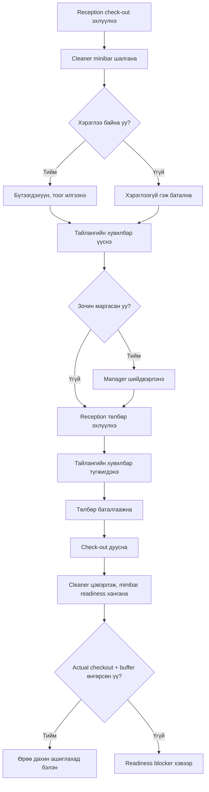

# Cleaner minibar тайлан, checkout exception ба маргааны ажиллагаа

**Хувилбар:** 1.11  
**Төлөв:** MVP ажиллагаа батлагдсан; P0-37, P0-38 болон P0-39A–P0-39C-2 батлагдсан  
**Хамаарах үе шат:** MVP — Cleaner / Reception / Checkout / Payment

## 1. Хамрах хүрээ

Энэ дүрэм нь Cleaner болон minibar боломжтой **25,000₮**, **30,000₮** багцын `Minibar ашиглана` өрөөний check-out-д үйлчилнэ. **20,000₮** багц болон `Minibar ашиглахгүй` өрөө энэ тайланг хүлээхгүй. Room minibar mode болон inventory readiness-ийг [22-minibar-stock-inventory.md](./22-minibar-stock-inventory.md)-д тодорхойлно.

Энд дараах нөхцөлийг нэг мөр болгоно:

- Cleaner-ийн minibar тайлан ирээгүй үеийн check-out;
- төлбөрөөс өмнөх буруу тайлангийн залруулга;
- төлбөр эхэлсний дараах тайлангийн түгжээ;
- төлбөр батлагдсаны дараах илүү/дутуу тооцооны залруулга;
- зочин minibar хэрэглээг маргасан үеийн шийдвэр.

## 2. Ердийн check-out урсгал

1. Reception `Check-out эхлүүлэх` үйлдэл хийнэ. Сервер pending actual-time correction байхгүйг шалгана.
2. Систем Cleaner-д `Минибар шалгах` ажил үүсгэнэ.
3. Cleaner бүтээгдэхүүн бүрийн хэрэглэсэн тоог оруулах эсвэл `Минибар хэрэглээгүй` гэж батална.
4. Cleaner тайлангаа илгээнэ.
5. Систем тайлангийн тухайн хувилбараар minibar-ын дүнг бодож Reception-д шинэчилсэн эцсийн тооцоо харуулна.
6. Reception өрөө, minibar, бусад батлагдсан төлбөр болон барьцааг нэгтгэн төлбөрийг эхлүүлнэ.
7. Төлбөр эхлэхэд ашиглаж буй тайлангийн хувилбар түгжигдэнэ.
8. Төлбөр амжилттай баталгаажсаны дараа Reception check-out-ыг дуусгана.
9. Cleaner өрөөг цэвэрлэж, minibar-ыг нөхөн дүүргэнэ.
10. Сервер actual check-out + snapshot cleaning buffer өнгөрсөн, cleaning status `Цэвэр`, мөн applicable minibar/configuration readiness хангагдсан үед л өрөөг дараагийн зочинд дахин ашиглахыг зөвшөөрнө.

Ердийн урсгалд Cleaner-ийн `хэрэглэсэн` эсвэл `хэрэглээгүй` гэсэн тайлангийн аль нэг ирээгүй бол эцсийн төлбөр болон check-out хаагдахгүй.

Actual check-out хийгдээгүй үед availability planning нь planned checkout + snapshot cleaning buffer ашиглана; actual check-out хийсний дараа actual checkout + ижил buffer authoritative болно. Early check-out existing confirmed booking-ийг автоматаар урагшлуулахгүй, auto reprice/refund хийхгүй. Late check-out readiness-ийг хойшлуулах боловч overdue status/time-аас автомат fee/penalty үүсгэхгүй; late conflict `STAY-DEC-013`-ын hard blocker/remedy-г ашиглана. Occupancy interval, overlap болон readiness-ийг сервер `[start_at, end_at)` дүрмээр дахин шалгана.

### 2.1 Actual-time correction checkout gate

Active stay-ийн check-out эхлээгүй үед Reception actual start correction request үүсгэж, Manager approve/reject хийнэ. Hotel Admin-д энэ approval хийх бол Manager role тусдаа шаардлагатай. Reception+Manager multi-role account self-approve хийж болох ч `self-approved` audit flag-тай. Нэг stay-д нэг pending request байх бөгөөд terminal `Approved`/`Rejected` болтол check-out initiation, улмаар Cleaner minibar report task болон payment урсгал эхлэхгүй.

Approval original check-in-ийг overwrite хийхгүй; immutable amendment-аас `effective_actual_check_in_at` derivation хийнэ. New time original `STAY-DEC-009` window дотор байна. Correction нь planned checkout/duration/type, check-in price book, minibar configuration/opening stock, report/task/movement, room/deposit/payment/cash/recognized time-ийг өөрчлөхгүй. Check-out аль хэдийн эхэлсэн эсвэл дууссан бол request/approval хийхгүй (`STAY-DEC-010`).

### 2.2 Planned checkout minimal guard

Confirmed booking эсвэл `ACTIVE` stay-ийн `planned_checkout_at`-ийг generic direct edit/PATCH-аар overwrite хийхгүй. MVP-д change байхгүй; STAY-DEC-011-ийн append-only history/revalidation нь зөвхөн post-MVP change хожим тусдаа батлагдвал мөрдөх invariant байна.

Энэ хамгаалалт одоогоор хугацаа өөрчлөх button/API/action, төрөл, permission/approval, eligibility, pricing/repricing, refund/payment эсвэл checkout lifecycle шийдээгүй бөгөөд тэдгээрийг идэвхжүүлэхгүй. Cleaner report/task/version, minibar report/refill/count, payment lock, charge/payment/cash, room/configuration/stock/price snapshot болон event-ийн server time-г өөрчлөхгүй; өөрөө шинэ task, movement, adjustment эсвэл check-out side effect үүсгэхгүй.

### 2.3 P0-39C-2 — Planned end lock ба actual checkout

`STAY-DEC-012`-оор `CONFIRMED` booking/`ACTIVE` stay-ийн planned checkout MVP-д огт өөрчлөгдөхгүй. Amendment/action/button/API, extension, planned-end shorten болон hourly ↔ nightly conversion байхгүй. Reception early/late actual checkout үед зөвхөн `actual_checkout_at` бүртгэж, original planned end-ийг хэвээр хадгална.

Early actual checkout автоматаар charge reprice/refund хийхгүй; overdue нь status/time л харуулж fee/penalty үүсгэхгүй. Room actual checkout хүртэл occupied/blocking байна. Actual checkout бүртгэгдсэний дараа л snapshot buffer өнгөрөх, `Цэвэр` болон applicable minibar/configuration readiness хангагдах existing checkout gate үйлчилнэ. C2 өөрөө Cleaner task/report, payment lock, charge/payment/cash, config/stock/price snapshot, movement эсвэл event time-д side effect үүсгэхгүй.

## 3. Cleaner тайлан ирээгүй үеийн онцгой ажиллагаа

Reception Cleaner-ийн тайланг алгасаж эсвэл minibar-ын дүнг таамгаар оруулж check-out дуусгах эрхгүй.

Cleaner бодитоор ажиллах боломжгүй үед:

1. Manager эсвэл Manager Plus өрөөг бодитоор шалгана.
2. `Онцгой minibar тайлан` үүсгэж, хэрэглэсэн бүтээгдэхүүн/тоо эсвэл `Хэрэглээгүй` гэсэн үр дүнг оруулна.
3. Онцгой тайлангийн шалтгааныг заавал бичнэ.
4. Нотлох зураг, хавсралт болон хоёр дахь хэрэглэгчийн баталгаа шаардахгүй.
5. Систем тайланг `Онцгой тайлан` гэж ялган, actor, role, шалтгаан, огноо/цагтай аудитад хадгална.

Hotel Admin нь Manager-ийн operational эрхийг автоматаар өвлөхгүй. Онцгой minibar тайлан оруулахын тулд тухайн account-д Manager эсвэл Manager Plus role тусад нь олгогдсон байна.

Энэ нь тайлангүй check-out хийх bypass биш; Cleaner-ийн оронд эрх бүхий Manager бодит шалгалтын тайлан үүсгэж буй ажиллагаа байна.

## 4. Төлбөрөөс өмнөх тайлангийн залруулга

- Reception тайлангийн бүтээгдэхүүн, тоо болон дүнг өөрөө засахгүй.
- Алдаа илэрвэл Reception тайланг `Залруулах шаардлагатай` төлөвөөр Cleaner-д буцаана.
- Буцаах шалтгаан заавал байна.
- Cleaner залруулж дахин илгээхэд шинэ хувилбар үүснэ; өмнөх хувилбарыг дарж өөрчлөхгүй.
- Шинэ report version бүр тухайн stay-ийн ижил check-in price book-оос unit price авна; current product price руу шилжихгүй.
- Эцсийн төлбөрт зөвхөн хамгийн сүүлийн хүчинтэй, түгжигдээгүй хувилбарыг ашиглана.
- Cleaner боломжгүй бол Manager/Manager Plus 3-р хэсгийн онцгой ажиллагаагаар шинэ тайлангийн хувилбар үүсгэж болно.

## 5. Төлбөр эхэлсэн үеийн түгжээ

Reception QPay, integrated card, гар POS эсвэл бэлэн төлбөрийн ажиллагааг эхлүүлэх үед эцсийн дүнд ашигласан minibar тайлангийн `report_version_id`-г payment attempt-тэй холбоод түгжинэ.

- Түгжигдсэн хувилбарыг Cleaner, Reception, Manager болон Hotel Admin хэн ч шууд засахгүй.
- Төлбөр **амжилтгүй/цуцлагдсан бөгөөд мөнгө авагдаагүй нь баттай** бол тухайн attempt-ийг хааж, тайланг залруулах урсгалд буцаан нээж болно.
- Provider-ийн төлөв `Хүлээгдэж байгаа` эсвэл `Тодорхойгүй` бол мөнгө давхар авах эрсдэлтэй тул тайлан болон checkout түгжээтэй хэвээр байна; эхлээд provider reconciliation/status check хийнэ.
- Callback, retry болон давтан даралт нь ижил payment attempt эсвэл ижил minibar charge-ийг хоёр удаа үүсгэхгүй.
- Retry хийхдээ өөр report version ашиглах шаардлагатай бол өмнөх attempt мөнгө аваагүй terminal төлөвтэй болсны дараа шинэ attempt үүсгэнэ.

## 6. Төлбөр батлагдсаны дараах алдаа

Төлбөр батлагдсан бол анхны minibar тайлан, invoice болон payment мөрийг edit/delete хийхгүй.

Manager, Manager Plus эсвэл Hotel Admin холбоостой залруулгын ажиллагаа үүсгэнэ:

- **Илүү тооцсон:** Илүү дүнг reversal/adjustment-аар бууруулж, батлагдсан refund урсгалаар буцаана.
- **Дутуу тооцсон:** Зөрүү дүнгээр шинэ авлага болон шинэ payment request үүсгэнэ.
- **Зочин төлөөгүй:** Авлагыг `Төлөгдөөгүй` төлөвтэй хадгална; өмнөх амжилттай төлбөрийг буцааж өөрчлөхгүй.

Залруулга бүр original report version, original payment, бүтээгдэхүүн, тоо, original check-in нэгж үнэ, зөрүү дүн, шалтгаан, actor болон огноо/цагтай холбоотой байна. Илүү/дутуу quantity-г current price-аар бус original stay price book-оор бодно. Refund болон financial correction-ийн сувгийн дүрмийг [20-deposit-and-payment-correction.md](./20-deposit-and-payment-correction.md)-ийн immutable transaction зарчмаар мөрдөнө.

## 7. Зочны minibar маргаан

Зочин эцсийн төлбөрөөс өмнө нэг эсвэл хэд хэдэн minibar мөрийг маргавал:

1. Reception тухайн мөрийг `Маргаантай` гэж тэмдэглэнэ; тоо, үнэ болон дүнг өөрөө засахгүй.
2. Check-out-ын эцсийн төлбөр маргаан шийдэгдэх хүртэл хүлээнэ.
3. Manager эсвэл Manager Plus бодит нөхцөлийг шалгаж шийдвэр гаргана.
4. `Төлбөрийг хэвээр үлдээх` эсвэл `Төлбөрөөс чөлөөлөх` гэсэн шийдвэрийн аль нэгийг сонгоно.
5. Чөлөөлөх бол анхны тайланг өөрчлөхгүй; төлөх дүнг бууруулсан adjustment мөр үүсгэнэ.
6. Нотлох зураг/баримт шаардахгүй. Manager, бүтээгдэхүүн, маргасан тоо/дүн, шийдвэр болон огноо/цагийг аудитад хадгална.

Hotel Admin энэ operational маргааныг шийдэх бол Manager эсвэл Manager Plus role-той байна. Харин төлбөр батлагдсаны дараах санхүүгийн correction/refund approval-д 6-р хэсэг болон payment correction-ийн тусгай эрх үйлчилнэ.

## 8. Төлөв ба хувилбар

### 8.1 Үндсэн тайлангийн төлөв

| Төлөв | Утга |
| --- | --- |
| `Хүлээгдэж байгаа` | Check-out эхэлсэн, тайлан үүсээгүй |
| `Шалгаж байгаа` | Cleaner ажлыг авч шалгаж байгаа |
| `Илгээсэн` | Анхны хүчинтэй хувилбар Reception-д ирсэн |
| `Залруулах шаардлагатай` | Reception шалтгаантайгаар Cleaner-д буцаасан |
| `Дахин илгээсэн` | Cleaner шинэ хувилбар илгээсэн |
| `Төлбөрт түгжигдсэн` | Тухайн report version payment attempt-д ашиглагдаж байгаа |
| `Тооцоонд орсон` | Холбоотой төлбөр баталгаажсан |

### 8.2 Тусгай тэмдэглэгээ

Эдгээрийг үндсэн төлөвийг дарж солих бус, тусдаа төрөл/flag эсвэл холбоотой event байдлаар хадгална:

- `Онцгой тайлан` — Manager/Manager Plus Cleaner-ийн оронд шалгаж илгээсэн;
- `Маргаантай` — зочны маргаан шийдэгдээгүй;
- `Маргаан шийдсэн` — Manager-ийн шийдвэр бүртгэгдсэн;
- `Залруулга хийгдсэн` — төлбөрийн дараах reversal/adjustment холбоотой;
- `Цуцлагдсан` — check-out цуцлагдаж тухайн тайлан ашиглагдаагүй.

Хувилбар бүр immutable байна. `report_id` нь нэг check-out-ын тайланг, `version_no` нь залруулгын дарааллыг, `report_version_id` нь payment-тэй холбох яг хувилбарыг ялгана.

## 9. Эрхийн хуваарилалт

| Үйлдэл | Reception | Cleaner | Manager | Manager Plus | Hotel Admin |
| --- | ---: | ---: | ---: | ---: | ---: |
| Check-out эхлүүлэх | ✓ | — | Нэмэлт Reception role | Нэмэлт Reception role | Нэмэлт Reception role |
| Ердийн minibar тайлан илгээх | — | ✓ | — | — | — |
| Тайланг залруулгад буцаах | ✓ | — | Нэмэлт Reception role | Нэмэлт Reception role | Нэмэлт Reception role |
| Буцаасан тайланг дахин илгээх | — | ✓ | — | — | — |
| Онцгой minibar тайлан үүсгэх | — | — | ✓ | ✓ | Нэмэлт Manager/Manager Plus role |
| Маргаантай мөр тэмдэглэх | ✓ | — | Нэмэлт Reception role | Нэмэлт Reception role | Нэмэлт Reception role |
| Төлбөрөөс өмнөх маргаан шийдэх | — | — | ✓ | ✓ | Нэмэлт Manager/Manager Plus role |
| Төлбөр батлагдсаны дараах correction/refund | Хүсэлт/гүйцэтгэл | — | ✓ | ✓ | ✓ |

Бүх үйлдэл package, subscription/account state, hotel scope болон server-side permission шалгалттай байна.

## 10. Аудит ба хамгаалалт

- Тайлан үүсгэсэн, буцаасан, дахин илгээсэн, онцгой тайлан үүсгэсэн, маргаан шийдсэн болон залруулга хийсэн үйлдэл бүр actor/time/reason-тэй байна.
- Өмнөх report version, payment болон invoice мөрийг hard delete хийхгүй.
- Тооцоонд орсон бүтээгдэхүүний нэр, тоо, stay price book-ийн unit price болон нийт дүн snapshot хэлбэрээр хадгалагдана.
- Төлбөрийн provider төлөвийг client screenshot эсвэл хэрэглэгчийн амаар хэлснээр батлахгүй.
- Payment callback болон status query-г idempotency хамгаалалттай боловсруулна.
- Нэг report version-ийг хоёр өөр амжилттай charge-д давхар ашиглахгүй.
- Actual-time amendment request/approve/reject нь requester/approver, reason, original/requested/effective time, boundary anchor, decision time болон `self-approved` flag-тай; existing Cleaner/report/payment event time-ийг өөрчлөхгүй.

Minibar selling price-ийг check-in үед stay price book болгон түгжих, normal/exception/corrected report болон post-payment correction-д ижил үнэ ашиглах дүрмийг [25-minibar-selling-price-snapshot.md](./25-minibar-selling-price-snapshot.md)-д PRICE-DEC-001–008-аар баталсан.

## 11. MVP acceptance criteria

- 25,000₮/30,000₮ багцын minibar-enabled өрөөний ердийн check-out Cleaner-ийн `хэрэглэсэн` эсвэл `хэрэглээгүй` тайлангүйгээр хаагдахгүй.
- Reception minibar тайлангийн бүтээгдэхүүн, тоо болон дүнг засахгүй.
- Cleaner буцаасан тайланг шинэ хувилбараар дахин илгээж, өмнөх хувилбар түүхэнд үлдэнэ.
- Cleaner/Manager report version бүр ижил stay price book ашиглаж, unit price override хийхгүй.
- Cleaner боломжгүй үед зөвхөн Manager/Manager Plus онцгой тайлан үүсгэж, шалтгаан болон аудит хадгалагдана.
- Payment attempt эхлэхэд яг ашигласан report version түгжигдэнэ.
- Тодорхойгүй/pending payment үед report unlock хийхгүй, шинэ payment давхар үүсгэхгүй.
- Баталгаатай failed/cancelled, мөнгө аваагүй payment-ийн дараа report correction-д буцаж болно.
- Төлбөр батлагдсаны дараа original report/payment edit/delete хийхгүй; reversal/adjustment ашиглана.
- Төлбөрийн дараах quantity reversal/new receivable original check-in price ашиглана.
- Зочны маргааныг Reception зөвхөн тэмдэглэж, Manager/Manager Plus шийдвэрлэнэ.
- Маргаан шийдэгдэхээс өмнө эцсийн төлбөр/check-out дуусахгүй.
- 20,000₮ багц болон minibar-disabled өрөөний check-out энэ Cleaner report workflow-г шаардахгүй.
- Check-out дууссан ч actual checkout + snapshot buffer, `Цэвэр` төлөв болон applicable minibar/configuration readiness бүгд хангагдахаас өмнө өрөөг дахин ашиглахгүй.
- Availability/assignment/check-in overlap болон readiness-ийг сервер end-exclusive `[start_at, end_at)` интервалаар authoritative шалгана.
- Cleaner/exception report version, cleaning-state transition, minibar readiness болон холбоотой task/movement бүр original immutable server time-тай байна. Initial check-in backdate validation эдгээр existing event-ийг сонгосон actual агшинд хүчинтэй байсан эсэхээр шалгах бөгөөд report/task/movement-ийг retroactive болгож өөрчлөхгүй (`STAY-DEC-009`).
- Нэг pending active-stay actual-time correction check-out initiation-ийг блоклоно; approved/rejected terminal болсны дараа л checkout эхэлнэ.
- Actual-time amendment original check-in/minibar snapshot/report/task/movement-ийг overwrite/reprice/re-time хийхгүй; checkout эхэлсэн/дууссан үед correction хориглогдоно.
- Confirmed booking/active stay-ийн planned checkout change MVP-д байхгүй; STAY-DEC-011-ийн amendment invariant зөвхөн post-MVP-д үйлчилнэ.
- Minimal guard өөрөө checkout/Cleaner/payment action, permission, reprice/refund, report/task/movement эсвэл snapshot/event өөрчлөхгүй.
- Early/late actual checkout original planned end-д хүрэхгүй; early auto reprice/refund, overdue auto fee/penalty үүсгэхгүй.
- Room actual checkout хүртэл occupied; дараа нь snapshot buffer + clean + minibar/config readiness gate үйлчилнэ.

## 12. Батлагдсан шийдвэр

### CHK-DEC-001 — Cleaner тайлан заавал байх

- **Төлөв:** Батлагдсан
- **Шийдвэр:** 25,000₮/30,000₮ багцын minibar-enabled өрөөний ердийн check-out-д Cleaner хэрэглэсэн тоо эсвэл `Хэрэглээгүй` гэсэн тайлан заавал илгээнэ. Тайлангүйгээр Reception check-out хаахгүй. Minibar-disabled өрөөнд энэ тайлан үүсэхгүй.

### CHK-DEC-002 — Manager-ийн онцгой тайлан

- **Төлөв:** Батлагдсан
- **Шийдвэр:** Cleaner боломжгүй үед Manager/Manager Plus өрөөг бодитоор шалгаж, шалтгаантай `Онцгой minibar тайлан` үүсгэнэ. Нотолгоо/хоёр дахь approval шаардахгүй. Hotel Admin-д тохирох Manager role тусдаа шаардлагатай.

### CHK-DEC-003 — Төлбөрөөс өмнөх versioned correction

- **Төлөв:** Батлагдсан
- **Шийдвэр:** Reception тайланг засахгүй, шалтгаантайгаар Cleaner-д буцаана. Cleaner шинэ immutable version илгээж, өмнөх хувилбар түүхэнд үлдэнэ.

### CHK-DEC-004 — Payment lock ба reconciliation

- **Төлөв:** Батлагдсан
- **Шийдвэр:** Payment attempt эхлэхэд ашигласан report version түгжигдэнэ. Зөвхөн мөнгө аваагүй нь баттай failed/cancelled attempt-ийн дараа correction-д нээнэ; pending/unknown үед reconciliation дуустал түгжээтэй байлгана. Callback/retry idempotent байна.

### CHK-DEC-005 — Төлбөрийн дараах immutable adjustment

- **Төлөв:** Батлагдсан
- **Шийдвэр:** Төлбөр батлагдсаны дараа original report/invoice/payment-ийг засахгүй. Илүү дүнг reversal/refund, дутуу дүнг шинэ авлага/payment-аар залруулна; төлөгдөөгүй зөрүүг авлагаар хадгална.

### CHK-DEC-006 — Зочны minibar маргаан

- **Төлөв:** Батлагдсан
- **Шийдвэр:** Reception маргааныг тэмдэглэж, Manager/Manager Plus `Хэвээр үлдээх` эсвэл adjustment-аар `Чөлөөлөх` шийдвэр гаргана. Нотлох зураг шаардахгүй; маргаан шийдэгдэх хүртэл checkout хүлээнэ.

## 13. Холбоотой дараагийн асуудал

Cleaner checkout exception-ийн P0-07–P0-09, P0-34–P0-39 хаагдсан. Shift, cash, inventory, financial болон price snapshot тусдаа canonical баримттай. Stay timing/conflict-ийн source of truth нь [05-room-stay-and-time-status.md](./05-room-stay-and-time-status.md)-ийн `STAY-DEC-008`–`014` байна.
