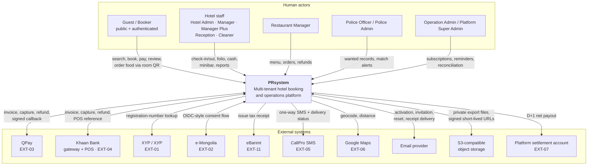
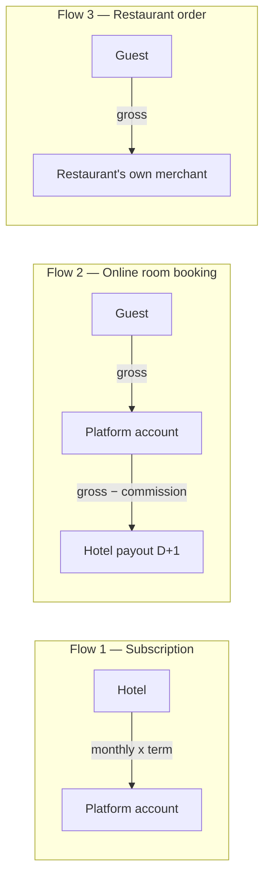

# 01 — System Context

**Level:** C4 Level 1. Who uses PRsystem, what it integrates with, and what crosses the boundary.

---

## 1. Context diagram

---

## 2. Actor summary

| Actor | Realm | Reaches | Never reaches |
| --- | --- | --- | --- |
| Guest / Booker | Guest | Public search, own bookings, own reviews, own restaurant orders via a stay-scoped session | Any hotel's operational data, any other guest, Police data |
| Hotel Admin | Hotel | Own hotel: subscription payment, staff, full financial dashboard and exports, drawers and safe, expense approval | Operational actions without the separate Manager/Manager Plus/Reception role; other hotels; Police data |
| Manager / Manager Plus | Hotel | Own hotel: rooms, tariffs, minibar, templates, shift review, expense submission, guest registry | Full financial dashboard and financial Excel; other hotels |
| Reception | Hotel | Own hotel: check-in/out, folio, deposit, own drawer shift, refill requests | Prices, inventory balances, roles, minibar report contents, bulk guest export |
| Cleaner | Hotel | Assigned tasks: cleaning status, minibar counts, assigned reconciliation transfers | Selling prices, guest identity, payments, financial data, other hotels |
| Restaurant Manager | Hotel (restaurant scope) | Own restaurant's menu, orders, refunds | Other restaurants, hotel guest identity, hotel financials |
| Police Officer | Police | Wanted records and matches in scope, exact-identifier match lookup, Found confirmation | The all-hotel check-in list, any export, hotel commercial data |
| Police Admin | Police | Police accounts, all-hotel check-in list, district graphs, access audit | Officer mutation rights by role name alone; bulk check-in export; hotel commercial data |
| Operation Admin | Operation/Platform | Subscription list and KPIs, manual SMS, reset initiation, retry and reconciliation queues | Guest data, hotel operational data, Police data, any secret value |
| Platform Super Admin | Operation/Platform | Operation access management, suspension, offline recovery approval | Business data by role name alone; every action needs an explicit named permission |

---

## 3. What crosses the boundary

### 3.1 Inbound

| Source | Payload | Trust | First validation |
| --- | --- | --- | --- |
| Browser (any portal) | JSON commands and queries | **Untrusted** | Realm guard, then the full seven-condition authorization pipeline ([05](05-authentication-realms-and-authorization.md)) |
| Payment provider callback | Payment or refund state change | **Untrusted** | Signature verification → event dedup → reference/amount/currency match → status re-query ([08](08-trust-boundaries.md) §4) |
| SMS provider callback | Delivery status | **Untrusted** | Signature or source verification, then message-id match |
| e-Mongolia redirect | Authorization code | **Untrusted** | Server-to-server code exchange; the redirect itself is never proof |
| XYP response | Identity fields | **Semi-trusted** | Structural validation; provenance recorded as `XYP_VERIFIED`, never inferred |
| Room QR scan | Opaque token | **Untrusted** | Token alone grants nothing; a one-time code bound to the stay is required |

### 3.2 Outbound

| Destination | Payload | Constraint |
| --- | --- | --- |
| QPay / Khaan Bank | Invoice, capture query, refund request | Amounts are server-computed integers; no client value is forwarded |
| CallPro | SMS body and recipient list | Police Match SMS carries the full registration number and nothing else identifying; body is never persisted to logs |
| eBarimt | Payment amount and breakdown | Never hand-authored; a failed issuance never reverses activation |
| Email | Activation, invitation, reset links, receipt links | One-time, short-lived, single-use; the token value never appears in any log |
| Google Maps | Address or coordinate pair | An unauthenticated user's precise coordinate is never persisted |
| Object storage | Export files | Private bucket; one-hour object TTL; five-minute signed URL |
| Settlement bank | Net payout instruction | Behind EXT-07; disabled until the contract clears |

---

## 4. Three money flows that must never merge

The requirements are explicit that these are separate ledgers with separate reporting
(doc 09 §9.3, `FIN-DEC-002`, `RC-DEC-020`, `CASH-DEC-004`).

- Flow 3 never touches the hotel folio, deposit, cash drawer, shift totals or hotel financial
  reports. The platform records order and payment state only; it performs no settlement.
- Flow 2's gateway fee is a platform expense — never added to the guest total and never deducted
  from the hotel payout.
- Flow 1 is non-refundable; duplicate charges are finance exceptions, not product refunds.

---

## 5. Isolation the context diagram must not hide

The single deployment hosts four realms whose data must not mix. Being one process is a deployment
choice, not a trust choice.

- Hotel modules never read Police tables. Police matching consumes a **minimal check-in event** via
  the outbox carrying `stay_id`, `hotel_id`, room, the keyed identifier token and
  `check_in_recorded_at` — no commercial, financial or guest-contact fields (doc 13 §3).
- Operation and Platform accounts reach no guest identity and no Police content
  (`RBAC-DEC-004`, `POL-DEC-007`).
- A hotel user cannot detect whether a Police match exists. Hotel-facing responses, error text and
  observable latency are identical either way (`POL-DEC-007`, threat `T-POL-02`).

---

## 6. Context-level assumptions

| ID | Assumption | Consequence if wrong |
| --- | --- | --- |
| CTX-01 | Hotels operate in a single country and timezone family; `Asia/Ulaanbaatar` is the seed value stored per hotel | Timezone already per-hotel data; low impact |
| CTX-02 | One guest-facing currency, MNT, with no subunit | Money type would need a currency dimension; contained in `packages/money` |
| CTX-03 | Restaurant settlement stays outside the platform for the MVP | Reintroducing it would add a fourth money flow and a new ledger |
| CTX-04 | Police integration is read-mostly for the platform: it emits check-in events and serves the Police portal, and never receives case data back into hotel modules | A reverse flow would break realm isolation and require a new legal basis |
