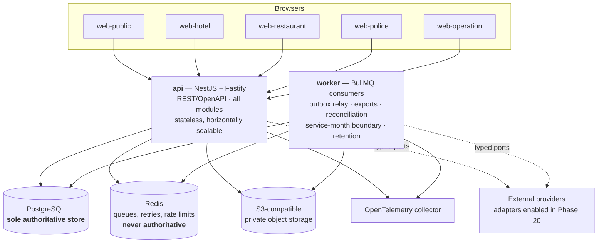
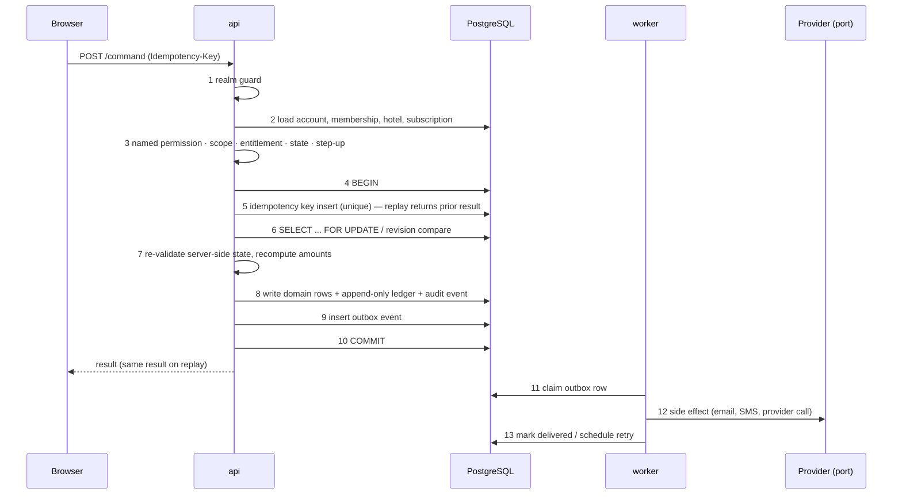
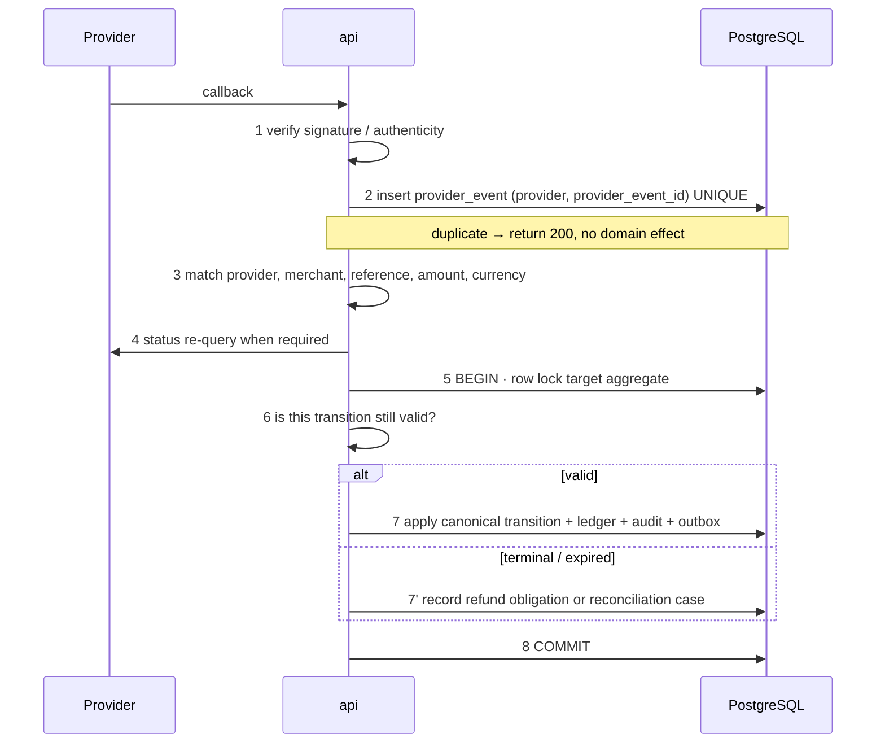

# 02 — Container and Deployment View

**Level:** C4 Level 2. What runs, where state lives, and how a request becomes a durable effect.

---

## 1. Containers

Per [CLAUDE.md](../../CLAUDE.md) §1 the MVP ships **exactly two runtime deployments** — `api` and
`worker` — plus five static/SSR portal builds. No microservices, no Kubernetes requirement, no
distributed broker.

| Container | Runtime | State | Scaling |
| --- | --- | --- | --- |
| `api` | Node, NestJS on Fastify | Stateless; sessions are server-side rows in PostgreSQL | Horizontal; any instance serves any request |
| `worker` | Node, BullMQ consumers | Stateless; job state in Redis, business state in PostgreSQL | Horizontal, with per-queue concurrency limits |
| PostgreSQL | Managed Postgres | All business, financial, audit and session state | Vertical + read replicas for reporting later |
| Redis | Managed Redis | Queues, retry backoff, rate-limit counters, non-authoritative caches | Vertical |
| Object storage | S3-compatible, private buckets | Export artefacts only, with TTL | Managed |

### 1.1 Database roles

Per [ADR-0017](adr/ADR-0017-tenant-isolation-rls.md) and D-09, the deployment uses **eleven group
roles and seven canonical login principals** rather than one application role. The table below lists
the ones a deployment interacts with directly; the remainder are the two audit reader roles, the
partition manager and the audit writer. Phase 03 supports exactly one login per group, shared by
every process of that runtime.

| Role | Used by | Notes |
| --- | --- | --- |
| `prsystem_migrate` | Migration runner only | DDL owner; never used at runtime |
| `prsystem_api` | `api` | DML only; subject to RLS; no `BYPASSRLS` |
| `prsystem_worker` | `worker` | DML plus job tables; subject to RLS; no `BYPASSRLS` |
| `prsystem_police` | Police module connections | `police` and `police_audit` schemas only; not grantable to the runtimes above |
| `prsystem_job_scheduler` | scheduler (D-09) | Issues privileged maintenance jobs through one narrow function; no table privilege on `job_run`; cannot execute maintenance |
| `prsystem_maintenance_fn` | — (function owner) | Owns the cross-tenant maintenance functions; sets tenant scope per tenant; **no `BYPASSRLS`** |
| `prsystem_maintenance` | — (break-glass only) | `BYPASSRLS`; owns nothing, holds no standing grant, reachable by nobody. Normal maintenance does **not** use it |

Every runtime transaction establishes its tenant context with `SET LOCAL` after the authorization
pipeline resolves scope. Connection pooling is therefore safe: the context cannot outlive the
transaction that set it.

### 1.2 Redis is never authoritative

`CLAUDE.md` §1 forbids Redis as a financial source of truth or an authoritative lock. Concretely:

- No balance, entitlement, booking state or lock decision is ever read from Redis to make a business
  decision. Every such read is a PostgreSQL row read inside the deciding transaction.
- Idempotency keys and outbox records live in **PostgreSQL**, not Redis, so a Redis flush can never
  duplicate a business effect.
- Rate limits and OTP attempt counters may live in Redis. Losing them fails **closed**: the affected
  action is rejected rather than allowed. The authoritative lockout state that must survive a flush
  (for example a Police account lock) is persisted in PostgreSQL.
- Queue loss re-drives work from the PostgreSQL outbox; it never loses a committed effect.

---

## 2. Portals

| Portal | Realm | Rendering | Notes |
| --- | --- | --- | --- |
| `web-public` | Guest (and anonymous) | SSR for search and hotel detail, client for booking flow | Anonymous search allowed; authentication required before payment |
| `web-hotel` | Hotel | Mostly client with SSR shell | Cleaner views are mobile-first and usable without horizontal scrolling (doc 04 §3) |
| `web-restaurant` | Hotel (restaurant scope) | Client | Order board with live refresh |
| `web-police` | Police | SSR shell, strict CSP | No analytics, no third-party scripts, no identifier in any URL |
| `web-operation` | Operation/Platform | Client | Masked contact values by default |

**Web applications contain no authoritative business rules** (`CLAUDE.md` §3). A portal may hide a
control for usability, but every decision is re-made server-side. Phase 21 asserts this with an
architecture test: web packages may import `packages/contracts` types only.

---

## 3. Request lifecycle for a money- or lifecycle-changing command

Invariants this sequence encodes:

- Steps 4–10 are one transaction. The audit event and the outbox event commit **with** the domain
  change, never after it.
- Step 5 makes the whole command idempotent. A retried request returns the first result and creates
  no second effect (`CLAUDE.md` §6).
- Step 7 recomputes every amount server-side. A client-supplied `amount`, `balance`, `role`,
  `hotel_id`, `restaurant_id`, provider status or payment success is discarded (`CLAUDE.md` §4).
- Step 12 happens **after** commit and is at-least-once. Every consumer is idempotent.

---

## 4. Inbound provider callback lifecycle

Step 7' is the rule that a **late callback never silently reopens** an expired booking or entitlement
(`CLAUDE.md` §7, `PAY-DEC-006`, `LIFE-DEC-006`, `REST-DEC-005`, `ONB-DEC-008`, `DEP-DEC-009`). The
money is recognised; the terminal entity is not resurrected; an explicitly permissioned human resolves
the resulting case.

---

## 5. Worker queues

| Queue | Trigger | Idempotency | Failure behaviour |
| --- | --- | --- | --- |
| `outbox-relay` | Poll of unrelayed outbox rows | Outbox row id | Backoff retry; row stays unrelayed |
| `notification` | Outbox event | `(event_id, channel)` | Retry; never re-sends on duplicate event |
| `provisioning` | Paid onboarding application | Application id + attempt | ≤5 exponential retries, then `PROVISIONING_FAILED` awaiting `ONBOARDING_PROVISION_RETRY` |
| `billing-boundary` | Scheduled service-month boundary | Subscription id + `billing_revision` CAS | Loses to a concurrent callback; exactly one transition wins |
| `export` | Export job row | Job id | Job → `FAILED`; no partial file is ever published |
| `reconciliation` | Provider status drift | Case id | Case stays open; never auto-resolves |
| `retention` | Schedule | Policy version + row | Skips rows under legal hold |

Job scheduling is BullMQ on Redis. **Business truth is the PostgreSQL row**; the job is only a
prompt to act.

---

## 6. Environments and configuration

| Environment | Data | External adapters |
| --- | --- | --- |
| local / CI | Synthetic only. Real registration numbers, addresses and case data are forbidden (`CLAUDE.md` §8, doc 13 §17) | Simulators only |
| staging | Synthetic | Sandbox adapters, individually enabled only when a gate clears |
| production | Real | Only adapters whose EXT gate is cleared; all others disabled and failing closed |

Policy values that the requirements refuse to hard-code — Police escalation minutes, Police retention,
guest retention, SMS caps — are **versioned configuration rows**, not constants. Absent an approved
value the dependent feature is disabled in production, not defaulted (EXT-08, EXT-09, `POL-DEC-010`,
`POL-DEC-011`, `GUEST-DEC-008`).

---

## 7. Availability and recovery posture

- `api` and `worker` are stateless; instance loss costs only in-flight requests.
- PostgreSQL is the single recovery unit. Point-in-time recovery is the disaster-recovery mechanism;
  targets are in [15](15-non-functional-targets.md) and rehearsed in Phase 22.
- Redis loss is tolerable: queues re-drive from the outbox, rate limits fail closed.
- Object storage holds only regenerable export artefacts under TTL.
- A restore must not replay side effects. Outbox rows carry a delivery marker so a restored database
  does not re-send email or SMS for already-delivered events; the recovery runbook
  ([docs/implementation/recovery-runbook.md](../implementation/recovery-runbook.md), Phase 22) records
  the cut-off procedure and the rehearsal's measured RPO and RTO.
