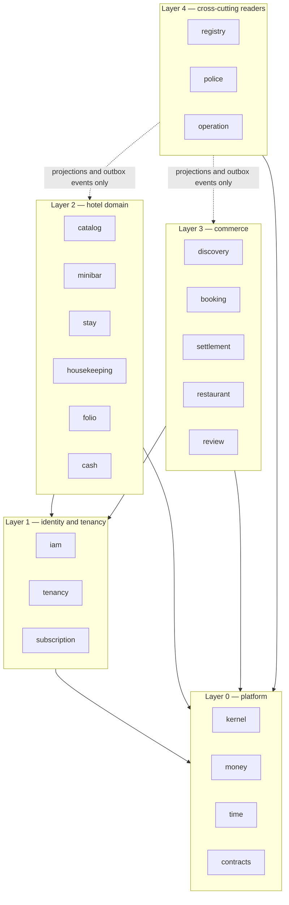
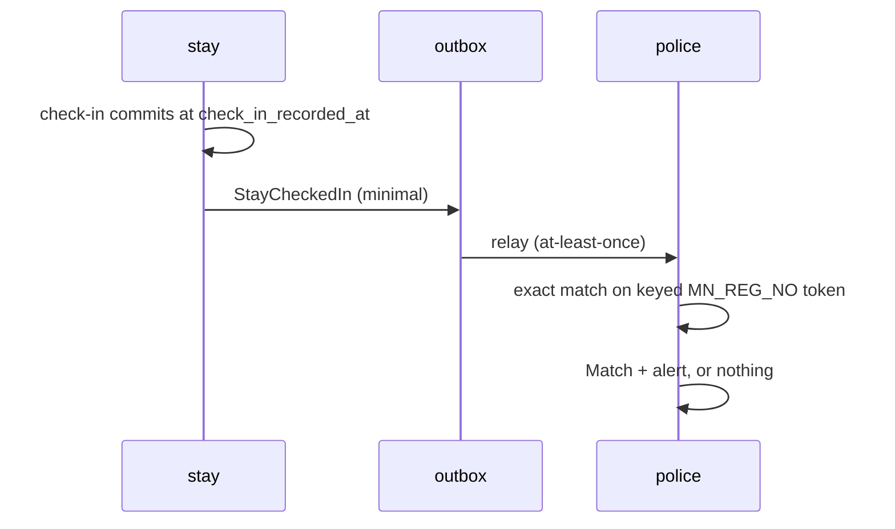

# 03 — Module Ownership and Dependency Rules

Which module owns which tables, what a module may import, and how cross-module reads happen without
breaking the boundary rule in [CLAUDE.md](../../CLAUDE.md) §3.

---

## 1. Module register

Each module owns its tables exclusively. No other module may read or write them directly.

Two rows carry a bracketed earlier phase. That is a **table** introduced before its owning module,
because an invariant somewhere else requires it to exist, and it means exactly what it says: the
table is created early with only the columns that invariant needs, and the owning module still owns
the aggregate.

- `cash location` is created in Phase 05. doc 24 §2.1 requires exactly one `Үндсэн касс` to exist
  when a hotel's subscription activates, and that has to happen inside the provisioning transaction
  or it is not an invariant at all. What Phase 05 introduces is the location root alone — kind, name,
  code, state, and the index that makes a second default drawer impossible. Shifts, movements,
  balances, transfers, expenses and safes are Phase 11's, and the table has no column for any of
  them.
- `hotel profile` and `hotel location` are created in Phase 05, for the same reason: doc 15 §2.1's
  public name, contact and coordinate are captured on the application and have to be written with the
  tenant they belong to. They are one table, `platform.hotel_profile`, holding the submitted values
  as integer micro-degrees plus the publication axis of doc 15 §6. No geocoding, no distance and no
  discovery — `GeoPort` and the public portal are Phase 12, behind EXT-06.

| Module | Owns (aggregates) | Introduced in phase |
| --- | --- | --- |
| `kernel` | audit event, outbox, idempotency key, session, auth epoch, config version | 03 |
| `iam` | user account, credential, hotel membership, restaurant membership, role grant, invitation, permission grant | 04 |
| `tenancy` | hotel, hotel profile, hotel location, package entitlement projection | 04 (profile and location: 05) |
| `subscription` | onboarding application, subscription owner, subscription, billing intent, payment attempt, reconciliation case, eBarimt receipt | 05 |
| `catalog` | room category, room, tariff (hotel/category/room × hourly/nightly), cleaning buffer config, deposit config, entity lifecycle state | 06 |
| `minibar` | product, stock location, stock movement, weighted-average cost, template entity, template version, room configuration, configuration request, rollout batch, rollout child | 07 |
| `stay` | guest identity, stay, stay price book, occupancy interval, actual-time amendment, readiness state, overdue conflict | 08 |
| `housekeeping` | cleaning task, minibar inspection task, minibar report version, refill request, dispute | 09 |
| `folio` | folio, charge line, payment, deposit aggregate, deposit movement, refund request, financial correction | 10 |
| `cash` | cash location, drawer shift, cash movement, transfer, expense request, expense payment | 11 (cash location root: 05) |
| `discovery` | public listing projection, search index projection | 12 |
| `booking` | booking, inventory hold, booking price snapshot, cancellation, no-show | 13 |
| `settlement` | booking payment, commission, hotel payable, provider fee, refund, payout batch, adjustment | 14 |
| `restaurant` | restaurant, hotel-restaurant link, menu category, menu item, order, order state axes, refund request, guest session, access code | 15 |
| `review` | review, review report, moderation action, official reply, rating aggregate | 16 |
| `registry` | guest registry projection, export job, retention policy snapshot, legal hold | 17 |
| `police` | wanted person, identity revision, wanted case, match, match-case link, alert, acknowledgement, outcome request, police account | 18 |
| `operation` | operation account, operation permission grant, KPI projection, SMS job, SMS recipient message, contact change request | 19 |

---

## 2. Dependency rules

### 2.1 The four rules

1. **No cross-module repository access.** A module may import another module's `contracts` types and
   call its application services. It may never import another module's repository, entity, schema
   file or table name. Enforced by ESLint boundary rule from Phase 02 and asserted by `GATE-LINT`.
2. **Layer 4 reads only derived data.** `registry`, `police` and `operation` are consumers. They read
   projections and consume outbox events; they never call into Layer 2/3 write paths and never join
   to their tables.
3. **Hotel modules never query Police tables**, in either direction of the import graph. `police` is
   reachable from no other module.
4. **Web applications import `contracts` types only** — never `db`, never `authz` internals, never a
   module service.

### 2.2 Permitted cross-module mechanisms

| Mechanism | Use when | Consistency |
| --- | --- | --- |
| Application contract call | A synchronous decision is needed inside one request, same transaction | Strong |
| Query service | A read-only, permission-checked view of another module's data | Strong, read-only |
| Own read model | A module maintains its **own** critical read model in the same transaction as the source change | Strong |
| Projection table | A consumer needs a denormalised read model owned by a different module (registry list, Operation KPI, search index) | Eventual, rebuildable |
| Outbox event | A consumer must react to a state change (Police matching, notifications, settlement eligibility) | Eventual, at-least-once |

### 2.3 Projection consistency rules

Decided in [ADR-0019](adr/ADR-0019-projection-consistency.md), closing DM-03.

1. **Within a module, same transaction.** A module may update its own critical read model inside the
   transaction that changes the source — category availability counters, deposit balance aggregates,
   rollout batch progress. No boundary is crossed and there is no lag.
2. **Across modules, eventually consistent.** A read model owned by a different module than its source
   is updated through the transactional outbox with an idempotent inbox consumer.
3. **Observable freshness.** Every asynchronous projection exposes an `as_of` timestamp, a processing
   status, or a measurable lag where operationally relevant. Silently stale is a defect.
4. **Critical commands never read a projection.** Authorization and entitlement, payment and refund
   eligibility, inventory and availability allocation, deposit balance, readiness admission, and any
   transition guarded by a uniqueness or non-negativity invariant all read authoritative rows under
   the appropriate lock.
5. **Rebuildable.** Every projection has a documented rebuild job and is fully reproducible from
   authoritative records or the event log. Losing one is an availability problem, never a correctness
   problem.

---

## 3. Cross-module flows that matter

### 3.1 Check-in → Police matching

The only path from the hotel domain into the Police realm.

`StayCheckedIn` carries exactly: `stay_id`, `hotel_id`, `hotel_district`, `room_number`,
`identity_type`, `identifier_lookup_token`, `check_in_recorded_at`. It carries **no** name, no
contact, no price, no payment, no deposit, no minibar data (doc 13 §3, `POL-DEC-017`).

Consumer idempotency key is `stay_id + wanted_person_id`, which is also the Match table's unique
constraint — a duplicate relay produces one Match and one alert (`POL-DEC-002`).

The `stay` module receives nothing back. It cannot observe whether a Match occurred, which is what
makes `POL-DEC-007` enforceable rather than aspirational.

### 3.2 Folio ↔ cash

`folio` decides that a cash payment or refund happened; `cash` records the physical movement. Both
happen in one transaction through a contract call, because a cash receipt that exists in the folio
but not the drawer is a reconciliation defect.

`cash` never interprets business meaning. Deposit allocation to a charge line creates **no** cash
movement (`DEP-DEC-002`, `CASH-DEC-004` §5) — no new money entered the drawer.

### 3.3 Minibar → stay price book

At check-in, `stay` calls `minibar` for the room's exact current published version and its product
selling prices, then writes the price book **inside the check-in transaction**. If the price book
cannot be built completely, the stay does not activate (`PRICE-DEC-001`).

After that, `stay` and `housekeeping` read only the price book. They never re-read the live catalog,
which is what makes active-stay price isolation structural rather than procedural (`PRICE-DEC-002`).

### 3.4 Booking → stay

`booking` owns category-level inventory; `stay` owns physical occupancy. At check-in the category
reservation converts atomically into stay occupancy so the unit is never counted twice
(`BK-DEC-013`).

---

## 4. Shared packages

| Package | Contents | May depend on |
| --- | --- | --- |
| `contracts` | Cross-module DTOs, event envelopes, port interfaces | nothing |
| `money` | `Mnt` bigint type, basis points, `ROUND_HALF_UP` | nothing |
| `time` | UTC instant, hotel-local date, `[start,end)` interval, service-month math | nothing |
| `authz` | Permission catalog, seven-condition pipeline, realm guards | `contracts` |
| `db` | Drizzle setup, migration runner, transaction and lock helpers | nothing |
| `outbox` | Outbox writer/relay, idempotency store, event envelope | `db`, `contracts` |
| `ports` | Typed external ports + deterministic simulators | `contracts`, `money`, `time` |
| `telemetry` | OTel setup, redacting logger | nothing |
| `testing` | Postgres harness, concurrency helpers, synthetic identity factory | all of the above |

`money`, `time` and `contracts` have no internal dependencies so that every module can adopt them
without creating a cycle.

---

## 5. Boundary enforcement

| Control | Mechanism | Gate |
| --- | --- | --- |
| `CTL-BOUND-01` | ESLint `no-restricted-imports` denying `*/repositories/*`, `*/schema/*`, `*/entities/*` across module roots | `GATE-LINT` |
| `CTL-BOUND-01` | A deliberate violation fixture that must fail lint | `GATE-LINT` |
| `CTL-BOUND-02` | Consumers of Layer 2/3 data import only projection or event types | `GATE-LINT`, `GATE-UNIT` |
| `CTL-BOUND-03` | Critical-path isolation: a stale projection does not change an authorization, payment, refund, allocation or readiness decision | `GATE-INTEG` |
| `CTL-DATA-11` | `police` schema reachable only by `prsystem_police`; no runtime role holds `BYPASSRLS` | `GATE-INTEG` |
| — | Web packages restricted to `contracts` types | `GATE-LINT` (Phase 21) |
| — | `police` is imported by no module; asserted by a dependency-graph test | `GATE-UNIT` |

Adding a module, or a dependency edge between modules, requires an ADR.
