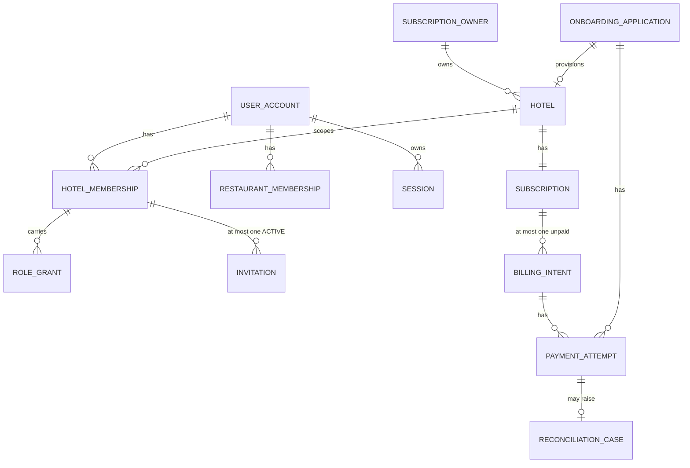
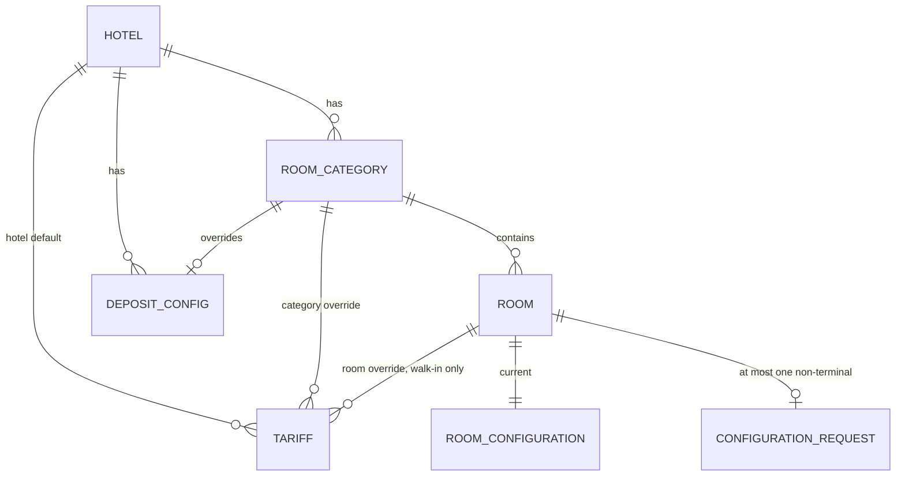
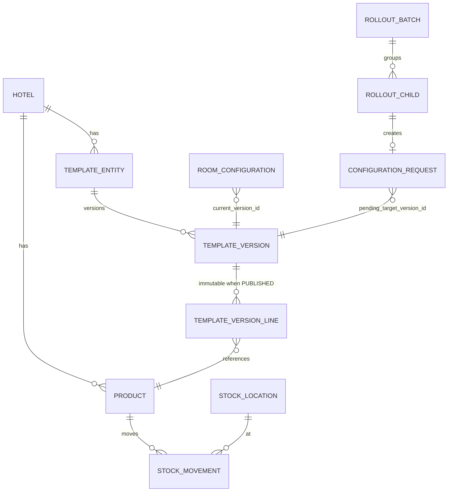
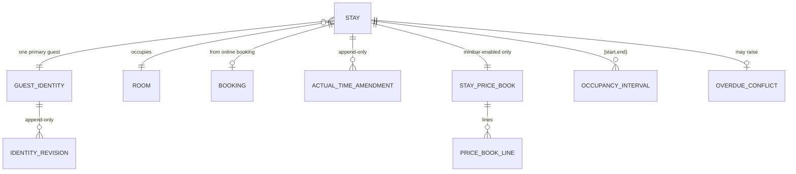
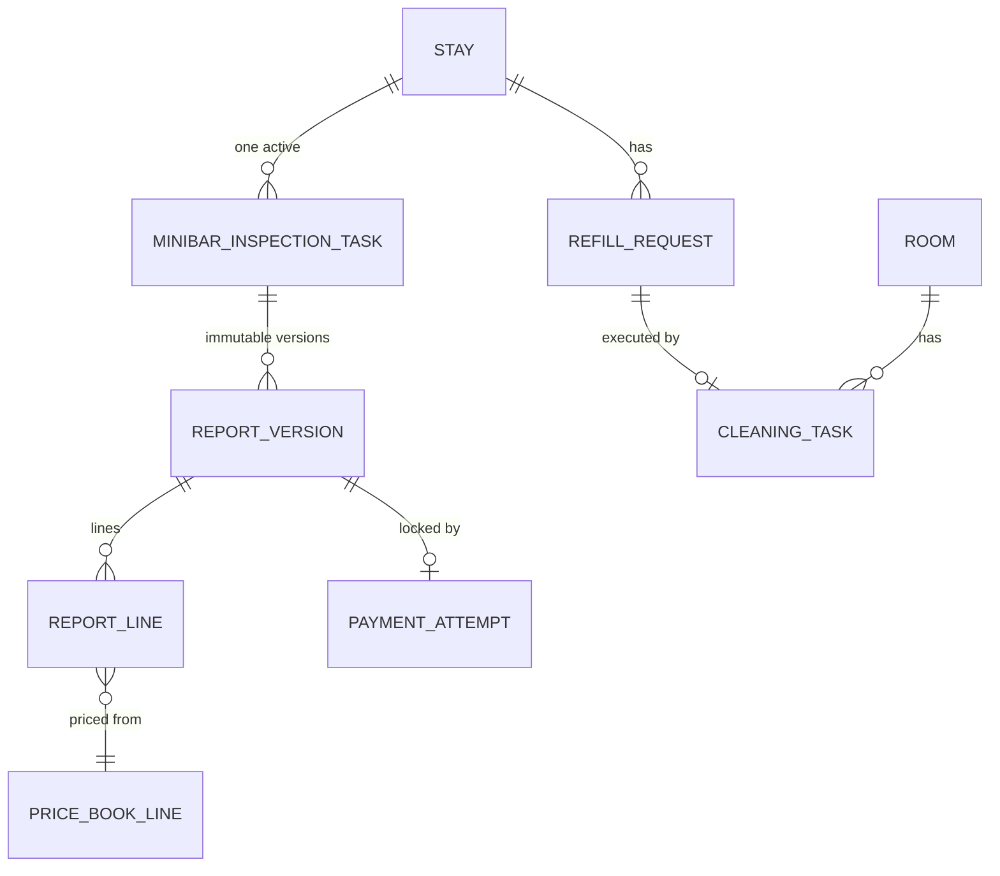
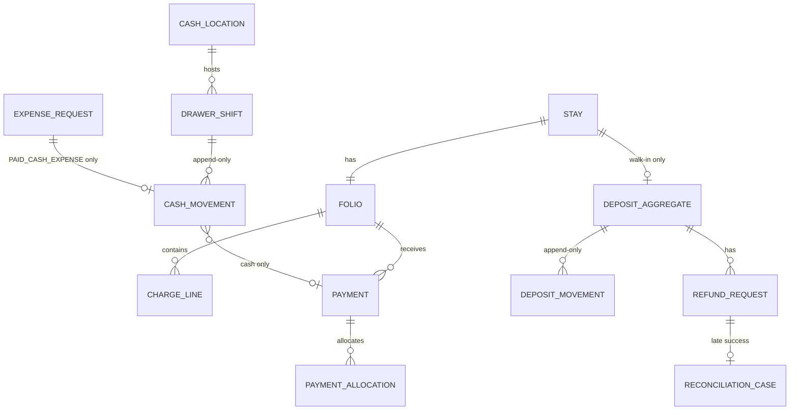
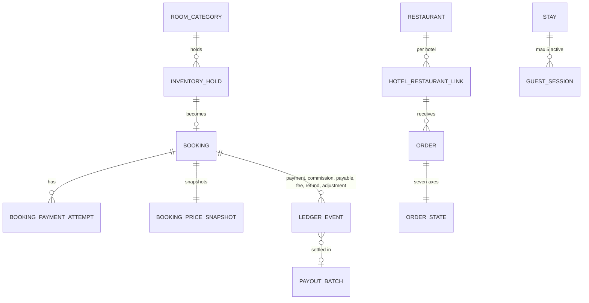
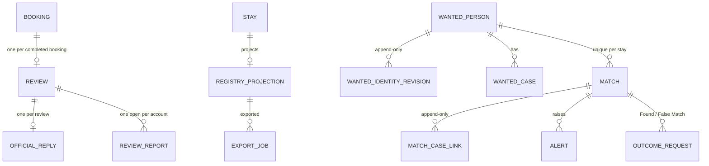

# 04 — Logical Data Model

Aggregates and entity relationships per bounded context, plus the database-level invariants each
context must carry. This is a **logical** model: column lists are indicative, not a migration.

---

## 1. Modelling rules

1. **Separate state axes.** Booking, payment, refund, fulfillment, handoff and settlement each get
   their own column. They are never collapsed into one status field (`CLAUDE.md` §5,
   `REST-DEC-001`, `PAY-DEC-005`).
2. **Append-only history.** Ledger and lifecycle event tables reject `UPDATE` and `DELETE` at the
   database level. Corrections are new linked rows (`CTL-DATA-03`, `CTL-TXN-03`).
3. **Snapshots over lookups.** Anything a later report or charge depends on is copied at confirmation:
   unit price, tariff source level and id, configuration version, cleaning buffer, price book,
   retention policy version.
4. **Money is `bigint` MNT; rates are `integer` basis points.** No floating point anywhere near money
   or duration.
5. **Every tenant-owned table carries `hotel_id`** and every query filters on it.
6. **Identifiers are encrypted at rest**; exact matching uses a separate keyed lookup token.

---

## 2. Identity, tenancy and subscription



| Invariant | Mechanism | Source |
| --- | --- | --- |
| One user account per verified email | unique index on normalized email | `STAFF-DEC-002`, `ONB-DEC-005` |
| One canonical membership per `(hotel_id, account_id)` | unique index | `STAFF-DEC-009` |
| At most one `ACTIVE` invitation per membership | partial unique index | `STAFF-DEC-009` |
| One Primary Hotel Admin per hotel | partial unique index on `is_primary` | `STAFF-DEC-006` |
| One `provider_payment_id` used once | unique on `(provider, merchant, provider_payment_id)` | `ONB-DEC-006` |
| At most one unpaid billing intent per subscription | partial unique index | `LIFE-DEC-006` |
| Monotonic `billing_revision`, `membership_revision` | CAS on update | `LIFE-DEC-006`, `STAFF-DEC-008` |
| Package floor never decreases | check constraint + transition guard | `LIFE-DEC-001` |

`SUBSCRIPTION` stores `starts_at`, `expires_at`, `effective_package`, `committed_target_package`,
`package_floor`, `billing_revision`. Derived states — `Идэвхтэй`, `Удахгүй дуусна`, `Grace period`,
`Дууссан`, `Түдгэлзсэн` — are **computed** from `expires_at`, server time and an explicit suspension
override, never stored as a stale column (`OPS-DEC-016`).

---

## 3. Catalog and lifecycle



`TARIFF` is keyed `(scope_level, scope_id, stay_type)` where `stay_type ∈ {HOURLY, NIGHTLY}` and the
two stay types resolve independently. An unset override inherits the next level down
(`STAY-DEC-005`).

Every lifecycle-bearing entity — room, category, product, template entity — carries
`lifecycle_state ∈ {ACTIVE, RETIRING, INACTIVE}` plus `deactivation_requested_at` and a blocker
snapshot. `RETIRING` is never user-selectable; only the server sets it (`RML-DEC-001`).

---

## 4. Minibar, templates and versions



| Invariant | Mechanism | Source |
| --- | --- | --- |
| Template entity lifecycle ≠ version lifecycle | separate columns on separate tables | `RML-DEC-015` |
| `PUBLISHED` version content immutable | append-only trigger on `TEMPLATE_VERSION_LINE` | `RML-DEC-016` |
| Exactly one Default per template with Published versions | partial unique index on `(template_id) WHERE is_default` | `RML-DEC-019` |
| At most one non-terminal configuration request per room | partial unique index | `RML-DEC-007` |
| Stock balance never negative per `(location, product)` | balance check inside the movement transaction | `INV-DEC-005` |
| Movement ledger append-only | trigger | `INV-DEC-003` |
| Batch state is derived, never stored as user input | computed from child rows | `RML-DEC-026` |

Balances are derived from the movement ledger. No balance column is ever overwritten
(`INV-DEC-001`, `INV-DEC-003`). Weighted-average cost is recomputed on receipt and **snapshotted onto
each consuming movement**, so a later purchase can never retro-change a past COGS figure
(`INV-DEC-004`).

---

## 5. Stay, guest identity and readiness



`STAY` carries three distinct time fields plus one derived value:

| Field | Meaning | Mutability |
| --- | --- | --- |
| `actual_check_in_at` | Reception-confirmed arrival, backdatable ≤120 min at initial confirmation only | immutable after activation |
| `check_in_recorded_at` | Server confirmation instant; drives Police matching, snapshots and cash shift | immutable |
| `planned_checkout_at` | Snapshotted at confirmation | immutable in MVP |
| `effective_actual_check_in_at` | `latest approved amendment ?? actual_check_in_at` | derived |

| Invariant | Mechanism | Source |
| --- | --- | --- |
| No overlapping occupancy per room | exclusion constraint on `(room_id, tstzrange(start_at, end_at, '[)'))` | `STAY-DEC-008` |
| At most one pending actual-time correction per stay | partial unique index | `STAY-DEC-010` |
| Planned checkout never mutated | no update path; append-only guard | `STAY-DEC-011`, `STAY-DEC-012` |
| Duration stored as integers | `duration_minutes`, `half_hour_units`; no float column | `STAY-DEC-014` |
| Price book complete or stay does not activate | same-transaction write + not-null FK | `PRICE-DEC-001` |
| One open overdue conflict per booking | partial unique index | `STAY-DEC-013` |
| Age is derived, never stored as free text | computed from DOB + effective check-in date | `GUEST-DEC-003` |

`GUEST_IDENTITY` stores `identity_type`, `identifier_ciphertext`, `identifier_lookup_token`
(keyed HMAC namespaced by type and country), `provenance ∈ {XYP_VERIFIED, MANUAL}`, `date_of_birth`,
`nationality`, optional guardian metadata, and `matching_eligibility` which is
`NOT_ELIGIBLE_EXACT_RD` for everything except a structurally valid normalized Mongolian registration
number (`RC-DEC-044`, `POL-DEC-017`).

---

## 6. Housekeeping and minibar reporting



A report line's unit price is a foreign key to a `PRICE_BOOK_LINE`, not a copied number and not a
join to the live catalog. A product absent from the price book therefore **cannot** be charged — it
is a referential impossibility, not a validation rule (`PRICE-DEC-006`, `PRICE-DEC-007`).

`report_version_id` is pinned onto the payment attempt at initiation and released only when the
attempt is provably terminal without money movement (`CHK-DEC-004`).

---

## 7. Folio, deposit and cash



`DEPOSIT_AGGREGATE` is versioned and carries the balance identity:

```
available = successful_receipt − receipt_reversal − allocated − refund_reserved − refunded
available >= 0
```

enforced by a check constraint evaluated inside the locking transaction (`DEP-DEC-007`).

| Invariant | Mechanism | Source |
| --- | --- | --- |
| One active shift per drawer | partial unique index | `CASH-DEC-001` |
| One active drawer shift per Reception account per hotel | partial unique index | `CASH-DEC-001` |
| Cash movement immutable | append-only trigger | `CASH-DEC-004` |
| Shift with pending transfer cannot close | transition guard + FK check | `CASH-DEC-006` |
| At most one non-terminal correction per original transaction | partial unique index | `DEP-DEC-006` |
| Card/POS/QPay expense creates no cash movement | movement type constraint | `CASH-DEC-005` |

---

## 8. Booking, settlement and restaurant



`BOOKING` carries the axes separately: `booking_state`, `hold_state`, `payment_state`,
`attempt_state`, `refund_state`, `payout_state`. `ORDER_STATE` carries `order`, `fulfillment`,
`payment`, `refund_policy`, `refund_request`, `refund`, `handoff_mode`.

| Invariant | Mechanism | Source |
| --- | --- | --- |
| Category capacity never oversold | capacity check under row lock across holds, bookings and stays | `BK-DEC-013` |
| One provider transaction used once | unique on `(provider, merchant, provider_payment_id)` | `PAY-DEC-005` |
| Commission recomputed, never client-supplied | server computation from basis points | `PAY-DEC-008` |
| One booking payable in exactly one successful payout | unique partial index | `PAY-DEC-009` |
| Ledger events append-only | trigger | `PAY-DEC-009`, `FIN-DEC-009` |
| At most five active guest sessions per stay | count check under lock at both code issue and redemption | `RC-DEC-027` |

---

## 9. Review, registry and Police



| Invariant | Mechanism | Source |
| --- | --- | --- |
| One review per completed booking | unique on `booking_id` | `RV-DEC-002` |
| One official reply per review | unique on `review_id` | `RV-DEC-007` |
| One open report per `(account_id, review_id)` | partial unique index | `RV-DEC-005` |
| One Match per `(stay_id, wanted_person_id)` | unique index | `POL-DEC-017` |
| Match has no owner column | no `responsible_user_id` exists | `POL-DEC-020` |
| Requester ≠ approver | check constraint on the outcome request row | `POL-DEC-018`, `POL-DEC-019` |
| Export never partial | job fails before writing when the row count exceeds the cap | `GUEST-DEC-006` |
| Retention snapshotted at checkout | policy version, days and expiry columns | `GUEST-DEC-008` |

`MATCH` records `detected_at`, `check_in_recorded_at` and `actual_check_in_at` as three separate
immutable columns. An approved actual-time amendment changes none of them (`POL-DEC-002`,
`STAY-DEC-010`).

---

## 10. Kernel tables

| Table | Purpose | Constraint |
| --- | --- | --- |
| `audit_event` | Every protected action: actor, role set, realm, hotel scope, target, before/after, reason, server time | append-only; no secret payloads |
| `outbox_event` | Domain events awaiting relay | written in the producing transaction; delivery marker |
| `idempotency_key` | `(realm, actor, endpoint, key)` → stored result | unique; replay returns the stored result |
| `session` | Server-side session with auth epoch | revocable by scope; epoch bump invalidates |
| `provider_event` | Inbound callback dedup | unique on `(provider, provider_event_id)` |
| `config_version` | Versioned policy values with owner, legal basis, effective date | append-only |

---

## 11. Open modelling questions

| ID | Question | Decided by |
| --- | --- | --- |
| DM-01 | Whether tenant isolation adds Row Level Security in addition to mandatory `hotel_id` predicates | Phase 03, recorded in [06](06-tenant-boundaries.md) §5 |
| DM-02 | Whether the audit event store is partitioned by month from the start | Phase 03; driven by the P1-12 retention matrix |
| DM-03 | Whether registry and Operation KPI projections are synchronous or outbox-driven | Phase 17 and Phase 19; both are rebuildable either way |
| DM-04 | Encryption-key management for identifier ciphertext and lookup tokens | Phase 03, then EXT-10 review |
