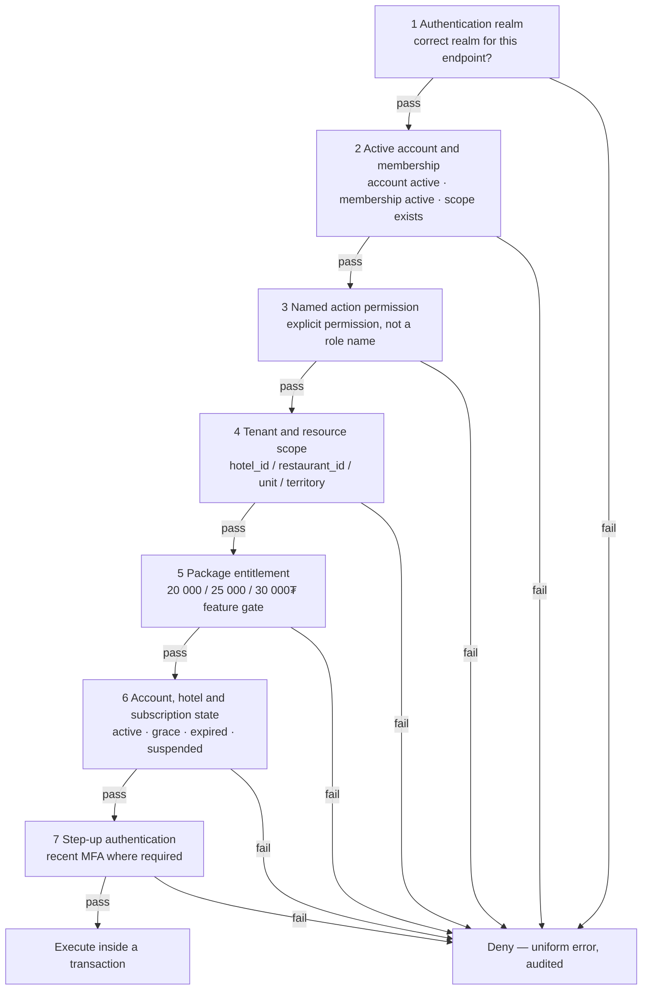
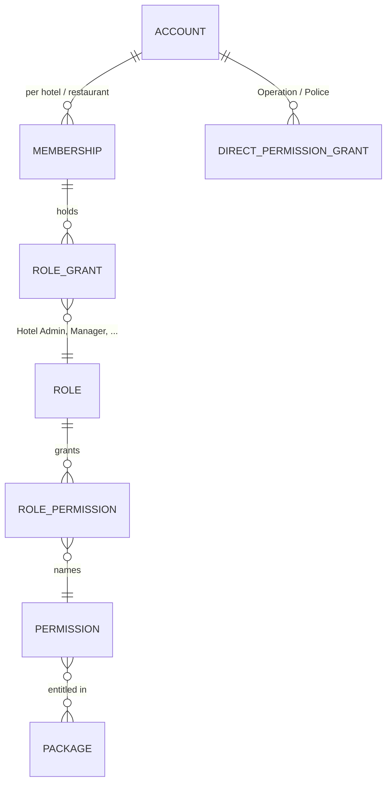

# 05 — Authentication Realms and Authorization

The four isolated realms, and the seven-condition pipeline every backend action passes.

---

## 1. The four realms

A realm is an isolated authentication population. Realms do not share accounts, sessions, permissions
or password state. Realm separation is absolute (`CLAUDE.md` §4, `RBAC-DEC-004`, `POL-DEC-007`).

| Realm | Population | Credential | Session | Step-up |
| --- | --- | --- | --- | --- |
| **Guest** | Booking/public users | e-Mongolia consent flow, or phone + OTP-verified password | Long-lived, guest-scoped | OTP on sensitive account change |
| **Hotel** | Hotel Admin, Manager, Manager Plus, Reception, Cleaner, Restaurant Manager | Email invitation → user-chosen password | Scoped per hotel/restaurant membership | Not required by MVP decisions |
| **Operation/Platform** | Operation Admin, Platform Super Admin | Password + TOTP or approved SSO | Idle 30 min, absolute 8 h | Recent 10-min step-up on every high-risk action |
| **Police** | Police Officer, Police Admin | Password + TOTP or approved state SSO; 4-digit code is bootstrap only | Idle 15 min, absolute 8 h, server-revocable | Recent 10-min step-up on full-identifier views, exports, approvals, role/phone/unit changes |

### 1.1 Rules that hold across realms

- One account never spans two realms. A hotel employee who is also a booking guest holds two
  unrelated accounts (doc 10 §7.2).
- Shared accounts are prohibited in the Hotel, Operation and Police realms. Every action is attributed
  to a named account (`SHIFT-DEC-007`, doc 13 §13.2, `OPS-DEC-015`).
- A **role name grants nothing.** `Platform Super Admin` and `Police Admin` are labels; each action
  requires an explicitly named permission (`RBAC-DEC-004`, `POL-DEC-021`, `RV-DEC-005`).
- Session revocation is server-side. Clearing browser storage is not logout.

### 1.2 Guest sessions inside a stay

The restaurant guest session is a fifth, deliberately weak credential: a room QR opaque token plus a
one-time code bound to `hotel + room + stay`. The QR alone grants nothing; codes are stored hashed;
at most five sessions are active per stay; checkout invalidates all of them
(`RC-DEC-026`, `RC-DEC-027`). It authorises menu browsing and ordering for that stay only.

---

## 2. The authorization pipeline

Every backend action evaluates all seven conditions. Any failure denies. Ordering is fixed so that a
denial never leaks information from a later stage.



| Stage | Control | Denial code |
| --- | --- | --- |
| 1 | `CTL-AUTHZ-01` | `REALM_MISMATCH` |
| 2 | `CTL-AUTHZ-02` | `NOT_AUTHORIZED` |
| 3 | `CTL-AUTHZ-02` | `NOT_AUTHORIZED` |
| 4 | `CTL-AUTHZ-05` | `NOT_AUTHORIZED` |
| 5 | `CTL-AUTHZ-03` | `PACKAGE_NOT_ENTITLED` |
| 6 | `CTL-AUTHZ-04` | `SUBSCRIPTION_EXPIRED` / `ACCOUNT_SUSPENDED` |
| 7 | `CTL-AUTHZ-06` | `STEP_UP_REQUIRED` |

Stages 2–4 return **one indistinguishable denial**, so a caller cannot probe whether a resource exists
in another tenant. Stages 5–7 return actionable codes because the caller is legitimately inside the
tenant and needs to know what to do.

---

## 3. Permission model



**Effective permission set** for a hotel action:

```
granted = union(permissions of every active role on this membership)
        ∪ direct grants
effective = granted ∩ permissions entitled by the hotel's currently applied package
```

Two consequences the requirements state explicitly:

- **Multi-role union.** One person holding `Hotel Admin + Manager + Reception` gets the union of the
  three permission sets (`RBAC-DEC-001`).
- **No inheritance.** `Hotel Admin` does not imply Manager, Manager Plus or Reception. A Hotel Admin
  performing an operational action must hold that operational role separately. This appears in the
  matrix as `Нэмэлт role` and is enforced as an ordinary missing-permission denial
  (`RBAC-DEC-001`, `CTL-AUTHZ-08`).

### 3.1 Package entitlement is a hard gate

Entitlement sits **above** role permission and cannot be bypassed by granting a role
(`RBAC-DEC-003`, `INV-DEC-008`, `RML-DEC-020`):

| Feature | 20 000₮ | 25 000₮ | 30 000₮ |
| --- | :---: | :---: | :---: |
| Reception, Manager/room management, cash drawer and shift, guest registry and export, official reply | ✓ | ✓ | ✓ |
| Cleaner role and API, minibar management, template Draft/Publish/Default/Archive/Rollout | — | ✓ | ✓ |
| Manager Plus role, restaurant registration, Restaurant Manager/menu/order | — | — | ✓ |

Two derived rules that must be tested, not assumed:

- Creating a `Manager Plus` role on a 25 000₮ hotel does not unlock 30 000₮ actions. Both the role
  assignment and the action API are denied.
- A paid pending upgrade does **not** open the new package's roles or actions until the approved
  effective moment (`LIFE-DEC-002`, doc 18 §4).

### 3.2 Separation of duties

Where the requirements demand two people, the backend compares immutable account ids. Hiding a button
is not an implementation (`CTL-AUTHZ-07`):

| Action | Rule | Source |
| --- | --- | --- |
| Wanted manual identity approval | approver ≠ creator | `POL-DEC-018` |
| Found correction decision | approver ≠ requester | `POL-DEC-015` |
| False Match decision | approver ≠ requester | `POL-DEC-019` |
| Shift financial review | reviewer ≠ the actor who worked the shift as Reception | `SHIFT-DEC-004`, `RBAC-DEC-011` |
| Cash correction review | reviewer ≠ original cash actor | `CASH-DEC-009` |

Two audited single-actor exceptions exist and must be recorded, not silently permitted: `self_approved`
for a Reception+Manager actual-time correction (`STAY-DEC-010`), and `self-reviewed` for a Hotel Admin
reviewing their own shift when no other reviewer exists (`SHIFT-DEC-004`).

---

## 4. Subscription and account state gate

Stage 6 evaluates state that is derived at request time, never a stale stored flag (`OPS-DEC-016`):

| State | Hotel operational actions | Public listing |
| --- | --- | --- |
| `Идэвхтэй` / `Удахгүй дуусна` | allowed | visible |
| `Grace period` (≤48 h past expiry) | **allowed in full** | visible |
| `Дууссан` (grace elapsed) | denied — only renew, help, logout | hidden |
| `Түдгэлзсэн` | denied immediately; sessions revoked; auth epoch bumped | hidden |

Grace is a full-rights window, not a degraded one (`LIFE-DEC-003`, `LIFE-DEC-005`). An active session
does not survive the grace boundary: stage 6 re-evaluates on every request.

---

## 5. Step-up authentication

Required within a 10-minute window before:

| Realm | Actions |
| --- | --- |
| Operation/Platform | SMS send, password-reset initiation, provisioning retry, eBarimt retry, paid reconciliation, suspend/reactivate, contact-change exception approval, access management, ownership recovery approval |
| Police | Full-identifier views and exports, Found/False Match approvals, manual identity approval, case lifecycle changes, role/phone/unit changes |

Step-up is proof of **recent** possession, not a second permission. It never substitutes for stage 3.

---

## 6. What the server never trusts

`CLAUDE.md` §4 lists the fields; the pipeline discards them structurally:

| Client-supplied | Server behaviour |
| --- | --- |
| `role`, `permissions` | Ignored; derived from membership |
| `hotel_id`, `restaurant_id` | Treated as a *request target*, then verified against the actor's scope |
| `amount`, `balance`, `total`, `commission` | Recomputed from server state and snapshots |
| provider status, `paid: true` | Ignored; only a verified provider result or cash transaction counts |
| `available: true` | Re-checked under lock at hold, payment and check-in |
| unit price | Resolved by the tariff engine or read from the price book |

---

## 7. Auditing authorization

Every protected action writes an append-only audit event with actor account id, realm, the role set at
that moment, hotel scope, permission evaluated, target, before/after values, reason where mandatory,
and server time. **Denied** high-risk attempts are audited too — a probing attempt is security signal
(doc 13 §13.1, `RBAC-DEC-006`).

Audit payloads never contain passwords, OTPs, tokens, provider secrets, full registration numbers or
SMS bodies (`CLAUDE.md` §8).

---

## 8. Verification

| Claim | Gate | Evidence required |
| --- | --- | --- |
| Every row of doc 18 §§3, 5, 6 is enforced, including every `Нэмэлт role` cell | `GATE-UNIT` | Table-driven test generated from the matrix |
| Package gate cannot be bypassed by role assignment | `GATE-INTEG` | 25 000₮ hotel + Manager Plus role → denied |
| Hotel Admin lacks operational rights without the extra role | `GATE-INTEG` | Denial per operational action |
| Cross-tenant access is indistinguishable from not-found | `GATE-INTEG` | Same status, body and shape |
| Suspension revokes in-flight authority | `GATE-CONC` | Revocation committing against a concurrent action |
| Separation of duties holds at the database | `GATE-INTEG` | Self-approval attempt rejected by constraint |
| Grace boundary is evaluated per request | `GATE-INTEG` | Session crossing `grace_expires_at` is denied |
