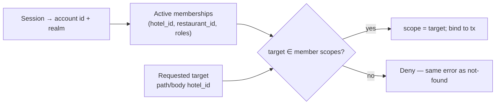

# 06 — Tenant Boundaries

How `hotel_id` scope is established, carried, enforced and proven.

---

## 1. What a tenant is

The tenant is the **hotel**. Each hotel has its own data space, staff, rooms, inventory, cash, folio,
guests and reports (doc 01 §5). An owner may hold several hotels; each remains a separate tenant with
its own subscription, package and payment (`ONB-DEC-005`).

Objects that are deliberately **not** tenant-scoped:

| Object | Scope | Why |
| --- | --- | --- |
| Guest account | Global, Guest realm | One guest books at many hotels |
| Booking | Guest ↔ hotel | Visible to its owner and to that hotel only |
| Review | Guest ↔ hotel | Public once published |
| Restaurant | Restaurant entity, linked per hotel | Active state lives on the hotel–restaurant link, not the restaurant, so one restaurant can serve several hotels on separate terms (doc 08 §4) |
| Wanted person / case / match | Police realm | Not hotel data; a hotel can never read it |
| Operation account, subscription KPI | Platform realm | Cross-tenant by design, but carries no guest or operational hotel data |

---

## 2. How scope is established

Scope is derived from the **membership**, never from the request body.



A `hotel_id` in a URL or body is a **request target**, not an assertion of authority. It is checked
against the actor's memberships at pipeline stage 4 ([05](05-authentication-realms-and-authorization.md) §2).

Once resolved, the scope is bound to the request context and every repository call inside that
transaction receives it. A repository method that can be called without a scope is a defect.

---

## 3. Enforcement layers

Five independent layers. Any one failing must not create an exposure.

| Layer | Mechanism | Catches |
| --- | --- | --- |
| L1 — Pipeline | Stage 4 scope check | Wrong hotel in the request target |
| L2 — Repository | Mandatory `hotel_id` predicate on every tenant-owned query | A handler that forgot to filter |
| L3 — Schema | `hotel_id` NOT NULL on every tenant-owned table; composite foreign keys carry `hotel_id` so a child cannot belong to a different hotel than its parent | Cross-tenant references created by a code bug |
| L4 — Row Level Security | `FORCE ROW LEVEL SECURITY` with a policy on transaction-scoped `app.hotel_id` / `app.restaurant_id` | A hand-written query, a repository method reachable without scope, a projection built without a tenant column |
| L5 — Test | Cross-tenant probe suite over every read and write endpoint, plus the RLS suite in §3.3 | Regressions |

### 3.1 Composite foreign keys

Where a child row must belong to the same hotel as its parent, the foreign key includes `hotel_id`:

```
room(hotel_id, room_id)  PRIMARY KEY (hotel_id, room_id)
stay(hotel_id, room_id)  FOREIGN KEY (hotel_id, room_id) REFERENCES room(hotel_id, room_id)
```

This makes "a stay in hotel A pointing at a room in hotel B" unrepresentable rather than merely
prevented by a check. The requirements demand server-side denial of cross-hotel ids in several places
(`RML-DEC-028`, doc 22 §11, doc 26 §11); composite keys give that guarantee structurally.

### 3.2 Row Level Security — DM-01 closed

Decided in [ADR-0017](adr/ADR-0017-tenant-isolation-rls.md). RLS is **adopted as defence in depth**,
never as a replacement for L1–L3.

**Tenant context is transaction-scoped and server-derived.** After the authorization pipeline resolves
scope from membership, the transaction issues:

```sql
SET LOCAL app.realm       = 'hotel';
SET LOCAL app.hotel_id    = '<resolved>';
SET LOCAL app.restaurant_id = '<resolved or null>';
```

`SET LOCAL` is deliberate: the setting dies with the transaction and therefore cannot survive on a
pooled connection. Scope is **never** derived from a request body or URL value alone — those remain
request *targets*, validated at pipeline stage 4 before the context is set.

**Failure mode is closed.** With `FORCE ROW LEVEL SECURITY` and no `app.hotel_id`, the policy matches
nothing: a query returns zero rows and a write is rejected. Missing context can never mean "see
everything".

**Database roles** ([ADR-0017](adr/ADR-0017-tenant-isolation-rls.md) §5):

| Role | Purpose | RLS |
| --- | --- | --- |
| `prsystem_migrate` | DDL owner, migrations only, never used at runtime | n/a |
| `prsystem_api` | Runtime API DML | subject; **no `BYPASSRLS`** |
| `prsystem_worker` | Worker DML and job tables | subject; **no `BYPASSRLS`** |
| `prsystem_police` | `police` and `police_audit` schemas only | subject; not grantable to the runtimes above |
| `prsystem_job_scheduler` | Issues privileged maintenance jobs (D-09) | subject; **no `BYPASSRLS`**; no table privilege on `job_run` |
| `prsystem_maintenance_fn` | Owns cross-tenant maintenance functions | subject; **no `BYPASSRLS`**; sets scope one tenant at a time |
| `prsystem_maintenance` | Break-glass only | `BYPASSRLS`; owns nothing, grants nothing, reachable by nobody |

**Police separation is a database boundary**, not only a module-graph boundary: Police data lives in
its own schema behind its own repository and its own role, unavailable to Hotel, Restaurant, Guest and
Operation runtimes.

**Background jobs carry explicit scope.** A job's payload names its tenant and the job establishes the
context transactionally, exactly as a request does. A job that iterates tenants opens one transaction
per tenant. There is no ambient or inherited scope; a job without scope fails rather than running
unscoped.

**Exempt categories** are enumerated in [04](04-logical-data-model.md) §11.2: public projections,
global reference data, and named cross-tenant system jobs running through `SECURITY DEFINER` functions owned by `prsystem_maintenance_fn` — not as `prsystem_maintenance`, which is break-glass only.

### 3.3 Required RLS tests

Owning phases must include these; Phase 03 establishes the mechanism and Phases 04–19 extend it as
they add tables.

| Test | Gate |
| --- | --- |
| Cross-tenant read blocked by RLS even with the repository predicate removed | `GATE-INTEG` |
| Missing scope returns zero rows and rejects writes | `GATE-INTEG` |
| Connection-pool context leak: a reused physical connection inherits no context | `GATE-CONC` |
| Every tenant-scoped API route establishes context from membership | `GATE-INTEG` |
| Every worker job establishes context transactionally, or fails | `GATE-INTEG` |
| No runtime role holds `BYPASSRLS`; `prsystem_api` cannot read `police` | `GATE-INTEG` |
| Every hotel/restaurant-scoped table has RLS enabled and forced | `GATE-MIGR` |

---

## 4. Boundaries other than the hotel

### 4.1 Restaurant sub-scope

A Restaurant Manager is scoped to `restaurant_id`, not to the hotel. They see their own menu and
orders and nothing else — no guest identity, no hotel financials, no other restaurant
(doc 08 §6, `REST-DEC-006`).

### 4.2 Police unit and territory

Police access is attribute-based, not tenant-based: unit, territory and case scope. Alert routing uses
the **hotel's registered district**, not the wanted person's home address (`POL-DEC-008`).
Police Admin's all-hotel check-in list is a deliberate cross-tenant view existing only in the Police
realm, gated by EXT-09 and never reachable from any hotel, Operation or Platform account
(`POL-DEC-010`).

### 4.3 Guest ownership

A guest reaches only their own bookings, payments, profile and reviews (doc 09 §11). Guest
authorization is ownership-based: `resource.account_id == session.account_id`.

### 4.4 Operation and Platform

Operation accounts are cross-tenant for subscription metadata only. They reach **no** guest identity,
**no** hotel operational data and **no** Police data (`RBAC-DEC-004`). Contact and email values are
masked in listings by default (`OPS-DEC-011`, `OPS-DEC-012`).

---

## 5. Cross-tenant leakage risks and mitigations

| Risk | Mitigation | Gate |
| --- | --- | --- |
| Enumerating another hotel's ids | Stages 2–4 return an identical denial; no existence signal | `GATE-INTEG` |
| A projection built without a scope column | Every projection carries `hotel_id`; a projection test asserts it | `GATE-INTEG` |
| An export job whose scope drifts between creation and download | Scope, role, membership and subscription re-checked at **both** create and download (`GUEST-DEC-006`) | `GATE-INTEG` |
| An outbox consumer widening scope | Event envelopes carry `hotel_id`; consumers filter on it; Police events are minimal by construction | `GATE-UNIT` |
| A background job iterating all tenants | Jobs iterate with an explicit tenant loop and per-tenant scope binding, never a global query | `GATE-INTEG` |
| Aggregated reporting joining across tenants | Financial and registry queries are scoped to the actor's hotel; only Operation KPI aggregates cross tenants, and it holds no guest or operational data | `GATE-INTEG` |
| Object-storage path collision | Export object keys include `hotel_id` and a random component; buckets are private; URLs expire in five minutes | `GATE-INTEG` |
| Pooled connection retains a previous request's tenant context | `SET LOCAL` only; context dies with the transaction; explicit leak test | `GATE-CONC` |
| A maintenance job runs unscoped against all tenants | `prsystem_maintenance` restricted to named audited jobs; per-tenant transactions where possible | `GATE-INTEG` |

---

## 6. Multi-hotel accounts

One account may hold memberships in several hotels (`STAFF-DEC-002`). Consequences:

- Permissions are evaluated **per membership**, never unioned across hotels.
- Suspension in hotel A does not affect an active membership in hotel B; session revocation is
  scope-targeted (doc 19 §10).
- Password reset revokes sessions across **all** memberships, because the credential itself changed
  (`STAFF-DEC-003`).
- The active hotel scope is explicit in the session context; switching hotels re-evaluates the whole
  pipeline.

---

## 7. Verification

| Claim | Gate | Evidence |
| --- | --- | --- |
| No tenant-owned endpoint returns another hotel's data | `GATE-INTEG` | Generated probe over every route with a foreign id |
| Cross-tenant denial is indistinguishable from not-found | `GATE-INTEG` | Identical status, body shape and error code |
| Every tenant-owned table has `hotel_id NOT NULL` | `GATE-INTEG` | Schema introspection assertion |
| Cross-hotel parent/child rows are unrepresentable | `GATE-INTEG` | Insert attempt rejected by the composite foreign key |
| RLS blocks a cross-tenant read independently of L1–L3 | `GATE-INTEG` | Predicate removed, context set to hotel A, hotel B's row invisible |
| Tenant context does not survive a pooled connection | `GATE-CONC` | Second transaction on the same connection sees no inherited context |
| Export scope is re-checked at download | `GATE-INTEG` | Revoke membership between create and download → denied |
| Police events carry no commercial fields | `GATE-UNIT` | Event schema assertion |
