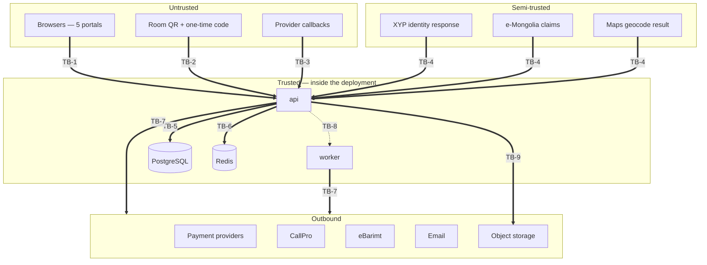
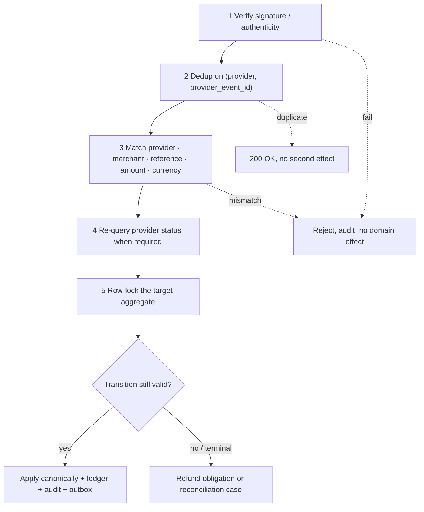

# 08 — Trust Boundaries

Every boundary an attacker or a bug can reach, what crosses it, and what validates it.

---

## 1. Boundary map



| ID | Boundary | Direction | Trust |
| --- | --- | --- | --- |
| TB-1 | Browser → api | in | Untrusted |
| TB-2 | Room QR + guest code → api | in | Untrusted, deliberately weak credential |
| TB-3 | Provider callback → api | in | Untrusted until signature-verified |
| TB-4 | Identity/geo provider response → api | in | Semi-trusted; content validated, provenance recorded |
| TB-5 | api/worker → PostgreSQL | internal | Trusted transport, untrusted *inputs* |
| TB-6 | api/worker → Redis | internal | Trusted transport, **never authoritative** |
| TB-7 | api/worker → external provider | out | Egress control |
| TB-8 | api → worker via outbox | internal | At-least-once, idempotent consumers |
| TB-9 | api → object storage | out | Private bucket, signed short-lived URLs |
| TB-10 | Realm ↔ realm inside one process | internal | **Hard boundary despite shared process** |
| TB-11 | Tenant ↔ tenant inside one schema | internal | **Hard boundary despite shared tables** |

---

## 2. TB-1 — Browser to API

**Assume every field is hostile.** Validation order matters: authorize before you interpret.

| Crossing | Validation |
| --- | --- |
| Session cookie / token | Server-side session row; auth epoch compared; expiry and idle timeout enforced |
| `role`, `permissions` | Discarded; derived from membership |
| `hotel_id`, `restaurant_id` | Treated as target, verified against member scopes |
| `amount`, `balance`, `total`, `commission`, `unit_price` | Discarded; recomputed server-side |
| `paid: true`, provider status | Discarded; only a verified provider result counts |
| `available: true` | Re-checked under row lock |
| Free text | Length-bounded, trimmed, stored as text; never rendered as HTML |
| File upload (menu/hotel images) | Content-type and magic-byte validation, size limit, re-encode, private storage |
| Idempotency key | Required on money and lifecycle commands; scoped to `(realm, actor, endpoint, key)` |

Additional controls: per-account and per-IP rate limits on authentication, OTP issue and verify,
export creation, review submission and report submission. CSRF protection on cookie-authenticated
state changes. Strict CSP on `web-police`, with no analytics or third-party scripts.

---

## 3. TB-2 — Room QR and guest access code

The QR carries an **opaque, unguessable token** only — no room number, no stay id, no guest data
(`RC-DEC-026`).

```mermaid
sequenceDiagram
    participant G as Guest device
    participant A as api
    G->>A: QR token
    A-->>G: prompt for one-time code (no room or stay data revealed)
    G->>A: 4–6 digit code
    A->>A: verify hash · check attempts · check active stay · check session count < 5
    alt valid
        A-->>G: session bound to hotel + room + stay
    else invalid
        A-->>G: uniform failure; increment attempt counter; temporary block on repeat
    end
```

Rules enforced: the QR alone never authenticates; codes are stored hashed; repeated failures
temporarily block that QR, IP and device; before a code is verified the response reveals nothing about
whether the room is occupied; at most five sessions per stay counted at **both** issue and redemption
under a lock; checkout invalidates every code and session; a token rotation invalidates old QR prints
(`RC-DEC-026`, `RC-DEC-027`, doc 08 §7).

---

## 4. TB-3 — Provider callbacks

The highest-value inbound boundary: it moves money.



Threats and mitigations:

| Threat | Mitigation |
| --- | --- |
| Forged callback | Signature verification before parsing; unsigned providers use server-to-server status re-query as the authority |
| Replayed callback | `provider_event` unique constraint; replay is a no-op |
| Amount or currency tampering | Field-by-field match against the stored intent |
| Late callback on an expired hold | Never reopens; creates `LATE_PAYMENT_AFTER_HOLD` refund obligation (`PAY-DEC-006`) |
| Duplicate capture across two attempts | First valid payment applies; the second becomes `DUPLICATE_CAPTURE` refund obligation |
| Callback racing an expiry job | Both contend for one row lock; first valid transition wins (`PAY-DEC-006`) |
| Callback racing a boundary worker | `billing_revision` CAS; exactly one transition applies (`LIFE-DEC-007`) |
| Callback on a released refund | Aggregate frozen; unique `LATE_REFUND_SUCCESS` case; no second refund (`DEP-DEC-009`) |

---

## 5. TB-4 — Identity and geo providers

Semi-trusted: the transport is authenticated but the content is still validated.

- XYP fields are structurally validated. Provenance is recorded as `XYP_VERIFIED` **only** when the
  service actually answered. A not-found or outage produces `MANUAL` provenance and is never
  presented as verified (`RC-DEC-007`, `POL-DEC-001`).
- e-Mongolia claims are accepted only through a server-to-server code exchange. The browser redirect
  is never proof. Accounts link by provider subject; automatic merging with an existing phone account
  is forbidden without dual-channel verification (doc 09 §6.3).
- Map results influence ordering only. Client-supplied distance is ignored (doc 09 §4).

---

## 6. TB-5 / TB-6 — Datastores

- **PostgreSQL** is reached only through parameterised queries. Dynamic SQL uses an allowlist for
  identifiers. Five separate roles exist ([02](02-container-and-deployment.md) §1.1): the application
  roles hold DML only and cannot perform DDL, and none holds `BYPASSRLS`.
- **Row Level Security** is forced on tenant-scoped tables. Even a query that escapes the repository
  layer sees only the rows of the transaction-scoped `app.hotel_id`, and sees nothing at all if no
  context was set ([ADR-0017](adr/ADR-0017-tenant-isolation-rls.md)).
- **Police data** is in its own schema reachable only by `prsystem_police`, a role not granted to the
  Hotel, Restaurant, Guest or Operation runtimes.
- **Redis** never holds authority. Losing it fails closed: rate-limit and OTP counters absent means
  reject, not allow. Idempotency and outbox records live in PostgreSQL so a Redis flush cannot cause a
  duplicate business effect ([02](02-container-and-deployment.md) §1.2).

---

## 7. TB-7 / TB-9 — Egress

- Outbound provider calls go only to configured hosts. Destinations are not taken from user input.
- Secrets come from secret storage at runtime; they never appear in source, logs, audit records or
  frontend bundles (doc 14 §5.6).
- Export objects go to a private bucket with keys containing `hotel_id` plus a random component;
  access is by five-minute signed URL; objects expire after one hour (`GUEST-DEC-007`).
- Email and SMS bodies are constructed server-side from templates; user-supplied content is escaped
  and length-bounded.

---

## 8. TB-8 — Outbox to worker

At-least-once delivery. Every consumer is idempotent on a natural key: `stay_id + wanted_person_id`
for Police matching, `(event_id, channel)` for notifications, application id for provisioning. A
redelivered event must produce no second effect (`CLAUDE.md` §6).

---

## 9. TB-10 — Realm boundary inside one process

The most easily eroded boundary, because everything shares a process and a database.

| Control | Mechanism |
| --- | --- |
| No shared accounts or sessions | Separate account tables per realm; realm recorded on the session |
| Police tables unreachable | `police` module imported by no other module; asserted by dependency-graph test |
| Police schema and role separated | `police` / `police_audit` schemas reachable only by `prsystem_police`, ungranted to other runtimes ([ADR-0017](adr/ADR-0017-tenant-isolation-rls.md)) |
| Police key material separated | Distinct KMS key scope and distinct keyed-HMAC lookup scope ([ADR-0020](adr/ADR-0020-key-management.md)) |
| Police audit separated | `police_audit.security_event` is a distinct stream with distinct grants ([ADR-0018](adr/ADR-0018-audit-partitioning.md)) |
| Minimal check-in event | Fixed event schema with no commercial or contact fields |
| No back-channel | The `stay` module receives nothing from `police`; a match cannot be observed |
| Uniform hotel-facing behaviour | Response body, status and observable latency identical whether or not a Match exists (`POL-DEC-007`) |
| Operation cannot read guest or Police data | No route, no projection, no join (`RBAC-DEC-004`) |

---

## 10. TB-11 — Tenant boundary inside one schema

Covered in [06](06-tenant-boundaries.md). **Five** layers: pipeline scope check, mandatory repository
predicate, `hotel_id NOT NULL` with composite foreign keys, forced Row Level Security on a
transaction-scoped server-derived context, and a cross-tenant probe suite.

---

## 11. Verification

| Boundary | Gate | Evidence |
| --- | --- | --- |
| TB-1 | `GATE-INTEG`, `GATE-SEC` | Client-supplied privileged fields ignored; rate limits enforced |
| TB-2 | `GATE-INTEG` | QR alone denied; sixth session refused; checkout invalidates all |
| TB-3 | `GATE-INTEG`, `GATE-CONC` | Full callback conformance suite per provider port |
| TB-4 | `GATE-INTEG` | Outage yields `MANUAL` provenance, never `XYP_VERIFIED` |
| TB-5/6 | `GATE-INTEG`, `GATE-CONC` | Redis flush mid-flow causes no duplicate effect; RLS blocks a cross-tenant read with the repository predicate removed; a pooled connection inherits no tenant context |
| TB-7/9 | `GATE-SEC` | No secret in bundle, log, trace or audit; signed URL expiry honoured |
| TB-8 | `GATE-CONC` | Redelivered event produces one effect |
| TB-10 | `GATE-UNIT`, `GATE-INTEG` | Dependency-graph assertion; hotel-facing responses identical under match/no-match |
| TB-11 | `GATE-INTEG` | Cross-tenant probe over every route |
