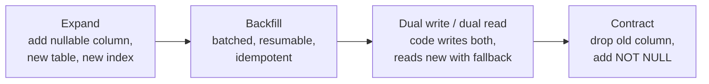

# 12 — Migration Strategy

Versioned migrations only. Schema push is forbidden (`CLAUDE.md` §10).

---

## 1. Rules

1. **Versioned files only.** Every schema change is a numbered, immutable SQL file committed with the
   code that needs it. Drizzle generates the candidate; a human reviews the SQL.
2. **No schema push.** `drizzle-kit push` is not part of any workflow, including local development.
   Local databases are built by running migrations, so the migration path is exercised daily.
3. **Applied migrations are immutable.** Once merged, a migration file is never edited. A mistake is
   corrected by a new migration.
4. **Both directions are tested.** Every phase runs `GATE-MIGR`: a **fresh** run on an empty database
   and an **upgrade** run from the previous release tag to head.
5. **Constraints live in the database.** Critical invariants are unique indexes, partial unique
   indexes, check constraints, exclusion constraints and composite foreign keys — not application
   guards ([04](04-logical-data-model.md), [11](11-concurrency-strategy.md)).
6. **Separate roles.** The migration role owns DDL; the application role has DML only and cannot
   alter schema.

---

## 2. Layout

```
packages/db/
  migrations/
    0000_baseline.sql    Phase 02 — extensions only, no table
    0001_kernel.sql      Phase 03 — platform, audit, police_audit; roles; RLS
    0002_iam.sql         Phase 04 — ...
    meta/_journal.json
  src/
    kernel/          Idempotency, outbox, inbox, audit, projections, partitions
    schema.ts        Drizzle table definitions (source of truth for types)
```

One migration per logical change. Numbering is monotonic; the journal records the applied set.

---

## 3. Expand / contract

Destructive changes are split so that a deploy never requires simultaneous code and schema cutover.



- **Expand** and **contract** are separate migrations, usually separate phases.
- Backfills run as resumable worker jobs, not inside a migration, when the table is large.
- A `NOT NULL` or a new unique constraint is only added after the backfill proves the data satisfies
  it.

---

## 4. Locking and safety

| Operation | Rule |
| --- | --- |
| Add index | `CREATE INDEX CONCURRENTLY`, outside a transaction, on any table with production data |
| Add column | Nullable, no volatile default, in its own migration |
| Add check constraint | `NOT VALID` first, then `VALIDATE CONSTRAINT` |
| Add foreign key | `NOT VALID` first, then validate |
| Rename | Never in place. Add new, dual-write, backfill, contract |
| Drop | Only after the code that referenced it is fully deployed |
| Long-running DDL | Statement timeout and lock timeout set; a blocked migration fails fast rather than queuing behind traffic |

Every migration declares whether it is transactional. `CONCURRENTLY` operations are non-transactional
and are therefore alone in their file.

---

## 5. Append-only enforcement

Append-only tables — audit events, ledger movements, cash movements, price-book lines, report
versions, identity revisions, amendments, outbox events — are protected in the migration that creates
them.

**D-05, resolved in Phase 03.** The outbox is append-only *as an event log*: `platform.outbox_event`
rejects `UPDATE` and `DELETE`, while the mutable delivery marker that
[04-logical-data-model.md](04-logical-data-model.md) §10 requires lives in the separate
`platform.outbox_delivery` row. A trigger creates the delivery row with the event, so a permanently
failing consumer can never destroy the record of what happened. See
[assumptions-and-conflicts.md](../implementation/assumptions-and-conflicts.md) §2 D-05.

The kernel uses a raising trigger rather than `DO INSTEAD NOTHING`, so the caller sees the refusal
instead of a silent no-op, and `TRUNCATE` is refused by privilege plus a statement trigger on each
partition:

```sql
CREATE RULE no_update AS ON UPDATE TO <table> DO INSTEAD NOTHING;
CREATE RULE no_delete AS ON DELETE TO <table> DO INSTEAD NOTHING;
```

or an equivalent trigger that raises. Correction is always a new linked row (`CTL-DATA-03`,
`CTL-TXN-03`). Retention deletion, where legally required, runs as a privileged maintenance path that
is audited and gated by legal hold — not as an ordinary application delete
(`GUEST-DEC-008`).

---

## 6. Data migrations

- Live in versioned files or resumable jobs, never in ad-hoc scripts run by hand.
- Are idempotent and batched.
- Never invent business data. A backfill that cannot derive a value leaves it null and raises a
  reconciliation task rather than guessing — the same discipline as `CTL-PROV-05`.
- Never write real personal data into a non-production environment (`CLAUDE.md` §8).

---

## 7. `GATE-MIGR`

| Check | Assertion |
| --- | --- |
| Fresh | Empty database → all migrations → schema matches the Drizzle schema snapshot exactly |
| Upgrade | Previous release tag → head → same final schema as fresh; no data loss |
| Idempotence | Re-running the journal applies nothing |
| Constraint presence | Introspection asserts every invariant in [04](04-logical-data-model.md) exists as a real constraint |
| Append-only | An `UPDATE` and a `DELETE` against each append-only table have no effect |
| Determinism | Fresh and upgrade produce byte-identical schema dumps after normalisation |

`GATE-MIGR` runs from Phase 02 onward and is a blocking gate for every phase.

**Phase 03 coverage.** Fresh, Upgrade (Phase 02 baseline → head), Determinism (upgrade and fresh
produce an identical normalised schema fingerprint covering columns, constraints, indexes, policies
and RLS flags), Idempotence, and Append-only are all asserted against real PostgreSQL in
`packages/db/src/migrate.test.ts` and `packages/db/src/integration/kernel.test.ts`. Constraint
presence is asserted per invariant as each table arrives.

---

## 8. Rollback

Down-migrations are **not** used. Rolling a schema backwards while data has moved forward is more
dangerous than rolling forward.

- Recovery from a bad migration is a new forward migration.
- The expand/contract discipline means the previous application version keeps working against the new
  schema for the length of a deploy, so an application rollback does not need a schema rollback.
- Catastrophic recovery is point-in-time restore, rehearsed in Phase 22 against the RPO/RTO targets
  in [15](15-non-functional-targets.md).
