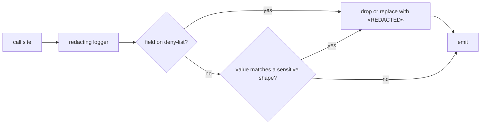

# 13 — Telemetry and Redaction

What is observable, what is never observable, and how the boundary is enforced rather than trusted.

---

## 1. Signals

OpenTelemetry-compatible, emitted by both `api` and `worker`.

| Signal | Content | Retention driver |
| --- | --- | --- |
| Traces | Request and job spans, database spans, provider port spans | Operational |
| Metrics | Latency, error rate, queue depth, lock waits, gate counters | Operational |
| Logs | Structured JSON, correlation-id joined to traces | P1-09 / P1-12 |
| Audit events | **Not telemetry.** Durable PostgreSQL business records | Legal / P1-12 |

Audit is deliberately not a log stream. Audit answers "who did what and was it allowed"; it is
queried, retained and access-controlled as business data ([04](04-logical-data-model.md) §10).

### 1.1 Audit streams — DM-02 closed

Decided in [ADR-0018](adr/ADR-0018-audit-partitioning.md).

No runtime role holds a direct privilege on either stream. Writes go through the `SECURITY DEFINER`
append wrapper owned by `prsystem_audit_writer`, which is the sole holder of `INSERT`; reads belong
to two dedicated reader roles that hold scoped `SELECT` and no write.

| Stream | Schema | Written by | Readable by |
| --- | --- | --- | --- |
| `audit.platform_event` | `audit` | `audit.append_platform_audit_event` (owner `prsystem_audit_writer`) | `prsystem_audit_reader` |
| `police_audit.security_event` | `police_audit` | `police_audit.append_police_security_event` (owner `prsystem_audit_writer`) | `prsystem_police_audit_reader` |

- **Monthly range partitions keyed on server `occurred_at`**, never a business-effective or
  client-supplied time. A backdated arrival still lands in the month it was actually recorded.
- **Partitions are pre-created** by a maintenance job, with an alert when the pre-created horizon
  falls below threshold. A missing partition is caught before a write fails.
- **Runtime roles hold `INSERT` and `SELECT` only.** No `UPDATE`, no `DELETE`, on either stream, in
  addition to the ADR-0009 append-only rules.
- **High-risk actions fail closed.** Where the audit record is written in the same transaction as the
  effect, a failure to record it rolls back the effect. An action that cannot be attributed does not
  happen. This covers every money- and lifecycle-changing command, every Police outcome decision and
  every step-up-gated Operation action.
- **Retention is configuration by data class**, with legal hold. **No Police retention duration is
  invented**: absent an approved ЦЕГ value (EXT-09), Police audit is retained and not purged.
- **Removal is privileged**: partition detach and drop run through the partition functions owned by
  `prsystem_partition_mgr`, not as the break-glass `prsystem_maintenance`, under a named
  audited job that checks legal hold first — never an application delete.

---

## 2. Correlation

Every request and job carries:

| Field | Notes |
| --- | --- |
| `trace_id`, `span_id` | W3C trace context |
| `request_id` | Returned to the client for support |
| `realm` | `guest` / `hotel` / `operation` / `police` |
| `hotel_id` | Present when the action is tenant-scoped |
| `actor_id` | Account **id** only — never name or email |
| `permission` | The named permission evaluated |
| `idempotency_key_hash` | Hash, never the raw key |
| `outcome` | `allowed` / `denied:<code>` |

Provider spans record provider, endpoint, reference **id**, latency and result — never the payload.

---

## 3. Redaction

Redaction is a property of the logger, not a discipline of the caller. A developer who passes a
forbidden value must still not be able to leak it.

**Deny-list by field name** — `password`, `passwordHash`, `otp`, `code`, `accessCode`, `token`,
`accessToken`, `refreshToken`, `sessionId`, `secret`, `apiKey`, `webhookSecret`, `signature`,
`registrationNumber`, `passportNumber`, `documentNumber`, `identifier`, `identifierCiphertext`,
`identifierLookupToken`, `pan`, `cvv`, `cardNumber`, `smsBody`, `messageBody`, `email`, `phone`,
`address`.

**Deny-list by value shape** — Mongolian registration-number pattern, passport-like patterns, PAN-like
digit runs, JWT shape, long high-entropy strings.

**Allow-list for identifiers** — `*_id` fields are emitted; they are references, not content.

Where the requirements permit a masked value in a business record (Operation subscription lists,
Police delivery records), masking happens in the domain layer and the masked value is C2, not C3
([07](07-data-classification.md)).

---

## 4. Never in telemetry

Restating the constraints the requirements make explicit, because these are the ones that get
violated by accident:

| Value | Rule | Source |
| --- | --- | --- |
| Password, OTP, activation/reset/session token | Never, in any signal or audit payload | `CLAUDE.md` §8 |
| Guest access code | Never; the audit records that a code was issued, not the code | `RC-DEC-027` |
| Registration or passport number | Never in ordinary logs or analytics | doc 02 §3.1, doc 13 §13.2 |
| Police Match SMS body | Never in application logs, delivery logs or provider callback records; identifier masked in delivery records | doc 13 §10.2 |
| Guest name, room number, coordinates | Never in URLs, error messages, analytics or application logs | doc 13 §13.2 |
| Provider credentials and webhook secrets | Never in source, logs, audit, or a frontend bundle | doc 14 §5.6 |
| Encryption key material and HMAC secrets | Never anywhere; `key_version` may be recorded, key bytes never | [ADR-0020](adr/ADR-0020-key-management.md) |
| Raw registry search terms | Never in URL analytics or ordinary application logs | doc 12 §8 |
| Sensitive values in URLs or query strings | Never — including report links and SMS deep links | doc 13 §10.2 |

---

## 5. Enforcement

| Layer | Control | Gate |
| --- | --- | --- |
| Logger construction | Only the redacting logger is exported; raw `console` is lint-banned in application code | `GATE-LINT` |
| Field deny-list | Unit tests pass forbidden fields and assert redaction | `GATE-UNIT` |
| Shape deny-list | Unit tests pass forbidden shapes in otherwise innocuous fields | `GATE-UNIT` |
| Canary scan | Tests plant unique canary values into every C3/C4 field; the scanner searches logs, traces, audit rows, outbox payloads, fixtures and seeds for them | `GATE-SEC` |
| Error serialisation | A global filter maps exceptions to safe payloads; raw driver errors never reach a client | `GATE-INTEG` |
| Outbox payloads | Event schemas are explicit allow-lists; a schema test asserts no C3/C4 field is present | `GATE-UNIT` |

A canary finding in Phase 22 is a **release blocker**, not a warning.

---

## 6. Operational monitoring

Signals that matter because of the requirements, not just the runtime:

| Metric | Why | Alert |
| --- | --- | --- |
| Outbox lag and oldest unrelayed event | Police alerts and notifications ride the outbox | Age above threshold |
| Reconciliation queue depth and oldest case | Money is unresolved while a case is open | Any case beyond SLA |
| Provider callback failure and signature-failure rate | Signature failures may indicate an attack | Rate spike |
| Idempotency replay rate | Sudden growth suggests a client retry storm | Rate spike |
| Lock wait and deadlock counts | Contention on stay, drawer and inventory aggregates | Threshold |
| Denied high-risk actions | Probing signal | Rate spike per actor/IP |
| Export job failures | Guest and financial exports are permissioned data paths | Any failure |
| Audit partition horizon | A missing partition would block high-risk actions | Horizon below threshold |
| Audit write failures | A fail-closed rollback means a user-visible action was refused | Any failure |
| Projection lag per consumer | Dashboards must be visibly stale, not silently wrong | Lag above declared bound |
| KMS availability and unwrap failures | Identifier flows fail closed when keys are unavailable | Any failure |
| Grace-boundary transitions | Hotels losing access is customer-visible | Daily count |
| Police alert delivery failures | An undelivered alert is an operational failure | Any failure |

Dashboards contain no C2/C3 content — counts, rates and ids only.

---

## 7. Environments

| Environment | Log level | Sampling | Personal data |
| --- | --- | --- | --- |
| local / CI | debug | none | synthetic only |
| staging | info | partial traces | synthetic only |
| production | info; debug only behind a time-boxed, audited flag | tail-based on errors and slow spans | never in telemetry |

Enabling debug logging in production is itself an audited action and cannot disable redaction —
redaction is not level-dependent.
