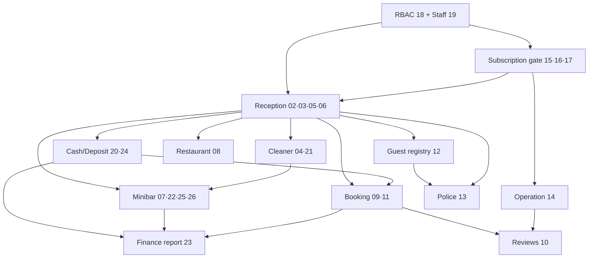

# Шаардлагын индекс — 01–26

**Төлөв:** Ажлын индекс. Эх шаардлагын файлыг өөрчлөөгүй.
**Эх сурвалжийн commit:** `738d9a4` (`origin/feat/approved-risk-controls`-тэй тэнцүү, `final` branch).
**Үүсгэсэн:** 2026-09-28.
**Холбоотой:** [Төлөвийн хүснэгт](requirements-status.md) · [Зөрчил ба дутуу шийдвэр](requirements-conflicts.md) · [Үлдсэн ажил ба эхний багц](requirements-roadmap.md)

## 1. Эх багц ба ID-ийн дүрэм

### 1.1 Сонгосон файлууд — 26

`docs/` доторх `01-`…`26-` угтвартай Markdown файл яг **26** байна. Тоо таарсан тул нэмэлт сонголт, таамаг хийгээгүй.

| | | | |
| --- | --- | --- | --- |
| [01](01-project-charter.md) project-charter | [02](02-reception-system-scope.md) reception-system-scope | [03](03-reception-shift-handover.md) reception-shift-handover | [04](04-cleaner-dashboard.md) cleaner-dashboard |
| [05](05-room-stay-and-time-status.md) room-stay-and-time-status | [06](06-room-status-model.md) room-status-model | [07](07-manager-room-minibar.md) manager-room-minibar | [08](08-restaurant-ordering.md) restaurant-ordering |
| [09](09-online-booking-system.md) online-booking-system | [10](10-hotel-ratings-reviews.md) hotel-ratings-reviews | [11](11-booking-payment-policy.md) booking-payment-policy | [12](12-hotel-guest-registry-report.md) hotel-guest-registry-report |
| [13](13-police-monitoring-system.md) police-monitoring-system | [14](14-operation-dashboard.md) operation-dashboard | [15](15-hotel-onboarding-account-activation.md) hotel-onboarding-account-activation | [16](16-subscription-pricing-and-payment.md) subscription-pricing-and-payment |
| [17](17-subscription-lifecycle.md) subscription-lifecycle | [18](18-action-level-permission-matrix.md) action-level-permission-matrix | [19](19-staff-account-lifecycle.md) staff-account-lifecycle | [20](20-deposit-and-payment-correction.md) deposit-and-payment-correction |
| [21](21-cleaner-checkout-exception-and-dispute.md) cleaner-checkout-exception-and-dispute | [22](22-minibar-stock-inventory.md) minibar-stock-inventory | [23](23-admin-financial-reporting.md) admin-financial-reporting | [24](24-cash-drawer-ledger.md) cash-drawer-ledger |
| [25](25-minibar-selling-price-snapshot.md) minibar-selling-price-snapshot | [26](26-room-minibar-lifecycle.md) room-minibar-lifecycle | | |

Тулгасан баримтууд (үндсэн багцад ороогүй):

- [README](../README.md)
- [00 — нээлттэй шийдвэр, P1/EXT/DEFER](00-mvp-open-decisions.md)
- [27 — R01–R03 батлагдсан засвар](27-approved-risk-controls.md)
- [31 — хөгжүүлэлтийн явц](31-development-progress.md)
- 28–30, 32–76-р implementation/acceptance баримтууд

**Хувилбарын анхааруулга:** 26 файлын 9 нь (01, 02, 09, 11, 17, 18, 19, 24 болон 00) анхны baseline `c1c2abc`-ийн дараа commit `1b43474`-оор өөрчлөгдсөн (2026-09-06, R01–R03). Энэ индекс feature branch дээрх шинэ хувилбарыг ашигласан. `main` дээр хуучин хувилбар хэвээр байгааг [зөрчлийн X-05](requirements-conflicts.md#x-05)-аас үзнэ.

### 1.2 Шаардлагын ID

Формат: **`REQ-<FF>-<HH>.<SS>`**

- `FF` — эх файлын дугаар (01–26).
- `HH` — тухайн файл дахь `##` (H2) гарчгийн дэс дугаар (1-ээс).
- `SS` — тухайн H2 доторх `###` (H3) гарчгийн дэс дугаар. H3-гүй H2, эсвэл эхний H3-аас өмнө өөрийн агуулгатай H2 нь `00` авна.

Нэг ID = нэг навч хэсэг (H3, эсвэл H3-гүй H2). Code fence доторх `#` тэмдэгтийг тооцоогүй. Үр дүн: **833 ID**, бүгд давхардалгүй.

**Тогтвортой байдлын дүрэм** (commit `738d9a4`-ийн төлөвөөр хөлдөөсөн):

1. Олгосон ID-г дахин дугаарлахгүй, өөр хэсэгт шилжүүлэхгүй.
2. Эх файлд шинэ хэсэг нэмэгдвэл тухайн H2-ийн дараагийн сул `SS`, эсвэл файлын дараагийн сул `HH`-ийг шинээр олгоно.
3. Хэсэг устгагдвал ID-г "retired" гэж тэмдэглээд дахин ашиглахгүй.
4. Хэсэг доторх текст өөрчлөгдвөл ID хэвээр; өөрчлөлтийг [төлөвийн хүснэгт](requirements-status.md)-д тусгана.

Хэсэг бүрт дурдагдсан `XXX-DEC-NNN` / `P0-NN` шийдвэрийн ID-г тусад нь баганад хадгалсан. Эдгээр нь эх баримтын өөрийн тогтвортой ID бөгөөд `origin/claude/ui-ux-polish` branch-ийн шийдвэр түвшний traceability-тэй тулгах гүүр болно.

**Төрөл:**

| Төрөл | Утга |
| --- | --- |
| шаардлага | Шалгаж болох үүрэг |
| шийдвэр | `XXX-DEC-NNN` бүртгэл |
| acceptance | Хүлээн авах шалгуур |
| контекст | Зорилго, нэр томьёо, тайлбар |
| хамрахгүй | Эх баримтаар хасагдсан эсвэл хойшлуулсан |
| нээлттэй асуулт | Шийдээгүй асуудал |

### 1.3 Модулийн бүлэглэл ба хэрэгжүүлэх дараалал

Баримтууд хоорондоо хоёр чиглэлд иш татдаг тул "лавлах" хамаарал мөчлөгтэй. Доорх нь **хэрэгжүүлэх** дарааллын хамаарал бөгөөд юуг эхэлж бүтээх ёстойг заана. Энэ бүлэглэл нь дүн шинжилгээний дүгнэлт болохоос эх баримтын шийдвэр биш.

| Модуль | Эх файл |
| --- | --- |
| Charter | 01 |
| RBAC / Staff | 18, 19 |
| Subscription / Onboarding | 15, 16, 17 |
| Operation | 14 |
| Reception | 02, 03, 05, 06 |
| Cash / Deposit | 20, 24 |
| Cleaner | 04, 21 |
| Minibar | 07, 22, 25, 26 |
| Booking | 09, 11 |
| Reviews | 10 |
| Restaurant | 08 |
| Registry | 12 |
| Police | 13 |
| Finance report | 23 |

Доорх файл бүрийн "Хамаарах файлууд" багана нь эх баримтын иш татсан (лавлах) хамаарал.

## 2. Файл тус бүрийн зорилго, модуль, хамаарал

| № | Эх файл | Зорилго | Модуль | Хамаарах файлууд | Хэрэгжүүлэлтийн баримт | ID-ийн тоо |
| --- | --- | --- | --- | --- | --- | ---: |
| 01 | [01-project-charter.md](01-project-charter.md) | Төслийн зорилго, оролцогч талууд, MVP-ийн өндөр түвшний хамрах хүрээ, суурь таамаглал болон 4 үндсэн систем (Reception, Online Booking, Цагдаа, Operation)-ийн батлагдсан чиглэлийг тодорхойлно. | Project charter / MVP scope | [00](00-mvp-open-decisions.md), [18](18-action-level-permission-matrix.md), [19](19-staff-account-lifecycle.md), [05](05-room-stay-and-time-status.md), [26](26-room-minibar-lifecycle.md), [23](23-admin-financial-reporting.md) | [README](../README.md), [28](28-backend-foundation.md), [31](31-development-progress.md), [73](73-remaining-modules-acceptance.md) | 6 |
| 02 | [02-reception-system-scope.md](02-reception-system-scope.md) | Reception (RC) системийн MVP хамрах хүрээ: зочин бүртгэл, check-in/out, өрөөний төлөв, төлбөр/барьцаа, ээлж ба касс, minibar, Restaurant, guest access-ийн үндсэн дүрэм болон RC-DEC-001–044 шийдвэрүүдийг нэгтгэнэ. | Reception / RC scope | [03](03-reception-shift-handover.md), [04](04-cleaner-dashboard.md), [05](05-room-stay-and-time-status.md), [06](06-room-status-model.md), [07](07-manager-room-minibar.md), [08](08-restaurant-ordering.md), [09](09-online-booking-system.md), [12](12-hotel-guest-registry-report.md), [13](13-police-monitoring-system.md), [18](18-action-level-permission-matrix.md), [20](20-deposit-and-payment-correction.md), [21](21-cleaner-checkout-exception-and-dispute.md), [22](22-minibar-stock-inventory.md), [23](23-admin-financial-reporting.md), [24](24-cash-drawer-ledger.md), [25](25-minibar-selling-price-snapshot.md), [26](26-room-minibar-lifecycle.md) | [38](38-reception-foundation.md), [39](39-walkin-check-in.md), [40](40-guest-cash-finance.md), [41](41-guest-corrections-and-provider-mocks.md), [42](42-checkout-cleaning.md), [43](43-reception-stage3-acceptance.md), [44](44-reception-integration-contract.md), [75](75-daily-workflow-ux.md), [47](47-booking-completion-candidate.md), [49](49-minibar-template-authoring.md), [50](50-minibar-configuration-requests.md), [53](53-minibar-room-rollout.md), [54](54-minibar-rollout-batches.md), [68](68-restaurant-orders.md), [73](73-remaining-modules-acceptance.md), [README](../README.md) | 67 |
| 03 | [03-reception-shift-handover.md](03-reception-shift-handover.md) | Reception-ийн ээлж хаах, бэлэн мөнгө сохроор тоолж хүлээлцэх, Manager/Hotel Admin-ийн тусдаа санхүүгийн review, нэг ажилтантай self-close, opening balance болон correction-ийн дүрмийг тодорхойлно. | Reception / Shift handover & cash review | [24](24-cash-drawer-ledger.md), [05](05-room-stay-and-time-status.md), [25](25-minibar-selling-price-snapshot.md), [26](26-room-minibar-lifecycle.md) | [36](36-staff-execution-and-onboarding.md), [38](38-reception-foundation.md), [43](43-reception-stage3-acceptance.md), [44](44-reception-integration-contract.md), [31](31-development-progress.md) | 30 |
| 04 | [04-cleaner-dashboard.md](04-cleaner-dashboard.md) | 25k/30k багцын Cleaner dashboard: check-out үеийн minibar шалгалт, active-stay refill, configuration reconciliation болон өрөө цэвэрлэх ажлын дэлгэц, төлөв, эрх, аудитын дүрмийг тодорхойлно. | Cleaner / Minibar tasks | [05](05-room-stay-and-time-status.md), [21](21-cleaner-checkout-exception-and-dispute.md), [22](22-minibar-stock-inventory.md), [25](25-minibar-selling-price-snapshot.md), [26](26-room-minibar-lifecycle.md), [18](18-action-level-permission-matrix.md) | [36](36-staff-execution-and-onboarding.md), [39](39-walkin-check-in.md), [42](42-checkout-cleaning.md), [49](49-minibar-template-authoring.md), [50](50-minibar-configuration-requests.md), [51](51-minibar-reconciliation.md), [52](52-minibar-version-archive.md), [53](53-minibar-room-rollout.md), [54](54-minibar-rollout-batches.md), [55](55-minibar-guest-reports.md), [56](56-minibar-stay-refill.md), [57](57-minibar-next-stay-refill.md), [58](58-minibar-manager-exceptions.md), [65](65-minibar-count-variance.md), [66](66-minibar-shortage-opening.md), [69](69-minibar-partial-rollback.md), [75](75-daily-workflow-ux.md) | 20 |
| 05 | [05-room-stay-and-time-status.md](05-room-stay-and-time-status.md) | Цагаар/хоногоор байрлалт, тарифын шатлал ба snapshot, [start,end) давхцал, cleaning buffer readiness, actual check-in backdate/amendment, planned checkout түгжээ, overdue conflict болон хагас цагийн precision-ийг тодорхойлно. | Reception / Room stay timing & pricing | [09](09-online-booking-system.md), [11](11-booking-payment-policy.md), [26](26-room-minibar-lifecycle.md), [25](25-minibar-selling-price-snapshot.md), [22](22-minibar-stock-inventory.md), [03](03-reception-shift-handover.md), [13](13-police-monitoring-system.md), [12](12-hotel-guest-registry-report.md) | [38](38-reception-foundation.md), [39](39-walkin-check-in.md), [42](42-checkout-cleaning.md), [43](43-reception-stage3-acceptance.md), [44](44-reception-integration-contract.md), [45](45-online-booking-policy.md), [46](46-booking-holds.md), [47](47-booking-completion-candidate.md) | 48 |
| 06 | [06-room-status-model.md](06-room-status-model.md) | Reception-д харагдах өрөөний олон тусдаа төлөв (occupancy, эх үүсвэр, reservation, цаг, цэвэрлэгээ, minibar, config/version/batch) болон readiness gate-ийг тодорхойлно. | Reception / Room status & readiness | [05](05-room-stay-and-time-status.md), [04](04-cleaner-dashboard.md), [21](21-cleaner-checkout-exception-and-dispute.md), [22](22-minibar-stock-inventory.md), [25](25-minibar-selling-price-snapshot.md), [26](26-room-minibar-lifecycle.md), [18](18-action-level-permission-matrix.md) | [38](38-reception-foundation.md), [39](39-walkin-check-in.md), [42](42-checkout-cleaning.md), [44](44-reception-integration-contract.md), [49](49-minibar-template-authoring.md), [50](50-minibar-configuration-requests.md), [52](52-minibar-version-archive.md), [53](53-minibar-room-rollout.md), [54](54-minibar-rollout-batches.md), [57](57-minibar-next-stay-refill.md), [60](60-minibar-entity-lifecycle.md), [66](66-minibar-shortage-opening.md), [69](69-minibar-partial-rollback.md) | 20 |
| 07 | [07-manager-room-minibar.md](07-manager-room-minibar.md) | Manager-ийн өрөө/ангилал, stay тариф, өрөөний QR, minibar бүтээгдэхүүн, template/version, configuration change, shortage override болон эрхийн MVP шаардлагыг тодорхойлно. | Manager / Room & Minibar catalog | [05](05-room-stay-and-time-status.md), [22](22-minibar-stock-inventory.md), [25](25-minibar-selling-price-snapshot.md), [26](26-room-minibar-lifecycle.md), [23](23-admin-financial-reporting.md), [18](18-action-level-permission-matrix.md) | [38](38-reception-foundation.md), [39](39-walkin-check-in.md), [43](43-reception-stage3-acceptance.md), [48](48-minibar-warehouse.md), [49](49-minibar-template-authoring.md), [50](50-minibar-configuration-requests.md), [51](51-minibar-reconciliation.md), [52](52-minibar-version-archive.md), [53](53-minibar-room-rollout.md), [54](54-minibar-rollout-batches.md), [57](57-minibar-next-stay-refill.md), [60](60-minibar-entity-lifecycle.md), [66](66-minibar-shortage-opening.md), [69](69-minibar-partial-rollback.md) | 19 |
| 08 | [08-restaurant-ordering.md](08-restaurant-ordering.md) | 30,000₮ багцын Restaurant бүртгэл, меню, өрөөний QR/нэг удаагийн кодын хандалт, хоолны захиалга, QPay, fulfillment, буцаалт, SLA болон check-out handoff-ийн дүрмийг тодорхойлно. | Restaurant / хоолны захиалга | [18](18-action-level-permission-matrix.md), [02](02-reception-system-scope.md), [05](05-room-stay-and-time-status.md), [19](19-staff-account-lifecycle.md), [16](16-subscription-pricing-and-payment.md) | [35](35-restaurant-identity.md), [68](68-restaurant-orders.md), [39](39-walkin-check-in.md), [43](43-reception-stage3-acceptance.md), [44](44-reception-integration-contract.md), [72](72-remaining-work-review.md), [73](73-remaining-modules-acceptance.md), [31](31-development-progress.md) | 33 |
| 09 | [09-online-booking-system.md](09-online-booking-system.md) | Нийтийн online booking-ийн хайлт, буудал/өрөө харагдах нөхцөл, бүртгэл/нэвтрэлт, захиалгын урсгал, state тэнхлэг, үнэ/availability хамгаалалт, үнэлгээ болон BK-DEC-001–014 шийдвэрүүдийг тодорхойлно. | Online Booking / Public catalog & booker | [11](11-booking-payment-policy.md), [05](05-room-stay-and-time-status.md), [10](10-hotel-ratings-reviews.md), [26](26-room-minibar-lifecycle.md), [22](22-minibar-stock-inventory.md), [02](02-reception-system-scope.md), [08](08-restaurant-ordering.md), [00](00-mvp-open-decisions.md) | [45](45-online-booking-policy.md), [46](46-booking-holds.md), [47](47-booking-completion-candidate.md), [59](59-minibar-booking-capacity.md), [27](27-approved-risk-controls.md), [44](44-reception-integration-contract.md), [31](31-development-progress.md), [README](../README.md) | 39 |
| 10 | [10-hotel-ratings-reviews.md](10-hotel-ratings-reviews.md) | Online Booking-ийн verified-stay үнэлгээ/сэтгэгдэл, засвар/soft-delete, authenticated report, Platform moderation/restore болон нэг official hotel reply-ийн дүрмийг тодорхойлно. | Online Booking / Review ба rating | [09](09-online-booking-system.md), [18](18-action-level-permission-matrix.md), [00](00-mvp-open-decisions.md) | [47](47-booking-completion-candidate.md) | 20 |
| 11 | [11-booking-payment-policy.md](11-booking-payment-policy.md) | Online room booking-ийн мөнгөн урсгал, гэрээний commission, 10 минутын hold, cancellation/no-show, gateway fee, settlement, санхүүгийн хамгаалалт ба PAY-DEC-001–010-ийг тодорхойлно. | Online Booking / Payment, commission & settlement | [09](09-online-booking-system.md), [27](27-approved-risk-controls.md), [00](00-mvp-open-decisions.md), [08](08-restaurant-ordering.md) | [27](27-approved-risk-controls.md), [45](45-online-booking-policy.md), [46](46-booking-holds.md), [47](47-booking-completion-candidate.md), [28](28-backend-foundation.md) | 21 |
| 12 | [12-hotel-guest-registry-report.md](12-hotel-guest-registry-report.md) | Hotel Admin/Manager/Manager Plus-ийн өөрийн буудлын үндсэн зочин–байрлалтын server-side pagination жагсаалт, 6 багана, DOB-оос насны snapshot, 10,000 мөрийн background Excel, private TTL файл болон 365 хоногийн retention/legal hold-ыг тодорхойлно. | Hotel guest registry / Excel export | [05](05-room-stay-and-time-status.md), [02](02-reception-system-scope.md), [18](18-action-level-permission-matrix.md), [13](13-police-monitoring-system.md), [00](00-mvp-open-decisions.md) | [39](39-walkin-check-in.md), [42](42-checkout-cleaning.md), [43](43-reception-stage3-acceptance.md), [44](44-reception-integration-contract.md), [71](71-release-readiness.md), [73](73-remaining-modules-acceptance.md) | 23 |
| 13 | [13-police-monitoring-system.md](13-police-monitoring-system.md) | Цагдаагийн тусгаарлагдсан portal: эрэн сурвалжлах Person/Case бүртгэл, үндсэн зочны РД-ийн exact Match, alert/SMS, Found/False Match урсгал, dashboard, Wanted Excel, Police Admin-ийн бүх буудлын check-in жагсаалт болон Police account/auth-ыг тодорхойлно. | Police monitoring (wanted / match / alert) | [05](05-room-stay-and-time-status.md), [02](02-reception-system-scope.md), [12](12-hotel-guest-registry-report.md), [18](18-action-level-permission-matrix.md), [00](00-mvp-open-decisions.md), [01](01-project-charter.md) | [README](../README.md), [28](28-backend-foundation.md), [31](31-development-progress.md), [39](39-walkin-check-in.md), [71](71-release-readiness.md), [72](72-remaining-work-review.md), [73](73-remaining-modules-acceptance.md), [74](74-ui-ux-completion.md) | 55 |
| 14 | [14-operation-dashboard.md](14-operation-dashboard.md) | Платформын Operation Dashboard: буудлын subscription KPI/жагсаалт/filter, SMS сануулга (CallPro), password reset, contact солих, suspension, paid reconciliation ба provisioning retry-ийн эрх ба аюулгүй байдлыг тодорхойлно. | Platform Operation Dashboard | [15](15-hotel-onboarding-account-activation.md), [16](16-subscription-pricing-and-payment.md), [17](17-subscription-lifecycle.md), [19](19-staff-account-lifecycle.md) | [70](70-operation-implementation.md), [73](73-remaining-modules-acceptance.md), [72](72-remaining-work-review.md), [71](71-release-readiness.md), [36](36-staff-execution-and-onboarding.md), [37](37-development-mocks.md) | 42 |
| 15 | [15-hotel-onboarding-account-activation.md](15-hotel-onboarding-account-activation.md) | Payment-gated hotel onboarding: бүртгэлийн төрөл/талбар, existing owner proof, төлбөрийн attempt дүрэм, durable idempotent provisioning ба анхны Hotel Admin activation-ийг тодорхойлно. | Hotel onboarding / Provisioning | [16](16-subscription-pricing-and-payment.md), [14](14-operation-dashboard.md), [19](19-staff-account-lifecycle.md) | [36](36-staff-execution-and-onboarding.md), [37](37-development-mocks.md), [31](31-development-progress.md), [70](70-operation-implementation.md) | 25 |
| 16 | [16-subscription-pricing-and-payment.md](16-subscription-pricing-and-payment.md) | Subscription багцын сарын үнэ, хугацааны нийт төлбөр, задаргаа/snapshot, QPay/Khaan, НӨАТ, provider fee, eBarimt болон буцаан олгохгүй бодлогыг тодорхойлно. | Subscription billing | [15](15-hotel-onboarding-account-activation.md), [17](17-subscription-lifecycle.md), [14](14-operation-dashboard.md) | [36](36-staff-execution-and-onboarding.md), [70](70-operation-implementation.md), [31](31-development-progress.md), [71](71-release-readiness.md) | 17 |
| 17 | [17-subscription-lifecycle.md](17-subscription-lifecycle.md) | Upgrade-only package дүрэм, renewal floor, upgrade үнэ/хэрэгжих мөч, billing concurrency, 48 цагийн grace ба hard lock-ийн allowlist болон public listing-ийг тодорхойлно. | Subscription lifecycle / Entitlement | [16](16-subscription-pricing-and-payment.md), [27](27-approved-risk-controls.md), [18](18-action-level-permission-matrix.md), [14](14-operation-dashboard.md) | [27](27-approved-risk-controls.md), [28](28-backend-foundation.md), [36](36-staff-execution-and-onboarding.md), [39](39-walkin-check-in.md), [70](70-operation-implementation.md) | 22 |
| 18 | [18-action-level-permission-matrix.md](18-action-level-permission-matrix.md) | Hotel/Restaurant role бүрийн action-level permission, package entitlement, subscription/account state gate, Operation/Platform болон Police эрхийн хил, server-side enforcement ба audit-ийг canonical байдлаар тодорхойлно. | Authorization / RBAC matrix | [17](17-subscription-lifecycle.md), [19](19-staff-account-lifecycle.md), [03](03-reception-shift-handover.md), [05](05-room-stay-and-time-status.md), [20](20-deposit-and-payment-correction.md), [24](24-cash-drawer-ledger.md), [26](26-room-minibar-lifecycle.md), [23](23-admin-financial-reporting.md), [12](12-hotel-guest-registry-report.md), [10](10-hotel-ratings-reviews.md), [13](13-police-monitoring-system.md), [11](11-booking-payment-policy.md) | [27](27-approved-risk-controls.md), [28](28-backend-foundation.md), [30](30-staff-auth-api.md), [33](33-membership-work.md), [36](36-staff-execution-and-onboarding.md), [38](38-reception-foundation.md), [47](47-booking-completion-candidate.md), [64](64-minibar-paid-corrections.md), [70](70-operation-implementation.md) | 30 |
| 19 | [19-staff-account-lifecycle.md](19-staff-account-lifecycle.md) | Hotel/Restaurant staff-ийн invitation, activation, password reset, role өөрчлөлт, suspension/termination/reactivation, open-work takeover/reassignment, Primary Hotel Admin болон session revoke-ийн дүрмийг тодорхойлно. | Staff identity / membership lifecycle | [18](18-action-level-permission-matrix.md), [17](17-subscription-lifecycle.md), [15](15-hotel-onboarding-account-activation.md), [03](03-reception-shift-handover.md), [24](24-cash-drawer-ledger.md) | [30](30-staff-auth-api.md), [32](32-staff-invitations-reset.md), [33](33-membership-work.md), [34](34-staff-recovery-mail-worker.md), [35](35-restaurant-identity.md), [36](36-staff-execution-and-onboarding.md), [31](31-development-progress.md) | 29 |
| 20 | [20-deposit-and-payment-correction.md](20-deposit-and-payment-correction.md) | Walk-in stay-ийн барьцааны тохиргоо/суваг, checkout суутгал, reserved balance ба idempotency, анхны/өөр сувгийн буцаалт, late refund reconciliation болон immutable financial correction-ийн дүрмийг тодорхойлно. | Reception / Барьцаа ба төлбөрийн залруулга | [05](05-room-stay-and-time-status.md), [24](24-cash-drawer-ledger.md), [03](03-reception-shift-handover.md), [23](23-admin-financial-reporting.md), [21](21-cleaner-checkout-exception-and-dispute.md), [25](25-minibar-selling-price-snapshot.md), [18](18-action-level-permission-matrix.md) | [39](39-walkin-check-in.md), [40](40-guest-cash-finance.md), [41](41-guest-corrections-and-provider-mocks.md), [42](42-checkout-cleaning.md), [43](43-reception-stage3-acceptance.md), [44](44-reception-integration-contract.md) | 29 |
| 21 | [21-cleaner-checkout-exception-and-dispute.md](21-cleaner-checkout-exception-and-dispute.md) | Minibar-enabled өрөөний checkout-д Cleaner тайлан заавал, Manager онцгой тайлан, төлбөрөөс өмнөх versioned correction, payment lock, төлбөрийн дараах adjustment, зочны маргааныг тодорхойлно. | Checkout / Minibar report exceptions | [05](05-room-stay-and-time-status.md), [20](20-deposit-and-payment-correction.md), [22](22-minibar-stock-inventory.md), [25](25-minibar-selling-price-snapshot.md), [18](18-action-level-permission-matrix.md), [04](04-cleaner-dashboard.md) | [42](42-checkout-cleaning.md), [43](43-reception-stage3-acceptance.md), [55](55-minibar-guest-reports.md), [58](58-minibar-manager-exceptions.md), [63](63-minibar-returned-report-adjustments.md), [64](64-minibar-paid-corrections.md), [67](67-minibar-historical-billing.md) | 22 |
| 22 | [22-minibar-stock-inventory.md](22-minibar-stock-inventory.md) | Minibar-ын агуулах/өрөөний нөөц, immutable хөдөлгөөн, жигнэсэн дундаж өртөг, refill, room mode/template/version, Rollout/batch, shortage override ба readiness-ийн canonical дүрэм. | Minibar / Inventory | [25](25-minibar-selling-price-snapshot.md), [26](26-room-minibar-lifecycle.md), [23](23-admin-financial-reporting.md), [05](05-room-stay-and-time-status.md), [07](07-manager-room-minibar.md) | [48](48-minibar-warehouse.md), [49](49-minibar-template-authoring.md), [50](50-minibar-configuration-requests.md), [51](51-minibar-reconciliation.md), [52](52-minibar-version-archive.md), [53](53-minibar-room-rollout.md), [54](54-minibar-rollout-batches.md), [55](55-minibar-guest-reports.md), [56](56-minibar-stay-refill.md), [57](57-minibar-next-stay-refill.md), [59](59-minibar-booking-capacity.md), [60](60-minibar-entity-lifecycle.md), [61](61-minibar-stock-adjustments.md), [62](62-minibar-atomic-adjustment-corrections.md), [63](63-minibar-returned-report-adjustments.md), [65](65-minibar-count-variance.md), [66](66-minibar-shortage-opening.md), [69](69-minibar-partial-rollback.md) | 28 |
| 23 | [23-admin-financial-reporting.md](23-admin-financial-reporting.md) | Hotel Admin-ийн баталгаажсан борлуулалт, орж ирсэн мөнгө, авлага, барьцаа, minibar gross profit, expense lifecycle, KPI dashboard, top-5 өрөө, график болон 4 financial Excel-ийн canonical дүрмийг тодорхойлно. | Hotel Admin finance reporting / expenses | [18](18-action-level-permission-matrix.md), [20](20-deposit-and-payment-correction.md), [22](22-minibar-stock-inventory.md), [24](24-cash-drawer-ledger.md), [25](25-minibar-selling-price-snapshot.md), [05](05-room-stay-and-time-status.md) | [40](40-guest-cash-finance.md), [44](44-reception-integration-contract.md) | 40 |
| 24 | [24-cash-drawer-ledger.md](24-cash-drawer-ledger.md) | Hotel-ийн физик бэлэн мөнгийг drawer/optional safe тус бүрээр immutable typed ledger-ээр хөтлөх: анхны opening, movement төрөл, expected cash, transfer reservation (CASH-DEC-011), expense/bank/owner/top-up, correction, эрх ба тайлан. | Reception / Cash drawer ledger | [03](03-reception-shift-handover.md), [05](05-room-stay-and-time-status.md), [20](20-deposit-and-payment-correction.md), [23](23-admin-financial-reporting.md), [25](25-minibar-selling-price-snapshot.md), [27](27-approved-risk-controls.md) | [27](27-approved-risk-controls.md), [28](28-backend-foundation.md), [29](29-postgres-cash.md), [38](38-reception-foundation.md), [40](40-guest-cash-finance.md), [41](41-guest-corrections-and-provider-mocks.md), [43](43-reception-stage3-acceptance.md), [44](44-reception-integration-contract.md) | 36 |
| 25 | [25-minibar-selling-price-snapshot.md](25-minibar-selling-price-snapshot.md) | Check-in үеийн minibar stay price book, active stay-ийн үнийн тусгаарлалт, report version/payment lock/correction, refill болон server-authoritative үнийн дүрэм (PRICE-DEC-001–008). | Minibar / Price snapshot & billing | [05](05-room-stay-and-time-status.md), [22](22-minibar-stock-inventory.md), [26](26-room-minibar-lifecycle.md), [20](20-deposit-and-payment-correction.md), [21](21-cleaner-checkout-exception-and-dispute.md), [23](23-admin-financial-reporting.md) | [55](55-minibar-guest-reports.md), [56](56-minibar-stay-refill.md), [58](58-minibar-manager-exceptions.md), [59](59-minibar-booking-capacity.md), [61](61-minibar-stock-adjustments.md), [63](63-minibar-returned-report-adjustments.md), [64](64-minibar-paid-corrections.md), [66](66-minibar-shortage-opening.md), [67](67-minibar-historical-billing.md) | 29 |
| 26 | [26-room-minibar-lifecycle.md](26-room-minibar-lifecycle.md) | Room, category, minibar product, template-ийн ACTIVE→RETIRING→INACTIVE lifecycle, hard-delete/reactivation, room minibar configuration-ийн current+pending загвар, template version (Draft/Published/Archived), Publish/Default, Archive, room болон multi-room Rollout-ийн бизнес дүрмийг (RML-DEC-001–028) тодорхойлно. | Minibar / Room–Minibar lifecycle ба configuration | [00](00-mvp-open-decisions.md), [05](05-room-stay-and-time-status.md), [07](07-manager-room-minibar.md), [09](09-online-booking-system.md), [16](16-subscription-pricing-and-payment.md), [17](17-subscription-lifecycle.md), [18](18-action-level-permission-matrix.md), [22](22-minibar-stock-inventory.md), [25](25-minibar-selling-price-snapshot.md) | [38](38-reception-foundation.md), [43](43-reception-stage3-acceptance.md), [44](44-reception-integration-contract.md), [49](49-minibar-template-authoring.md), [50](50-minibar-configuration-requests.md), [51](51-minibar-reconciliation.md), [52](52-minibar-version-archive.md), [53](53-minibar-room-rollout.md), [54](54-minibar-rollout-batches.md), [57](57-minibar-next-stay-refill.md), [59](59-minibar-booking-capacity.md), [60](60-minibar-entity-lifecycle.md), [65](65-minibar-count-variance.md), [66](66-minibar-shortage-opening.md), [69](69-minibar-partial-rollback.md), [73](73-remaining-modules-acceptance.md) | 83 |

### 2.1 Хамаарлын тайлбар

- **01 →** 00: Нээлттэй шийдвэр ба хойшлуулсан ажлын нэгдсэн бүртгэл; 18: Бүх role-ийн эрхийн canonical эх сурвалж; 19: Staff invitation/session lifecycle; 05: STAY-DEC-005–014 хураангуйн canonical эх; 26: RML-DEC-001–028 хураангуйн canonical эх; 23: Hotel Admin санхүүгийн тайлангийн canonical дүрэм
- **02 →** 03: Ээлж хаах/хүлээлцэх canonical state machine (SHIFT-DEC); 04: Cleaner dashboard ба ердийн minibar шалгалт; 05: STAY-DEC-005–014: тариф, planned checkout, backdate, correction, planned-end no-change; 06: Reception-д харагдах өрөөний төлөвийн нэгдсэн загвар; 07: Manager-ийн өрөө/minibar тохиргоо; 08: Restaurant захиалга, QPay, REST-DEC; 09: Онлайн захиалга, BK-DEC-012, барьцааны чөлөөлөлт; 12: Guest registry/Excel GUEST-DEC-005–008; 13: Police match/alert POL-DEC-017–022; 18: Үйлдэл тус бүрийн canonical эрх, багц gate; 20: Canonical deposit/payment correction (DEP-DEC-008); 21: Minibar тайлан, payment lock, exception, dispute; 22: Warehouse/room stock, weighted average cost, shortage override (INV-DEC); 23: Hotel Admin financial reporting (FIN-DEC); 24: Cash drawer ledger (CASH-DEC); 25: Minibar price book (PRICE-DEC); 26: Entity lifecycle, configuration, version, Rollout (RML-DEC)
- **03 →** 24: Typed cash movement, drawer/safe, transfer, top-up, withdrawal, correction (CASH-DEC-001–010)-ийн canonical эх сурвалж.; 05: STAY-DEC-008–012: backdate, actual-time amendment, planned checkout түгжээ ээлжийн мөнгөн хөдөлгөөнд нөлөөлөхгүй байх дүрэм.; 25: Minibar selling price snapshot-ийн source of truth (§12).; 26: Entity/configuration/template version ба Rollout-ийн source of truth (§12).
- **04 →** 05: P0-39A–D, STAY-DEC-008–014 interval/buffer/readiness, backdate, planned-end дүрмийн canonical эх; 21: Checkout exception, versioned report, payment lock, dispute (CHK-DEC-001–006); 22: Warehouse/room stock, shortage override, optional minibar mode; 25: Check-in price book, PRICE-DEC-001–008; 26: Room/template lifecycle, RML-DEC-015–028 version/Rollout дүрэм; 18: Cleaner/Manager/Reception/Hotel Admin эрхийн матриц
- **05 →** 09: BK-DEC-012 (online зөвхөн хоногоор), BK-DEC-014 (hotel-caused fulfillment failure) шийдвэрүүд.; 11: PAY-DEC-007 cancellation/no-show тоон дүрэм; CANCELLED_HOTEL бүтэн refund.; 26: RML-DEC-015–028: template version, configuration change, Rollout/batch-ийн canonical дүрэм.; 25: Check-in үеийн stay price book snapshot.; 22: Minibar readiness-ийн canonical дүрэм.; 03: Backdate/amendment нь shift, drawer, cash movement-ийг өөрчлөхгүй байх (shift isolation).; 13: Exact-RD Police matching нь check_in_recorded_at дээр ажиллах, alert time backdate хийхгүй.; 12: Guest registry/Excel нь effective_actual_check_in_at ашиглах (§20.5).
- **06 →** 05: STAY-DEC-008–014 (interval, backdate, correction, planned end, overdue, hourly); 04: Cleaner цэвэрлэгээ/minibar task-ийн төлөв; 21: Minibar шалгалтын тайлангийн canonical төлөв ба flag; 22: Minibar mode, fill, shortage override; 25: Opening 0 болон price book дүрэм; 26: Entity lifecycle, template version, Rollout batch; 18: Reception/Cleaner/Manager/Hotel Admin эрх
- **07 →** 05: Stay тариф, interval, STAY-DEC-005–014 canonical; 22: Inventory movement/cost/override canonical; 25: Price book, PRICE-DEC-001–008; 26: Entity/room/version lifecycle, RML-DEC; 23: Minibar орлого/COGS тайлангийн томьёо; 18: Package×role эрх
- **08 →** 18: Manager Plus, Restaurant Manager, Reception-ийн Restaurant эрх ба багцын хязгаар (мөр 84–87, 353–355).; 02: RC-DEC-019–023: Restaurant бүртгэл, QPay merchant, хуваарь, хаалтын invoice.; 05: Check-in үеийн guest code ба check-out үеийн Restaurant анхааруулга/сонголт.; 19: Restaurant хэрэглэгчийн invitation, suspension, session хүчингүй болгох.; 16: 20/25/30 мянгын багцын ялгаа, Restaurant зөвхөн 30,000₮.
- **09 →** 11: Hold, gateway, cancellation/no-show, commission, settlement (PAY-DEC-005–010) дүрмийг эндээс авна.; 05: STAY-DEC-005/007–014: nightly quote, planned checkout, buffer, backdate/amendment, planned end no-change.; 10: Үнэлгээ/сэтгэгдлийн нарийн дүрэм (BK-DEC-004–007).; 26: RML-DEC-015–028: template/version/Rollout ба availability-ийн minibar хасалт.; 22: Minibar room mode, shortage override, readiness.; 02: RC-DEC-044: booker биш check-in-ий бодит зочинд тулгуурлах.; 08: Restaurant төлбөрийг booking settlement-тэй холихгүй.; 00: P1-01 search radius, P1-02 OTP, EXT-02 e-Mongolia, EXT-06 Maps.
- **10 →** 09: Completed booking/check-out төлөв, буудлын жагсаалт/дэлгэрэнгүйд үнэлгээ харуулах (§12).; 18: REVIEW_MODERATE, report ба official reply-ийн role/багцын эрх (мөр 114–116, 215, 266).; 00: P0-18 хаалт ба P1-14 Review UX, P1-09 retention.
- **11 →** 09: Booking shape, category inventory, state axes (BK-DEC-012–014).; 27: R03/PAY-DEC-010 settlement contract implementation тодруулга.; 00: EXT-03 QPay, EXT-04 Khaan, EXT-07 платформын төв данс.; 08: Restaurant merchant урсгалыг тусгаарлах.
- **12 →** 05: STAY-DEC-009–013: actual/recorded time, backdate, amendment, planned-end immutability, overdue дүрэм; 02: RC-DEC-044: үндсэн зочны identity type, DOB, provenance; 18: Guest registry list/Excel-ийн role×багцын эрх (мөр 112-113); 13: Police matching зөвхөн үндсэн зочны РД, check_in_recorded_at timing; 00: P0-19/P0-30 хаалт, P1-09 retention, EXT-08 хувийн мэдээлэл
- **13 →** 05: STAY-DEC-009/010: actual vs recorded time, amendment-ийн Police нөлөө; 02: RC-DEC-044: identity eligibility, exact MN_REG_NO matching; 12: Зөвхөн нэг үндсэн зочин бүртгэх, check-in-ийн дараа мөр үүсэх дүрэм; 18: §6 Police matrix, realm тусгаарлалт; 00: P0-20–23/31/32/40 хаалт, P1-08, EXT-01/05/08/09/10; 01: Police хяналтын системийг үндсэн 3 системийн нэг гэж тодорхойлсон (L42, L60)
- **14 →** 15: Application canonical төлөв ба Идэвхжээгүй бүлэглэл, provisioning retry (ONB-DEC-006/007).; 16: Багцын үнэ, eBarimt retry, буцаан олгохгүй бодлого (SUB-DEC-009).; 17: 48 цагийн grace, renewal ба reconciliation queue-ийн lifecycle.; 19: Primary Hotel Admin password reset ба session revoke-ийн staff урсгал.
- **15 →** 16: Багц/сарын үнэ ба төлбөрийн баталгаажуулалт.; 14: Идэвхжээгүй queue, ONBOARDING_PROVISION_RETRY, PAID_REQUIRES_RECONCILIATION queue.; 19: Activation link, staff account/membership төлөв.
- **16 →** 15: Payment-gated activation урсгал.; 17: Renewal/upgrade/grace lifecycle (LIFE-DEC-001–008).; 14: OPS-DEC-006/007 хугацааны дүрэм, eBarimt retry permission.
- **17 →** 16: Үнэ, төлбөр, eBarimt-ийн дүрэм.; 27: LIFE-DEC-008 hard-lock action/root matrix.; 18: Allowlist нь role/package/scope gate-ийг алгасахгүй (RBAC §7).; 14: Reconciliation queue permission ба manual SMS сануулга.
- **18 →** 17: LIFE-DEC-008 grace/allowlist gate; 19: Membership, suspension, takeover; 03: Shift review/self-close эрх; 05: STAY-DEC tariff/check-in/amendment эрх; 20: Deposit/correction эрх (DEP-DEC-009); 24: Drawer/safe/transfer/payout эрх; 26: Minibar template/rollout эрх; 23: Full financial/expense эрх; 12: Guest registry эрх; 10: Review/moderation эрх; 13: Police эрх; 11: No-show/cancellation эрх (PAY-DEC-007)
- **19 →** 18: Role/package эрхийн canonical matrix; 17: Grace/LIFE-DEC-008 session нөлөө; 15: Primary Hotel Admin provisioning; 03: Takeover-ийн cash/handover guard; 24: Transfer receive/return terminalization
- **20 →** 05: STAY-DEC-009–012: backdate, actual-time amendment, planned checkout guard, C2 lock-ийн санхүүгийн isolation (§2.1–2.4).; 24: Бэлэн барьцаа/буцаалтын drawer/shift хөдөлгөөн ба physical correction-ийн canonical дүрэм (§9).; 03: Бэлэн барьцаа shift/drawer-тэй холбогдох, pending refund shift хаалтыг блоклох (§13).; 23: Refund/covered/shortfall болон correction-ийн тайлангийн нөлөө (§7, §13).; 21: Checkout exception/dispute-ийн төлбөрийн мөр (§13).; 25: Minibar payment line-ийн үнэ, барьцааны суутгалд ашиглах (§3, §13).; 18: Manager / Manager Plus (30,000₮) / Hotel Admin / Reception эрхийн тусгаарлалт (§2.5).
- **21 →** 05: STAY-DEC-008–014 checkout/readiness/actual-time gate; 20: Immutable refund/financial correction суваг; 22: Minibar mode, inventory readiness; 25: Normal/exception/corrected report-ийн үнэ (PRICE-DEC-001–008); 18: Report/dispute/correction эрхийн матриц; 04: Cleaner task урсгал
- **22 →** 25: Selling price snapshot-ийн дүрэм; 26: RML-DEC-001–028 lifecycle/rollout; 23: FIN-DEC COGS тайлан; 05: STAY-DEC-008–012 readiness/timestamp; 07: Manager-ийн minibar удирдлагын хүрээ
- **23 →** 18: Full financial эрх зөвхөн Hotel Admin (RBAC-DEC-007/010); 20: Deposit liability, correction/reversal; 22: Weighted average cost; 24: Paid cash expense drawer movement; 25: Minibar selling price snapshot; 05: Room tariff snapshot, STAY-DEC-008–012
- **24 →** 03: SHIFT-DEC-001–007: handover/self-close actual count нь дараагийн opening болох (§3, §4).; 05: STAY-DEC-008–014: backdate/amendment/planned-end lock-ийн cash side effectгүй байдал (§4.1–4.4, §16).; 20: Customer deposit/payment/refund lifecycle ба financial correction (§7, §10).; 23: Expense Paid lifecycle, KPI/Excel ба full report (§8, §12).; 25: Selling price source of truth (§16).; 27: R02 → CASH-DEC-011 cash command contract (Reserve/Confirm/Cancel/SpendCash).
- **25 →** 05: Room tariff snapshot, STAY-DEC-005/009–012; 22: Refill/non-guest stock-out, WAC; 26: Version/Archive/Rollout isolation; 20: Төлбөрийн дараах refund/receivable; 21: Exception report, dispute; 23: Snapshot үнэ Excel тайланд
- **26 →** 00: P0-37A–C-3 шийдвэрүүдийг RML-DEC-001–028-аар хаасан бүртгэл; 05: STAY-DEC-008–013: backdate, actual start correction, planned checkout MVP-д өөрчлөгдөхгүй, buffer/readiness gate; 07: Manager-ийн room minibar mode/template тохиргооны суурь; 09: BK-DEC-013: online booking category inventory эзэлж physical room-ийг check-in үед онооно; 16: 20,000/25,000/30,000₮ багцын minibar entitlement ба Manager Plus; 17: 48 цагийн grace, entitlement хаагдах/upgrade; 18: Hotel Admin/Manager/Manager Plus/Reception/Cleaner action эрх; 22: Warehouse↔room movement, waste/adjustment, "Дутуу minibar-тайгаар нээх" shortage дүрэм; 25: Check-in үеийн selling price book/opening snapshot

## 3. Шаардлагын ID жагсаалт

Мөр = эх файл дахь хэсгийн мөрийн муж. Шийдвэр = тухайн хэсэгт дурдагдсан `XXX-DEC-NNN` / `P0-NN` ID.

### 01-project-charter.md

| ID | Гарчиг | Мөр | Төрөл | Шийдвэрийн ID |
| --- | --- | --- | --- | --- |
| `REQ-01-01.00` | 1. Төслийн зорилго | 7–12 | контекст | — |
| `REQ-01-02.00` | 2. Системийн ерөнхий хэлбэр | 13–16 | шаардлага | — |
| `REQ-01-03.00` | 3. Үндсэн оролцогч талууд | 17–27 | контекст | — |
| `REQ-01-04.00` | 4. Одоогоор тодорхой болсон өндөр түвшний хамрах хүрээ | 28–44 | шаардлага | — |
| `REQ-01-05.00` | 5. Суурь таамаглал | 45–53 | контекст | — |
| `REQ-01-06.00` | 6. Батлагдсан эхний чиглэл | 54–119 | шийдвэр | BK-DEC-012, P0-37A, P0-37C, P0-37C-2A, P0-37C-2B-1, P0-37C-2B-2, P0-37C-3, P0-38A, P0-38B, P0-38C, P0-39A, P0-39B-1, P0- |

### 02-reception-system-scope.md

| ID | Гарчиг | Мөр | Төрөл | Шийдвэрийн ID |
| --- | --- | --- | --- | --- |
| `REQ-02-01.00` | 1. Зорилго | 7–10 | контекст | — |
| `REQ-02-02.00` | 2. Нэр томьёо | 11–24 | контекст | — |
| `REQ-02-03.01` | 3. RC системийн үндсэн ажиллагаа › 3.1 Зочин бүртгэх | 27–51 | шаардлага | BK-DEC-012, STAY-DEC-014 |
| `REQ-02-03.02` | 3. RC системийн үндсэн ажиллагаа › 3.2 Өрөөний төлөв харах | 52–84 | шаардлага | STAY-DEC-012, STAY-DEC-013 |
| `REQ-02-03.03` | 3. RC системийн үндсэн ажиллагаа › 3.3 Төлбөр тооцоо хийх | 85–105 | шаардлага | — |
| `REQ-02-03.04` | 3. RC системийн үндсэн ажиллагаа › 3.4 Барьцаа | 106–128 | шаардлага | — |
| `REQ-02-03.05` | 3. RC системийн үндсэн ажиллагаа › 3.5 Ээлж хаах ба хүлээлцэх | 129–140 | шаардлага | — |
| `REQ-02-03.06` | 3. RC системийн үндсэн ажиллагаа › 3.6 Cash drawer | 141–154 | шаардлага | — |
| `REQ-02-03.07` | 3. RC системийн үндсэн ажиллагаа › 3.7 Minibar selling price snapshot | 155–166 | шаардлага | — |
| `REQ-02-03.08` | 3. RC системийн үндсэн ажиллагаа › 3.8 Room/minibar entity lifecycle | 167–179 | шаардлага | — |
| `REQ-02-03.09` | 3. RC системийн үндсэн ажиллагаа › 3.9 Room minibar configuration change | 180–193 | шаардлага | — |
| `REQ-02-03.10` | 3. RC системийн үндсэн ажиллагаа › 3.10 Minibar template version lifecycle | 194–212 | шаардлага | RML-DEC-015 |
| `REQ-02-03.11` | 3. RC системийн үндсэн ажиллагаа › 3.11 Explicit Rollout | 213–240 | шаардлага | P0-37B, RML-DEC-022, RML-DEC-025 |
| `REQ-02-03.12` | 3. RC системийн үндсэн ажиллагаа › 3.12 Stay room тарифын шатлал, snapshot ба хоногийн planned checkout | 241–258 | шаардлага | P0-38B, P0-38C, STAY-DEC-005, STAY-DEC-008 |
| `REQ-02-03.13` | 3. RC системийн үндсэн ажиллагаа › 3.13 Actual check-in time ба backdate хамгаалалт | 259–284 | шаардлага | P0-39B-2, STAY-DEC-009, STAY-DEC-010 |
| `REQ-02-03.14` | 3. RC системийн үндсэн ажиллагаа › 3.14 Active stay-ийн actual check-in correction request | 285–311 | шаардлага | STAY-DEC-010 |
| `REQ-02-03.15` | 3. RC системийн үндсэн ажиллагаа › 3.15 Confirmed booking/active stay-ийн immutable planned end | 312–323 | шаардлага | BK-DEC-012, P0-39A, PAY-DEC-007, STAY-DEC-011, STAY-DEC-012 |
| `REQ-02-04.00` | 4. Системийн хэрэглэгчийн эрхүүд | 324–336 | шаардлага | STAY-DEC-009, STAY-DEC-010 |
| `REQ-02-05.00` | 5. RC хэрэглэгчийн үндсэн навигаци | 337–347 | шаардлага | — |
| `REQ-02-06.00` | 6. Бүртгэх болон тайлагнах үзүүлэлтүүд | 348–361 | шаардлага | — |
| `REQ-02-07.01` | 7. Батлагдсан шийдвэр › RC-DEC-001 — Нэгдсэн тооцооны мөчлөг | 364–368 | шийдвэр | RC-DEC-001 |
| `REQ-02-07.02` | 7. Батлагдсан шийдвэр › RC-DEC-002 — Барьцааны үндсэн шаардлага | 369–373 | шийдвэр | DEP-DEC-008, RC-DEC-002 |
| `REQ-02-07.03` | 7. Батлагдсан шийдвэр › RC-DEC-003 — Захиалгын эх үүсвэрт суурилсан барьцаа | 374–378 | шийдвэр | RC-DEC-003 |
| `REQ-02-07.04` | 7. Батлагдсан шийдвэр › RC-DEC-004 — Барьцааны төлбөр ба суутгал | 379–383 | шийдвэр | RC-DEC-004 |
| `REQ-02-07.05` | 7. Батлагдсан шийдвэр › RC-DEC-005 — Онлайн захиалгын эх үүсвэр | 384–388 | шийдвэр | RC-DEC-005 |
| `REQ-02-07.06` | 7. Батлагдсан шийдвэр › RC-DEC-006 — Картын төлбөрийн хэлбэр | 389–393 | шийдвэр | RC-DEC-006 |
| `REQ-02-07.07` | 7. Батлагдсан шийдвэр › RC-DEC-007 — ХУР-ийн нөөц ажиллагаа | 394–398 | шийдвэр | RC-DEC-007 |
| `REQ-02-07.08` | 7. Батлагдсан шийдвэр › RC-DEC-008 — Цэвэрлэгээний төлөвийн эрх | 399–403 | шийдвэр | RC-DEC-008 |
| `REQ-02-07.09` | 7. Батлагдсан шийдвэр › RC-DEC-009 — Ээлж хаалтын эрх | 404–408 | шийдвэр | RC-DEC-009, SHIFT-DEC-001 |
| `REQ-02-07.10` | 7. Батлагдсан шийдвэр › RC-DEC-010 — Cleaner dashboard ба минибарын тайлан | 409–413 | шийдвэр | RC-DEC-010 |
| `REQ-02-07.11` | 7. Батлагдсан шийдвэр › RC-DEC-011 — Cleaner ба minibar-ын багцын хязгаарлалт | 414–418 | шийдвэр | RC-DEC-011 |
| `REQ-02-07.12` | 7. Батлагдсан шийдвэр › RC-DEC-012 — Цагаар болон хоногоор байрлуулах | 419–423 | шийдвэр | RC-DEC-012, STAY-DEC-007 |
| `REQ-02-07.13` | 7. Батлагдсан шийдвэр › RC-DEC-013 — Хугацаа хэтрэлтийн төлбөр | 424–428 | шийдвэр | RC-DEC-013, STAY-DEC-012 |
| `REQ-02-07.14` | 7. Батлагдсан шийдвэр › RC-DEC-014 — Захиалгын хоорондох цэвэрлэгээний зай | 429–433 | шийдвэр | RC-DEC-014, STAY-DEC-008 |
| `REQ-02-07.15` | 7. Батлагдсан шийдвэр › RC-DEC-015 — Өрөөний тусдаа төлөвүүд | 434–438 | шийдвэр | RC-DEC-015 |
| `REQ-02-07.16` | 7. Батлагдсан шийдвэр › RC-DEC-016 — Cleaner-ийн минибар нөхөн дүүргэлт | 439–443 | шийдвэр | RC-DEC-016 |
| `REQ-02-07.17` | 7. Батлагдсан шийдвэр › RC-DEC-017 — Өрөө шинэ зочинд бэлэн болох нөхцөл | 444–448 | шийдвэр | RC-DEC-017, STAY-DEC-008 |
| `REQ-02-07.18` | 7. Батлагдсан шийдвэр › RC-DEC-018 — Өрөө ба minibar category | 449–453 | шийдвэр | RC-DEC-018 |
| `REQ-02-07.19` | 7. Батлагдсан шийдвэр › RC-DEC-019 — Restaurant бүртгэл ба хандалт | 454–458 | шийдвэр | RC-DEC-019 |
| `REQ-02-07.20` | 7. Батлагдсан шийдвэр › RC-DEC-020 — Хоолны захиалга ба QPay баталгаажуулалт | 459–463 | шийдвэр | RC-DEC-020, REST-DEC-001 |
| `REQ-02-07.21` | 7. Батлагдсан шийдвэр › RC-DEC-021 — Restaurant-ийн QPay merchant | 464–468 | шийдвэр | RC-DEC-021 |
| `REQ-02-07.22` | 7. Батлагдсан шийдвэр › RC-DEC-022 — Restaurant-ийн захиалга авах цагийн хуваарь | 469–473 | шийдвэр | RC-DEC-022 |
| `REQ-02-07.23` | 7. Батлагдсан шийдвэр › RC-DEC-023 — Restaurant хаалтын үеийн QPay invoice | 474–478 | шийдвэр | RC-DEC-023, REST-DEC-005 |
| `REQ-02-07.24` | 7. Батлагдсан шийдвэр › RC-DEC-024 — Restaurant захиалгын QPay буцаалтын эрх | 479–483 | шийдвэр | RC-DEC-024, REST-DEC-006 |
| `REQ-02-07.25` | 7. Батлагдсан шийдвэр › RC-DEC-025 — Restaurant-ийн холбоо барих дугаарын харагдац | 484–488 | шийдвэр | RC-DEC-025 |
| `REQ-02-07.26` | 7. Батлагдсан шийдвэр › RC-DEC-026 — Өрөөний QR ба нэг удаагийн guest access код | 489–493 | шийдвэр | RC-DEC-026 |
| `REQ-02-07.27` | 7. Батлагдсан шийдвэр › RC-DEC-027 — Нэг stay-ийн олон төхөөрөмжийн guest session | 494–498 | шийдвэр | RC-DEC-027 |
| `REQ-02-07.28` | 7. Батлагдсан шийдвэр › RC-DEC-028 — Дуусаагүй Restaurant захиалгатай check-out | 499–503 | шийдвэр | RC-DEC-028 |
| `REQ-02-07.29` | 7. Батлагдсан шийдвэр › RC-DEC-029 — Check-out үеийн Restaurant захиалга хүлээн авах сонголт | 504–508 | шийдвэр | RC-DEC-029 |
| `REQ-02-07.30` | 7. Батлагдсан шийдвэр › RC-DEC-030 — Restaurant захиалга хүлээн авах 5/10 минутын SLA | 509–513 | шийдвэр | RC-DEC-030, REST-DEC-002 |
| `REQ-02-07.31` | 7. Батлагдсан шийдвэр › RC-DEC-031 — Restaurant цуцлалт/буцаалтын хүсэлт шийдвэрлэх SLA | 514–518 | шийдвэр | RC-DEC-031, REST-DEC-002, REST-DEC-006 |
| `REQ-02-07.32` | 7. Батлагдсан шийдвэр › RC-DEC-032 — Зочдын жагсаалт ба Excel export | 519–523 | шийдвэр | GUEST-DEC-005, RC-DEC-032 |
| `REQ-02-07.33` | 7. Батлагдсан шийдвэр › RC-DEC-033 — Нэг stay-ийн бүртгэлтэй үйлчлүүлэгч | 524–528 | шийдвэр | RC-DEC-033 |
| `REQ-02-07.34` | 7. Батлагдсан шийдвэр › RC-DEC-034 — Үндсэн үйлчлүүлэгчийн Police match | 529–533 | шийдвэр | POL-DEC-017, RC-DEC-034, RC-DEC-044 |
| `REQ-02-07.35` | 7. Батлагдсан шийдвэр › RC-DEC-035 — Cleaner checkout exception ба minibar маргаан | 534–538 | шийдвэр | RC-DEC-035 |
| `REQ-02-07.36` | 7. Батлагдсан шийдвэр › RC-DEC-036 — Minibar stock, cost болон shortage override | 539–543 | шийдвэр | INV-DEC-001, RC-DEC-036 |
| `REQ-02-07.37` | 7. Батлагдсан шийдвэр › RC-DEC-037 — Hotel Admin financial reporting | 544–548 | шийдвэр | CASH-DEC-005, FIN-DEC-001, RC-DEC-037 |
| `REQ-02-07.38` | 7. Батлагдсан шийдвэр › RC-DEC-038 — Cash drawer ба physical cash ledger | 549–553 | шийдвэр | CASH-DEC-001, RC-DEC-038 |
| `REQ-02-07.39` | 7. Батлагдсан шийдвэр › RC-DEC-039 — Minibar selling price snapshot | 554–558 | шийдвэр | PRICE-DEC-001, RC-DEC-039 |
| `REQ-02-07.40` | 7. Батлагдсан шийдвэр › RC-DEC-040 — Room/minibar entity lifecycle | 559–563 | шийдвэр | RC-DEC-040, RML-DEC-001, RML-DEC-015 |
| `REQ-02-07.41` | 7. Батлагдсан шийдвэр › RC-DEC-041 — Room minibar configuration change | 564–568 | шийдвэр | RC-DEC-041, RML-DEC-007, RML-DEC-015 |
| `REQ-02-07.42` | 7. Батлагдсан шийдвэр › RC-DEC-042 — Explicit exact-version Rollout | 569–573 | шийдвэр | RC-DEC-042, RML-DEC-022 |
| `REQ-02-07.43` | 7. Батлагдсан шийдвэр › RC-DEC-043 — Multi-room Rollout batch | 574–578 | шийдвэр | P0-37, RC-DEC-043, RML-DEC-025 |
| `REQ-02-07.44` | 7. Батлагдсан шийдвэр › RC-DEC-044 — Монгол/гадаад/баримтгүй үндсэн зочны identity | 579–583 | шийдвэр | RC-DEC-044 |
| `REQ-02-08.00` | 8. Хаагдсан canonical scope | 584–587 | контекст | GUEST-DEC-005, P0-37, P0-38, P0-39A, P0-40, RC-DEC-044, STAY-DEC-008 |
| `REQ-02-09.00` | 9. Барьцааны төрлийг хамгаалах дүрэм | 588–597 | шаардлага | DEP-DEC-008 |
| `REQ-02-10.00` | 10. Дараагийн боловсруулах хэсэг | 598–624 | контекст | STAY-DEC-005, STAY-DEC-012 |

### 03-reception-shift-handover.md

| ID | Гарчиг | Мөр | Төрөл | Шийдвэрийн ID |
| --- | --- | --- | --- | --- |
| `REQ-03-01.00` | 1. Зорилго | 7–12 | контекст | — |
| `REQ-03-02.01` | 2. Батлагдсан эрхийн хуваарилалт › Ээлжээс бууж буй Reception | 15–22 | шаардлага | — |
| `REQ-03-02.02` | 2. Батлагдсан эрхийн хуваарилалт › Ээлж авч буй Reception | 23–29 | шаардлага | — |
| `REQ-03-02.03` | 2. Батлагдсан эрхийн хуваарилалт › Manager / Manager Plus | 30–37 | шаардлага | — |
| `REQ-03-02.04` | 2. Батлагдсан эрхийн хуваарилалт › Hotel Admin | 38–43 | шаардлага | — |
| `REQ-03-03.00` | 3. Хэн ээлжийг батлах вэ? | 44–55 | шаардлага | — |
| `REQ-03-03.01` | 3. Хэн ээлжийг батлах вэ? › Жижиг буудлын нэг ажилтантай горим | 56–68 | шаардлага | — |
| `REQ-03-04.01` | 4. Ээлж хаах үеийн тооцоо › 4.1 Хүлээгдэж буй бэлэн мөнгө | 71–96 | шаардлага | STAY-DEC-008, STAY-DEC-012 |
| `REQ-03-04.02` | 4. Ээлж хаах үеийн тооцоо › 4.2 P0-39B-1 — Initial check-in time ба shift isolation | 97–104 | шаардлага | P0-39B-1, STAY-DEC-010 |
| `REQ-03-04.03` | 4. Ээлж хаах үеийн тооцоо › 4.3 P0-39B-2 — Active stay actual-time amendment | 105–112 | шаардлага | P0-39B-2, STAY-DEC-009, STAY-DEC-010 |
| `REQ-03-04.04` | 4. Ээлж хаах үеийн тооцоо › 4.4 P0-39C-1 — Planned checkout-ийн минимал хамгаалалт | 113–118 | шаардлага | P0-39C-1, STAY-DEC-011 |
| `REQ-03-04.05` | 4. Ээлж хаах үеийн тооцоо › 4.5 P0-39C-2 — Planned checkout MVP-д бүрэн түгжээтэй | 119–126 | шаардлага | P0-39A, P0-39C-2, STAY-DEC-011, STAY-DEC-012 |
| `REQ-03-04.06` | 4. Ээлж хаах үеийн тооцоо › 4.6 Зөрүү | 127–136 | шаардлага | — |
| `REQ-03-05.00` | 5. Үндсэн ажиллагааны дараалал | 137–151 | шаардлага | — |
| `REQ-03-06.01` | 6. Ээлжийн хоёр тусдаа төлөв › 6.1 Operational төлөв | 154–167 | шаардлага | — |
| `REQ-03-06.02` | 6. Ээлжийн хоёр тусдаа төлөв › 6.2 Санхүүгийн review төлөв | 168–179 | шаардлага | — |
| `REQ-03-07.00` | 7. Хадгалах аудитын мэдээлэл | 180–194 | шаардлага | — |
| `REQ-03-08.00` | 8. Батлагдсан жижиг буудлын нөхцөл | 195–198 | шаардлага | — |
| `REQ-03-09.01` | 9. Opening balance ба дараах correction › 9.1 Opening balance | 201–207 | шаардлага | — |
| `REQ-03-09.02` | 9. Opening balance ба дараах correction › 9.2 Manager rejection/dispute | 208–214 | шаардлага | — |
| `REQ-03-09.03` | 9. Opening balance ба дараах correction › 9.3 Correction | 215–237 | шаардлага | CASH-DEC-001 |
| `REQ-03-10.00` | 10. MVP acceptance criteria | 238–262 | acceptance | STAY-DEC-011 |
| `REQ-03-11.01` | 11. Батлагдсан шийдвэр › SHIFT-DEC-001 — Operational ба review төлөв тусдаа | 265–269 | шийдвэр | SHIFT-DEC-001 |
| `REQ-03-11.02` | 11. Батлагдсан шийдвэр › SHIFT-DEC-002 — Actual cash opening balance | 270–274 | шийдвэр | SHIFT-DEC-002 |
| `REQ-03-11.03` | 11. Батлагдсан шийдвэр › SHIFT-DEC-003 — Self-close terminal | 275–279 | шийдвэр | SHIFT-DEC-003 |
| `REQ-03-11.04` | 11. Батлагдсан шийдвэр › SHIFT-DEC-004 — Self-review fallback | 280–284 | шийдвэр | SHIFT-DEC-004 |
| `REQ-03-11.05` | 11. Батлагдсан шийдвэр › SHIFT-DEC-005 — Rejection хуучин ээлжийг дахин нээхгүй | 285–289 | шийдвэр | SHIFT-DEC-005 |
| `REQ-03-11.06` | 11. Батлагдсан шийдвэр › SHIFT-DEC-006 — Immutable opening ба correction | 290–294 | шийдвэр | SHIFT-DEC-006 |
| `REQ-03-11.07` | 11. Батлагдсан шийдвэр › SHIFT-DEC-007 — Audit | 295–299 | шийдвэр | SHIFT-DEC-007 |
| `REQ-03-12.00` | 12. Дараагийн баталгаажуулах нэг асуудал | 300–302 | контекст | P0-34, P0-39, STAY-DEC-008 |

### 04-cleaner-dashboard.md

| ID | Гарчиг | Мөр | Төрөл | Шийдвэрийн ID |
| --- | --- | --- | --- | --- |
| `REQ-04-01.00` | 1. Зорилго | 7–10 | контекст | — |
| `REQ-04-02.00` | 2. Багцын хамрах хүрээ | 11–19 | шаардлага | — |
| `REQ-04-03.00` | 3. Dashboard-ийн хэлбэр | 20–33 | шаардлага | — |
| `REQ-04-04.00` | 4. Cleaner-д харагдах мэдээлэл | 34–47 | шаардлага | — |
| `REQ-04-05.01` | 5. Minibar task-ийн ажиллагаа › 5.1 Идэвхтэй байрлалтын үеийн нөхөлт | 50–62 | шаардлага | — |
| `REQ-04-05.02` | 5. Minibar task-ийн ажиллагаа › 5.2 Check-out ба minibar-ын ажиллагаа | 63–102 | шаардлага | — |
| `REQ-04-05.03` | 5. Minibar task-ийн ажиллагаа › 5.3 Room minibar configuration reconciliation | 103–124 | шаардлага | P0-37B, RML-DEC-015 |
| `REQ-04-05.04` | 5. Minibar task-ийн ажиллагаа › 5.4 Multi-room Rollout ба Cleaner task | 125–138 | шаардлага | RML-DEC-025 |
| `REQ-04-05.05` | 5. Minibar task-ийн ажиллагаа › 5.5 P0-39A — Interval ба өрөө дахин ашиглах readiness | 139–162 | шаардлага | P0-39A, PRICE-DEC-001, STAY-DEC-008, STAY-DEC-009, STAY-DEC-010, STAY-DEC-011, STAY-DEC-012, STAY-DEC-013 |
| `REQ-04-06.01` | 6. Төлөвүүд › Минибар шалгах ажлын төлөв | 165–178 | шаардлага | — |
| `REQ-04-06.02` | 6. Төлөвүүд › Active-stay refill task-ийн төлөв | 179–190 | шаардлага | — |
| `REQ-04-06.03` | 6. Төлөвүүд › Configuration reconciliation task-ийн төлөв | 191–202 | шаардлага | — |
| `REQ-04-06.04` | 6. Төлөвүүд › Өрөөний цэвэрлэгээний төлөв | 203–210 | шаардлага | — |
| `REQ-04-07.00` | 7. Эрхийн дүрэм | 211–235 | шаардлага | — |
| `REQ-04-08.00` | 8. Тооцоо ба аудитын хамгаалалт | 236–260 | шаардлага | — |
| `REQ-04-09.00` | 9. MVP acceptance criteria | 261–307 | acceptance | P0-37B, STAY-DEC-011, STAY-DEC-013 |
| `REQ-04-10.00` | 10. Батлагдсан бизнесийн шийдвэр | 308–311 | шийдвэр | — |
| `REQ-04-11.00` | 11. 20,000₮ багцын цэвэрлэгээний дүрэм | 312–315 | шийдвэр | — |
| `REQ-04-12.00` | 12. Батлагдсан checkout exception ба залруулгын дүрэм | 316–326 | шийдвэр | CHK-DEC-001 |
| `REQ-04-13.00` | 13. Холбоотой дараагийн асуудал | 327–329 | контекст | P0-39A, STAY-DEC-008, STAY-DEC-014 |

### 05-room-stay-and-time-status.md

| ID | Гарчиг | Мөр | Төрөл | Шийдвэрийн ID |
| --- | --- | --- | --- | --- |
| `REQ-05-01.00` | 1. Зорилго | 7–10 | контекст | — |
| `REQ-05-02.00` | 2. Хооронд нь тусдаа хадгалах ойлголтууд | 11–37 | шаардлага | — |
| `REQ-05-03.00` | 3. Check-in хийх үеийн сонголт | 38–79 | шаардлага | BK-DEC-012, P0-37B, P0-39B-1, PAY-DEC-007, RML-DEC-015, STAY-DEC-012 |
| `REQ-05-04.00` | 4. Өрөөний карт дээр харагдах цагийн төлөв | 80–110 | шаардлага | — |
| `REQ-05-05.00` | 5. Цагийн төлөвийн үндсэн дүрэм | 111–132 | шаардлага | — |
| `REQ-05-06.00` | 6. Давхардлаас хамгаалах | 133–146 | шаардлага | — |
| `REQ-05-07.00` | 7. Төлбөр тооцооны суурь дүрэм | 147–173 | шаардлага | BK-DEC-012, STAY-DEC-012 |
| `REQ-05-08.00` | 8. MVP acceptance criteria | 174–227 | acceptance | P0-37B, STAY-DEC-009, STAY-DEC-010, STAY-DEC-013 |
| `REQ-05-09.00` | 9. Батлагдсан хоногийн дүрэм | 228–256 | шаардлага | P0-38C |
| `REQ-05-10.00` | 10. Батлагдсан цагийн үнийн дүрэм | 257–266 | шаардлага | STAY-DEC-005 |
| `REQ-05-11.00` | 11. Батлагдсан хугацаа хэтрэлтийн дүрэм | 267–272 | шаардлага | STAY-DEC-012 |
| `REQ-05-12.00` | 12. Батлагдсан цэвэрлэгээний хугацааны дүрэм | 273–283 | шаардлага | — |
| `REQ-05-13.01` | 13. P0-38A — Тарифын шатлал ба room charge snapshot › 13.1 Түвшин тус бүрийн үүрэг | 286–304 | шаардлага | — |
| `REQ-05-13.02` | 13. P0-38A — Тарифын шатлал ба room charge snapshot › 13.2 Server authority, snapshot ба audit | 305–313 | шаардлага | — |
| `REQ-05-13.03` | 13. P0-38A — Тарифын шатлал ба room charge snapshot › 13.3 P0-38A acceptance criteria | 314–324 | acceptance | P0-38A |
| `REQ-05-14.01` | 14. Батлагдсан шийдвэрүүд › STAY-DEC-001 — Тогтсон check-out цагтай хоногийн байрлалт | 327–331 | шийдвэр | STAY-DEC-001, STAY-DEC-007 |
| `REQ-05-14.02` | 14. Батлагдсан шийдвэрүүд › STAY-DEC-002 — Цагийн үнийн үндсэн томьёо | 332–336 | шийдвэр | P0-38B, STAY-DEC-002 |
| `REQ-05-14.03` | 14. Батлагдсан шийдвэрүүд › STAY-DEC-003 — Хугацаа хэтрэхэд автомат төлбөргүй | 337–341 | шийдвэр | STAY-DEC-003, STAY-DEC-012 |
| `REQ-05-14.04` | 14. Батлагдсан шийдвэрүүд › STAY-DEC-004 — Цэвэрлэгээний хугацаа ба бодит төлөв | 342–346 | шийдвэр | STAY-DEC-004 |
| `REQ-05-14.05` | 14. Батлагдсан шийдвэрүүд › STAY-DEC-005 — Тарифын precedence, snapshot ба permission | 347–352 | шийдвэр | BK-DEC-012, STAY-DEC-005, STAY-DEC-014 |
| `REQ-05-14.06` | 14. Батлагдсан шийдвэрүүд › STAY-DEC-006 — P0-38B Manager-аар тохируулах нэмэлт хязгаарлалтгүй байх | 353–358 | шийдвэр | BK-DEC-012, P0-38B, STAY-DEC-002, STAY-DEC-005, STAY-DEC-006, STAY-DEC-012, STAY-DEC-014 |
| `REQ-05-14.07` | 14. Батлагдсан шийдвэрүүд › STAY-DEC-007 — P0-38C nightly calendar, үнэ ба early-arrival дүрэм | 359–364 | шийдвэр | P0-38C, STAY-DEC-007 |
| `REQ-05-15.00` | 15. P0-38 хаагдсан төлөв | 365–371 | контекст | P0-38, P0-38A, P0-38B, P0-38C, P0-39, STAY-DEC-006, STAY-DEC-007 |
| `REQ-05-16.00` | 16. MVP-ээс хойшлуулсан санал — Early-morning cutoff | 372–375 | хамрахгүй | STAY-DEC-007 |
| `REQ-05-17.01` | 17. P0-39A — Interval boundary ба cleaning buffer anchor › 17.1 Тооцооны canonical дүрэм | 378–401 | шаардлага | STAY-DEC-008, STAY-DEC-012, STAY-DEC-013 |
| `REQ-05-17.02` | 17. P0-39A — Interval boundary ба cleaning buffer anchor › STAY-DEC-008 — Exclusive end interval ба planned/actual cleaning readiness | 402–406 | шийдвэр | STAY-DEC-008, STAY-DEC-012, STAY-DEC-013 |
| `REQ-05-18.00` | 18. P0-39-ийн төлөв | 407–410 | контекст | P0-39, P0-39A, P0-39B-1, P0-39C-1, P0-39D, STAY-DEC-008, STAY-DEC-013 |
| `REQ-05-19.01` | 19. P0-39B-1 — Actual check-in time ба backdate хамгаалалт › 19.1 Default болон зөвшөөрөгдөх интервал | 413–432 | шаардлага | — |
| `REQ-05-19.02` | 19. P0-39B-1 — Actual check-in time ба backdate хамгаалалт › 19.2 Confirmation үеийн authoritative validation | 433–445 | шаардлага | — |
| `REQ-05-19.03` | 19. P0-39B-1 — Actual check-in time ба backdate хамгаалалт › 19.3 Timestamp, snapshot болон side effect | 446–455 | шаардлага | STAY-DEC-010 |
| `REQ-05-19.04` | 19. P0-39B-1 — Actual check-in time ба backdate хамгаалалт › STAY-DEC-009 — Initial actual check-in ба 120 минутын backdate | 456–460 | шийдвэр | STAY-DEC-009, STAY-DEC-010 |
| `REQ-05-20.01` | 20. P0-39B-2 — Active stay actual check-in correction amendment › 20.1 Request, approval ба lifecycle gate | 463–470 | шаардлага | — |
| `REQ-05-20.02` | 20. P0-39B-2 — Active stay actual check-in correction amendment › 20.2 Original recorded-at дээр түгжсэн correction boundary | 471–489 | шаардлага | — |
| `REQ-05-20.03` | 20. P0-39B-2 — Active stay actual check-in correction amendment › 20.3 Immutable amendment ба effective value | 490–501 | шаардлага | — |
| `REQ-05-20.04` | 20. P0-39B-2 — Active stay actual check-in correction amendment › 20.4 Approval үеийн validation ба өөрчлөгдөхгүй зүйлс | 502–508 | шаардлага | STAY-DEC-012 |
| `REQ-05-20.05` | 20. P0-39B-2 — Active stay actual check-in correction amendment › 20.5 Police болон guest registry | 509–514 | шаардлага | — |
| `REQ-05-20.06` | 20. P0-39B-2 — Active stay actual check-in correction amendment › STAY-DEC-010 — Active stay actual-time immutable correction | 515–519 | шийдвэр | STAY-DEC-009, STAY-DEC-010 |
| `REQ-05-21.01` | 21. P0-39C-1 — Planned checkout-ийн минимал хамгаалалт › 21.1 Direct overwrite хориг | 522–533 | шаардлага | — |
| `REQ-05-21.02` | 21. P0-39C-1 — Planned checkout-ийн минимал хамгаалалт › 21.2 Server хамгаалалт ба одоогийн хязгаар | 534–540 | шаардлага | P0-39A, STAY-DEC-011, STAY-DEC-012 |
| `REQ-05-21.03` | 21. P0-39C-1 — Planned checkout-ийн минимал хамгаалалт › STAY-DEC-011 — Confirmed/active planned-checkout minimal guard | 541–545 | шийдвэр | STAY-DEC-011, STAY-DEC-012 |
| `REQ-05-22.01` | 22. P0-39C-2 — MVP-д planned checkout өөрчлөхгүй › 22.1 Confirmation-оос хойших immutable хугацаа | 548–554 | шаардлага | BK-DEC-012, PAY-DEC-007, STAY-DEC-011 |
| `REQ-05-22.02` | 22. P0-39C-2 — MVP-д planned checkout өөрчлөхгүй › 22.2 Actual checkout, overdue ба үнэ | 555–562 | шаардлага | P0-39A, STAY-DEC-013 |
| `REQ-05-22.03` | 22. P0-39C-2 — MVP-д planned checkout өөрчлөхгүй › STAY-DEC-012 — No confirmed/active planned-checkout change in MVP | 563–567 | шийдвэр | STAY-DEC-012, STAY-DEC-013 |
| `REQ-05-23.01` | 23. P0-39D — Overdue stay ба дараагийн confirmed booking › 23.1 Conflict илрүүлэх ба хориг | 570–577 | шаардлага | — |
| `REQ-05-23.02` | 23. P0-39D — Overdue stay ба дараагийн confirmed booking › 23.2 Шийдвэрлэх дараалал | 578–586 | шаардлага | BK-DEC-014, PAY-DEC-007 |
| `REQ-05-23.03` | 23. P0-39D — Overdue stay ба дараагийн confirmed booking › STAY-DEC-013 — Overdue conflict blocker ба deterministic remedy | 587–591 | шийдвэр | STAY-DEC-013 |
| `REQ-05-24.00` | 24. Бутархай цагийн canonical precision | 592–606 | шаардлага | BK-DEC-012 |
| `REQ-05-24.01` | 24. Бутархай цагийн canonical precision › STAY-DEC-014 — Хагас цагийн бутархай stay | 607–610 | шийдвэр | STAY-DEC-014 |

### 06-room-status-model.md

| ID | Гарчиг | Мөр | Төрөл | Шийдвэрийн ID |
| --- | --- | --- | --- | --- |
| `REQ-06-01.00` | 1. Үндсэн зарчим | 7–17 | шаардлага | — |
| `REQ-06-02.00` | 2. Reception-д харагдах төлөвүүд | 18–35 | шаардлага | — |
| `REQ-06-03.00` | 3. Өрөөний картын жишээ | 36–69 | контекст | — |
| `REQ-06-04.00` | 4. Цэвэрлэгээний төлөв | 70–77 | шаардлага | — |
| `REQ-06-04.01` | 4. Цэвэрлэгээний төлөв › 4.1 Хугацаа, cleaning buffer ба бодит readiness | 78–88 | шаардлага | P0-39A, STAY-DEC-008, STAY-DEC-012, STAY-DEC-013 |
| `REQ-06-04.02` | 4. Цэвэрлэгээний төлөв › 4.2 Actual check-in time ба backdate үеийн төлөв | 89–98 | шаардлага | STAY-DEC-009 |
| `REQ-06-04.03` | 4. Цэвэрлэгээний төлөв › 4.3 Active stay-ийн actual-time correction төлөв | 99–108 | шаардлага | STAY-DEC-010 |
| `REQ-06-04.04` | 4. Цэвэрлэгээний төлөв › 4.4 Confirmed/active stay-ийн immutable planned end | 109–118 | шаардлага | BK-DEC-012, PAY-DEC-007, STAY-DEC-011, STAY-DEC-012, STAY-DEC-013 |
| `REQ-06-04.05` | 4. Цэвэрлэгээний төлөв › 4.5 Цагийн үйлчилгээний бутархай хугацаа | 119–125 | шаардлага | BK-DEC-012, STAY-DEC-014 |
| `REQ-06-05.00` | 5. Минибарын төлөв | 126–129 | шаардлага | — |
| `REQ-06-05.01` | 5. Минибарын төлөв › 5.1 Дүүргэлтийн төлөв | 130–138 | шаардлага | — |
| `REQ-06-05.02` | 5. Минибарын төлөв › 5.2 Шалгалтын төлөв | 139–176 | шаардлага | — |
| `REQ-06-05.03` | 5. Минибарын төлөв › 5.3 Configuration change-ийн төлөв | 177–191 | шаардлага | P0-37B |
| `REQ-06-05.04` | 5. Минибарын төлөв › 5.4 Template version lifecycle-ийн суурь | 192–207 | шаардлага | RML-DEC-015 |
| `REQ-06-05.05` | 5. Минибарын төлөв › 5.5 Multi-room Rollout batch-ийн төлөв | 208–232 | шаардлага | RML-DEC-025 |
| `REQ-06-06.00` | 6. Эрхийн хуваарилалт | 233–241 | шаардлага | — |
| `REQ-06-07.00` | 7. Системийн хамгаалалт | 242–268 | шаардлага | — |
| `REQ-06-08.00` | 8. MVP acceptance criteria | 269–314 | acceptance | P0-37B, STAY-DEC-009 |
| `REQ-06-09.00` | 9. Батлагдсан нөхөн дүүргэлтийн дүрэм | 315–318 | шийдвэр | — |
| `REQ-06-10.00` | 10. Батлагдсан өрөө бэлэн болох дүрэм | 319–333 | шийдвэр | P0-39A, P0-39B-1, P0-39B-2, P0-39C-1, P0-39C-2, STAY-DEC-008, STAY-DEC-009, STAY-DEC-010, STAY-DEC-011, STAY-DEC-012, ST |

### 07-manager-room-minibar.md

| ID | Гарчиг | Мөр | Төрөл | Шийдвэрийн ID |
| --- | --- | --- | --- | --- |
| `REQ-07-01.00` | 1. Багцын хамрах хүрээ | 7–15 | шаардлага | — |
| `REQ-07-02.00` | 2. Өрөөний ангилал | 16–29 | шаардлага | — |
| `REQ-07-02.01` | 2. Өрөөний ангилал › 2.1 Stay тарифын шатлал | 30–44 | шийдвэр | P0-38, P0-38A, P0-38B, P0-38C, STAY-DEC-002, STAY-DEC-005, STAY-DEC-006, STAY-DEC-007 |
| `REQ-07-02.02` | 2. Өрөөний ангилал › 2.2 Stay interval ба өрөө бэлэн болох хугацаа | 45–59 | шийдвэр | P0-39A, STAY-DEC-008, STAY-DEC-009, STAY-DEC-010, STAY-DEC-011, STAY-DEC-012, STAY-DEC-013 |
| `REQ-07-03.00` | 3. Өрөө | 60–77 | шаардлага | — |
| `REQ-07-03.01` | 3. Өрөө › 3.1 Өрөөний Restaurant QR | 78–90 | шаардлага | — |
| `REQ-07-03.02` | 3. Өрөө › 3.2 Room/category deactivation | 91–100 | шаардлага | — |
| `REQ-07-03.03` | 3. Өрөө › 3.3 Room minibar configuration change | 101–112 | шаардлага | — |
| `REQ-07-04.00` | 4. Minibar бүтээгдэхүүн | 113–136 | шаардлага | — |
| `REQ-07-05.00` | 5. Minibar template entity ба version | 137–179 | шаардлага | — |
| `REQ-07-06.00` | 6. Stock ба өртгийн canonical дүрэм | 180–192 | шаардлага | — |
| `REQ-07-07.00` | 7. Өрөөний minibar ажиллагаа | 193–207 | шаардлага | — |
| `REQ-07-07.01` | 7. Өрөөний minibar ажиллагаа › 7.1 Configuration reconciliation | 208–216 | шаардлага | — |
| `REQ-07-08.00` | 8. Дутуу minibar-тайгаар нээх | 217–230 | шаардлага | — |
| `REQ-07-09.00` | 9. Үнэ ба түүхийн хамгаалалт | 231–241 | шийдвэр | PRICE-DEC-001 |
| `REQ-07-10.00` | 10. Эрхийн хуваарилалт | 242–248 | шаардлага | — |
| `REQ-07-11.00` | 11. MVP acceptance criteria | 249–324 | acceptance | P0-38, STAY-DEC-011, STAY-DEC-013 |
| `REQ-07-12.00` | 12. Батлагдсан бизнесийн шийдвэр | 325–328 | контекст | FIN-DEC-001, INV-DEC-001, P0-08, P0-09, P0-36, P0-37A, P0-38A, P0-39A, P0-39B-1, P0-39B-2, P0-39C-1, P0-39C-2, PRICE-DEC |
| `REQ-07-13.00` | 13. Үлдсэн нээлттэй асуудал | 329–331 | хамрахгүй | P0-37, P0-38, P0-39A, STAY-DEC-013, STAY-DEC-014 |

### 08-restaurant-ordering.md

| ID | Гарчиг | Мөр | Төрөл | Шийдвэрийн ID |
| --- | --- | --- | --- | --- |
| `REQ-08-01.00` | 1. Багцын хамрах хүрээ | 7–10 | шаардлага | — |
| `REQ-08-02.00` | 2. Оролцогчид | 11–18 | шаардлага | — |
| `REQ-08-03.00` | 3. Restaurant бүртгэх форм | 19–35 | шаардлага | — |
| `REQ-08-04.00` | 4. Идэвхтэй ба идэвхгүй төлөв | 36–45 | шаардлага | — |
| `REQ-08-05.00` | 5. Захиалга авах цагийн хуваарь | 46–75 | шаардлага | — |
| `REQ-08-06.00` | 6. Restaurant хэрэглэгчийн меню | 76–91 | шаардлага | — |
| `REQ-08-07.00` | 7. Зочны менюд хандах | 92–104 | шаардлага | — |
| `REQ-08-07.01` | 7. Зочны менюд хандах › Өрөөний QR-аар нэвтрэх | 105–134 | шаардлага | — |
| `REQ-08-07.02` | 7. Зочны менюд хандах › Захиалгын дараах холбоо барих мэдээлэл | 135–142 | шаардлага | — |
| `REQ-08-08.00` | 8. Захиалга ба QPay урсгал | 143–153 | шаардлага | — |
| `REQ-08-08.01` | 8. Захиалга ба QPay урсгал › Restaurant захиалга хүлээн авах хугацаа | 154–198 | шаардлага | — |
| `REQ-08-09.00` | 9. Restaurant-д очих мэдэгдэл | 199–215 | шаардлага | — |
| `REQ-08-10.00` | 10. Canonical state axes | 216–238 | шаардлага | — |
| `REQ-08-11.00` | 11. QPay ба давхардлын хамгаалалт | 239–255 | шаардлага | — |
| `REQ-08-12.00` | 12. MVP acceptance criteria | 256–296 | acceptance | — |
| `REQ-08-13.00` | 13. Батлагдсан QPay төлбөр хүлээн авагч | 297–307 | шаардлага | — |
| `REQ-08-14.00` | 14. Батлагдсан хаалтын үеийн invoice дүрэм | 308–318 | шаардлага | — |
| `REQ-08-15.00` | 15. Батлагдсан буцаалтын эрх | 319–326 | шаардлага | — |
| `REQ-08-16.00` | 16. Батлагдсан өрөөний QR хандалт | 327–330 | шаардлага | — |
| `REQ-08-17.00` | 17. Батлагдсан олон төхөөрөмжийн session дүрэм | 331–340 | шаардлага | — |
| `REQ-08-18.00` | 18. Батлагдсан дуусаагүй захиалгатай check-out | 341–349 | шаардлага | — |
| `REQ-08-19.00` | 19. Батлагдсан check-out үеийн хүлээн авах сонголт | 350–359 | шаардлага | — |
| `REQ-08-20.00` | 20. Батлагдсан Restaurant хүлээн авах SLA | 360–367 | шаардлага | — |
| `REQ-08-21.01` | 21. Батлагдсан цуцлалт/буцаалтын хүсэлт шийдвэрлэх SLA › 21.1 Буцаалтын эрхийг тодорхойлох | 370–397 | шаардлага | — |
| `REQ-08-21.02` | 21. Батлагдсан цуцлалт/буцаалтын хүсэлт шийдвэрлэх SLA › 21.2 Хүсэлт шийдвэрлэх хугацаа | 398–418 | шаардлага | — |
| `REQ-08-21.03` | 21. Батлагдсан цуцлалт/буцаалтын хүсэлт шийдвэрлэх SLA › 21.3 Эрх, мөнгө ба аудит | 419–428 | шаардлага | — |
| `REQ-08-22.00` | 22. Батлагдсан fulfillment ETA | 429–437 | шаардлага | — |
| `REQ-08-23.01` | 23. Canonical шийдвэрүүд › REST-DEC-001 — Тусдаа state axes | 440–444 | шийдвэр | REST-DEC-001 |
| `REQ-08-23.02` | 23. Canonical шийдвэрүүд › REST-DEC-002 — Acceptance/refund-request race | 445–449 | шийдвэр | REST-DEC-002 |
| `REQ-08-23.03` | 23. Canonical шийдвэрүүд › REST-DEC-003 — Fulfillment ETA | 450–454 | шийдвэр | REST-DEC-003 |
| `REQ-08-23.04` | 23. Canonical шийдвэрүүд › REST-DEC-004 — Checkout handoff terminal | 455–459 | шийдвэр | REST-DEC-004 |
| `REQ-08-23.05` | 23. Canonical шийдвэрүүд › REST-DEC-005 — Closing/late payment | 460–464 | шийдвэр | REST-DEC-005 |
| `REQ-08-23.06` | 23. Canonical шийдвэрүүд › REST-DEC-006 — Actor ба unresolved SLA | 465–470 | шийдвэр | REST-DEC-001, REST-DEC-006 |

### 09-online-booking-system.md

| ID | Гарчиг | Мөр | Төрөл | Шийдвэрийн ID |
| --- | --- | --- | --- | --- |
| `REQ-09-01.00` | 1. Зорилго | 7–14 | контекст | — |
| `REQ-09-02.00` | 2. Үндсэн оролцогчид | 15–25 | контекст | PAY-DEC-005 |
| `REQ-09-03.01` | 3. Нийтийн дэлгэцийн бүтэц › 3.1 Нүүр хуудас ба хайлт | 28–41 | шаардлага | BK-DEC-012 |
| `REQ-09-03.02` | 3. Нийтийн дэлгэцийн бүтэц › 3.2 Буудлын жагсаалт | 42–59 | шаардлага | — |
| `REQ-09-03.03` | 3. Нийтийн дэлгэцийн бүтэц › 3.3 Буудлын дэлгэрэнгүй | 60–80 | шаардлага | BK-DEC-013 |
| `REQ-09-03.04` | 3. Нийтийн дэлгэцийн бүтэц › 3.4 Захиалгын баталгаажуулах дэлгэц | 81–117 | шаардлага | BK-DEC-012, P0-39A, P0-39B-2, PAY-DEC-007, STAY-DEC-005, STAY-DEC-007, STAY-DEC-009, STAY-DEC-010, STAY-DEC-011, STAY-DE |
| `REQ-09-04.00` | 4. Байршил ба ойрхон буудал | 118–127 | шаардлага | — |
| `REQ-09-05.00` | 5. Буудал болон өрөө харагдах нөхцөл | 128–189 | шаардлага | P0-37B, RML-DEC-015, STAY-DEC-008, STAY-DEC-012, STAY-DEC-013 |
| `REQ-09-06.00` | 6. Бүртгэл ба нэвтрэлт | 190–193 | шаардлага | — |
| `REQ-09-06.01` | 6. Бүртгэл ба нэвтрэлт › 6.1 e-Mongolia-аар бүртгүүлэх/нэвтрэх | 194–203 | шаардлага | — |
| `REQ-09-06.02` | 6. Бүртгэл ба нэвтрэлт › 6.2 Утасны дугаараар бүртгүүлэх | 204–216 | шаардлага | — |
| `REQ-09-06.03` | 6. Бүртгэл ба нэвтрэлт › 6.3 Давхардсан account-аас хамгаалах | 217–223 | шаардлага | — |
| `REQ-09-06.04` | 6. Бүртгэл ба нэвтрэлт › 6.4 Account, захиалагч болон байрлах зочин | 224–233 | шаардлага | BK-DEC-012, RC-DEC-044 |
| `REQ-09-07.00` | 7. Захиалгын үндсэн урсгал | 234–251 | шаардлага | — |
| `REQ-09-08.00` | 8. Canonical booking/payment state axes | 252–266 | шаардлага | PAY-DEC-005 |
| `REQ-09-09.01` | 9. Booking төлбөр, шимтгэл ба settlement › 9.1 Батлагдсан бизнесийн чиглэл | 269–277 | шаардлага | — |
| `REQ-09-09.02` | 9. Booking төлбөр, шимтгэл ба settlement › 9.2 Суурь тооцоолол | 278–304 | шаардлага | PAY-DEC-008 |
| `REQ-09-09.03` | 9. Booking төлбөр, шимтгэл ба settlement › 9.3 Тусдаа мөнгөн урсгалууд | 305–312 | шаардлага | — |
| `REQ-09-09.04` | 9. Booking төлбөр, шимтгэл ба settlement › 9.4 Санхүүгийн ledger-ийн хамгаалалт | 313–330 | шаардлага | — |
| `REQ-09-09.05` | 9. Booking төлбөр, шимтгэл ба settlement › 9.5 Батлагдсан settlement дүрэм | 331–340 | шаардлага | PAY-DEC-007, PAY-DEC-008, PAY-DEC-009 |
| `REQ-09-10.00` | 10. Үнэ ба availability-ийн хамгаалалт | 341–368 | шаардлага | PAY-DEC-006, STAY-DEC-010, STAY-DEC-012, STAY-DEC-013 |
| `REQ-09-11.00` | 11. Аюулгүй байдал ба өгөгдлийн хамгаалалт | 369–380 | шаардлага | — |
| `REQ-09-12.00` | 12. Үнэлгээ ба сэтгэгдэл | 381–397 | шаардлага | — |
| `REQ-09-13.00` | 13. MVP acceptance criteria | 398–453 | acceptance | P0-37B, P0-39A, PAY-DEC-007 |
| `REQ-09-14.01` | 14. Одоогоор бүртгэсэн Booking шийдвэрүүд › BK-DEC-001 — Нийтийн хайлт | 456–460 | шийдвэр | BK-DEC-001 |
| `REQ-09-14.02` | 14. Одоогоор бүртгэсэн Booking шийдвэрүүд › BK-DEC-002 — Booking authentication | 461–465 | шийдвэр | BK-DEC-002 |
| `REQ-09-14.03` | 14. Одоогоор бүртгэсэн Booking шийдвэрүүд › BK-DEC-003 — Платформоор дамжих booking төлбөр | 466–470 | шийдвэр | BK-DEC-003, PAY-DEC-008, PAY-DEC-009 |
| `REQ-09-14.04` | 14. Одоогоор бүртгэсэн Booking шийдвэрүүд › BK-DEC-004 — Буудлын үнэлгээ ба сэтгэгдэл | 471–475 | шийдвэр | BK-DEC-004 |
| `REQ-09-14.05` | 14. Одоогоор бүртгэсэн Booking шийдвэрүүд › BK-DEC-005 — Verified-stay review | 476–480 | шийдвэр | BK-DEC-005 |
| `REQ-09-14.06` | 14. Одоогоор бүртгэсэн Booking шийдвэрүүд › BK-DEC-006 — Review input ба хугацаа | 481–485 | шийдвэр | BK-DEC-006 |
| `REQ-09-14.07` | 14. Одоогоор бүртгэсэн Booking шийдвэрүүд › BK-DEC-007 — Review засах ба soft-delete | 486–490 | шийдвэр | BK-DEC-007 |
| `REQ-09-14.08` | 14. Одоогоор бүртгэсэн Booking шийдвэрүүд › BK-DEC-008 — Гэрээ бүрийн commission rate | 491–495 | шийдвэр | BK-DEC-008 |
| `REQ-09-14.09` | 14. Одоогоор бүртгэсэн Booking шийдвэрүүд › BK-DEC-009 — 10 минутын payment hold | 496–500 | шийдвэр | BK-DEC-009 |
| `REQ-09-14.10` | 14. Одоогоор бүртгэсэн Booking шийдвэрүүд › BK-DEC-010 — Cancellation ба no-show framework | 501–505 | шийдвэр | BK-DEC-010, PAY-DEC-007 |
| `REQ-09-14.11` | 14. Одоогоор бүртгэсэн Booking шийдвэрүүд › BK-DEC-011 — Gateway fee | 506–520 | шийдвэр | BK-DEC-011, BK-DEC-012, P0-38A, P0-38B, P0-38C, P0-39A, P0-39B-1, P0-39B-2, P0-39C-1, P0-39C-2, STAY-DEC-005, STAY-DEC-0 |
| `REQ-09-14.12` | 14. Одоогоор бүртгэсэн Booking шийдвэрүүд › BK-DEC-012 — MVP booking shape ба booker/staying guest | 521–525 | шийдвэр | BK-DEC-012 |
| `REQ-09-14.13` | 14. Одоогоор бүртгэсэн Booking шийдвэрүүд › BK-DEC-013 — Category inventory ба physical room assignment | 526–530 | шийдвэр | BK-DEC-013 |
| `REQ-09-14.14` | 14. Одоогоор бүртгэсэн Booking шийдвэрүүд › BK-DEC-014 — Overbooking/hotel-caused fulfillment failure | 531–535 | шийдвэр | BK-DEC-014 |
| `REQ-09-15.00` | 15. Online booking P0 хаагдсан төлөв | 536–538 | контекст | BK-DEC-012, PAY-DEC-005, STAY-DEC-013 |

### 10-hotel-ratings-reviews.md

| ID | Гарчиг | Мөр | Төрөл | Шийдвэрийн ID |
| --- | --- | --- | --- | --- |
| `REQ-10-01.00` | 1. Зорилго | 7–10 | контекст | — |
| `REQ-10-02.00` | 2. Батлагдсан үндсэн шаардлага | 11–18 | шаардлага | — |
| `REQ-10-03.00` | 3. Батлагдсан verified-stay дүрэм | 19–37 | шаардлага | — |
| `REQ-10-04.00` | 4. Review үүсгэх урсгал | 38–48 | шаардлага | — |
| `REQ-10-05.00` | 5. Батлагдсан review input | 49–66 | шаардлага | — |
| `REQ-10-06.00` | 6. Харагдац ба тооцоолол | 67–79 | шаардлага | — |
| `REQ-10-07.01` | 7. Засвар, устгал ба moderation › 7.1 Батлагдсан хэрэглэгчийн засвар ба устгал | 82–94 | шаардлага | — |
| `REQ-10-07.02` | 7. Засвар, устгал ба moderation › 7.2 Authenticated Guest report | 95–102 | шаардлага | — |
| `REQ-10-07.03` | 7. Засвар, устгал ба moderation › 7.3 Platform moderation ба restore | 103–112 | шаардлага | — |
| `REQ-10-07.04` | 7. Засвар, устгал ба moderation › 7.4 Нэг official hotel reply | 113–122 | шаардлага | — |
| `REQ-10-08.00` | 8. Аюулгүй байдал ба privacy | 123–131 | шаардлага | — |
| `REQ-10-09.00` | 9. MVP acceptance criteria | 132–155 | acceptance | — |
| `REQ-10-10.01` | 10. Одоогоор бүртгэсэн шийдвэр › RV-DEC-001 — Нэвтэрсэн хэрэглэгчийн review | 158–162 | шийдвэр | RV-DEC-001 |
| `REQ-10-10.02` | 10. Одоогоор бүртгэсэн шийдвэр › RV-DEC-002 — Verified-stay review eligibility | 163–167 | шийдвэр | RV-DEC-002 |
| `REQ-10-10.03` | 10. Одоогоор бүртгэсэн шийдвэр › RV-DEC-003 — Rating, comment ба review хугацаа | 168–172 | шийдвэр | RV-DEC-003 |
| `REQ-10-10.04` | 10. Одоогоор бүртгэсэн шийдвэр › RV-DEC-004 — Review засвар ба soft-delete | 173–177 | шийдвэр | RV-DEC-004 |
| `REQ-10-10.05` | 10. Одоогоор бүртгэсэн шийдвэр › RV-DEC-005 — Authenticated report ба Platform moderation | 178–182 | шийдвэр | RV-DEC-005 |
| `REQ-10-10.06` | 10. Одоогоор бүртгэсэн шийдвэр › RV-DEC-006 — Нуусан review restore | 183–187 | шийдвэр | RV-DEC-006 |
| `REQ-10-10.07` | 10. Одоогоор бүртгэсэн шийдвэр › RV-DEC-007 — Нэг official hotel reply | 188–192 | шийдвэр | RV-DEC-007 |
| `REQ-10-11.00` | 11. Хаагдсан төлөв | 193–195 | хамрахгүй | P0-18, RV-DEC-005, RV-DEC-007 |

### 11-booking-payment-policy.md

| ID | Гарчиг | Мөр | Төрөл | Шийдвэрийн ID |
| --- | --- | --- | --- | --- |
| `REQ-11-01.00` | 1. Зорилго | 7–10 | контекст | — |
| `REQ-11-02.00` | 2. Батлагдсан мөнгөн урсгал | 11–23 | шаардлага | — |
| `REQ-11-03.00` | 3. Гэрээ бүрийн commission | 24–42 | шаардлага | — |
| `REQ-11-04.00` | 4. 10 минутын payment hold | 43–57 | шаардлага | — |
| `REQ-11-05.00` | 5. Cancellation framework | 58–65 | шаардлага | — |
| `REQ-11-06.00` | 6. No-show framework | 66–76 | шаардлага | — |
| `REQ-11-07.00` | 7. Gateway/provider fee | 77–84 | шаардлага | — |
| `REQ-11-08.00` | 8. Settlement | 85–94 | шаардлага | PAY-DEC-010 |
| `REQ-11-09.00` | 9. Санхүүгийн хамгаалалт | 95–116 | шаардлага | — |
| `REQ-11-10.01` | 10. Батлагдсан шийдвэрүүд › PAY-DEC-001 — Contract-specific commission | 119–123 | шийдвэр | PAY-DEC-001 |
| `REQ-11-10.02` | 10. Батлагдсан шийдвэрүүд › PAY-DEC-002 — Payment hold | 124–128 | шийдвэр | PAY-DEC-002 |
| `REQ-11-10.03` | 10. Батлагдсан шийдвэрүүд › PAY-DEC-003 — Cancellation/no-show framework | 129–133 | шийдвэр | PAY-DEC-003, PAY-DEC-007 |
| `REQ-11-10.04` | 10. Батлагдсан шийдвэрүүд › PAY-DEC-004 — Gateway fee | 134–138 | шийдвэр | PAY-DEC-004 |
| `REQ-11-10.05` | 10. Батлагдсан шийдвэрүүд › PAY-DEC-005 — QPay ба Khaan Bank gateway authority | 139–143 | шийдвэр | PAY-DEC-005 |
| `REQ-11-10.06` | 10. Батлагдсан шийдвэрүүд › PAY-DEC-006 — Hold expiry ба late/duplicate capture | 144–148 | шийдвэр | PAY-DEC-006 |
| `REQ-11-10.07` | 10. Батлагдсан шийдвэрүүд › PAY-DEC-007 — Cancellation/no-show тоон дүрэм | 149–153 | шийдвэр | PAY-DEC-007 |
| `REQ-11-10.08` | 10. Батлагдсан шийдвэрүүд › PAY-DEC-008 — Commission base ба rounding | 154–158 | шийдвэр | PAY-DEC-008 |
| `REQ-11-10.09` | 10. Батлагдсан шийдвэрүүд › PAY-DEC-009 — Settlement lifecycle | 159–163 | шийдвэр | PAY-DEC-009 |
| `REQ-11-10.10` | 10. Батлагдсан шийдвэрүүд › PAY-DEC-010 — Zero-refund settlement eligibility | 164–168 | шийдвэр | PAY-DEC-010 |
| `REQ-11-11.00` | 11. Хаагдсан төлөв | 169–172 | контекст | PAY-DEC-005, PAY-DEC-009 |
| `REQ-11-12.00` | 12. External verification note | 173–177 | контекст | — |

### 12-hotel-guest-registry-report.md

| ID | Гарчиг | Мөр | Төрөл | Шийдвэрийн ID |
| --- | --- | --- | --- | --- |
| `REQ-12-01.00` | 1. Зорилго | 7–10 | контекст | — |
| `REQ-12-02.00` | 2. Эрх ба өгөгдлийн хамрах хүрээ | 11–22 | шаардлага | — |
| `REQ-12-03.00` | 3. Нэг мөрийн утга | 23–33 | шаардлага | — |
| `REQ-12-04.00` | 4. Pagination жагсаалт | 34–41 | шаардлага | — |
| `REQ-12-05.00` | 5. Батлагдсан баганууд | 42–54 | шаардлага | — |
| `REQ-12-05.01` | 5. Батлагдсан баганууд › 5.1 Actual check-in timestamp-ийн эх сурвалж | 55–62 | шаардлага | P0-39B-2, STAY-DEC-009, STAY-DEC-010 |
| `REQ-12-05.02` | 5. Батлагдсан баганууд › 5.2 Approved correction ба effective actual time | 63–70 | шаардлага | P0-39B-2, STAY-DEC-010 |
| `REQ-12-05.03` | 5. Батлагдсан баганууд › 5.3 Active хугацааны immutable planned end | 71–79 | шаардлага | P0-39A, STAY-DEC-011, STAY-DEC-012, STAY-DEC-013 |
| `REQ-12-06.00` | 6. Насны тооцоолол | 80–92 | шаардлага | — |
| `REQ-12-07.00` | 7. Excel export | 93–105 | шаардлага | — |
| `REQ-12-08.00` | 8. Батлагдсан шүүлтүүр | 106–118 | шаардлага | — |
| `REQ-12-09.00` | 9. Хувийн мэдээллийн хамгаалалт | 119–132 | шаардлага | — |
| `REQ-12-10.00` | 10. MVP acceptance criteria | 133–151 | acceptance | — |
| `REQ-12-11.01` | 11. Батлагдсан шийдвэр › GUEST-DEC-001 — Admin/Manager guest registry | 154–158 | шийдвэр | GUEST-DEC-001 |
| `REQ-12-11.02` | 11. Батлагдсан шийдвэр › GUEST-DEC-002 — Эхний зургаан багана | 159–163 | шийдвэр | GUEST-DEC-002 |
| `REQ-12-11.03` | 11. Батлагдсан шийдвэр › GUEST-DEC-003 — Насны эх үүсвэр | 164–168 | шийдвэр | GUEST-DEC-003 |
| `REQ-12-11.04` | 11. Батлагдсан шийдвэр › GUEST-DEC-004 — Зөвхөн үндсэн үйлчлүүлэгч бүртгэх | 169–173 | шийдвэр | GUEST-DEC-004 |
| `REQ-12-11.05` | 11. Батлагдсан шийдвэр › GUEST-DEC-005 — Filter ба pagination | 174–178 | шийдвэр | GUEST-DEC-005 |
| `REQ-12-11.06` | 11. Батлагдсан шийдвэр › GUEST-DEC-006 — 10,000 мөрийн background Excel | 179–183 | шийдвэр | GUEST-DEC-006 |
| `REQ-12-11.07` | 11. Батлагдсан шийдвэр › GUEST-DEC-007 — Private temporary export | 184–188 | шийдвэр | GUEST-DEC-007 |
| `REQ-12-11.08` | 11. Батлагдсан шийдвэр › GUEST-DEC-008 — Product retention ба legal hold | 189–193 | шийдвэр | GUEST-DEC-008 |
| `REQ-12-12.00` | 12. Хаагдсан төлөв | 194–197 | контекст | GUEST-DEC-005, GUEST-DEC-008, P0-19, P0-30, STAY-DEC-009, STAY-DEC-013 |
| `REQ-12-13.00` | 13. External verification note | 198–200 | нээлттэй асуулт | — |

### 13-police-monitoring-system.md

| ID | Гарчиг | Мөр | Төрөл | Шийдвэрийн ID |
| --- | --- | --- | --- | --- |
| `REQ-13-01.00` | 1. Зорилго | 7–14 | контекст | — |
| `REQ-13-02.00` | 2. Нэр томьёо | 15–34 | контекст | STAY-DEC-009 |
| `REQ-13-03.00` | 3. Системийн тусгаарлалт | 35–53 | шаардлага | — |
| `REQ-13-04.00` | 4. Police role matrix | 54–79 | шаардлага | — |
| `REQ-13-04.01` | 4. Police role matrix › 4.1 Police Admin-ийн check-in зочдын жагсаалт | 80–116 | шаардлага | — |
| `REQ-13-05.01` | 5. Police account үүсгэх ба нууц үг › 5.1 Account activation | 119–129 | шаардлага | — |
| `REQ-13-05.02` | 5. Police account үүсгэх ба нууц үг › 5.2 Нууц үг сэргээх | 130–137 | шаардлага | — |
| `REQ-13-05.03` | 5. Police account үүсгэх ба нууц үг › 5.3 Дөрвөн оронтой кодын заавал дагах хамгаалалт | 138–156 | шаардлага | — |
| `REQ-13-06.01` | 6. Эрэн сурвалжлах мэдээлэл бүртгэх › 6.1 Үндсэн урсгал | 159–178 | шаардлага | — |
| `REQ-13-06.02` | 6. Эрэн сурвалжлах мэдээлэл бүртгэх › 6.2 ХУР олдохгүй/ажиллахгүй үеийн fallback | 179–188 | шаардлага | — |
| `REQ-13-06.03` | 6. Эрэн сурвалжлах мэдээлэл бүртгэх › 6.3 Canonical өгөгдлийн архитектур | 189–203 | шаардлага | — |
| `REQ-13-07.00` | 7. Эрэн сурвалжлах төлөв | 204–220 | шаардлага | — |
| `REQ-13-08.01` | 8. Match үүсэх дүрэм › 8.1 Match нөхцөл | 223–230 | шаардлага | — |
| `REQ-13-08.02` | 8. Match үүсэх дүрэм › 8.2 Үндсэн зочны identity eligibility | 231–242 | шаардлага | — |
| `REQ-13-08.03` | 8. Match үүсэх дүрэм › 8.3 Match шалгах мөчүүд | 243–251 | шаардлага | STAY-DEC-009 |
| `REQ-13-08.04` | 8. Match үүсэх дүрэм › 8.4 Match event-д хадгалах мэдээлэл | 252–269 | шаардлага | — |
| `REQ-13-08.05` | 8. Match үүсэх дүрэм › 8.5 Approved actual-time correction-ийн Police нөлөө | 270–280 | шаардлага | STAY-DEC-010 |
| `REQ-13-09.00` | 9. Match-ийг шалгах урсгал | 281–311 | шаардлага | — |
| `REQ-13-09.01` | 9. Match-ийг шалгах урсгал › 9.1 `Олдсон` баталгаажуулалтын хурдан форм | 312–331 | шаардлага | — |
| `REQ-13-09.02` | 9. Match-ийг шалгах урсгал › 9.2 Алдаатай `Олдсон` баталгаажуулалтыг залруулах | 332–349 | шаардлага | — |
| `REQ-13-09.03` | 9. Match-ийг шалгах урсгал › 9.3 `Худал Match` хүсэлт ба хоёр хүний шийдвэр | 350–361 | шаардлага | — |
| `REQ-13-10.01` | 10. Alert ба notification › 10.1 MVP alert | 364–378 | шаардлага | — |
| `REQ-13-10.02` | 10. Alert ба notification › 10.2 SMS/push мэдэгдэл | 379–396 | шаардлага | — |
| `REQ-13-11.01` | 11. Dashboard › 11.1 Үндсэн тоон үзүүлэлт | 399–410 | шаардлага | — |
| `REQ-13-11.02` | 11. Dashboard › 11.2 Police Admin график | 411–418 | шаардлага | — |
| `REQ-13-12.01` | 12. Эрэн сурвалжлах жагсаалт ба Excel › 12.1 Жагсаалт | 421–436 | шаардлага | — |
| `REQ-13-12.02` | 12. Эрэн сурвалжлах жагсаалт ба Excel › 12.2 Эрэн сурвалжлах жагсаалтын Excel export | 437–446 | шаардлага | POL-DEC-009, POL-DEC-010 |
| `REQ-13-12.03` | 12. Эрэн сурвалжлах жагсаалт ба Excel › 12.3 Эрэн сурвалжлах жагсаалтын export хамгаалалт | 447–457 | шаардлага | — |
| `REQ-13-13.01` | 13. Аудит ба хамгаалалт › 13.1 Аудитад заавал орох үйлдэл | 460–477 | шаардлага | — |
| `REQ-13-13.02` | 13. Аудит ба хамгаалалт › 13.2 Мэдээллийн хамгаалалт | 478–491 | шаардлага | — |
| `REQ-13-14.00` | 14. MVP acceptance criteria | 492–534 | acceptance | — |
| `REQ-13-15.01` | 15. Батлагдсан шаардлагууд › POL-DEC-001 — Эрэн сурвалжлах мэдээлэл бүртгэх | 537–541 | шийдвэр | POL-DEC-001 |
| `REQ-13-15.02` | 15. Батлагдсан шаардлагууд › POL-DEC-002 — Match мэдээлэл ба alert | 542–546 | шийдвэр | POL-DEC-002, STAY-DEC-009, STAY-DEC-010 |
| `REQ-13-15.03` | 15. Батлагдсан шаардлагууд › POL-DEC-003 — Police dashboard ба Excel | 547–551 | шийдвэр | POL-DEC-003 |
| `REQ-13-15.04` | 15. Батлагдсан шаардлагууд › POL-DEC-004 — Police account activation | 552–556 | шийдвэр | POL-DEC-004 |
| `REQ-13-15.05` | 15. Батлагдсан шаардлагууд › POL-DEC-005 — Police Admin ба Officer харагдац | 557–561 | шийдвэр | POL-DEC-005 |
| `REQ-13-15.06` | 15. Батлагдсан шаардлагууд › POL-DEC-006 — Match ба Олдсон төлөвийн ялгаа | 562–566 | шийдвэр | POL-DEC-006 |
| `REQ-13-15.07` | 15. Батлагдсан шаардлагууд › POL-DEC-007 — Match-ийг hotel хэрэглэгчээс нууцлах | 567–571 | шийдвэр | POL-DEC-007 |
| `REQ-13-15.08` | 15. Батлагдсан шаардлагууд › POL-DEC-008 — Match alert хүлээн авагч | 572–576 | шийдвэр | POL-DEC-008 |
| `REQ-13-15.09` | 15. Батлагдсан шаардлагууд › POL-DEC-009 — Match SMS-ийн агуулга | 577–581 | шийдвэр | POL-DEC-009 |
| `REQ-13-15.10` | 15. Батлагдсан шаардлагууд › POL-DEC-010 — Бүх check-in зочдын жагсаалтын эрх | 582–586 | шийдвэр | POL-DEC-010 |
| `REQ-13-15.11` | 15. Батлагдсан шаардлагууд › POL-DEC-011 — Match alert хүлээн авах ба шатлан мэдэгдэх | 587–591 | шийдвэр | POL-DEC-011 |
| `REQ-13-15.12` | 15. Батлагдсан шаардлагууд › POL-DEC-012 — Олдсоныг өөрийн account-аар уян хатан батлах | 592–596 | шийдвэр | POL-DEC-012 |
| `REQ-13-15.13` | 15. Батлагдсан шаардлагууд › POL-DEC-013 — Олдсон төлөвийн нөлөөлөх хүрээ | 597–601 | шийдвэр | POL-DEC-013 |
| `REQ-13-15.14` | 15. Батлагдсан шаардлагууд › POL-DEC-014 — Олдсон баталгаажуулалтын хурдан форм | 602–606 | шийдвэр | POL-DEC-014 |
| `REQ-13-15.15` | 15. Батлагдсан шаардлагууд › POL-DEC-015 — Алдаатай Олдсон төлөвийн залруулга | 607–611 | шийдвэр | POL-DEC-015 |
| `REQ-13-15.16` | 15. Батлагдсан шаардлагууд › POL-DEC-016 — Match хариуцагч шилжүүлэхгүй байх | 612–616 | шийдвэр | POL-DEC-016 |
| `REQ-13-15.17` | 15. Батлагдсан шаардлагууд › POL-DEC-017 — Wanted Person–Case–Match model ба exact identity boundary | 617–621 | шийдвэр | POL-DEC-017 |
| `REQ-13-15.18` | 15. Батлагдсан шаардлагууд › POL-DEC-018 — Manual identity approval ба Wanted Case lifecycle | 622–626 | шийдвэр | POL-DEC-018 |
| `REQ-13-15.19` | 15. Батлагдсан шаардлагууд › POL-DEC-019 — False Match хоёр хүний outcome workflow | 627–631 | шийдвэр | POL-DEC-019 |
| `REQ-13-15.20` | 15. Батлагдсан шаардлагууд › POL-DEC-020 — No-exclusive-owner canonical responsibility model | 632–636 | шийдвэр | POL-DEC-016, POL-DEC-020 |
| `REQ-13-15.21` | 15. Батлагдсан шаардлагууд › POL-DEC-021 — Police permission ба export boundary | 637–641 | шийдвэр | POL-DEC-021 |
| `REQ-13-15.22` | 15. Батлагдсан шаардлагууд › POL-DEC-022 — 4 оронтой activation/reset код ба Police authentication | 642–646 | шийдвэр | POL-DEC-022 |
| `REQ-13-16.00` | 16. Энэ үе шатанд хаасан P0 асуудлууд | 647–660 | контекст | P0-20, P0-21, P0-22, P0-23, P0-31, P0-32, P0-40, POL-DEC-016, POL-DEC-017, POL-DEC-018, POL-DEC-019, POL-DEC-020, POL-DE |
| `REQ-13-17.00` | 17. Production-оос өмнөх заавал баталгаажуулах нөхцөл | 661–682 | нээлттэй асуулт | — |

### 14-operation-dashboard.md

| ID | Гарчиг | Мөр | Төрөл | Шийдвэрийн ID |
| --- | --- | --- | --- | --- |
| `REQ-14-01.00` | 1. Зорилго | 7–12 | контекст | — |
| `REQ-14-02.00` | 2. Operation role ба тусгаарлалт | 13–30 | шаардлага | — |
| `REQ-14-02.01` | 2. Operation role ба тусгаарлалт › 2.1 Subscription account-ийн нууц үг сэргээхэд туслах | 31–54 | шаардлага | — |
| `REQ-14-02.02` | 2. Operation role ба тусгаарлалт › 2.2 Бүртгэлтэй email-д хандах боломжгүй account recovery | 55–63 | шаардлага | — |
| `REQ-14-02.03` | 2. Operation role ба тусгаарлалт › 2.3 Subscription contact утас өөрчлөх | 64–72 | шаардлага | — |
| `REQ-14-02.04` | 2. Operation role ба тусгаарлалт › 2.4 Operation action permission | 73–87 | шаардлага | — |
| `REQ-14-03.01` | 3. Dashboard-ийн үндсэн харагдац › 3.1 Canonical KPI карт ба filter | 90–105 | шаардлага | — |
| `REQ-14-03.02` | 3. Dashboard-ийн үндсэн харагдац › 3.2 Буудлын subscription жагсаалт | 106–128 | шаардлага | — |
| `REQ-14-03.03` | 3. Dashboard-ийн үндсэн харагдац › 3.3 Filter ба хайлт | 129–146 | шаардлага | — |
| `REQ-14-03.04` | 3. Dashboard-ийн үндсэн харагдац › 3.4 Onboarding application queue-ийн тусгаарлалт | 147–154 | шаардлага | ONB-DEC-006, ONB-DEC-007 |
| `REQ-14-04.00` | 4. Subscription хугацаа ба төлөв | 155–183 | шаардлага | — |
| `REQ-14-04.01` | 4. Subscription хугацаа ба төлөв › 4.1 Subscription suspension | 184–191 | шаардлага | — |
| `REQ-14-04.02` | 4. Subscription хугацаа ба төлөв › 4.2 Paid reconciliation queue | 192–199 | шаардлага | SUB-DEC-009 |
| `REQ-14-05.01` | 5. SMS сануулгын tab › 5.1 Зорилго ба хүлээн авагч | 202–210 | шаардлага | — |
| `REQ-14-05.02` | 5. SMS сануулгын tab › 5.2 Хүлээн авагч сонгох | 211–221 | шаардлага | — |
| `REQ-14-05.03` | 5. SMS сануулгын tab › 5.3 Текстийн дүрэм | 222–233 | шаардлага | — |
| `REQ-14-05.04` | 5. SMS сануулгын tab › 5.4 Илгээх үндсэн урсгал | 234–250 | шаардлага | — |
| `REQ-14-05.05` | 5. SMS сануулгын tab › 5.5 Давхардал ба алдааны хамгаалалт | 251–258 | шаардлага | — |
| `REQ-14-05.06` | 5. SMS сануулгын tab › 5.6 CallPro Text API интеграц | 259–276 | шаардлага | — |
| `REQ-14-06.00` | 6. SMS түүх ба тайлан | 277–292 | шаардлага | — |
| `REQ-14-07.00` | 7. Аудит ба хамгаалалт | 293–310 | шаардлага | — |
| `REQ-14-08.00` | 8. MVP acceptance criteria — эхний хувилбар | 311–342 | acceptance | — |
| `REQ-14-09.01` | 9. Батлагдсан болон бүртгэгдсэн шийдвэр › OPS-DEC-001 — Operation Dashboard-ийн үндсэн зорилго | 345–349 | шийдвэр | OPS-DEC-001 |
| `REQ-14-09.02` | 9. Батлагдсан болон бүртгэгдсэн шийдвэр › OPS-DEC-002 — SMS сануулгын tab | 350–354 | шийдвэр | OPS-DEC-002 |
| `REQ-14-09.03` | 9. Батлагдсан болон бүртгэгдсэн шийдвэр › OPS-DEC-003 — CallPro SMS provider | 355–359 | шийдвэр | OPS-DEC-003 |
| `REQ-14-09.04` | 9. Батлагдсан болон бүртгэгдсэн шийдвэр › OPS-DEC-004 — One-way SMS | 360–364 | шийдвэр | OPS-DEC-004 |
| `REQ-14-09.05` | 9. Батлагдсан болон бүртгэгдсэн шийдвэр › OPS-DEC-005 — Удахгүй дуусах хугацааны босго | 365–369 | шийдвэр | OPS-DEC-005 |
| `REQ-14-09.06` | 9. Батлагдсан болон бүртгэгдсэн шийдвэр › OPS-DEC-006 — Subscription эхлэх ба дуусах мөч | 370–374 | шийдвэр | OPS-DEC-006 |
| `REQ-14-09.07` | 9. Батлагдсан болон бүртгэгдсэн шийдвэр › OPS-DEC-007 — Subscription сунгалтын хугацаа | 375–379 | шийдвэр | OPS-DEC-007 |
| `REQ-14-09.08` | 9. Батлагдсан болон бүртгэгдсэн шийдвэр › OPS-DEC-008 — Operation-оос password reset эхлүүлэх | 380–384 | шийдвэр | OPS-DEC-008 |
| `REQ-14-09.09` | 9. Батлагдсан болон бүртгэгдсэн шийдвэр › OPS-DEC-009 — Email-д хандах боломжгүй recovery | 385–389 | шийдвэр | OPS-DEC-009 |
| `REQ-14-09.10` | 9. Батлагдсан болон бүртгэгдсэн шийдвэр › OPS-DEC-010 — Manual-only SMS илгээлт | 390–394 | шийдвэр | OPS-DEC-010 |
| `REQ-14-09.11` | 9. Батлагдсан болон бүртгэгдсэн шийдвэр › OPS-DEC-011 — Subscription жагсаалтын багана ба эрэмбэ | 395–399 | шийдвэр | OPS-DEC-011 |
| `REQ-14-09.12` | 9. Батлагдсан болон бүртгэгдсэн шийдвэр › OPS-DEC-012 — Subscription жагсаалтын filter ба хайлт | 400–404 | шийдвэр | OPS-DEC-012 |
| `REQ-14-09.13` | 9. Батлагдсан болон бүртгэгдсэн шийдвэр › OPS-DEC-013 — Application, идэвхжээгүй төлөв ба Hotel KPI-ийн зааг | 405–409 | шийдвэр | ONB-DEC-006, OPS-DEC-013 |
| `REQ-14-09.14` | 9. Батлагдсан болон бүртгэгдсэн шийдвэр › OPS-DEC-014 — KPI formula ба card filter | 410–414 | шийдвэр | OPS-DEC-014 |
| `REQ-14-09.15` | 9. Батлагдсан болон бүртгэгдсэн шийдвэр › OPS-DEC-015 — Operation security ба contact change | 415–419 | шийдвэр | OPS-DEC-015 |
| `REQ-14-09.16` | 9. Батлагдсан болон бүртгэгдсэн шийдвэр › OPS-DEC-016 — Subscription state ба suspension | 420–424 | шийдвэр | OPS-DEC-016 |
| `REQ-14-09.17` | 9. Батлагдсан болон бүртгэгдсэн шийдвэр › OPS-DEC-017 — Paid reconciliation permission ба terminal outcome | 425–429 | шийдвэр | OPS-DEC-017 |
| `REQ-14-09.18` | 9. Батлагдсан болон бүртгэгдсэн шийдвэр › OPS-DEC-018 — Provisioning retry ба Operation recovery permission | 430–434 | шийдвэр | OPS-DEC-018 |
| `REQ-14-10.00` | 10. P0 хаагдсан төлөв | 435–438 | контекст | OPS-DEC-014, OPS-DEC-018 |
| `REQ-14-11.00` | 11. Production-оос өмнө баталгаажуулах зүйлс | 439–446 | нээлттэй асуулт | — |

### 15-hotel-onboarding-account-activation.md

| ID | Гарчиг | Мөр | Төрөл | Шийдвэрийн ID |
| --- | --- | --- | --- | --- |
| `REQ-15-01.00` | 1. Зорилго | 7–12 | контекст | — |
| `REQ-15-02.00` | 2. Бүртгэлийн төрөл | 13–21 | шаардлага | — |
| `REQ-15-02.01` | 2. Бүртгэлийн төрөл › 2.1 Иргэнээр бүртгүүлэх заавал талбар | 22–41 | шаардлага | — |
| `REQ-15-02.02` | 2. Бүртгэлийн төрөл › 2.2 Байгууллагаар бүртгүүлэх заавал талбар | 42–62 | шаардлага | — |
| `REQ-15-02.03` | 2. Бүртгэлийн төрөл › 2.3 Нэг эзэмшигчийн олон буудал | 63–70 | шаардлага | — |
| `REQ-15-03.00` | 3. Төлбөрөөс өмнөх бүртгэл | 71–97 | шаардлага | — |
| `REQ-15-03.01` | 3. Төлбөрөөс өмнөх бүртгэл › 3.1 Existing account/owner-ийг төлбөрөөс өмнө батлах | 98–109 | шаардлага | — |
| `REQ-15-04.00` | 4. Төлбөр баталгаажуулах дүрэм | 110–119 | шаардлага | — |
| `REQ-15-04.01` | 4. Төлбөр баталгаажуулах дүрэм › 4.1 Payment retry, late success ба давхар суутгал | 120–127 | шаардлага | — |
| `REQ-15-05.00` | 5. Төлбөр баталгаажсаны дараах durable provisioning | 128–151 | шаардлага | — |
| `REQ-15-05.01` | 5. Төлбөр баталгаажсаны дараах durable provisioning › 5.1 Давхардлаас хамгаалах дүрэм | 152–162 | шаардлага | — |
| `REQ-15-06.00` | 6. Hotel account, Admin account, subscription, public listing-ийн ялгаа | 163–175 | шаардлага | — |
| `REQ-15-07.01` | 7. Canonical application болон activation state › Бүртгэлийн хүсэлт | 178–191 | шаардлага | — |
| `REQ-15-07.02` | 7. Canonical application болон activation state › Анхны Hotel Admin account | 192–233 | шаардлага | — |
| `REQ-15-08.00` | 8. Аудит | 234–250 | шаардлага | — |
| `REQ-15-09.00` | 9. MVP acceptance criteria | 251–274 | acceptance | — |
| `REQ-15-10.01` | 10. Батлагдсан шийдвэр › ONB-DEC-001 — Payment-gated activation | 277–281 | шийдвэр | ONB-DEC-001 |
| `REQ-15-10.02` | 10. Батлагдсан шийдвэр › ONB-DEC-002 — Бүртгэлийн төрөл | 282–286 | шийдвэр | ONB-DEC-002 |
| `REQ-15-10.03` | 10. Батлагдсан шийдвэр › ONB-DEC-003 — Анхны Hotel Admin activation | 287–291 | шийдвэр | ONB-DEC-003 |
| `REQ-15-10.04` | 10. Батлагдсан шийдвэр › ONB-DEC-004 — Бүртгэлийн заавал талбар | 292–296 | шийдвэр | ONB-DEC-004 |
| `REQ-15-10.05` | 10. Батлагдсан шийдвэр › ONB-DEC-005 — Ownership ба давхардал | 297–301 | шийдвэр | ONB-DEC-005 |
| `REQ-15-10.06` | 10. Батлагдсан шийдвэр › ONB-DEC-006 — Durable, idempotent provisioning | 302–306 | шийдвэр | ONB-DEC-006 |
| `REQ-15-10.07` | 10. Батлагдсан шийдвэр › ONB-DEC-007 — Existing account/owner proof ба canonical state | 307–311 | шийдвэр | ONB-DEC-007 |
| `REQ-15-10.08` | 10. Батлагдсан шийдвэр › ONB-DEC-008 — Payment attempt retry ба late/duplicate success | 312–316 | шийдвэр | ONB-DEC-008 |
| `REQ-15-11.00` | 11. Хаагдсан төлөв | 317–319 | контекст | ONB-DEC-001 |

### 16-subscription-pricing-and-payment.md

| ID | Гарчиг | Мөр | Төрөл | Шийдвэрийн ID |
| --- | --- | --- | --- | --- |
| `REQ-16-01.00` | 1. Үндсэн үнийн дүрэм | 7–18 | шаардлага | — |
| `REQ-16-02.00` | 2. Батлагдсан үнийн хүснэгт | 19–32 | шаардлага | — |
| `REQ-16-03.00` | 3. Төлбөрийн өмнөх задаргаа | 33–51 | шаардлага | — |
| `REQ-16-04.00` | 4. Үнэ ба төлбөрийн snapshot | 52–73 | шаардлага | — |
| `REQ-16-04.01` | 4. Үнэ ба төлбөрийн snapshot › 4.1 eBarimt үүсгэлт амжилтгүй үеийн урсгал | 74–90 | шаардлага | — |
| `REQ-16-05.00` | 5. Activation болон хугацаатай холбоо | 91–102 | шаардлага | OPS-DEC-006 |
| `REQ-16-06.00` | 6. MVP acceptance criteria | 103–128 | acceptance | — |
| `REQ-16-07.01` | 7. Батлагдсан шийдвэр › SUB-DEC-001 — Сарын суурь үнэ | 131–135 | шийдвэр | SUB-DEC-001 |
| `REQ-16-07.02` | 7. Батлагдсан шийдвэр › SUB-DEC-002 — Хугацааны нийт төлбөр | 136–140 | шийдвэр | SUB-DEC-002 |
| `REQ-16-07.03` | 7. Батлагдсан шийдвэр › SUB-DEC-003 — MVP хөнгөлөлт | 141–145 | шийдвэр | SUB-DEC-003 |
| `REQ-16-07.04` | 7. Батлагдсан шийдвэр › SUB-DEC-004 — Subscription payment gateway | 146–150 | шийдвэр | SUB-DEC-004 |
| `REQ-16-07.05` | 7. Батлагдсан шийдвэр › SUB-DEC-005 — eBarimt | 151–155 | шийдвэр | SUB-DEC-005 |
| `REQ-16-07.06` | 7. Батлагдсан шийдвэр › SUB-DEC-006 — НӨАТ багтсан эцсийн үнэ | 156–160 | шийдвэр | SUB-DEC-006 |
| `REQ-16-07.07` | 7. Батлагдсан шийдвэр › SUB-DEC-007 — Gateway provider fee | 161–165 | шийдвэр | SUB-DEC-007 |
| `REQ-16-07.08` | 7. Батлагдсан шийдвэр › SUB-DEC-008 — eBarimt үүсээгүй үеийн операторын ажиллагаа | 166–170 | шийдвэр | SUB-DEC-008 |
| `REQ-16-07.09` | 7. Батлагдсан шийдвэр › SUB-DEC-009 — Subscription төлбөр буцаан олгохгүй | 171–177 | шийдвэр | SUB-DEC-009 |
| `REQ-16-08.00` | 8. Lifecycle баримттай уялдах нь | 178–180 | контекст | LIFE-DEC-001, LIFE-DEC-007 |

### 17-subscription-lifecycle.md

| ID | Гарчиг | Мөр | Төрөл | Шийдвэрийн ID |
| --- | --- | --- | --- | --- |
| `REQ-17-01.00` | 1. Зорилго | 7–10 | контекст | — |
| `REQ-17-02.00` | 2. Upgrade-only дүрэм | 11–38 | шаардлага | — |
| `REQ-17-03.00` | 3. Renewal-д үзүүлэх нөлөө | 39–54 | шаардлага | — |
| `REQ-17-04.00` | 4. Төлбөр ба түүх | 55–65 | шаардлага | — |
| `REQ-17-04.01` | 4. Төлбөр ба түүх › 4.1 Үйлчилгээний сарын хил | 66–73 | шаардлага | — |
| `REQ-17-04.02` | 4. Төлбөр ба түүх › 4.2 Upgrade төлбөрийн томьёо | 74–100 | шаардлага | — |
| `REQ-17-04.03` | 4. Төлбөр ба түүх › 4.3 Pending upgrade дээр дахин upgrade хийх | 101–120 | шаардлага | — |
| `REQ-17-04.04` | 4. Төлбөр ба түүх › 4.4 Upgrade/renewal concurrency ба stale payment | 121–133 | шаардлага | — |
| `REQ-17-05.00` | 5. MVP acceptance criteria — батлагдсан хэсэг | 134–155 | acceptance | — |
| `REQ-17-06.00` | 5.1 Subscription хугацаа дуусах grace period ба hard lock | 156–176 | шаардлага | LIFE-DEC-008 |
| `REQ-17-06.01` | 5.1 Subscription хугацаа дуусах grace period ба hard lock › Нээлттэй үлдэх үйлдэл | 177–186 | шаардлага | — |
| `REQ-17-06.02` | 5.1 Subscription хугацаа дуусах grace period ба hard lock › Хаагдах ажиллагаа | 187–197 | шаардлага | — |
| `REQ-17-06.03` | 5.1 Subscription хугацаа дуусах grace period ба hard lock › Нийтийн landing page ба online booking | 198–208 | шаардлага | — |
| `REQ-17-07.01` | 6. Батлагдсан шийдвэр › LIFE-DEC-001 — Downgrade байхгүй, зөвхөн upgrade | 211–215 | шийдвэр | LIFE-DEC-001 |
| `REQ-17-07.02` | 6. Батлагдсан шийдвэр › LIFE-DEC-002 — Upgrade үнэ ба хэрэгжих мөч | 216–220 | шийдвэр | LIFE-DEC-002 |
| `REQ-17-07.03` | 6. Батлагдсан шийдвэр › LIFE-DEC-003 — Expiry hard lock, 48 цагийн grace-ээр шинэчилсэн | 221–225 | шийдвэр | LIFE-DEC-003, LIFE-DEC-008 |
| `REQ-17-07.04` | 6. Батлагдсан шийдвэр › LIFE-DEC-004 — Landing page-ээс нуух | 226–230 | шийдвэр | LIFE-DEC-004 |
| `REQ-17-07.05` | 6. Батлагдсан шийдвэр › LIFE-DEC-005 — Grace period доторх renewal | 231–235 | шийдвэр | LIFE-DEC-005 |
| `REQ-17-07.06` | 6. Батлагдсан шийдвэр › LIFE-DEC-006 — Paid pending upgrade ба renewal serialization | 236–240 | шийдвэр | LIFE-DEC-006 |
| `REQ-17-07.07` | 6. Батлагдсан шийдвэр › LIFE-DEC-007 — Higher renewal, boundary race ба reconciliation owner | 241–245 | шийдвэр | LIFE-DEC-007 |
| `REQ-17-07.08` | 6. Батлагдсан шийдвэр › LIFE-DEC-008 — Hard lock-ийн өмнөх үүргийг дуусгах | 246–250 | шийдвэр | LIFE-DEC-008 |
| `REQ-17-08.00` | 7. Хаагдсан төлөв | 251–253 | контекст | LIFE-DEC-001 |

### 18-action-level-permission-matrix.md

| ID | Гарчиг | Мөр | Төрөл | Шийдвэрийн ID |
| --- | --- | --- | --- | --- |
| `REQ-18-01.00` | 1. Үндсэн зарчим | 7–23 | шаардлага | LIFE-DEC-008 |
| `REQ-18-02.00` | 2. Account ба role-ийн дүрэм | 24–36 | шаардлага | — |
| `REQ-18-03.00` | 3. Hotel role-ийн canonical matrix | 37–141 | шаардлага | STAY-DEC-009 |
| `REQ-18-03.01` | 3. Hotel role-ийн canonical matrix › 3.1 Shift exception | 142–150 | шаардлага | — |
| `REQ-18-03.02` | 3. Hotel role-ийн canonical matrix › 3.2 Suspension дараах takeover/reassignment | 151–159 | шаардлага | — |
| `REQ-18-03.03` | 3. Hotel role-ийн canonical matrix › 3.3 Online booking cancellation/no-show/overbooking | 160–176 | шаардлага | — |
| `REQ-18-04.00` | 4. Package entitlement matrix | 177–198 | шаардлага | — |
| `REQ-18-05.00` | 5. Operation ба Platform Super Admin matrix | 199–224 | шаардлага | OPS-DEC-015, OPS-DEC-016 |
| `REQ-18-06.00` | 6. Police matrix | 225–253 | шаардлага | — |
| `REQ-18-07.00` | 7. Subscription ба account state gate | 254–261 | шаардлага | LIFE-DEC-008 |
| `REQ-18-08.00` | 8. Scope, server enforcement ба audit | 262–326 | шаардлага | P0-37B, P0-37C-2B-2, P0-38B, P0-38C, P0-39A, P0-39B-1, P0-39B-2, P0-39C-1, P0-39C-2, PAY-DEC-007, RML-DEC-022, RML-DEC-0 |
| `REQ-18-09.00` | 9. MVP acceptance criteria | 327–406 | acceptance | LIFE-DEC-008, P0-37B, P0-39A, STAY-DEC-009, STAY-DEC-012, STAY-DEC-013 |
| `REQ-18-10.01` | 10. Батлагдсан шийдвэр › RBAC-DEC-001 — Multi-role ба explicit operational role | 409–413 | шийдвэр | RBAC-DEC-001 |
| `REQ-18-10.02` | 10. Батлагдсан шийдвэр › RBAC-DEC-002 — Hotel action matrix | 414–428 | шийдвэр | P0-38A, P0-38B, P0-38C, P0-39A, P0-39B-1, P0-39B-2, P0-39C-1, P0-39C-2, P0-39D, RBAC-DEC-002, STAY-DEC-005, STAY-DEC-006 |
| `REQ-18-10.03` | 10. Батлагдсан шийдвэр › RBAC-DEC-003 — Package gate | 429–433 | шийдвэр | RBAC-DEC-003 |
| `REQ-18-10.04` | 10. Батлагдсан шийдвэр › RBAC-DEC-004 — Platform/Operation separation | 434–438 | шийдвэр | RBAC-DEC-004 |
| `REQ-18-10.05` | 10. Батлагдсан шийдвэр › RBAC-DEC-005 — Police үндсэн matrix | 439–443 | шийдвэр | RBAC-DEC-005 |
| `REQ-18-10.06` | 10. Батлагдсан шийдвэр › RBAC-DEC-006 — Server-side enforcement | 444–448 | шийдвэр | RBAC-DEC-006 |
| `REQ-18-10.07` | 10. Батлагдсан шийдвэр › RBAC-DEC-007 — Full financial report зөвхөн Hotel Admin-д | 449–453 | шийдвэр | RBAC-DEC-007 |
| `REQ-18-10.08` | 10. Батлагдсан шийдвэр › RBAC-DEC-008 — Cleaner checkout exception-ийн эрх | 454–458 | шийдвэр | RBAC-DEC-008 |
| `REQ-18-10.09` | 10. Батлагдсан шийдвэр › RBAC-DEC-009 — Minibar inventory ба shortage override-ийн эрх | 459–465 | шийдвэр | P0-37B, P0-37C-3, RBAC-DEC-009, RML-DEC-022, RML-DEC-024, RML-DEC-025, RML-DEC-028 |
| `REQ-18-10.10` | 10. Батлагдсан шийдвэр › RBAC-DEC-010 — Expense lifecycle ба financial report-ийн эрх | 466–470 | шийдвэр | RBAC-DEC-010 |
| `REQ-18-10.11` | 10. Батлагдсан шийдвэр › RBAC-DEC-011 — Shift self-close ба review эрх | 471–475 | шийдвэр | RBAC-DEC-011 |
| `REQ-18-10.12` | 10. Батлагдсан шийдвэр › RBAC-DEC-012 — Cash drawer, transfer ба payout эрх | 476–480 | шийдвэр | RBAC-DEC-012 |
| `REQ-18-10.13` | 10. Батлагдсан шийдвэр › RBAC-DEC-013 — Deposit config ба correction permission | 481–485 | шийдвэр | DEP-DEC-009, RBAC-DEC-013 |
| `REQ-18-10.14` | 10. Батлагдсан шийдвэр › RBAC-DEC-014 — Suspension дараах unfinished work | 486–490 | шийдвэр | RBAC-DEC-014 |
| `REQ-18-10.15` | 10. Батлагдсан шийдвэр › RBAC-DEC-015 — Review ба guest registry permission | 491–495 | шийдвэр | RBAC-DEC-015 |
| `REQ-18-10.16` | 10. Батлагдсан шийдвэр › RBAC-DEC-016 — Online cancellation/no-show/overbooking permission | 496–500 | шийдвэр | RBAC-DEC-016 |
| `REQ-18-10.17` | 10. Батлагдсан шийдвэр › RBAC-DEC-017 — Explicit Operation permission ба takeover scope | 501–505 | шийдвэр | RBAC-DEC-017 |
| `REQ-18-11.00` | 11. Хаагдсан төлөв ба лавлах баримтууд | 506–510 | контекст | P0-39C, POL-DEC-019, POL-DEC-021, STAY-DEC-011, STAY-DEC-012, STAY-DEC-013 |

### 19-staff-account-lifecycle.md

| ID | Гарчиг | Мөр | Төрөл | Шийдвэрийн ID |
| --- | --- | --- | --- | --- |
| `REQ-19-01.00` | 1. Хамрах хүрээ | 7–12 | контекст | — |
| `REQ-19-02.00` | 2. Account ба membership-ийн ялгаа | 13–20 | шаардлага | — |
| `REQ-19-03.01` | 3. Хэн invitation үүсгэх вэ? › Hotel Admin | 23–30 | шаардлага | — |
| `REQ-19-03.02` | 3. Хэн invitation үүсгэх вэ? › Manager Plus | 31–36 | шаардлага | — |
| `REQ-19-04.00` | 4. Invitation урсгал | 37–61 | шаардлага | — |
| `REQ-19-05.01` | 5. Activation › Шинэ user account | 64–74 | шаардлага | — |
| `REQ-19-05.02` | 5. Activation › Өмнө account-тай email | 75–83 | шаардлага | — |
| `REQ-19-06.00` | 6. Password reset | 84–93 | шаардлага | — |
| `REQ-19-07.00` | 7. Role нэмэх/хасах | 94–103 | шаардлага | — |
| `REQ-19-08.00` | 8. Suspension, ажлаас гарах ба reactivation | 104–126 | шаардлага | — |
| `REQ-19-08.01` | 8. Suspension, ажлаас гарах ба reactivation › 8.1 Нээлттэй Reception shift takeover | 127–139 | шаардлага | — |
| `REQ-19-08.02` | 8. Suspension, ажлаас гарах ба reactivation › 8.2 Cleaner task reassignment ба linked continuation | 140–148 | шаардлага | — |
| `REQ-19-08.03` | 8. Suspension, ажлаас гарах ба reactivation › 8.3 Restaurant unfinished work | 149–154 | шаардлага | — |
| `REQ-19-08.04` | 8. Suspension, ажлаас гарах ба reactivation › 8.4 Нийтлэг reassignment хамгаалалт | 155–161 | шаардлага | — |
| `REQ-19-08.05` | 8. Suspension, ажлаас гарах ба reactivation › 8.5 Membership lifecycle concurrency | 162–168 | шаардлага | — |
| `REQ-19-09.00` | 9. Primary Hotel Admin | 169–176 | шаардлага | — |
| `REQ-19-10.00` | 10. Session цуцлах matrix | 177–190 | шаардлага | LIFE-DEC-008 |
| `REQ-19-11.00` | 11. Audit | 191–205 | шаардлага | — |
| `REQ-19-12.00` | 12. MVP acceptance criteria | 206–227 | acceptance | — |
| `REQ-19-13.01` | 13. Батлагдсан шийдвэр › STAFF-DEC-001 — Email invitation, user-created password | 230–234 | шийдвэр | STAFF-DEC-001 |
| `REQ-19-13.02` | 13. Батлагдсан шийдвэр › STAFF-DEC-002 — Account ба membership | 235–239 | шийдвэр | STAFF-DEC-002 |
| `REQ-19-13.03` | 13. Батлагдсан шийдвэр › STAFF-DEC-003 — Password reset ба session | 240–244 | шийдвэр | STAFF-DEC-003 |
| `REQ-19-13.04` | 13. Батлагдсан шийдвэр › STAFF-DEC-004 — Role change ба suspension | 245–249 | шийдвэр | STAFF-DEC-004 |
| `REQ-19-13.05` | 13. Батлагдсан шийдвэр › STAFF-DEC-005 — Hard delete хийхгүй | 250–254 | шийдвэр | STAFF-DEC-005 |
| `REQ-19-13.06` | 13. Батлагдсан шийдвэр › STAFF-DEC-006 — Нэг Primary Hotel Admin | 255–259 | шийдвэр | STAFF-DEC-006 |
| `REQ-19-13.07` | 13. Батлагдсан шийдвэр › STAFF-DEC-007 — Suspension дараах operational takeover/reassignment | 260–264 | шийдвэр | STAFF-DEC-007 |
| `REQ-19-13.08` | 13. Батлагдсан шийдвэр › STAFF-DEC-008 — Membership revision, reactivation ба takeover terminalization | 265–269 | шийдвэр | STAFF-DEC-008 |
| `REQ-19-13.09` | 13. Батлагдсан шийдвэр › STAFF-DEC-009 — Invitation concurrency ба нэг membership invariant | 270–274 | шийдвэр | STAFF-DEC-009 |
| `REQ-19-14.00` | 14. Хаагдсан төлөв | 275–277 | хамрахгүй | STAFF-DEC-001 |

### 20-deposit-and-payment-correction.md

| ID | Гарчиг | Мөр | Төрөл | Шийдвэрийн ID |
| --- | --- | --- | --- | --- |
| `REQ-20-01.00` | 1. Үндсэн хүрээ | 7–15 | шаардлага | — |
| `REQ-20-02.00` | 2. Барьцаа авах суваг | 16–27 | шаардлага | — |
| `REQ-20-02.01` | 2. Барьцаа авах суваг › 2.1 Initial check-in backdate ба deposit/payment | 28–37 | шаардлага | STAY-DEC-009, STAY-DEC-010 |
| `REQ-20-02.02` | 2. Барьцаа авах суваг › 2.2 Active stay actual-time amendment санхүүд нөлөөлөхгүй | 38–45 | шаардлага | STAY-DEC-009, STAY-DEC-010 |
| `REQ-20-02.03` | 2. Барьцаа авах суваг › 2.3 Planned checkout minimal guard санхүүгийн side effectгүй | 46–51 | шаардлага | STAY-DEC-011 |
| `REQ-20-02.04` | 2. Барьцаа авах суваг › 2.4 P0-39C-2 — MVP complete lock ба санхүүгийн isolation | 52–57 | шаардлага | P0-39C-2, STAY-DEC-012 |
| `REQ-20-02.05` | 2. Барьцаа авах суваг › 2.5 Deposit config, source ба snapshot permission | 58–74 | шаардлага | — |
| `REQ-20-03.00` | 3. Checkout тооцоо ба барьцааны суутгал | 75–103 | шаардлага | — |
| `REQ-20-03.01` | 3. Checkout тооцоо ба барьцааны суутгал › 3.1 Reserved balance, concurrency ба idempotency | 104–125 | шаардлага | — |
| `REQ-20-03.02` | 3. Checkout тооцоо ба барьцааны суутгал › 3.2 Released refund-ийн late-success reconciliation | 126–134 | шаардлага | — |
| `REQ-20-04.00` | 4. Үлдэгдэл буцаах үндсэн суваг | 135–149 | шаардлага | — |
| `REQ-20-05.00` | 5. Өөр сувгийн refund exception | 150–161 | шаардлага | — |
| `REQ-20-06.00` | 6. POS/reference дүрэм | 162–176 | шаардлага | — |
| `REQ-20-07.00` | 7. Refund төлөв | 177–199 | шаардлага | — |
| `REQ-20-08.00` | 8. Financial correction | 200–219 | шаардлага | — |
| `REQ-20-09.00` | 9. Shift/cash нөлөө | 220–231 | шаардлага | — |
| `REQ-20-10.00` | 10. Аудит | 232–250 | шаардлага | — |
| `REQ-20-11.00` | 11. MVP acceptance criteria | 251–278 | acceptance | STAY-DEC-011 |
| `REQ-20-12.01` | 12. Батлагдсан шийдвэр › DEP-DEC-001 — Deposit source ба дүн | 281–285 | шийдвэр | DEP-DEC-001 |
| `REQ-20-12.02` | 12. Батлагдсан шийдвэр › DEP-DEC-002 — Normal deduction | 286–290 | шийдвэр | DEP-DEC-002 |
| `REQ-20-12.03` | 12. Батлагдсан шийдвэр › DEP-DEC-003 — Original-channel refund | 291–295 | шийдвэр | DEP-DEC-003 |
| `REQ-20-12.04` | 12. Батлагдсан шийдвэр › DEP-DEC-004 — Alternate-channel exception | 296–300 | шийдвэр | DEP-DEC-004 |
| `REQ-20-12.05` | 12. Батлагдсан шийдвэр › DEP-DEC-005 — POS reference | 301–305 | шийдвэр | DEP-DEC-005 |
| `REQ-20-12.06` | 12. Батлагдсан шийдвэр › DEP-DEC-006 — Immutable financial correction | 306–310 | шийдвэр | DEP-DEC-006 |
| `REQ-20-12.07` | 12. Батлагдсан шийдвэр › DEP-DEC-007 — Reserved balance, concurrency ба idempotency | 311–315 | шийдвэр | DEP-DEC-007 |
| `REQ-20-12.08` | 12. Батлагдсан шийдвэр › DEP-DEC-008 — Deposit operational permission ба immutable config snapshot | 316–320 | шийдвэр | DEP-DEC-008 |
| `REQ-20-12.09` | 12. Батлагдсан шийдвэр › DEP-DEC-009 — Refund release ба late-success race | 321–325 | шийдвэр | DEP-DEC-009 |
| `REQ-20-12.10` | 12. Батлагдсан шийдвэр › DEP-DEC-010 — Late refund reconciliation owner ба terminal posting | 326–330 | шийдвэр | DEP-DEC-010 |
| `REQ-20-13.00` | 13. Хаагдсан төлөв | 331–333 | контекст | DEP-DEC-001 |

### 21-cleaner-checkout-exception-and-dispute.md

| ID | Гарчиг | Мөр | Төрөл | Шийдвэрийн ID |
| --- | --- | --- | --- | --- |
| `REQ-21-01.00` | 1. Хамрах хүрээ | 7–18 | шаардлага | — |
| `REQ-21-02.00` | 2. Ердийн check-out урсгал | 19–35 | шаардлага | STAY-DEC-013 |
| `REQ-21-02.01` | 2. Ердийн check-out урсгал › 2.1 Actual-time correction checkout gate | 36–41 | шаардлага | STAY-DEC-009, STAY-DEC-010 |
| `REQ-21-02.02` | 2. Ердийн check-out урсгал › 2.2 Planned checkout minimal guard | 42–47 | шаардлага | STAY-DEC-011 |
| `REQ-21-02.03` | 2. Ердийн check-out урсгал › 2.3 P0-39C-2 — Planned end lock ба actual checkout | 48–74 | шаардлага | P0-39C-2, STAY-DEC-012 |
| `REQ-21-03.00` | 3. Cleaner тайлан ирээгүй үеийн онцгой ажиллагаа | 75–90 | шаардлага | — |
| `REQ-21-04.00` | 4. Төлбөрөөс өмнөх тайлангийн залруулга | 91–100 | шаардлага | — |
| `REQ-21-05.00` | 5. Төлбөр эхэлсэн үеийн түгжээ | 101–110 | шаардлага | — |
| `REQ-21-06.00` | 6. Төлбөр батлагдсаны дараах алдаа | 111–122 | шаардлага | — |
| `REQ-21-07.00` | 7. Зочны minibar маргаан | 123–135 | шаардлага | — |
| `REQ-21-08.01` | 8. Төлөв ба хувилбар › 8.1 Үндсэн тайлангийн төлөв | 138–149 | шаардлага | — |
| `REQ-21-08.02` | 8. Төлөв ба хувилбар › 8.2 Тусгай тэмдэглэгээ | 150–161 | шаардлага | — |
| `REQ-21-09.00` | 9. Эрхийн хуваарилалт | 162–176 | шаардлага | — |
| `REQ-21-10.00` | 10. Аудит ба хамгаалалт | 177–188 | шаардлага | PRICE-DEC-001 |
| `REQ-21-11.00` | 11. MVP acceptance criteria | 189–213 | acceptance | STAY-DEC-009, STAY-DEC-011 |
| `REQ-21-12.01` | 12. Батлагдсан шийдвэр › CHK-DEC-001 — Cleaner тайлан заавал байх | 216–220 | шийдвэр | CHK-DEC-001 |
| `REQ-21-12.02` | 12. Батлагдсан шийдвэр › CHK-DEC-002 — Manager-ийн онцгой тайлан | 221–225 | шийдвэр | CHK-DEC-002 |
| `REQ-21-12.03` | 12. Батлагдсан шийдвэр › CHK-DEC-003 — Төлбөрөөс өмнөх versioned correction | 226–230 | шийдвэр | CHK-DEC-003 |
| `REQ-21-12.04` | 12. Батлагдсан шийдвэр › CHK-DEC-004 — Payment lock ба reconciliation | 231–235 | шийдвэр | CHK-DEC-004 |
| `REQ-21-12.05` | 12. Батлагдсан шийдвэр › CHK-DEC-005 — Төлбөрийн дараах immutable adjustment | 236–240 | шийдвэр | CHK-DEC-005 |
| `REQ-21-12.06` | 12. Батлагдсан шийдвэр › CHK-DEC-006 — Зочны minibar маргаан | 241–245 | шийдвэр | CHK-DEC-006 |
| `REQ-21-13.00` | 13. Холбоотой дараагийн асуудал | 246–248 | контекст | P0-07, P0-09, P0-34, P0-39, STAY-DEC-008 |

### 22-minibar-stock-inventory.md

| ID | Гарчиг | Мөр | Төрөл | Шийдвэрийн ID |
| --- | --- | --- | --- | --- |
| `REQ-22-01.00` | 1. Хамрах хүрээ | 7–26 | шаардлага | — |
| `REQ-22-02.00` | 2. Нөөцийн хоёр байршил | 27–55 | шаардлага | — |
| `REQ-22-03.00` | 3. Бүтээгдэхүүн ба анхны нөөц | 56–77 | шаардлага | — |
| `REQ-22-04.00` | 4. Inventory хөдөлгөөний төрөл | 78–97 | шаардлага | — |
| `REQ-22-05.00` | 5. Жигнэсэн дундаж өртөг | 98–127 | шийдвэр | FIN-DEC-001 |
| `REQ-22-06.01` | 6. Cleaner-ийн хэрэглээ ба нөхөн дүүргэлт › 6.1 Зочны хэрэглээ | 130–136 | шаардлага | — |
| `REQ-22-06.02` | 6. Cleaner-ийн хэрэглээ ба нөхөн дүүргэлт › 6.2 Нөхөн дүүргэлт | 137–146 | шийдвэр | P0-37B |
| `REQ-22-06.03` | 6. Cleaner-ийн хэрэглээ ба нөхөн дүүргэлт › 6.3 Active stay үеийн нөхөлт | 147–159 | шаардлага | — |
| `REQ-22-06.04` | 6. Cleaner-ийн хэрэглээ ба нөхөн дүүргэлт › 6.4 Room configuration reconciliation | 160–175 | шаардлага | — |
| `REQ-22-07.00` | 7. Өрөөний minibar mode ба template | 176–184 | шаардлага | — |
| `REQ-22-07.01` | 7. Өрөөний minibar mode ба template › `Minibar ашиглана` | 185–191 | шаардлага | — |
| `REQ-22-07.02` | 7. Өрөөний minibar mode ба template › `Minibar ашиглахгүй` | 192–245 | шийдвэр | P0-39A, RML-DEC-018, RML-DEC-020, RML-DEC-021, STAY-DEC-009, STAY-DEC-010, STAY-DEC-011, STAY-DEC-012 |
| `REQ-22-07.03` | 7. Өрөөний minibar mode ба template › 7.1 Exact Published version рүү хийх Rollout | 246–267 | шийдвэр | P0-37B, RML-DEC-022, RML-DEC-024 |
| `REQ-22-07.04` | 7. Өрөөний minibar mode ба template › 7.2 Multi-room Rollout batch | 268–298 | шийдвэр | P0-37C-2B-2, RML-DEC-025, RML-DEC-028 |
| `REQ-22-08.00` | 8. Нөөц хүрэлцэхгүй үеийн controlled override | 299–325 | шаардлага | — |
| `REQ-22-09.00` | 9. Өрөө бэлэн болох шинэчилсэн дүрэм | 326–346 | шийдвэр | STAY-DEC-008, STAY-DEC-012 |
| `REQ-22-10.00` | 10. Эрхийн хуваарилалт | 347–377 | шаардлага | — |
| `REQ-22-11.00` | 11. Аудит ба системийн хамгаалалт | 378–395 | шаардлага | — |
| `REQ-22-12.00` | 12. MVP acceptance criteria | 396–457 | acceptance | P0-37B, STAY-DEC-011 |
| `REQ-22-13.01` | 13. Батлагдсан шийдвэр › INV-DEC-001 — Manager quantity нь агуулахын нөөц | 460–464 | шийдвэр | INV-DEC-001 |
| `REQ-22-13.02` | 13. Батлагдсан шийдвэр › INV-DEC-002 — Агуулах ба өрөөний тусдаа нөөц | 465–469 | шийдвэр | INV-DEC-002 |
| `REQ-22-13.03` | 13. Батлагдсан шийдвэр › INV-DEC-003 — Immutable inventory ledger | 470–474 | шийдвэр | INV-DEC-003 |
| `REQ-22-13.04` | 13. Батлагдсан шийдвэр › INV-DEC-004 — Худалдан авалтын өртөг ба weighted average | 475–479 | шийдвэр | INV-DEC-004 |
| `REQ-22-13.05` | 13. Батлагдсан шийдвэр › INV-DEC-005 — Сөрөг нөөцийн хориг | 480–484 | шийдвэр | INV-DEC-005 |
| `REQ-22-13.06` | 13. Батлагдсан шийдвэр › INV-DEC-006 — Controlled shortage override | 485–489 | шийдвэр | INV-DEC-006 |
| `REQ-22-13.07` | 13. Батлагдсан шийдвэр › INV-DEC-007 — Minibar өрөө бүрд optional | 490–494 | шийдвэр | INV-DEC-007 |
| `REQ-22-13.08` | 13. Батлагдсан шийдвэр › INV-DEC-008 — Inventory action permission | 495–501 | шийдвэр | INV-DEC-008, P0-37B, P0-37C-3, RML-DEC-022, RML-DEC-024, RML-DEC-025, RML-DEC-028 |
| `REQ-22-14.00` | 14. Холбоотой дараагийн асуудал | 502–504 | хамрахгүй | P0-08, P0-09, P0-34, P0-39, STAY-DEC-008 |

### 23-admin-financial-reporting.md

| ID | Гарчиг | Мөр | Төрөл | Шийдвэрийн ID |
| --- | --- | --- | --- | --- |
| `REQ-23-01.00` | 1. Зорилго | 7–12 | шаардлага | — |
| `REQ-23-02.01` | 2. Тусдаа хадгалах санхүүгийн ойлголтууд › 2.1 Баталгаажсан борлуулалт | 15–39 | шаардлага | STAY-DEC-010, STAY-DEC-011, STAY-DEC-012 |
| `REQ-23-02.02` | 2. Тусдаа хадгалах санхүүгийн ойлголтууд › 2.2 Орж ирсэн үйлчилгээний төлбөр | 40–53 | шаардлага | — |
| `REQ-23-02.03` | 2. Тусдаа хадгалах санхүүгийн ойлголтууд › 2.3 Авлага | 54–65 | шаардлага | — |
| `REQ-23-02.04` | 2. Тусдаа хадгалах санхүүгийн ойлголтууд › 2.4 Барьцаа | 66–72 | шаардлага | — |
| `REQ-23-02.05` | 2. Тусдаа хадгалах санхүүгийн ойлголтууд › 2.5 Буцаалт ба залруулга | 73–78 | шаардлага | — |
| `REQ-23-03.01` | 3. Profit ба margin › 3.1 Minibar gross profit | 81–104 | шаардлага | — |
| `REQ-23-03.02` | 3. Profit ба margin › 3.2 Үйл ажиллагааны тооцоолсон үр дүн | 105–123 | шаардлага | — |
| `REQ-23-03.03` | 3. Profit ба margin › 3.3 Inventory purchase ба COGS-ийг давхар хасахгүй | 124–140 | шаардлага | — |
| `REQ-23-04.01` | 4. Зарлагын төрөл ба lifecycle › 4.1 Хоёр тайлагналын төрөл | 143–153 | шаардлага | — |
| `REQ-23-04.02` | 4. Зарлагын төрөл ба lifecycle › 4.2 Expense төлөв | 154–172 | шаардлага | — |
| `REQ-23-04.03` | 4. Зарлагын төрөл ба lifecycle › 4.3 Expense-ийн заавал талбар | 173–189 | шаардлага | — |
| `REQ-23-04.04` | 4. Зарлагын төрөл ба lifecycle › 4.4 Default category | 190–202 | шаардлага | — |
| `REQ-23-05.00` | 5. Dashboard-ийн KPI карт | 203–222 | шаардлага | — |
| `REQ-23-06.01` | 6. Огноо, хугацаа болон график › 6.1 Quick filter | 225–232 | шаардлага | — |
| `REQ-23-06.02` | 6. Огноо, хугацаа болон график › 6.2 Огнооны суурь | 233–243 | шаардлага | — |
| `REQ-23-06.03` | 6. Огноо, хугацаа болон график › 6.3 График | 244–258 | шаардлага | — |
| `REQ-23-07.01` | 7. Top-5 өрөө › 7.1 `Эрэлтээр` үндсэн эрэмбэ | 261–269 | шаардлага | — |
| `REQ-23-07.02` | 7. Top-5 өрөө › 7.2 `Орлогоор` сонголт | 270–273 | шаардлага | — |
| `REQ-23-07.03` | 7. Top-5 өрөө › 7.3 Харагдах багана | 274–284 | шаардлага | — |
| `REQ-23-08.00` | 8. Excel export | 285–290 | шаардлага | — |
| `REQ-23-08.01` | 8. Excel export › 8.1 Room sales Excel | 291–316 | шаардлага | STAY-DEC-009, STAY-DEC-010, STAY-DEC-012 |
| `REQ-23-08.02` | 8. Excel export › 8.2 Minibar sales ба profit Excel | 317–338 | шаардлага | — |
| `REQ-23-08.03` | 8. Excel export › 8.3 Expense Excel | 339–357 | шаардлага | — |
| `REQ-23-08.04` | 8. Excel export › 8.4 Payment breakdown Excel | 358–377 | шаардлага | — |
| `REQ-23-09.00` | 9. Эрхийн хуваарилалт | 378–394 | шаардлага | — |
| `REQ-23-10.00` | 10. Scope, audit ба засвар | 395–405 | шаардлага | — |
| `REQ-23-11.00` | 11. Scope-оос тусдаа үлдэх хамаарал | 406–417 | хамрахгүй | P0-14, PRICE-DEC-001, STAY-DEC-005, STAY-DEC-008 |
| `REQ-23-12.00` | 12. MVP acceptance criteria | 418–446 | acceptance | — |
| `REQ-23-13.01` | 13. Батлагдсан шийдвэр › FIN-DEC-001 — Борлуулалт ба орж ирсэн мөнгө тусдаа | 449–453 | шийдвэр | FIN-DEC-001 |
| `REQ-23-13.02` | 13. Батлагдсан шийдвэр › FIN-DEC-002 — Deposit ба Restaurant exclusion | 454–458 | шийдвэр | FIN-DEC-002 |
| `REQ-23-13.03` | 13. Батлагдсан шийдвэр › FIN-DEC-003 — Minibar weighted average COGS | 459–463 | шийдвэр | FIN-DEC-003 |
| `REQ-23-13.04` | 13. Батлагдсан шийдвэр › FIN-DEC-004 — Inventory purchase-ийг давхар expense болгохгүй | 464–468 | шийдвэр | FIN-DEC-004 |
| `REQ-23-13.05` | 13. Батлагдсан шийдвэр › FIN-DEC-005 — Expense submission, approval ба payment execution | 469–473 | шийдвэр | FIN-DEC-005 |
| `REQ-23-13.06` | 13. Батлагдсан шийдвэр › FIN-DEC-006 — 7 хоног, сар, custom хугацаа | 474–478 | шийдвэр | FIN-DEC-006 |
| `REQ-23-13.07` | 13. Батлагдсан шийдвэр › FIN-DEC-007 — Top-5 room | 479–483 | шийдвэр | FIN-DEC-007 |
| `REQ-23-13.08` | 13. Батлагдсан шийдвэр › FIN-DEC-008 — Дөрвөн financial Excel | 484–488 | шийдвэр | FIN-DEC-008 |
| `REQ-23-13.09` | 13. Батлагдсан шийдвэр › FIN-DEC-009 — Effective-date correction | 489–493 | шийдвэр | FIN-DEC-009 |
| `REQ-23-13.10` | 13. Батлагдсан шийдвэр › FIN-DEC-010 — Full financial эрх зөвхөн Hotel Admin-д | 494–498 | шийдвэр | FIN-DEC-010 |
| `REQ-23-14.00` | 14. Дараагийн баталгаажуулах нэг асуудал | 499–501 | контекст | BK-DEC-014, P0-09, P0-34, P0-39, PAY-DEC-008, STAY-DEC-008 |

### 24-cash-drawer-ledger.md

| ID | Гарчиг | Мөр | Төрөл | Шийдвэрийн ID |
| --- | --- | --- | --- | --- |
| `REQ-24-01.00` | 1. Зорилго | 7–12 | шаардлага | — |
| `REQ-24-02.01` | 2. Cash location-ийн бүтэц › 2.1 Төрөл | 15–28 | шаардлага | — |
| `REQ-24-02.02` | 2. Cash location-ийн бүтэц › 2.2 Constraint | 29–38 | шаардлага | — |
| `REQ-24-03.00` | 3. Анхны opening balance | 39–60 | шаардлага | SHIFT-DEC-001 |
| `REQ-24-04.00` | 4. Immutable cash ledger | 61–83 | шаардлага | — |
| `REQ-24-04.01` | 4. Immutable cash ledger › 4.1 Initial check-in backdate cash ledger-ийг буцаахгүй | 84–94 | шаардлага | STAY-DEC-009, STAY-DEC-010 |
| `REQ-24-04.02` | 4. Immutable cash ledger › 4.2 Active stay actual-time amendment cash side effectгүй | 95–100 | шаардлага | STAY-DEC-009, STAY-DEC-010 |
| `REQ-24-04.03` | 4. Immutable cash ledger › 4.3 Planned checkout minimal guard cash side effectгүй | 101–106 | шаардлага | STAY-DEC-011 |
| `REQ-24-04.04` | 4. Immutable cash ledger › 4.4 P0-39C-2 — Planned-end complete lock cash side effectгүй | 107–112 | шаардлага | P0-39C-2, STAY-DEC-012 |
| `REQ-24-05.00` | 5. Movement type | 113–131 | шаардлага | — |
| `REQ-24-06.00` | 6. Expected cash | 132–158 | шаардлага | — |
| `REQ-24-06.01` | 6. Expected cash › 6.1 Зарцуулж болох үлдэгдэл | 159–169 | шаардлага | — |
| `REQ-24-07.00` | 7. Customer payment, deposit болон refund | 170–177 | шаардлага | — |
| `REQ-24-08.01` | 8. Cash expense execution › 8.1 Lifecycle | 180–196 | шаардлага | — |
| `REQ-24-09.01` | 9. Transfer, top-up болон withdrawal › 9.1 Drawer → Drawer | 199–209 | шаардлага | CASH-DEC-011 |
| `REQ-24-09.02` | 9. Transfer, top-up болон withdrawal › 9.2 Drawer ↔ Safe | 210–217 | шаардлага | — |
| `REQ-24-09.03` | 9. Transfer, top-up болон withdrawal › 9.3 Bank deposit | 218–226 | шаардлага | — |
| `REQ-24-09.04` | 9. Transfer, top-up болон withdrawal › 9.4 Owner/other withdrawal | 227–233 | шаардлага | — |
| `REQ-24-09.05` | 9. Transfer, top-up болон withdrawal › 9.5 Cash top-up | 234–240 | шаардлага | — |
| `REQ-24-10.00` | 10. Correction-ийн shift ба reporting date | 241–250 | шаардлага | — |
| `REQ-24-11.00` | 11. Эрхийн хуваарилалт | 251–274 | шаардлага | — |
| `REQ-24-12.00` | 12. Reporting | 275–290 | шаардлага | — |
| `REQ-24-13.00` | 13. Аудит ба хамгаалалт | 291–302 | шаардлага | — |
| `REQ-24-14.00` | 14. MVP acceptance criteria | 303–329 | acceptance | STAY-DEC-011 |
| `REQ-24-15.01` | 15. Батлагдсан шийдвэр › CASH-DEC-001 — Default ба multiple drawer | 332–336 | шийдвэр | CASH-DEC-001 |
| `REQ-24-15.02` | 15. Батлагдсан шийдвэр › CASH-DEC-002 — Optional safe | 337–341 | шийдвэр | CASH-DEC-002 |
| `REQ-24-15.03` | 15. Батлагдсан шийдвэр › CASH-DEC-003 — Actual initial opening | 342–346 | шийдвэр | CASH-DEC-003 |
| `REQ-24-15.04` | 15. Батлагдсан шийдвэр › CASH-DEC-004 — Typed immutable ledger | 347–351 | шийдвэр | CASH-DEC-004 |
| `REQ-24-15.05` | 15. Батлагдсан шийдвэр › CASH-DEC-005 — Paid expense execution | 352–356 | шийдвэр | CASH-DEC-005 |
| `REQ-24-15.06` | 15. Батлагдсан шийдвэр › CASH-DEC-006 — Transfer | 357–361 | шийдвэр | CASH-DEC-006 |
| `REQ-24-15.07` | 15. Батлагдсан шийдвэр › CASH-DEC-007 — Bank ба owner withdrawal | 362–366 | шийдвэр | CASH-DEC-007 |
| `REQ-24-15.08` | 15. Батлагдсан шийдвэр › CASH-DEC-008 — Top-up | 367–371 | шийдвэр | CASH-DEC-008 |
| `REQ-24-15.09` | 15. Батлагдсан шийдвэр › CASH-DEC-009 — Effective-date correction | 372–376 | шийдвэр | CASH-DEC-009 |
| `REQ-24-15.10` | 15. Батлагдсан шийдвэр › CASH-DEC-010 — Permission ба reporting | 377–381 | шийдвэр | CASH-DEC-010 |
| `REQ-24-15.11` | 15. Батлагдсан шийдвэр › CASH-DEC-011 — Outgoing reservation ба concurrent cash debit | 382–386 | шийдвэр | CASH-DEC-011 |
| `REQ-24-16.00` | 16. Дараагийн баталгаажуулах нэг асуудал | 387–389 | контекст | P0-35, P0-39, STAY-DEC-008 |

### 25-minibar-selling-price-snapshot.md

| ID | Гарчиг | Мөр | Төрөл | Шийдвэрийн ID |
| --- | --- | --- | --- | --- |
| `REQ-25-01.00` | 1. Зорилго | 7–15 | контекст | — |
| `REQ-25-02.00` | 2. Хамрах хүрээ | 16–22 | шаардлага | BK-DEC-012 |
| `REQ-25-02.01` | 2. Хамрах хүрээ › 2.1 Room тарифын snapshot-аас тусгаарлах | 23–28 | шийдвэр | P0-38A, STAY-DEC-005 |
| `REQ-25-03.00` | 3. Check-in үеийн stay price book | 29–52 | шаардлага | — |
| `REQ-25-03.01` | 3. Check-in үеийн stay price book › 3.1 Backdated `actual_check_in_at` ба recorded-at snapshot | 53–60 | шийдвэр | STAY-DEC-009, STAY-DEC-010 |
| `REQ-25-03.02` | 3. Check-in үеийн stay price book › 3.2 Active stay actual-time amendment price book-ийг өөрчлөхгүй | 61–68 | шийдвэр | STAY-DEC-009, STAY-DEC-010 |
| `REQ-25-03.03` | 3. Check-in үеийн stay price book › 3.3 Planned checkout minimal guard price book-д нөлөөлөхгүй | 69–74 | шийдвэр | STAY-DEC-011 |
| `REQ-25-03.04` | 3. Check-in үеийн stay price book › 3.4 P0-39C-2 — Planned-end complete lock price snapshot isolation | 75–80 | шийдвэр | P0-39C-2, STAY-DEC-012 |
| `REQ-25-04.00` | 4. Active stay-ийн үнэ өөрчлөгдөхгүй | 81–99 | шаардлага | — |
| `REQ-25-05.00` | 5. Cleaner болон Manager report-ийн үнэ | 100–115 | шаардлага | — |
| `REQ-25-06.00` | 6. Opening quantity `0` болон active-stay refill | 116–124 | шаардлага | — |
| `REQ-25-06.01` | 6. Opening quantity `0` болон active-stay refill › 6.1 Баримтжуулсан active-stay refill task | 125–140 | шаардлага | — |
| `REQ-25-06.02` | 6. Opening quantity `0` болон active-stay refill › 6.2 Зочны хэрэглээ биш stock-out | 141–158 | шаардлага | — |
| `REQ-25-07.00` | 7. Snapshot-д байгаагүй бүтээгдэхүүн | 159–169 | шийдвэр | P0-37A, P0-37B, P0-37C-1, P0-37C-2A, P0-37C-2B-1, P0-37C-2B-2, P0-37C-3 |
| `REQ-25-07.01` | 7. Snapshot-д байгаагүй бүтээгдэхүүн › 7.1 Pending room configuration change ба stay snapshot | 170–192 | шийдвэр | P0-37B, P0-37C-1, P0-37C-2A, P0-37C-2B-1, P0-37C-2B-2, RML-DEC-022, RML-DEC-024, RML-DEC-025, RML-DEC-028 |
| `REQ-25-08.01` | 8. Report version, payment lock болон correction › 8.1 Төлбөрөөс өмнө | 195–201 | шаардлага | — |
| `REQ-25-08.02` | 8. Report version, payment lock болон correction › 8.2 Төлбөрийн дараа | 202–210 | шаардлага | — |
| `REQ-25-09.00` | 9. Эрх ба харагдац | 211–230 | шаардлага | — |
| `REQ-25-10.00` | 10. Аудит ба хамгаалалт | 231–246 | шаардлага | — |
| `REQ-25-11.00` | 11. MVP acceptance criteria | 247–298 | acceptance | P0-37B, STAY-DEC-011 |
| `REQ-25-12.01` | 12. Батлагдсан шийдвэр › PRICE-DEC-001 — Check-in price book | 301–305 | шийдвэр | PRICE-DEC-001 |
| `REQ-25-12.02` | 12. Батлагдсан шийдвэр › PRICE-DEC-002 — Active stay isolation | 306–310 | шийдвэр | PRICE-DEC-002 |
| `REQ-25-12.03` | 12. Батлагдсан шийдвэр › PRICE-DEC-003 — Normal ба exception report | 311–315 | шийдвэр | PRICE-DEC-003 |
| `REQ-25-12.04` | 12. Батлагдсан шийдвэр › PRICE-DEC-004 — Report version ба correction | 316–320 | шийдвэр | PRICE-DEC-004 |
| `REQ-25-12.05` | 12. Батлагдсан шийдвэр › PRICE-DEC-005 — Opening zero ба refill | 321–325 | шийдвэр | PRICE-DEC-005 |
| `REQ-25-12.06` | 12. Батлагдсан шийдвэр › PRICE-DEC-006 — Snapshot-д байгаагүй product | 326–332 | шийдвэр | P0-37B, P0-37C-3, PRICE-DEC-006, RML-DEC-022, RML-DEC-024, RML-DEC-025, RML-DEC-028 |
| `REQ-25-12.07` | 12. Батлагдсан шийдвэр › PRICE-DEC-007 — Server authoritative price | 333–337 | шийдвэр | PRICE-DEC-007 |
| `REQ-25-12.08` | 12. Батлагдсан шийдвэр › PRICE-DEC-008 — Selling price ба cost тусдаа | 338–342 | шийдвэр | PRICE-DEC-008 |
| `REQ-25-13.00` | 13. Дараагийн баталгаажуулах асуудал | 343–345 | контекст | P0-36, P0-39, STAY-DEC-008 |

### 26-room-minibar-lifecycle.md

| ID | Гарчиг | Мөр | Төрөл | Шийдвэрийн ID |
| --- | --- | --- | --- | --- |
| `REQ-26-01.00` | 1. Зорилго | 7–27 | контекст | P0-37 |
| `REQ-26-02.00` | 2. Нэгдсэн lifecycle state | 28–55 | шаардлага | — |
| `REQ-26-03.00` | 3. Шинэ ажиллагааг шууд хаах дүрэм | 56–74 | шаардлага | P0-15 |
| `REQ-26-03.01` | 3. Шинэ ажиллагааг шууд хаах дүрэм › 3.1 Minibar configuration-ийн дам gate | 75–85 | шаардлага | P0-37B, P0-37C-2B-1 |
| `REQ-26-04.00` | 4. Room lifecycle | 86–100 | шаардлага | BK-DEC-013 |
| `REQ-26-05.00` | 5. Room category lifecycle | 101–110 | шаардлага | — |
| `REQ-26-06.00` | 6. Minibar product lifecycle | 111–125 | шаардлага | — |
| `REQ-26-07.00` | 7. Minibar template lifecycle | 126–136 | шаардлага | — |
| `REQ-26-08.00` | 8. Hard-delete дүрэм | 137–147 | шаардлага | — |
| `REQ-26-09.00` | 9. Reactivation | 148–161 | шаардлага | — |
| `REQ-26-10.00` | 10. Эрх ба харагдац | 162–172 | шаардлага | — |
| `REQ-26-11.00` | 11. Audit ба concurrency хамгаалалт | 173–182 | шаардлага | — |
| `REQ-26-12.00` | 12. MVP acceptance criteria | 183–203 | acceptance | STAY-DEC-011 |
| `REQ-26-13.01` | 13. Батлагдсан шийдвэр › RML-DEC-001 — Нэгдсэн lifecycle state | 206–210 | шийдвэр | RML-DEC-001 |
| `REQ-26-13.02` | 13. Батлагдсан шийдвэр › RML-DEC-002 — Active stay болон future booking хамгаалалт | 211–215 | шийдвэр | RML-DEC-002 |
| `REQ-26-13.03` | 13. Батлагдсан шийдвэр › RML-DEC-003 — Entity-specific deactivation | 216–220 | шийдвэр | RML-DEC-003 |
| `REQ-26-13.04` | 13. Батлагдсан шийдвэр › RML-DEC-004 — Historical snapshot хамгаалалт | 221–225 | шийдвэр | RML-DEC-004 |
| `REQ-26-13.05` | 13. Батлагдсан шийдвэр › RML-DEC-005 — Hard-delete-ийн хязгаар | 226–230 | шийдвэр | RML-DEC-005 |
| `REQ-26-13.06` | 13. Батлагдсан шийдвэр › RML-DEC-006 — Reactivation, permission ба audit | 231–235 | шийдвэр | RML-DEC-006 |
| `REQ-26-14.00` | 14. Room configuration-ийн `current + pending` загвар | 236–246 | шаардлага | P0-37B, P0-37C-1 |
| `REQ-26-14.01` | 14. Room configuration-ийн `current + pending` загвар › 14.1 Pending change state | 247–272 | шаардлага | — |
| `REQ-26-15.00` | 15. Active stay ба safe point | 273–292 | шаардлага | — |
| `REQ-26-16.00` | 16. `Minibar ашиглана → ашиглахгүй` | 293–301 | шаардлага | — |
| `REQ-26-17.00` | 17. `Minibar ашиглахгүй → ашиглана` | 302–310 | шаардлага | — |
| `REQ-26-18.00` | 18. `Template A/version → Template B/version` | 311–321 | шаардлага | — |
| `REQ-26-19.00` | 19. Future booking ба check-in blocker | 322–335 | шаардлага | P0-39A, STAY-DEC-009, STAY-DEC-010, STAY-DEC-011, STAY-DEC-012 |
| `REQ-26-20.00` | 20. Cancellation, rollback ба apply | 336–357 | шаардлага | — |
| `REQ-26-21.00` | 21. Эрх, task boundary ба audit | 358–373 | шаардлага | — |
| `REQ-26-22.00` | 22. P0-37B acceptance criteria | 374–389 | acceptance | P0-37B |
| `REQ-26-23.01` | 23. P0-37B батлагдсан шийдвэр › RML-DEC-007 — Current configuration ба нэг pending change | 392–396 | шийдвэр | RML-DEC-007 |
| `REQ-26-23.02` | 23. P0-37B батлагдсан шийдвэр › RML-DEC-008 — Active stay safe point | 397–401 | шийдвэр | RML-DEC-008 |
| `REQ-26-23.03` | 23. P0-37B батлагдсан шийдвэр › RML-DEC-009 — ON → OFF reconciliation | 402–406 | шийдвэр | RML-DEC-009 |
| `REQ-26-23.04` | 23. P0-37B батлагдсан шийдвэр › RML-DEC-010 — OFF → ON ба shortage | 407–411 | шийдвэр | RML-DEC-010 |
| `REQ-26-23.05` | 23. P0-37B батлагдсан шийдвэр › RML-DEC-011 — Template A → B delta reconciliation | 412–416 | шийдвэр | RML-DEC-011 |
| `REQ-26-23.06` | 23. P0-37B батлагдсан шийдвэр › RML-DEC-012 — Future booking ба effective config | 417–421 | шийдвэр | RML-DEC-012 |
| `REQ-26-23.07` | 23. P0-37B батлагдсан шийдвэр › RML-DEC-013 — Action permission ба task boundary | 422–426 | шийдвэр | RML-DEC-013 |
| `REQ-26-23.08` | 23. P0-37B батлагдсан шийдвэр › RML-DEC-014 — Cancel, rollback, atomic apply ба audit | 427–431 | шийдвэр | RML-DEC-014 |
| `REQ-26-24.00` | 24. P0-37C-1 — Template version lifecycle-ийн суурь | 432–451 | шаардлага | P0-37C-1 |
| `REQ-26-24.01` | 24. P0-37C-1 — Template version lifecycle-ийн суурь › 24.1 Version state | 452–465 | шаардлага | — |
| `REQ-26-24.02` | 24. P0-37C-1 — Template version lifecycle-ийн суурь › 24.2 Multiple Published ба Default version | 466–474 | шаардлага | — |
| `REQ-26-24.03` | 24. P0-37C-1 — Template version lifecycle-ийн суурь › 24.3 Exact room-version binding | 475–482 | шаардлага | P0-37B |
| `REQ-26-24.04` | 24. P0-37C-1 — Template version lifecycle-ийн суурь › 24.4 History ба hard-delete | 483–489 | шаардлага | — |
| `REQ-26-25.00` | 25. P0-37C-1 acceptance criteria | 490–503 | acceptance | P0-37C-1 |
| `REQ-26-26.01` | 26. P0-37C-1 батлагдсан шийдвэр › RML-DEC-015 — Entity, version болон room configuration тусдаа | 506–510 | шийдвэр | RML-DEC-015 |
| `REQ-26-26.02` | 26. P0-37C-1 батлагдсан шийдвэр › RML-DEC-016 — Draft, immutable Published ба Archived history | 511–515 | шийдвэр | RML-DEC-016 |
| `REQ-26-26.03` | 26. P0-37C-1 батлагдсан шийдвэр › RML-DEC-017 — Multiple Published, Default ба exact binding | 516–520 | шийдвэр | RML-DEC-017 |
| `REQ-26-27.00` | 27. P0-37C-2A — Publish ба Default activation | 521–524 | шаардлага | P0-37C-2A |
| `REQ-26-27.01` | 27. P0-37C-2A — Publish ба Default activation › 27.1 Publish validation | 525–537 | шаардлага | — |
| `REQ-26-27.02` | 27. P0-37C-2A — Publish ба Default activation › 27.2 Анхны ба дараагийн Default | 538–544 | шаардлага | — |
| `REQ-26-27.03` | 27. P0-37C-2A — Publish ба Default activation › 27.3 Existing room болон inventory-д нөлөөлөхгүй | 545–556 | шаардлага | P0-37C-2B-1, P0-37C-2B-2, P0-37C-3 |
| `REQ-26-27.04` | 27. P0-37C-2A — Publish ба Default activation › 27.4 Permission ба package gate | 557–567 | шаардлага | — |
| `REQ-26-28.00` | 28. P0-37C-2A acceptance criteria | 568–579 | acceptance | P0-37C-2A |
| `REQ-26-29.01` | 29. P0-37C-2A батлагдсан шийдвэр › RML-DEC-018 — Publish validation | 582–586 | шийдвэр | RML-DEC-018 |
| `REQ-26-29.02` | 29. P0-37C-2A батлагдсан шийдвэр › RML-DEC-019 — Анхны ба дараагийн Default | 587–591 | шийдвэр | RML-DEC-019 |
| `REQ-26-29.03` | 29. P0-37C-2A батлагдсан шийдвэр › RML-DEC-020 — Publish/Default isolation, entitlement ба Rollout separation | 592–596 | шийдвэр | RML-DEC-020 |
| `REQ-26-30.00` | 30. P0-37C-2B-1 — Version Archive | 597–600 | шаардлага | P0-37C-2B-1 |
| `REQ-26-30.01` | 30. P0-37C-2B-1 — Version Archive › 30.1 Archive blocker | 601–614 | шаардлага | — |
| `REQ-26-30.02` | 30. P0-37C-2B-1 — Version Archive › 30.2 Historical reference ба side-effect isolation | 615–621 | шаардлага | — |
| `REQ-26-30.03` | 30. P0-37C-2B-1 — Version Archive › 30.3 Transition, terminal behavior ба audit | 622–634 | шаардлага | — |
| `REQ-26-30.04` | 30. P0-37C-2B-1 — Version Archive › 30.4 Permission ба package gate | 635–642 | шаардлага | — |
| `REQ-26-31.00` | 31. P0-37C-2B-1 acceptance criteria | 643–653 | acceptance | P0-37C-2B-1 |
| `REQ-26-32.01` | 32. P0-37C-2B-1 батлагдсан шийдвэр › RML-DEC-021 — Version Archive blocker, history ба permission | 656–660 | шийдвэр | RML-DEC-021 |
| `REQ-26-33.00` | 33. P0-37C-2B-2 — Room-level explicit Rollout | 661–664 | шаардлага | P0-37C-2B-2 |
| `REQ-26-33.01` | 33. P0-37C-2B-2 — Room-level explicit Rollout › 33.1 Target version ба eligible room | 665–679 | шаардлага | — |
| `REQ-26-33.02` | 33. P0-37C-2B-2 — Room-level explicit Rollout › 33.2 Confirm, pending request, blocker ба Cleaner task | 680–695 | шаардлага | — |
| `REQ-26-33.03` | 33. P0-37C-2B-2 — Room-level explicit Rollout › 33.3 Reconciliation, isolation ба atomic apply | 696–710 | шаардлага | P0-37B, RML-DEC-021 |
| `REQ-26-33.04` | 33. P0-37C-2B-2 — Room-level explicit Rollout › 33.4 Permission ба multi-room boundary | 711–718 | шаардлага | — |
| `REQ-26-34.00` | 34. P0-37C-2B-2 acceptance criteria | 719–732 | acceptance | P0-37B, P0-37C-2B-2, P0-37C-3 |
| `REQ-26-35.01` | 35. P0-37C-2B-2 батлагдсан шийдвэр › RML-DEC-022 — Rollout target ба eligible room | 735–739 | шийдвэр | RML-DEC-022 |
| `REQ-26-35.02` | 35. P0-37C-2B-2 батлагдсан шийдвэр › RML-DEC-023 — Pending, blocker ба safe-point task trigger | 740–744 | шийдвэр | RML-DEC-023 |
| `REQ-26-35.03` | 35. P0-37C-2B-2 батлагдсан шийдвэр › RML-DEC-024 — Rollout isolation, apply, permission ба batch boundary | 745–749 | шийдвэр | P0-37B, RML-DEC-024, RML-DEC-025 |
| `REQ-26-36.00` | 36. P0-37C-3 — Multi-room Rollout batch consistency | 750–753 | шаардлага | P0-37C-3 |
| `REQ-26-36.01` | 36. P0-37C-3 — Multi-room Rollout batch consistency › 36.1 Read-only preview ба batch input | 754–778 | шаардлага | P0-37C-2B-2 |
| `REQ-26-36.02` | 36. P0-37C-3 — Multi-room Rollout batch consistency › 36.2 Confirm, partial success ба room child | 779–792 | шаардлага | P0-37B |
| `REQ-26-36.03` | 36. P0-37C-3 — Multi-room Rollout batch consistency › 36.3 Progress summary ба derived batch state | 793–821 | шаардлага | — |
| `REQ-26-36.04` | 36. P0-37C-3 — Multi-room Rollout batch consistency › 36.4 `Cancel remaining`, rollback ба applied room | 822–831 | шаардлага | P0-37B |
| `REQ-26-36.05` | 36. P0-37C-3 — Multi-room Rollout batch consistency › 36.5 Retry, target/archive, permission ба audit | 832–853 | шаардлага | RML-DEC-021 |
| `REQ-26-37.00` | 37. P0-37C-3 acceptance criteria | 854–870 | acceptance | P0-37C-3 |
| `REQ-26-38.01` | 38. P0-37C-3 батлагдсан шийдвэр › RML-DEC-025 — Batch parent, exact target ба read-only preview | 873–877 | шийдвэр | RML-DEC-025 |
| `REQ-26-38.02` | 38. P0-37C-3 батлагдсан шийдвэр › RML-DEC-026 — Partial success, independent child ба derived progress | 878–882 | шийдвэр | RML-DEC-026 |
| `REQ-26-38.03` | 38. P0-37C-3 батлагдсан шийдвэр › RML-DEC-027 — Cancel remaining, rollback ба linked retry | 883–887 | шийдвэр | RML-DEC-027 |
| `REQ-26-38.04` | 38. P0-37C-3 батлагдсан шийдвэр › RML-DEC-028 — Target/Archive, concurrency, permission ба audit | 888–892 | шийдвэр | RML-DEC-028 |
| `REQ-26-39.00` | 39. P0-37 хаагдсан төлөв | 893–895 | контекст | P0-37, P0-37A, P0-38A, P0-39A, RML-DEC-001, STAY-DEC-005, STAY-DEC-008, STAY-DEC-013 |
